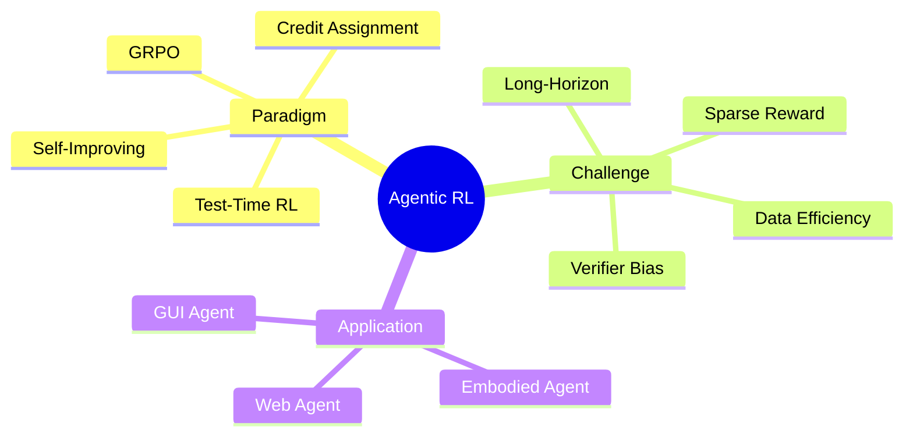

## 核心定义

**Agentic RL** = 将强化学习应用于智能体训练，通过环境交互、反馈信号、策略优化提升执行能力。核心是从"模仿学习驱动"向"可验证策略优化驱动"的范式转型。

## 技术架构

## 研究路线

### 1. GRPO-based Training (主流)

**突破**: UI-R1 仅用 **136 条任务** + rule-based reward 达到 +22.1% ScreenSpot

**代表工作**:
- UI-R1: Rule-based RL 首次系统应用
- MobileRL (ADAGRPO): 80.2% AndroidWorld
- CRAFT-GUI: Curriculum + GRPO
- ClawGUI: 首个开源 RL infrastructure

**核心设计**: action type + coordinate + format 三类可验证奖励

**关联**: [[2500-UiR1EnhancingEfficient]], [[2604-ClawGUI]]

### 2. Credit Assignment (拥挤赛道)

**问题**: 稀疏终点奖励无法分配到中间步骤

**方案**:
- SOLAR-RL: First failure point detection + 三阶段 alignment
- UI-Voyager GRSD: Fork point from 成组 rollout
- ADMIRE: Adaptive milestone reward

**关键洞察**: 该方向窗口迅速关闭（5+ concurrent works 2026年初）

**关联**: [[2604-SOLAR-RL]], [[2600-UiVoyagerSelfEvolving]]

### 3. Self-Improving Agent

**核心原则**: Verifier-First — 先解决可验证性，再扩张数据

**代表工作**:
- UI-Genie: Unified reward model + self-improvement
- GenericAgent: Context density maximization + SOP evolution（100% 完成率，token 仅 15%-35%）

**风险**: Reward model 偏差可能被自增强放大

**关联**: [[2500-UiGenieSelfImproving]], [[2604-GenericAgent]]

### 4. Test-Time RL

**创新**: 推理阶段 RL 式优化，无需额外标注

**方案**:
- GUI-RCPO: Region consistency reward（1,272 无标注数据）
- PND: Contrastive decoding for grounding

**优势**: Training-free, plug-and-play

**关联**: [[2500-TestTimeReinforcementLearning]], [[2604-AdaptiveGrounding]]

## Benchmarks

| Benchmark | 平台 | SOTA |
|-----------|------|------|
| AndroidWorld | Mobile | MobileRL: 80.2% |
| ScreenSpot | Multi | UI-R1: +22.1% |
| ScreenSpot-Pro | Multi | Orcust: +23.9% |
| SOP-bench | General | GenericAgent: 100% |

## 关键洞察

### Pattern 1: 数据效率 10x+
RL 直接优化执行成功而非模仿文本，136 条 > 大规模 SFT

### Pattern 2: Credit Assignment 是核心瓶颈
长程任务稀疏奖励下步级监督不足，多方案覆盖大部分设计空间

### Pattern 3: Verifier-First 原则
先构建可靠 verifier，再扩张数据

### Pattern 4: Outcome vs Process 权衡
Outcome 保真度高但稀疏，Process 密集但易 bias

## 待解决问题

1. 长程任务 credit assignment 在高噪声场景的稳定性
2. Self-improving 系统性偏差纠错机制
3. Rule-based reward 对模糊指令的泛化
4. 真实环境评测覆盖率不足

## 下一步

| 方向 | Action |
|------|--------|
| GRPO | 研究 UI-R1 rule reward 设计 |
| Credit Assignment | 读 SOLAR-RL/ProxMO 确认差异化 |
| Self-Improving | 监控 UI-Genie/SGV 进展 |