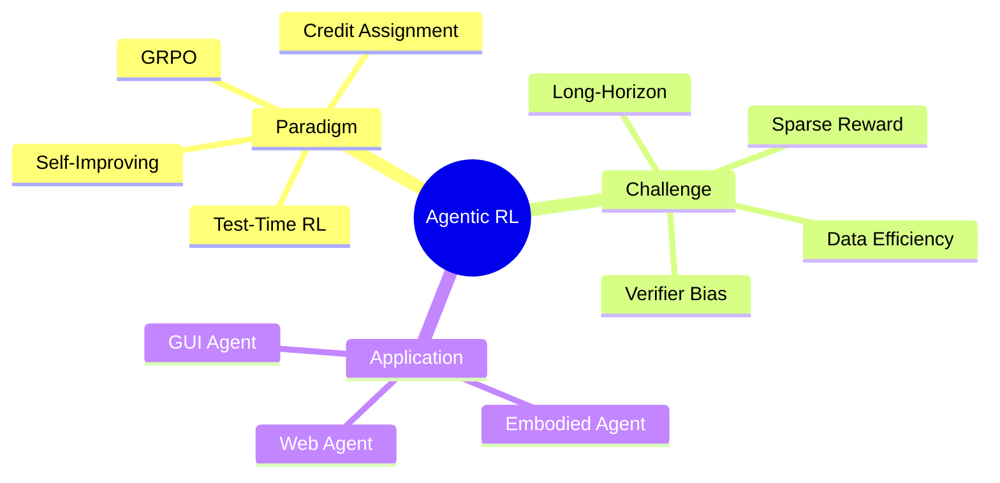

## 核心定义

**Agentic RL** = 将强化学习应用于智能体训练，通过环境交互、反馈信号、策略优化提升执行能力。核心是从"模仿学习驱动"向"可验证策略优化驱动"的范式转型。

## 技术架构

```mermaid
mindmap
  root((Agentic RL))
    Paradigm
      GRPO
      Self-Improving
      Credit Assignment
      Test-Time RL
    Challenge
      Sparse Reward
      Long-Horizon
      Data Efficiency
      Verifier Bias
    Application
      GUI Agent
      Web Agent
      Embodied Agent
```

## 研究路线

### 1. GRPO-based Training (主流)

**突破**: UI-R1 仅用 **136 条任务** + rule-based reward 达到 +22.1% ScreenSpot

**代表工作**:
- UI-R1: Rule-based RL 首次系统应用
- MobileRL (ADAGRPO): 80.2% AndroidWorld
- CRAFT-GUI: Curriculum + GRPO
- ClawGUI: 首个开源 RL infrastructure

**核心设计**: action type + coordinate + format 三类可验证奖励

**关联**: [[2500-UiR1EnhancingEfficient]], [[2604-ClawGUI]]

### 2. Credit Assignment (拥挤赛道)

**问题**: 稀疏终点奖励无法分配到中间步骤

**方案**:
- SOLAR-RL: First failure point detection + 三阶段 alignment
- UI-Voyager GRSD: Fork point from 成组 rollout
- ADMIRE: Adaptive milestone reward

**关键洞察**: 该方向窗口迅速关闭（5+ concurrent works 2026年初）

**关联**: [[2604-SOLAR-RL]], [[2600-UiVoyagerSelfEvolving]]

### 3. Self-Improving Agent

**核心原则**: Verifier-First — 先解决可验证性，再扩张数据

**代表工作**:
- UI-Genie: Unified reward model + self-improvement
- GenericAgent: Context density maximization + SOP evolution（100% 完成率，token 仅 15%-35%）

**风险**: Reward model 偏差可能被自增强放大

**关联**: [[2500-UiGenieSelfImproving]], [[2604-GenericAgent]]

### 4. Test-Time RL

**创新**: 推理阶段 RL 式优化，无需额外标注

**方案**:
- GUI-RCPO: Region consistency reward（1,272 无标注数据）
- PND: Contrastive decoding for grounding

**优势**: Training-free, plug-and-play

**关联**: [[2500-TestTimeReinforcementLearning]], [[2604-AdaptiveGrounding]]

## Benchmarks

| Benchmark | 平台 | SOTA |
|-----------|------|------|
| AndroidWorld | Mobile | MobileRL: 80.2% |
| ScreenSpot | Multi | UI-R1: +22.1% |
| ScreenSpot-Pro | Multi | Orcust: +23.9% |
| SOP-bench | General | GenericAgent: 100% |

## 关键洞察

### Pattern 1: 数据效率 10x+
RL 直接优化执行成功而非模仿文本，136 条 > 大规模 SFT

### Pattern 2: Credit Assignment 是核心瓶颈
长程任务稀疏奖励下步级监督不足，多方案覆盖大部分设计空间

### Pattern 3: Verifier-First 原则
先构建可靠 verifier，再扩张数据

### Pattern 4: Outcome vs Process 权衡
Outcome 保真度高但稀疏，Process 密集但易 bias

## 待解决问题

1. 长程任务 credit assignment 在高噪声场景的稳定性
2. Self-improving 系统性偏差纠错机制
3. Rule-based reward 对模糊指令的泛化
4. 真实环境评测覆盖率不足

## 下一步

| 方向 | Action |
|------|--------|
| GRPO | 研究 UI-R1 rule reward 设计 |
| Credit Assignment | 读 SOLAR-RL/ProxMO 确认差异化 |
| Self-Improving | 监控 UI-Genie/SGV 进展 |
## 近期格局变化

- **2026-07-21｜环境工程被确立为与算法同级的 agentic RL 瓶颈**：三个独立团队一手证词（[[Papers/2511-DreamGym]] 4 并发上限、[[Papers/2509-AgentGymRL]] 改造清单、[[Papers/2606-OpenWebRL]] 51% 失败在环境层）；解法对偶分化为"引擎做便宜"（[[Papers/2510-WebServ]]/[[Papers/2604-Crab]]）vs"引擎做没"（DreamGym 合成经验）（[[Topics/CUA-Survey]] §4.2/§7.8）
- **2026-07-21｜树结构 rollout 收敛为新范式，有状态 fork 是双侧空白**：[[Papers/2509-TreeGRPO]] 证明 intra-tree GRPO ≡ step-DPO，与 [[Papers/2408-AgentQ]] 两代方法结构收敛——outcome reward 可免费产出步级过程信号；但树方法目前只在无状态环境成立（[[Topics/CUA-Survey]] §7.6）
- **2026-07-21｜RL 增益从默认叙事变为条件化命题**：[[Papers/2607-GRPONullWebAgent]] 受控 null（headroom 前提）+ [[Papers/2607-MAG]] 零方差 stall + [[Papers/2602-GUILibra]] partial verifiability 下 KL 必要——"先测 headroom / reward variance 再决定投 RL 还是蒸馏"应成为默认流程（[[Topics/CUA-Survey]] §7.8）
- **2026-07-21｜"监督资产是 policy 相对的"成为跨域收敛结论**：skill（[[Papers/2607-SEED]] 静态库 −7.4）、tool 边界（[[Papers/2607-SearchGenBoundary]]）、训练数据（[[Papers/2607-EvoCUA15]] Table 5）、reward 锚点（[[Papers/2602-ADMIRE]]）四个独立域同一结论——静态构建的监督资产随 policy 演化必然失效；skill 路线由此分岔为内化（SEED 蒸参数）vs 外挂（[[Papers/2607-KnowActGUIClaw]] library，跨 backbone 可迁移 +3.1pts 但跨演化阶段过期）（[[Topics/CUA-Survey]] / [[Topics/SelfEvolvingAgents-Survey]]）
- **2026-07-21｜Verifier 从被动 judge 转向主动 agent**：[[Papers/2602-VAGEN]] 交互取证 92.9% acc，第一性依据是验证不对称性（verify 83.1% vs solve 55.9%）；与 [[Papers/2510-CUARewardBench]] UPE ensemble 弃权构成 verifier 可靠性两条工程分支（[[Topics/CUA-Survey]] §8.12）
- **2026-07-21｜Self-improving 系统性偏差从假设变实证**：[[Papers/2509-Misevolution]] 四路径实测（memory reward hacking >60%、workflow ASR 54→83）——触发 agenda 中 paused 方向 Self-Improving Agent Reliability 的 resume_condition，Discussion Topic 2026-07-15 待 Supervisor 决策（[[Topics/SelfEvolvingAgents-Survey]]）
- **2026-07-24｜演化步 verifier gating 从方法空白转为实证家族，收益归因反转**：[[Papers/2605-GRASP]]（编辑级 held-out 探针+硬回归预算，消融把收益几乎全归于闸门）与 [[Papers/2606-SkillNb]]（步骤级运行时 gate，去 gate 后回归 3.3%→18.6%）两个独立数据点同指"收益在验收闸门、不在写技能"；[[Papers/2512-ASGSI]] 补第三方审计维度（无实证）；开放前沿移到 gate 自身可信性——precision 未测、replay-relative、verifier 可被攻破（[[Topics/SelfEvolvingAgents-Survey]] Takeaway 4 / Open Problem 已改写）
- **2026-07-24｜majority-voting 共识奖励的劣化获得第一方量化**：[[Papers/2606-VisPlay]] 无标注自举收益真实（3B 平均 30.61→47.27）但同批图像逐代 pseudo-label 准确率 72→61——SpatialEvo 对"共识信号继承自身误差"的批评从推测变实测，缺 deterministic verifier 的域 internal 信号"越训越脏"有了剂量数据（[[Topics/SelfEvolvingAgents-Survey]] Takeaway 2）
