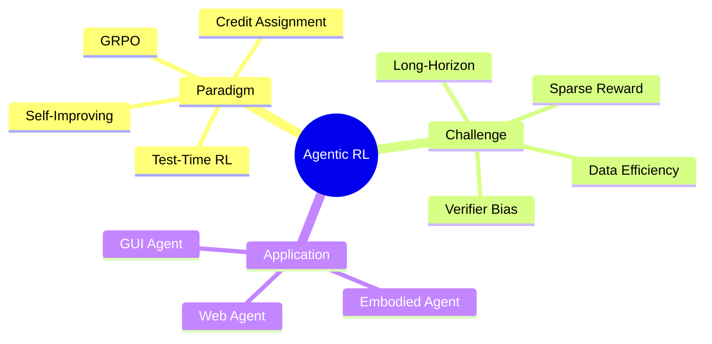

## 核心定义

**Agentic RL** = 将强化学习应用于智能体训练，通过环境交互、反馈信号、策略优化提升执行能力。核心是从"模仿学习驱动"向"可验证策略优化驱动"的范式转型。

## 技术架构

```mermaid
mindmap
  root((Agentic RL))
    Paradigm
      GRPO
      Self-Improving
      Credit Assignment
      Test-Time RL
    Challenge
      Sparse Reward
      Long-Horizon
      Data Efficiency
      Verifier Bias
    Application
      GUI Agent
      Web Agent
      Embodied Agent
```

## 研究路线

### 1. GRPO-based Training (主流)

**突破**: UI-R1 仅用 **136 条任务** + rule-based reward 达到 +22.1% ScreenSpot

**代表工作**:
- UI-R1: Rule-based RL 首次系统应用
- MobileRL (ADAGRPO): 80.2% AndroidWorld
- CRAFT-GUI: Curriculum + GRPO
- ClawGUI: 首个开源 RL infrastructure

**核心设计**: action type + coordinate + format 三类可验证奖励

**关联**: [[2500-UiR1EnhancingEfficient]], [[2604-ClawGUI]]

### 2. Credit Assignment (拥挤赛道)

**问题**: 稀疏终点奖励无法分配到中间步骤

**方案**:
- SOLAR-RL: First failure point detection + 三阶段 alignment
- UI-Voyager GRSD: Fork point from 成组 rollout
- ADMIRE: Adaptive milestone reward

**关键洞察**: 该方向窗口迅速关闭（5+ concurrent works 2026年初）

**关联**: [[2604-SOLAR-RL]], [[2600-UiVoyagerSelfEvolving]]

### 3. Self-Improving Agent

**核心原则**: Verifier-First — 先解决可验证性，再扩张数据

**代表工作**:
- UI-Genie: Unified reward model + self-improvement
- GenericAgent: Context density maximization + SOP evolution（100% 完成率，token 仅 15%-35%）

**风险**: Reward model 偏差可能被自增强放大

**关联**: [[2500-UiGenieSelfImproving]], [[2604-GenericAgent]]

### 4. Test-Time RL

**创新**: 推理阶段 RL 式优化，无需额外标注

**方案**:
- GUI-RCPO: Region consistency reward（1,272 无标注数据）
- PND: Contrastive decoding for grounding

**优势**: Training-free, plug-and-play

**关联**: [[2500-TestTimeReinforcementLearning]], [[2604-AdaptiveGrounding]]

## Benchmarks

| Benchmark | 平台 | SOTA |
|-----------|------|------|
| AndroidWorld | Mobile | MobileRL: 80.2% |
| ScreenSpot | Multi | UI-R1: +22.1% |
| ScreenSpot-Pro | Multi | Orcust: +23.9% |
| SOP-bench | General | GenericAgent: 100% |

## 关键洞察

### Pattern 1: 数据效率 10x+
RL 直接优化执行成功而非模仿文本，136 条 > 大规模 SFT

### Pattern 2: Credit Assignment 是核心瓶颈
长程任务稀疏奖励下步级监督不足，多方案覆盖大部分设计空间

### Pattern 3: Verifier-First 原则
先构建可靠 verifier，再扩张数据

### Pattern 4: Outcome vs Process 权衡
Outcome 保真度高但稀疏，Process 密集但易 bias

## 待解决问题

1. 长程任务 credit assignment 在高噪声场景的稳定性
2. Self-improving 系统性偏差纠错机制
3. Rule-based reward 对模糊指令的泛化
4. 真实环境评测覆盖率不足

## 下一步

| 方向 | Action |
|------|--------|
| GRPO | 研究 UI-R1 rule reward 设计 |
| Credit Assignment | 读 SOLAR-RL/ProxMO 确认差异化 |
| Self-Improving | 监控 UI-Genie/SGV 进展 |
## 近期格局变化

- **2026-08-05｜"演化步的验收 gate 是收益来源"降为条件性结论，条件是 gate 之外有没有一个冗余的部署选择器**：[[Papers/2607-HarnessBank]] 去掉 2σ 验收 gate 后 test Pass@1 ±0.0——因为 train-argmax 已经在同一训练侧数据上选中了同一个赢家，gate 的天花板贡献被完全挤到零；它真正买到的是假精英 2→0 与收敛轮数 >20→10。[[Papers/2606-SkillNb]] 同向（去 gate 只掉约 6 分 SR，而回归率 3.3%→18.6%）。对立面是 [[Papers/2605-GRASP]] 的 88.8%→63.5%，但那里闸门本身即部署决策，且该记录为 legacy（无 Evidence Ledger / verification_status），不能与两处台账齐备的自身消融等量齐观。可判别的写法因此是：**gate 扛的是地板不是天花板，除非它同时充当部署决策者**。另需分清两类证据——"无闸门循环会交付回归"成立，但依据来自跨方法对照（DGM 在 Omni-MATH 交付 −1.1%），HarnessBank 自身去 gate 后并未产生回归，只是停不下来（[[Topics/SelfEvolvingAgents-Survey]] §6.2）
- **2026-08-05｜自演化增益被首个跨方法受控析因证明不是普遍属性**：[[Papers/2608-AgentStream]] 在 5 方法 × 3 底座 × 3 种任务流的 45 个计数单元里，测到 11–17 个单元跑输不演化的同一模型；增益随底座能力非单调，最优方法不跨底座保序。问题形态由此从"某方法能涨多少"改写成"自演化的收益在什么条件下存在"。**数值不可承重**：效应量小于其自身 seed 间标准差，全文无显著性检验——可引用的是形态，不是分数（[[Topics/SelfEvolvingAgents-Survey]] §9.2/§12）
- **2026-08-05｜演化产物被测定为 model-specific correction，而非普适更优配置**：[[Papers/2607-HarnessBank]] 的 cross-model dissociation——匹配 patch +15.4、错配 +1.2、反向叠加 −15.7——把"演化产物可迁移吗"细化成"两个模型的失败模式是否同构"；[[Papers/2608-AgentStream]] 的方法排名不跨底座迁移是同一现象在方法层的投影。推论是任何 harness/skill 库的复用都应先测失败模式相似度，而不是直接套用（[[Topics/SelfEvolvingAgents-Survey]] §6.2/§9.2）
- **2026-08-05｜归因缺口新增第四种形态：组件的功劳被系统内的冗余机制吃掉**：此前三种是预算未配平（MANTA +28K token）、外部 teacher 未分离（Frontis-MA1）、组件自身未隔离（[[Papers/2608-RoMeRL]]）；HarnessBank 补上第四种——gate 的增益其实归最终选择器。补法与前三者一样便宜：固定判决规则、只换掉最终选择器再跑一遍。四种形态合起来构成一份可直接套用的自演化工作审阅清单（[[Topics/SelfEvolvingAgents-Survey]] §11）
- **2026-08-04｜"自演化组件本身"开始被要求做关掉对照，第一次做了的结果对外挂路线不利**：[[Papers/2607-SESA]] 训练时全程带技能库，评测时把库关掉跑了一遍——SESA-Off 相对 SSP 已拿到 +1.8/+2.2，重开同一最终库只再加 +0.5/+1.0，即收益主要沉淀在训练期塑造的分布里而非部署期检索；[[Papers/2608-RoMeRL]] 则是反面例子（四个记忆坐标只有一个用到学到的 Q，却没跑纯启发式臂）。与既有的预算未匹配（MANTA +28K token）、teacher 未分离（Frontis-MA1）合成同一条诊断：**报出的是联合效应，写下的是单一归因**；关库/关组件对照成本极低，缺席本身是信号（[[Topics/SelfEvolvingAgents-Survey]] §6.3/§11）
- **2026-08-04｜可验证性从任务固有属性被改述为可设计属性，但判分负担只是被转移**：[[Papers/2607-SpyRL]] 的 RLSVR 用"环境注入隐变量 → agent 在被条件化的观测上执行原任务 → 仅凭输出回答关于隐变量的问题 → 规则核对"四步给无 verifier 的域造出 ground truth，与 GRPO 正交且原则上可迁移到 GUI/agent 轨迹质量这类同样缺 verifier 的问题；但其实例中真正塑造生成质量的 reward 等于得票数、由被训练的同一模型扮演 detector 投出（论文 Algorithm 1 自标 non-verifiable），开放式生成上对 GPT-4o-RaR 整体胜率停在 48.9%/48.2%——省掉的是 verifier 成本，不是 judge 本身（[[Topics/SelfEvolvingAgents-Survey]] §3.4/§4.4）

- **2026-07-21｜环境工程被确立为与算法同级的 agentic RL 瓶颈**：三个独立团队一手证词（[[Papers/2511-DreamGym]] 4 并发上限、[[Papers/2509-AgentGymRL]] 改造清单、[[Papers/2606-OpenWebRL]] 51% 失败在环境层）；解法对偶分化为"引擎做便宜"（[[Papers/2510-WebServ]]/[[Papers/2604-Crab]]）vs"引擎做没"（DreamGym 合成经验）（[[Topics/CUA-Survey]] §4.2/§7.8）
- **2026-07-21｜树结构 rollout 收敛为新范式，有状态 fork 是双侧空白**：[[Papers/2509-TreeGRPO]] 证明 intra-tree GRPO ≡ step-DPO，与 [[Papers/2408-AgentQ]] 两代方法结构收敛——outcome reward 可免费产出步级过程信号；但树方法目前只在无状态环境成立（[[Topics/CUA-Survey]] §7.6）
- **2026-07-21｜RL 增益从默认叙事变为条件化命题**：[[Papers/2607-GRPONullWebAgent]] 受控 null（headroom 前提）+ [[Papers/2607-MAG]] 零方差 stall + [[Papers/2602-GUILibra]] partial verifiability 下 KL 必要——"先测 headroom / reward variance 再决定投 RL 还是蒸馏"应成为默认流程（[[Topics/CUA-Survey]] §7.8）
- **2026-07-21｜"监督资产是 policy 相对的"成为跨域收敛结论**：skill（[[Papers/2607-SEED]] 静态库 −7.4）、tool 边界（[[Papers/2607-SearchGenBoundary]]）、训练数据（[[Papers/2607-EvoCUA15]] Table 5）、reward 锚点（[[Papers/2602-ADMIRE]]）四个独立域同一结论——静态构建的监督资产随 policy 演化必然失效；skill 路线由此分岔为内化（SEED 蒸参数）vs 外挂（[[Papers/2607-KnowActGUIClaw]] library，跨 backbone 可迁移 +3.1pts 但跨演化阶段过期）（[[Topics/CUA-Survey]] / [[Topics/SelfEvolvingAgents-Survey]]）
- **2026-07-21｜Verifier 从被动 judge 转向主动 agent**：[[Papers/2602-VAGEN]] 交互取证 92.9% acc，第一性依据是验证不对称性（verify 83.1% vs solve 55.9%）；与 [[Papers/2510-CUARewardBench]] UPE ensemble 弃权构成 verifier 可靠性两条工程分支（[[Topics/CUA-Survey]] §8.12）
- **2026-07-21｜Self-improving 系统性偏差从假设变实证**：[[Papers/2509-Misevolution]] 四路径实测（memory reward hacking >60%、workflow ASR 54→83）——触发 agenda 中 paused 方向 Self-Improving Agent Reliability 的 resume_condition，Discussion Topic 2026-07-15 待 Supervisor 决策（[[Topics/SelfEvolvingAgents-Survey]]）
- **2026-07-24｜演化步 verifier gating 从方法空白转为实证家族，收益归因反转**：[[Papers/2605-GRASP]]（编辑级 held-out 探针+硬回归预算，消融把收益几乎全归于闸门）与 [[Papers/2606-SkillNb]]（步骤级运行时 gate，去 gate 后回归 3.3%→18.6%）两个独立数据点同指"收益在验收闸门、不在写技能"；[[Papers/2512-ASGSI]] 补第三方审计维度（无实证）；开放前沿移到 gate 自身可信性——precision 未测、replay-relative、verifier 可被攻破（[[Topics/SelfEvolvingAgents-Survey]] Takeaway 4 / Open Problem 已改写）
- **2026-07-24｜majority-voting 共识奖励的劣化获得第一方量化**：[[Papers/2606-VisPlay]] 无标注自举收益真实（3B 平均 30.61→47.27）但同批图像逐代 pseudo-label 准确率 72→61——SpatialEvo 对"共识信号继承自身误差"的批评从推测变实测，缺 deterministic verifier 的域 internal 信号"越训越脏"有了剂量数据（[[Topics/SelfEvolvingAgents-Survey]] Takeaway 2）
- **2026-07-28｜长程 agent 的 context 管理路线成型，训练非平稳性被形式化**：heuristic masking 增益为 regime 依赖（倒 U，饱和转负 [[Papers/2605-MaskingRegimeMap]]）；learned 路线两种 formulation（编辑动作 [[Papers/2510-MemAct]] / branch-return 折叠 [[Papers/2510-ContextFolding]]）以 10× 小上下文追平或超大上下文 baseline，但 [[Papers/2512-FoldAct]] 证明 summary 进入未来 observation 违反平稳观察假设→训练崩溃（step 173 实证），稳定化三手段（process reward/consistency KL/分离 credit）尚无合并对照（[[Topics/WebAgent-Survey]] §4 与 Takeaway 4）
- **2026-07-29｜RL 是否扩展能力被改写为二维条件命题**：[[Papers/2604-PassKT]] 以 Pass@(k,T) 区分采样宽度与交互深度；静态推理复现 boundary null，组合 bridge 检索中 RL 曲线在 `k≈4` 后分离，而同数据 SFT 收缩边界——task structure 与 base policy support 共同决定 RL 是否有 headroom（[[Topics/WebAgent-Survey]]）
- **2026-08-02｜Topology 演化出现 inference-time 分支，"演化信号不接触结果"首次被定量**：[[Papers/2607-MANTA]] 把通信拓扑从部署前搜索目标改成执行中可写对象（无状态 agent + append-only 存储 + 读取期解析可见性 ⇒ 突变零迁移零重算），等 token 下 74.0 vs Voting 64.7；其 Trace Auditor 明确不看答案，无 flag run 正确率 83.2% vs flagged 62.5%，但作为错误检测器 precision 仅 0.38、分域从 PlanCraft 1/90 到 BrowseComp 83/90——self-gate 的退化有"恒过"与"恒不过"两种形态，rubber-stamp 命题由此从二元判断细化为分域现象（[[Topics/SelfEvolvingAgents-Survey]] §3.4/§7.1/§10.2）
- **2026-08-02｜RSI 谱系的瓶颈坐实在"选法"，而"递归"仍无实物**：DGM 即时分数 / HGM clade 聚合（CMP 0.778 vs 0.285）/ [[Papers/2607-FrontisMA1]] 多因子固定权重效用（quality + 相对父进步 + method-family novelty）/ MANTA 纯过程 flag 四种 parent-selection 信号同时出现且从未在同一 testbed 对照；同时以 RSI 为题的工作实际做到 generation ≥2 的库内一篇也没有——Frontis-MA1 六件 artifact 全开源却只训到 generation 1，演化系统本身按其自述 largely fixed，增益又与外部 teacher（GLM-4.7）蒸馏未分离（[[Topics/SelfEvolvingAgents-Survey]] §7.2/§7.3/§7.5）
- **2026-07-29｜Relevance 从内容选择器变成 execution prior**：[[Papers/2607-RARG]] 用 document order、entry point 与 match visibility 三级 guidance 控制 corpus interaction；RARG++ 在 depth-first QA 更强、RARG+ 在 breadth-first BRIGHT 更好，表明 relevance granularity 需随任务与 budget 自适应（[[Topics/WebAgent-Survey]]）
- **2026-09-07｜反馈信号轴多出一个正交属性：信号分辨率**：此前把反馈信号按"可验证性"单轴排列，但一组 rollout 全部失败时，二值 reward 在组内退化为常数（$\hat g_{\mathrm{RL}}=0$）——可验证性完好而梯度恰好为零，不是弱而是没有。两篇独立工作从不同方向填这个真空：[[Papers/2608-ZerothOrderSelfEvolve]] 用 instance-specific LoRA 的参数空间扰动配 gold-answer 的 token-normalized NLL（50 个难例上 first-order 7 / RL 16 / ZO 23；GAIA controlled 设定 47.5 对 ReAct 23.3 / ARPO 38.8），[[Papers/2608-ROPSD]] 把反思文本转成 token 级 log-ratio 优势（六 benchmark 50.2→57.6，而同设置下基于二值 reward 的 GUI-RCPO 是 −0.3）。共同代价是标注需求被转移而非消除：一个要求域里有便宜可核对的短答案（环境 reward 型任务不可直接迁移），一个要求预先训好的 Reflector（约 10,160 对标注数据）；ZO 每题独立优化，共享前向与 tool-call 缓存后单例仍在数百秒量级。这一端与 [[Papers/2604-PassKT]] 接得上：PassKT 描述 base 分布已稀疏含可奖励策略时的概率重排，ZO 与 ROPSD 处理的正是该前提不成立的那一端（[[Topics/SelfEvolvingAgents-Survey]] §3.4 / §4.3 / §4.5、[[Topics/WebAgent-Survey]] §2）
- **2026-09-07｜演化产物开始被当作需要治理的资产，而现有算子只造不管**：三个互不相关的切面同时显形。体积上，技能文档随演化轮次单调膨胀（五轮约 5.2×、十六轮 2.5–3.7×），[[Papers/2608-SkillZip]] 给出零 rollout 的 typed-MDL 压缩算子（压缩 31.2% 对评测驱动基线 9.2%）并测出膨胀有路径依赖——从第八轮才启用压缩只能部分挽回（2.6× 对全程启用的 1.9×）。血缘上，[[Papers/2608-SkillJack]] 测到派生技能在源经验被删后仍有 80.0% 存活、来源标记在跨层提炼中从 100.0% 掉到 44.4%，使"撤销一条坏经验"在工程上不可实现。时效上，[[Papers/2608-OpenART]] 归纳的长程工作流三类反复失效全部以"复用先前判断"为前提。三者指向同一处缺失：资产被创建时的上下文——为什么存在、从哪来、何时应作废——没有被任何机制保留，而待建组件是带血缘的撤销、语义冗余度量与作废条件（[[Topics/SelfEvolvingAgents-Survey]] §12）
- **2026-09-07｜"frozen FM 天花板"应拆成操作天花板与激发天花板两个量**：[[Papers/2608-MacaronV1]] 把 policy 显式写成 $\pi_\phi(a \mid o;\theta,c)$ 并分离权重更新与配置搜索——在 122 个冻结基座全挂（0/122）的 TerminalBench-2.1 派生任务上，零权重更新的自适应配置搜索（69 job / 450 attempts）累计覆盖 122/122，而最强单配置的全集 sweep 只有 11/122。11/122 是一个配置服务所有任务的操作天花板，122/122 是每任务用最合适配置的激发天花板，两者差一个数量级；此前归给"基座能力不足"的失败里有相当一部分是 elicitation failure 而非 capability failure。边界：累计覆盖是 450 次尝试的并集、非可交付的单一配置，接近 pass@450 的重参数化（[[Topics/SelfEvolvingAgents-Survey]] §7.4）
- **2026-09-07｜gate 独立性要分三层记，"判决者外生"不等于"判据外生"**：[[Papers/2608-EvoHarnessRL]] 的技能库由外族 Claude Opus 在 epoch 边界增删改，判决者独立，但判据只是该模型阅读 agent 自写 note 加 LFU 频次，无 held-out 回归检查；对照 [[Papers/2607-HarnessBank]] 的"外生模型算确定性统计量"，两个样本合看，三层（判决算法 / 证据来源 / 打分器）中目前没有一篇同时做到外生。更重的是证据来源层可被攻击者控制：[[Papers/2608-SkillJack]] 测到 LLM judge 只看代码判恶 36.7%，补上攻击者撰写的 name 与 documentation 后反降到 10.0%，而这两个字段正是多数 skill 准入闸门与检索器的主要输入。可直接转成设计规则：准入判据只读行为与代码（[[Topics/SelfEvolvingAgents-Survey]] §6.2 / §10.6）
- **2026-09-07｜共演方向多出一篇按演化算子作用域切分的 anchor survey，并改述了一条常被引用的空白**：[[Papers/2608-CoEvolutionSurvey]] 以 $\Omega$ 的作用域分三阶段（agent 集体内 → 环境进入更新 → 演化机制自身被 $\Gamma$ 改写），与库内按组件切的两篇 anchor survey 正交，自带判别标准（≥2 个演化单元相互重塑彼此的后续演化）与十个相邻概念的划界。其 Stage 2 的 feedback-space 分支（ROSKA / CURE / ARCO / ECHO）确实在演化 reward、unit test 与 critic，因此缺的不是"有人演化 verifier"而是"有人验证演化后的 verifier"——这些工作对演化后判分器的唯一背书是下游任务性能，而下游性能正由该判分器给出（[[Topics/SelfEvolvingAgents-Survey]] §8 / §8.4 / §11）
- **2026-09-07｜归因缺口再添两种形态，且第一次出现"对照就在同一张表里却未被讨论"**：已记录的四种是预算未配平、外部 teacher 未分离、组件自身未隔离、功劳被冗余机制吃掉。[[Papers/2606-SenseSearch]] 补第五种——training-free 的 RAG workflow 对其 Table 1 中每一个模型都优于 agentic workflow（GPT-4o 63.47 对 60.93），论文正文一句未提；同表还能读出工具 scaffold +7.80 / cold-start SFT +17.56 / RL +4.37，被放在标题中心的 RL 只占约 15%。[[Papers/2608-ABSeeker]] 补第六种——头条 55.3 的多数（+18.0）来自与本文贡献完全正交的 inference-time context management，方法自身净增益 +3.8。加上 [[Papers/2607-SESA]] 的 memory-off 对照，本方向连续三次拆分都对头条组件不利，而三次拆分的成本都只是关掉组件重跑一次，或把未训练的同工具集 scaffold 摆进同一张表（[[Topics/WebAgent-Survey]] §2 / Takeaway 9）
- **2026-09-07｜context management 的问题形态从"学哪个压缩函数"变为"没有单一赢家、选择本身才是对象"，但自适应路由的成本仍未被审计**：[[Papers/2603-AgentSwing]] 逐列可读出最好的静态策略随 backbone 与 benchmark 换人（GPT-OSS-120B 的 BrowseComp 是 Keep-Last-N 52.5，DeepSeek-v3.2 与 Tongyi-DR 是 Discard-All 58.0，DeepSeek-v3.2 的 HLE 是 Summary 43.5），这比它自身的路由增量更硬地否定"全程固定一种压缩函数"；配套的 Pass@1 = η·ρ 分解给出可复用的度量语言（Discard-All 以小 context 换高 ρ、以多次 reset 补 η）。但增益只在 k=3 前瞻下出现——随机路由 51.0/56.5 与去 lookahead 的 50.0/57.0 都跌回最好静态策略之下，说明手里有多个候选本身不产生收益；而每个触发点是 3 分支 × 3 轮加一次含全部候选与原始 raw context 的路由调用，全文无 token 计数、无触发频次、无 compute-matched 对照。因此它是"静态策略无单一赢家"的证据，不是"自适应路由划算"的证据（[[Topics/WebAgent-Survey]] §5 / Takeaway 4）
