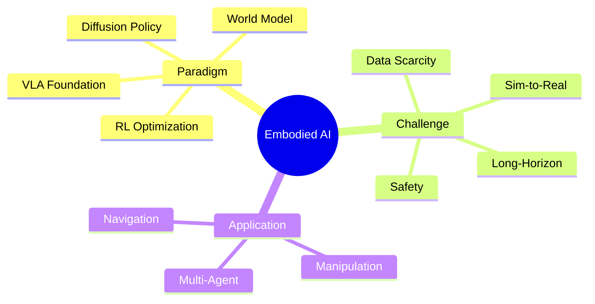

## 核心定义

**Embodied AI** = AI 在物理/仿真环境中执行感知-决策-行动闭环，从"理解"走向"操作"——导航、操作物体、与人协作。是 VLM、Robot Learning、RL、Control 的交叉领域。

## 技术架构

## 研究路线

### 1. VLA Foundation Model (主流)

**里程碑**:
- RT-2 (2023): 首次证明 VLM→VLA 直接迁移
- RT-X (2023): Cross-embodiment positive transfer（22 robots, 1M+ episodes）
- OpenVLA (2024): 首个开源 VLA

**关键发现** (EmbodiedMidtrain):
- VLA data 与 VLM distribution 存在 gap
- Data selection 应偏向 spatial reasoning
- Mid-training 为 downstream 提供更强初始化

**关联**: [[Papers/2604-EmbodiedMidtrain]], RT-2/RT-X/OpenVLA

### 2. Diffusion Policy

**问题**: Behavior cloning mode collapse

**方案**:
- Diffusion Policy: Action sequence as diffusion target
- SeedPolicy (SEGA): Long-horizon observation 压缩，+36.8% RoboTwin

**优势**: Multimodal action distribution modeling

**关联**: [[Papers/2026-SeedPolicy- Horizon Scaling via Self-Evolving Diffusion Policy for Robot Manipulation]]

### 3. World Model for Planning

**应用**: 减少 real-world interaction，支持 counterfactual planning

**代表**:
- MultiWorld: Multi-agent multi-view WM
- HY-World 2.0: 3D scene generation + planning
- Agentic World Model Survey: Levels × Laws taxonomy

**关联**: [[Papers/2604-MultiWorld]], [[Papers/2604-HYWorld2]], [[Papers/2604-AgenticWorldModel]]

### 4. RL for Long-Horizon

**方案**:
- LongNav-R1: Multi-turn RL + horizon-adaptive advantage（64.3% → 73.0%）
- ARPO: GRPO for GUI/Embodied

**优势**: 直接优化 long-horizon success

**关联**: [[Papers/2600-LongnavR1HorizonAdaptive]], [[Papers/2500-ArpoEndEndPolicy]]

### 5. Safety & Reliability

**Threat Taxonomy** (VLA Safety Survey):
- Training-time: Data poisoning, backdoors
- Inference-time: Adversarial patches, semantic jailbreaks

**Defense**: Data validation, adversarial training, runtime monitor

**关联**: [[Papers/2604-VLASafety]]

## Benchmarks

| Benchmark | 类型 | SOTA |
|-----------|------|------|
| Open X-Embodiment | Training | RT-X |
| RLBench | Manipulation | Diffusion Policy |
| RoboTwin 2.0 | Manipulation | SeedPolicy |
| CALVIN | Long-horizon | - |
| Habitat | Navigation | - |

## 关键洞察

### Pattern 1: Foundation Model 范式已成主流
Web-scale VLM knowledge → robot policy，开源生态降低研究门槛

### Pattern 2: Diffusion Policy 解决 BC 痛点
Multimodal action modeling，适合 manipulation

### Pattern 3: VLM→VLA 需要 data alignment
EmbodiedMidtrain 发现 distribution gap，spatial reasoning > text-centric

### Pattern 4: World Model 提供新 planning 路径
减少真实交互，支持安全验证

### Pattern 5: 安全系统性关注
VLA Safety Survey 定义新问题域，区别于 LLM safety 和 classical robotics

## 待解决问题

1. Sim-to-Real gap 系统性解决
2. Dexterous manipulation 精度瓶颈
3. Long-horizon credit assignment
4. Real-time inference constraint（sub-second latency）
5. VLA certified robustness
6. 不可逆操作风险控制

## 下一步

| 方向 | Action |
|------|--------|
| VLA | 研究 EmbodiedMidtrain data alignment |
| Diffusion | 跟进 SeedPolicy SEGA module |
| World Model | 测试 MultiWorld multi-agent planning |
| Safety | 监控 VLA Safety Survey open problems |