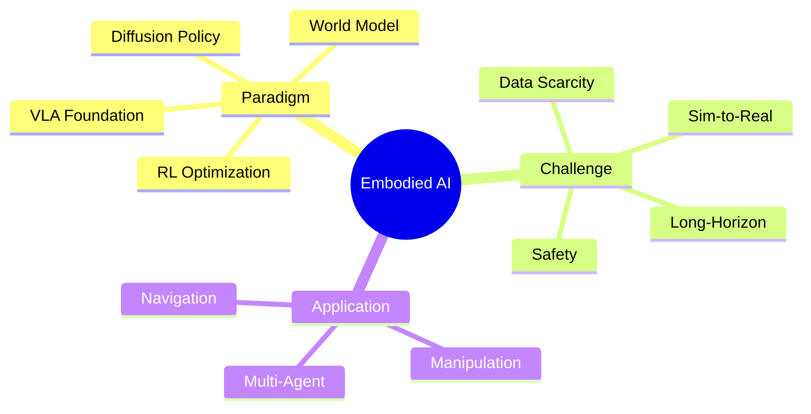

## 核心定义

**Embodied AI** = AI 在物理/仿真环境中执行感知-决策-行动闭环，从"理解"走向"操作"——导航、操作物体、与人协作。是 VLM、Robot Learning、RL、Control 的交叉领域。

## 技术架构

```mermaid
mindmap
  root((Embodied AI))
    Paradigm
      VLA Foundation
      Diffusion Policy
      World Model
      RL Optimization
    Challenge
      Data Scarcity
      Sim-to-Real
      Long-Horizon
      Safety
    Application
      Manipulation
      Navigation
      Multi-Agent
```

## 研究路线

### 1. VLA Foundation Model (主流)

**里程碑**:
- RT-2 (2023): 首次证明 VLM→VLA 直接迁移
- RT-X (2023): Cross-embodiment positive transfer（22 robots, 1M+ episodes）
- OpenVLA (2024): 首个开源 VLA

**关键发现** (EmbodiedMidtrain):
- VLA data 与 VLM distribution 存在 gap
- Data selection 应偏向 spatial reasoning
- Mid-training 为 downstream 提供更强初始化

**关联**: [[Papers/2604-EmbodiedMidtrain]], RT-2/RT-X/OpenVLA

### 2. Diffusion Policy

**问题**: Behavior cloning mode collapse

**方案**:
- Diffusion Policy: Action sequence as diffusion target
- SeedPolicy (SEGA): Long-horizon observation 压缩，+36.8% RoboTwin

**优势**: Multimodal action distribution modeling

**关联**: [[Papers/2603-SeedPolicy- Horizon Scaling via Self-Evolving Diffusion Policy for Robot Manipulation]]

### 3. World Model for Planning

**应用**: 减少 real-world interaction，支持 counterfactual planning

**代表**:
- MultiWorld: Multi-agent multi-view WM
- HY-World 2.0: 3D scene generation + planning
- Agentic World Model Survey: Levels × Laws taxonomy

**关联**: [[Papers/2604-MultiWorld]], [[Papers/2604-HYWorld2]], [[Papers/2604-AgenticWorldModel]]

### 4. RL for Long-Horizon

**方案**:
- LongNav-R1: Multi-turn RL + horizon-adaptive advantage（64.3% → 73.0%）
- ARPO: GRPO for GUI/Embodied

**优势**: 直接优化 long-horizon success

**关联**: [[Papers/2600-LongnavR1HorizonAdaptive]], [[Papers/2500-ArpoEndEndPolicy]]

### 5. Safety & Reliability

**Threat Taxonomy** (VLA Safety Survey):
- Training-time: Data poisoning, backdoors
- Inference-time: Adversarial patches, semantic jailbreaks

**Defense**: Data validation, adversarial training, runtime monitor

**关联**: [[Papers/2604-VLASafety]]

## Benchmarks

| Benchmark | 类型 | SOTA |
|-----------|------|------|
| Open X-Embodiment | Training | RT-X |
| RLBench | Manipulation | Diffusion Policy |
| RoboTwin 2.0 | Manipulation | SeedPolicy |
| CALVIN | Long-horizon | - |
| Habitat | Navigation | - |

## 关键洞察

### Pattern 1: Foundation Model 范式已成主流
Web-scale VLM knowledge → robot policy，开源生态降低研究门槛

### Pattern 2: Diffusion Policy 解决 BC 痛点
Multimodal action modeling，适合 manipulation

### Pattern 3: VLM→VLA 需要 data alignment
EmbodiedMidtrain 发现 distribution gap，spatial reasoning > text-centric

### Pattern 4: World Model 提供新 planning 路径
减少真实交互，支持安全验证

### Pattern 5: 安全系统性关注
VLA Safety Survey 定义新问题域，区别于 LLM safety 和 classical robotics

## 待解决问题

1. Sim-to-Real gap 系统性解决
2. Dexterous manipulation 精度瓶颈
3. Long-horizon credit assignment
4. Real-time inference constraint（sub-second latency）
5. VLA certified robustness
6. 不可逆操作风险控制

## 下一步

| 方向 | Action |
|------|--------|
| VLA | 研究 EmbodiedMidtrain data alignment |
| Diffusion | 跟进 SeedPolicy SEGA module |
| World Model | 测试 MultiWorld multi-agent planning |
| Safety | 监控 VLA Safety Survey open problems |
## 近期格局变化

- **2026-07-30｜高保真 UMI 跨过 target-task post-training 门槛**：[[Papers/2607-HiFiUMI]] 在四个双臂桌面任务、三种 backbone、960 次 real-robot rollout 中把 UMI−teleoperation aggregate gap 压到 −2.5 / +3.1 / −0.6pp，并开放 2K 小时子集；但比较为 3,200 vs ~300 trajectories 且 fidelity factors 未逐项 ablate，因此当前结论是“联合系统足够有效”，不是 equal-sample 优越或单因素因果结论（[[Topics/EmbodiedAI-Survey]] / [[Topics/VLA-Survey]]）
- **2026-07-21｜World model 完成三角色分化并成 competitive policy 范式**：WAM 作 policy（[[Papers/2607-ABotM05]] RoboTwin 2.0 94.1% / [[Papers/2607-FlowWAM]]）超纯 VLA，数据引擎（[[Papers/2607-RynnWorldTeleop]]）与 policy evaluator（[[Papers/2607-GigaWorld1]]，evaluator-world agreement 新标准）各自成线；同时 [[Papers/2607-BadWAM]] 实证 action-imagination 解耦攻击面（LIBERO 96.5%→43.1%）——"检查生成未来"不构成安全保障（[[Topics/EmbodiedAI-Survey]] / [[Topics/VLA-Survey]]）
- **2026-07-21｜VLA 表征侵蚀从轶事变为可测量-可修复闭环**：[[Papers/2606-Act2Answer]]（语义知识掉 20–40 分、问题在读出通路）+ [[Papers/2607-AnchorAlignVLA]]（锚定修复，控制实验排除正则化解释）+ VQA co-training 保护效应三方收敛；防遗忘应成 VLA 训练默认件（[[Topics/EmbodiedAI-Survey]] / [[Topics/VLA-Survey]]）
- **2026-07-21｜数据瓶颈的答案收敛到 human/手持视频 + 强 curation**：[[Papers/2607-XiaomiRobotics1]]（100K-hr UMI，data scale 边际收益大于 billion 级 model size，方法论公开打破工业黑箱）+ [[Papers/2607-EgoSteer]] log-linear scaling + [[Papers/2606-DoAsIDo]]（在线视频仅 ~5% 可用）——瓶颈从采集成本转移到 curation 与验证（[[Topics/EmbodiedAI-Survey]] / [[Topics/VLA-Survey]]）
- **2026-07-21｜VLN 格局双变**：R2R-CE supervised SOTA 由 graph-based Pano+Depth 64.2% 易主 generalist 双系统 VLA（[[Papers/2607-ABotN1]] tri-view RGB 70.9%），"RGB-only 落后"判断失效；memory-persistent VLN（跨 episode 记忆）成为新设定轴，[[Papers/2603-Memoir]] oracle 差 20 SPL 表明记忆访问机制是主要 headroom（[[Topics/VLN-Survey]]）
