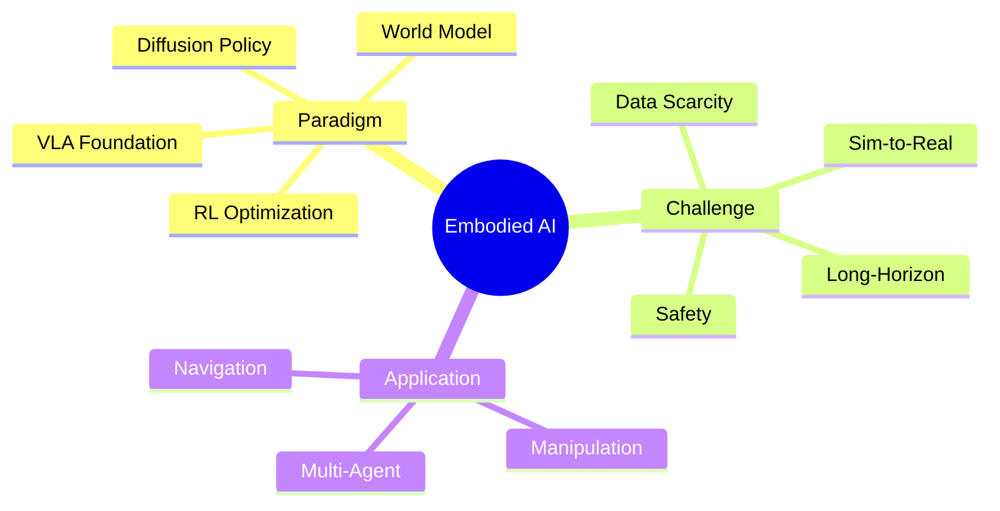

## 核心定义

**Embodied AI** = AI 在物理/仿真环境中执行感知-决策-行动闭环，从"理解"走向"操作"——导航、操作物体、与人协作。是 VLM、Robot Learning、RL、Control 的交叉领域。

## 技术架构

```mermaid
mindmap
  root((Embodied AI))
    Paradigm
      VLA Foundation
      Diffusion Policy
      World Model
      RL Optimization
    Challenge
      Data Scarcity
      Sim-to-Real
      Long-Horizon
      Safety
    Application
      Manipulation
      Navigation
      Multi-Agent
```

## 研究路线

### 1. VLA Foundation Model (主流)

**里程碑**:
- RT-2 (2023): 首次证明 VLM→VLA 直接迁移
- RT-X (2023): Cross-embodiment positive transfer（22 robots, 1M+ episodes）
- OpenVLA (2024): 首个开源 VLA

**关键发现** (EmbodiedMidtrain):
- VLA data 与 VLM distribution 存在 gap
- Data selection 应偏向 spatial reasoning
- Mid-training 为 downstream 提供更强初始化

**关联**: [[Papers/2604-EmbodiedMidtrain]], RT-2/RT-X/OpenVLA

### 2. Diffusion Policy

**问题**: Behavior cloning mode collapse

**方案**:
- Diffusion Policy: Action sequence as diffusion target
- SeedPolicy (SEGA): Long-horizon observation 压缩，+36.8% RoboTwin

**优势**: Multimodal action distribution modeling

**关联**: [[Papers/2603-SeedPolicy- Horizon Scaling via Self-Evolving Diffusion Policy for Robot Manipulation]]

### 3. World Model for Planning

**应用**: 减少 real-world interaction，支持 counterfactual planning

**代表**:
- MultiWorld: Multi-agent multi-view WM
- HY-World 2.0: 3D scene generation + planning
- Agentic World Model Survey: Levels × Laws taxonomy

**关联**: [[Papers/2604-MultiWorld]], [[Papers/2604-HYWorld2]], [[Papers/2604-AgenticWorldModel]]

### 4. RL for Long-Horizon

**方案**:
- LongNav-R1: Multi-turn RL + horizon-adaptive advantage（64.3% → 73.0%）
- ARPO: GRPO for GUI/Embodied

**优势**: 直接优化 long-horizon success

**关联**: [[Papers/2600-LongnavR1HorizonAdaptive]], [[Papers/2500-ArpoEndEndPolicy]]

### 5. Safety & Reliability

**Threat Taxonomy** (VLA Safety Survey):
- Training-time: Data poisoning, backdoors
- Inference-time: Adversarial patches, semantic jailbreaks

**Defense**: Data validation, adversarial training, runtime monitor

**关联**: [[Papers/2604-VLASafety]]

## Benchmarks

| Benchmark | 类型 | SOTA |
|-----------|------|------|
| Open X-Embodiment | Training | RT-X |
| RLBench | Manipulation | Diffusion Policy |
| RoboTwin 2.0 | Manipulation | SeedPolicy |
| CALVIN | Long-horizon | - |
| Habitat | Navigation | - |

## 关键洞察

### Pattern 1: Foundation Model 范式已成主流
Web-scale VLM knowledge → robot policy，开源生态降低研究门槛

### Pattern 2: Diffusion Policy 解决 BC 痛点
Multimodal action modeling，适合 manipulation

### Pattern 3: VLM→VLA 需要 data alignment
EmbodiedMidtrain 发现 distribution gap，spatial reasoning > text-centric

### Pattern 4: World Model 提供新 planning 路径
减少真实交互，支持安全验证

### Pattern 5: 安全系统性关注
VLA Safety Survey 定义新问题域，区别于 LLM safety 和 classical robotics

## 待解决问题

1. Sim-to-Real gap 系统性解决
2. Dexterous manipulation 精度瓶颈
3. Long-horizon credit assignment
4. Real-time inference constraint（sub-second latency）
5. VLA certified robustness
6. 不可逆操作风险控制

## 下一步

| 方向 | Action |
|------|--------|
| VLA | 研究 EmbodiedMidtrain data alignment |
| Diffusion | 跟进 SeedPolicy SEGA module |
| World Model | 测试 MultiWorld multi-agent planning |
| Safety | 监控 VLA Safety Survey open problems |
## 近期格局变化

- **2026-08-04｜VLA-RL 的样本效率瓶颈被指向 critic 侧的表征，而非算法或数据量**：[[Papers/2607-WCM]] 把预测下一帧 latent 与 return 回归放进同一个轻量 critic trunk（可直接替换 PPO / Flow-SDE / AWR / RECAP 的 critic），LIBERO-Plus 上从 one-shot SFT 起跑约 250 步 RL 即超过 20k 轨迹的 Full-SFT，WidowX-250S 长程 stovetop cleaning 从 1/50 提到 15/50；决定性对照是把 critic 换成 2-5 帧历史 ViT（论文定义为 $\lambda=0$ 特例）仍然无效——**缺的是预测性目标而不是时序输入**。与之对偶的 world-action-model 把同类目标放在 actor 侧，两者能否共享同一 latent dynamics 尚无人做。边界：全文没有任何 value 估计精度指标，"预测目标 → value 更准"与"预测目标 → 表征不塌缩"两种解释同样兼容；SIGReg 在 on-policy 被关闭，仿真主结果里真正额外生效的只有预测损失；Table 1 baseline 行无误差棒而部分增益仅 0.8-1.1（[[Topics/VLA-Survey]] / [[Topics/WorldModel-Survey]]）
- **2026-08-04｜触觉成为 VLA 的一条建模轴，但"预测式触觉"的收益归属立刻被同门证据推翻**：[[Papers/2607-N0VTLA]] 把触觉做成预测目标（latent `z` 在 32 候选池 top-1 92.3，chance 3.2；Stage 2 屏蔽 VL prefix 迫使动作损失只能经 `z` 下降），[[Papers/2607-N0TWAM]] 把触觉做成世界模型的一路专家；但后者的消融显示去掉**反应式** observed 通路比去掉**预测式** predicted 通路损失更大（UniVTAC 70.5 vs 71.8、NeoSim 29.6 vs 41.1），最大单因素反而是预训练数据量（−19.1），而前者自己的 ALTER 结果显示 offline RL 是主导项、触觉预训练是二阶项。两篇同团队、共享不可独立核查的私有数据与基准（八个基准中仅 UniVTAC 为第三方），故记为争议而非共识。与 [[Papers/2607-STWAM]] 的 DINO 未来分支单独使用反低于纯 VAE 基线合看，"多预测一种未来 → 动作更好"这条推论目前缺少同 backbone 同算力的逐目标移除对照（[[Topics/EmbodiedAI-Survey]] / [[Topics/WorldModel-Survey]]）
- **2026-08-04｜VLA 的语言鲁棒性被重新定位为架构内的信息路由问题，同时给出恢复 LIBERO 鉴别力的最廉价协议**：[[Papers/2608-GSRParaVLA]] 用因果干预证明任务语义在语言主干里保留完好（Retrieval@1 0.941/0.675/0.516，chance 0.1），失效在动作策略对 joint V-L 编码漂移的敏感——只替换最后一个融合 block 的语言特征即消除 96.8% 动作差异；把语义改由不看图像的冻结文本编码器承担，仅用 canonical 数据即把 SmolVLA Full Para 从 4.47 提到 49.12，且"增益来自容量"被三个落在同一数值（46.82）的对照排除。这接续并收紧了 08-02 的 [[Papers/2607-TurboVLA]] 条目：LIBERO 的鉴别力不是消失而是被 canonical 模板掩盖——只改措辞的 LIBERO-Para 就把同批模型从 72-98% 打回 4-77%。边界同样明确：全部仿真证据来自 LIBERO-Goal 10 任务共享场景，句子编码器与 10 路任务码尚未分开，且附录声明的 McNemar/bootstrap CI 全文无一数值、单 seed（[[Topics/EmbodiedAI-Survey]] / [[Topics/VLA-Survey]]）
- **2026-08-02｜World model 的角色从三种扩为四种，"生成保真"与"物理判别"被证明可以背离**：[[Papers/2607-WorldActionPlanner]] 把 policy 降级为工具、规划在想象中完成（pose-image conditioning 绕开低维动作与视频骨干的接口失配，compositional LIBERO-Long 72 对 π0.5 的 4、cosmos-policy 的 0；1 次想象胜过带 ground-truth reward 的 BoN-8），planner 由此与 policy / 数据引擎 / evaluator 并列；但其对照带 URDF、相机标定与硬编码抓放原语，"72 vs 0" 是特权信息模块化系统 vs 端到端 policy，仅 Table 9 隔离世界模型自身增益。同时 [[Papers/2607-PhiZero]] 在 Physics-IQ 生成端第一（41.2）却在 IntPhys2 Hard 仅 52.38（随机 50）——planner 与 evaluator 消费的恰是判别能力，这两条路线不能靠视频质量指标验收（[[Topics/EmbodiedAI-Survey]]）
- **2026-08-02｜"VLA 必须长在 VLM 之上"首次有了对照实验，同时暴露 LIBERO 的语言鉴别力不足**：[[Papers/2607-TurboVLA]] 执行路径完全无 LLM（DINOv3 + BERT + Grounding-DINO 初始化的双向 cross-attention + ACT decoder），LIBERO 97.7% / 0.2B / 32 Hz 与 0.9B-4.7B 的 VLA 同处噪声带；但其自身 ablation 显示把指令换成 task-ID embedding 只掉 2.3pp，说明该 benchmark 近似闭集任务索引——"去 VLM 不掉点"主要是 benchmark 性质而非 VLM 无用（RoboTwin 2.0 上 60.2% 对 WAM 系 92-94% 即差异重现）。举证责任由此反转：以语义先验为卖点的方法需配语言鉴别力已验证的评测或同规模无 VLM 基线（[[Topics/VLA-Survey]] / [[Topics/EmbodiedAI-Survey]]）
- **2026-07-30｜高保真 UMI 跨过 target-task post-training 门槛**：[[Papers/2607-HiFiUMI]] 在四个双臂桌面任务、三种 backbone、960 次 real-robot rollout 中把 UMI−teleoperation aggregate gap 压到 −2.5 / +3.1 / −0.6pp，并开放 2K 小时子集；但比较为 3,200 vs ~300 trajectories 且 fidelity factors 未逐项 ablate，因此当前结论是“联合系统足够有效”，不是 equal-sample 优越或单因素因果结论（[[Topics/EmbodiedAI-Survey]] / [[Topics/VLA-Survey]]）
- **2026-07-21｜World model 完成三角色分化并成 competitive policy 范式**：WAM 作 policy（[[Papers/2607-ABotM05]] RoboTwin 2.0 94.1% / [[Papers/2607-FlowWAM]]）超纯 VLA，数据引擎（[[Papers/2607-RynnWorldTeleop]]）与 policy evaluator（[[Papers/2607-GigaWorld1]]，evaluator-world agreement 新标准）各自成线；同时 [[Papers/2607-BadWAM]] 实证 action-imagination 解耦攻击面（LIBERO 96.5%→43.1%）——"检查生成未来"不构成安全保障（[[Topics/EmbodiedAI-Survey]] / [[Topics/VLA-Survey]]）
- **2026-07-21｜VLA 表征侵蚀从轶事变为可测量-可修复闭环**：[[Papers/2606-Act2Answer]]（语义知识掉 20–40 分、问题在读出通路）+ [[Papers/2607-AnchorAlignVLA]]（锚定修复，控制实验排除正则化解释）+ VQA co-training 保护效应三方收敛；防遗忘应成 VLA 训练默认件（[[Topics/EmbodiedAI-Survey]] / [[Topics/VLA-Survey]]）
- **2026-07-21｜数据瓶颈的答案收敛到 human/手持视频 + 强 curation**：[[Papers/2607-XiaomiRobotics1]]（100K-hr UMI，data scale 边际收益大于 billion 级 model size，方法论公开打破工业黑箱）+ [[Papers/2607-EgoSteer]] log-linear scaling + [[Papers/2606-DoAsIDo]]（在线视频仅 ~5% 可用）——瓶颈从采集成本转移到 curation 与验证（[[Topics/EmbodiedAI-Survey]] / [[Topics/VLA-Survey]]）
- **2026-07-21｜VLN 格局双变**：R2R-CE supervised SOTA 由 graph-based Pano+Depth 64.2% 易主 generalist 双系统 VLA（[[Papers/2607-ABotN1]] tri-view RGB 70.9%），"RGB-only 落后"判断失效；memory-persistent VLN（跨 episode 记忆）成为新设定轴，[[Papers/2603-Memoir]] oracle 差 20 SPL 表明记忆访问机制是主要 headroom（[[Topics/VLN-Survey]]）
