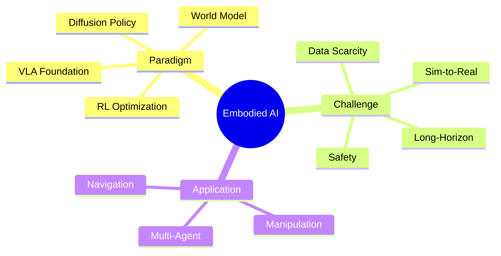

## 核心定义

**Embodied AI** = AI 在物理/仿真环境中执行感知-决策-行动闭环，从"理解"走向"操作"——导航、操作物体、与人协作。是 VLM、Robot Learning、RL、Control 的交叉领域。

## 技术架构

```mermaid
mindmap
  root((Embodied AI))
    Paradigm
      VLA Foundation
      Diffusion Policy
      World Model
      RL Optimization
    Challenge
      Data Scarcity
      Sim-to-Real
      Long-Horizon
      Safety
    Application
      Manipulation
      Navigation
      Multi-Agent
```

## 研究路线

### 1. VLA Foundation Model (主流)

**里程碑**:
- RT-2 (2023): 首次证明 VLM→VLA 直接迁移
- RT-X (2023): Cross-embodiment positive transfer（22 robots, 1M+ episodes）
- OpenVLA (2024): 首个开源 VLA

**关键发现** (EmbodiedMidtrain):
- VLA data 与 VLM distribution 存在 gap
- Data selection 应偏向 spatial reasoning
- Mid-training 为 downstream 提供更强初始化

**关联**: [[Papers/2604-EmbodiedMidtrain]], RT-2/RT-X/OpenVLA

### 2. Diffusion Policy

**问题**: Behavior cloning mode collapse

**方案**:
- Diffusion Policy: Action sequence as diffusion target
- SeedPolicy (SEGA): Long-horizon observation 压缩，+36.8% RoboTwin

**优势**: Multimodal action distribution modeling

**关联**: [[Papers/2603-SeedPolicy- Horizon Scaling via Self-Evolving Diffusion Policy for Robot Manipulation]]

### 3. World Model for Planning

**应用**: 减少 real-world interaction，支持 counterfactual planning

**代表**:
- MultiWorld: Multi-agent multi-view WM
- HY-World 2.0: 3D scene generation + planning
- Agentic World Model Survey: Levels × Laws taxonomy

**关联**: [[Papers/2604-MultiWorld]], [[Papers/2604-HYWorld2]], [[Papers/2604-AgenticWorldModel]]

### 4. RL for Long-Horizon

**方案**:
- LongNav-R1: Multi-turn RL + horizon-adaptive advantage（64.3% → 73.0%）
- ARPO: GRPO for GUI/Embodied

**优势**: 直接优化 long-horizon success

**关联**: [[Papers/2600-LongnavR1HorizonAdaptive]], [[Papers/2500-ArpoEndEndPolicy]]

### 5. Safety & Reliability

**Threat Taxonomy** (VLA Safety Survey):
- Training-time: Data poisoning, backdoors
- Inference-time: Adversarial patches, semantic jailbreaks

**Defense**: Data validation, adversarial training, runtime monitor

**关联**: [[Papers/2604-VLASafety]]

## Benchmarks

| Benchmark | 类型 | SOTA |
|-----------|------|------|
| Open X-Embodiment | Training | RT-X |
| RLBench | Manipulation | Diffusion Policy |
| RoboTwin 2.0 | Manipulation | SeedPolicy |
| CALVIN | Long-horizon | - |
| Habitat | Navigation | - |

## 关键洞察

### Pattern 1: Foundation Model 范式已成主流
Web-scale VLM knowledge → robot policy，开源生态降低研究门槛

### Pattern 2: Diffusion Policy 解决 BC 痛点
Multimodal action modeling，适合 manipulation

### Pattern 3: VLM→VLA 需要 data alignment
EmbodiedMidtrain 发现 distribution gap，spatial reasoning > text-centric

### Pattern 4: World Model 提供新 planning 路径
减少真实交互，支持安全验证

### Pattern 5: 安全系统性关注
VLA Safety Survey 定义新问题域，区别于 LLM safety 和 classical robotics

## 待解决问题

1. Sim-to-Real gap 系统性解决
2. Dexterous manipulation 精度瓶颈
3. Long-horizon credit assignment
4. Real-time inference constraint（sub-second latency）
5. VLA certified robustness
6. 不可逆操作风险控制

## 下一步

| 方向 | Action |
|------|--------|
| VLA | 研究 EmbodiedMidtrain data alignment |
| Diffusion | 跟进 SeedPolicy SEGA module |
| World Model | 测试 MultiWorld multi-agent planning |
| Safety | 监控 VLA Safety Survey open problems |
## 近期格局变化

- **2026-08-05｜VLA 怎么接 proprioceptive state 从惯例问题变成三条可测量的设计轴**：[[Papers/2608-VLAProprioception]] 在固定 π0.5 基座与训练预算下把这条一直由实现习惯决定的接线拆成表示 / 历史长度 / 注入位置，结论均不支持现有默认做法——只喂当前帧收益很小，且不存在任务无关的最优接口；注入位置的偏好随时间预算翻转，意味着任何单点比较都可能得出相反结论。最有格局意义的是历史深度这条：raw observation history 存在收益峰值，K≈8 之后未压缩历史开始损害控制，这把压缩式 memory（[[Papers/2607-LaMemVLA]]）从"工程优化"改写为"避免退化的必需件"，并给 Open Problem 11 的 crossover point 提供了第一个量级参考。单篇证据，库内暂无独立复现（[[Topics/VLA-Survey]] / [[Topics/EmbodiedAI-Survey]]）
- **2026-08-05｜"增益来自新增的预测通道本身"这一类归因终于有了可复用的对照模板**：[[Papers/2608-VLAProprioception]] 的 slot-matched 对照保持输入槽位数与参数量不变、只抽掉其中的时间变化内容，30.8 对 39.0 的落差因此可归给时序信息而非容量或槽位。[[Papers/2607-STWAM]]、[[Papers/2607-N0TWAM]] 暴露的正是缺这一步时"新增预测头涨点"无法排除容量混淆的问题——归因设计本身由此成为一个独立的方法论议题，而不再是各篇自选的实验细节（[[Topics/VLA-Survey]] / [[Topics/EmbodiedAI-Survey]]）
- **2026-08-05｜视频世界模型的失效点收敛到 contact 与场景反应，而视觉质量指标看不见它**：[[Papers/2608-WorldExam]] 的反应类典型失败是"被接触物体不变、主体直接穿过去"，最好的 action-driven 模型仅 33.75 而 language-driven 达 75.96；[[Papers/2607-GigaWorld1]] 独立观察到 video model 对 contact-sensitive failure 的 optimistic bias；[[Papers/2607-PhiZero]] 则给出"生成保真不蕴含物理判别"。三条来自不同团队、不同数据、不同评测目标的证据同向，把 Key Takeaway 4「planner/evaluator 不能靠视频质量指标验收」从单模型观察抬到跨范式结论（[[Topics/EmbodiedAI-Survey]] / [[Topics/WorldModel-Survey]]）
- **2026-08-05｜world model 评测从 explicit instruction fulfillment 转向 inherent reactivity**：[[Papers/2608-WorldExam]] 的构造法是只给触发性控制、把本该随之发生的反应留空不写进指令，于是分数衡量的是模型自己补出了什么而非它照做了什么；20 个模型上能力沿接口分裂，且视觉质量与其余三层解耦。这套"不说出应然结果"的构造可直接迁移到 GUI 与 embodied 环境评测——当前这两处的任务描述普遍把预期后果写进指令，因而测不出模型是否真的具备环境动力学模型（[[Topics/WorldModel-Survey]] / [[Topics/EmbodiedAI-Survey]]）
- **2026-08-04｜VLA-RL 的样本效率瓶颈被指向 critic 侧的表征，而非算法或数据量**：[[Papers/2607-WCM]] 把预测下一帧 latent 与 return 回归放进同一个轻量 critic trunk（可直接替换 PPO / Flow-SDE / AWR / RECAP 的 critic），LIBERO-Plus 上从 one-shot SFT 起跑约 250 步 RL 即超过 20k 轨迹的 Full-SFT，WidowX-250S 长程 stovetop cleaning 从 1/50 提到 15/50；决定性对照是把 critic 换成 2-5 帧历史 ViT（论文定义为 $\lambda=0$ 特例）仍然无效——**缺的是预测性目标而不是时序输入**。与之对偶的 world-action-model 把同类目标放在 actor 侧，两者能否共享同一 latent dynamics 尚无人做。边界：全文没有任何 value 估计精度指标，"预测目标 → value 更准"与"预测目标 → 表征不塌缩"两种解释同样兼容；SIGReg 在 on-policy 被关闭，仿真主结果里真正额外生效的只有预测损失；Table 1 baseline 行无误差棒而部分增益仅 0.8-1.1（[[Topics/VLA-Survey]] / [[Topics/WorldModel-Survey]]）
- **2026-08-04｜触觉成为 VLA 的一条建模轴，但"预测式触觉"的收益归属立刻被同门证据推翻**：[[Papers/2607-N0VTLA]] 把触觉做成预测目标（latent `z` 在 32 候选池 top-1 92.3，chance 3.2；Stage 2 屏蔽 VL prefix 迫使动作损失只能经 `z` 下降），[[Papers/2607-N0TWAM]] 把触觉做成世界模型的一路专家；但后者的消融显示去掉**反应式** observed 通路比去掉**预测式** predicted 通路损失更大（UniVTAC 70.5 vs 71.8、NeoSim 29.6 vs 41.1），最大单因素反而是预训练数据量（−19.1），而前者自己的 ALTER 结果显示 offline RL 是主导项、触觉预训练是二阶项。两篇同团队、共享不可独立核查的私有数据与基准（八个基准中仅 UniVTAC 为第三方），故记为争议而非共识。与 [[Papers/2607-STWAM]] 的 DINO 未来分支单独使用反低于纯 VAE 基线合看，"多预测一种未来 → 动作更好"这条推论目前缺少同 backbone 同算力的逐目标移除对照（[[Topics/EmbodiedAI-Survey]] / [[Topics/WorldModel-Survey]]）
- **2026-08-04｜VLA 的语言鲁棒性被重新定位为架构内的信息路由问题，同时给出恢复 LIBERO 鉴别力的最廉价协议**：[[Papers/2608-GSRParaVLA]] 用因果干预证明任务语义在语言主干里保留完好（Retrieval@1 0.941/0.675/0.516，chance 0.1），失效在动作策略对 joint V-L 编码漂移的敏感——只替换最后一个融合 block 的语言特征即消除 96.8% 动作差异；把语义改由不看图像的冻结文本编码器承担，仅用 canonical 数据即把 SmolVLA Full Para 从 4.47 提到 49.12，且"增益来自容量"被三个落在同一数值（46.82）的对照排除。这接续并收紧了 08-02 的 [[Papers/2607-TurboVLA]] 条目：LIBERO 的鉴别力不是消失而是被 canonical 模板掩盖——只改措辞的 LIBERO-Para 就把同批模型从 72-98% 打回 4-77%。边界同样明确：全部仿真证据来自 LIBERO-Goal 10 任务共享场景，句子编码器与 10 路任务码尚未分开，且附录声明的 McNemar/bootstrap CI 全文无一数值、单 seed（[[Topics/EmbodiedAI-Survey]] / [[Topics/VLA-Survey]]）
- **2026-08-02｜World model 的角色从三种扩为四种，"生成保真"与"物理判别"被证明可以背离**：[[Papers/2607-WorldActionPlanner]] 把 policy 降级为工具、规划在想象中完成（pose-image conditioning 绕开低维动作与视频骨干的接口失配，compositional LIBERO-Long 72 对 π0.5 的 4、cosmos-policy 的 0；1 次想象胜过带 ground-truth reward 的 BoN-8），planner 由此与 policy / 数据引擎 / evaluator 并列；但其对照带 URDF、相机标定与硬编码抓放原语，"72 vs 0" 是特权信息模块化系统 vs 端到端 policy，仅 Table 9 隔离世界模型自身增益。同时 [[Papers/2607-PhiZero]] 在 Physics-IQ 生成端第一（41.2）却在 IntPhys2 Hard 仅 52.38（随机 50）——planner 与 evaluator 消费的恰是判别能力，这两条路线不能靠视频质量指标验收（[[Topics/EmbodiedAI-Survey]]）
- **2026-08-02｜"VLA 必须长在 VLM 之上"首次有了对照实验，同时暴露 LIBERO 的语言鉴别力不足**：[[Papers/2607-TurboVLA]] 执行路径完全无 LLM（DINOv3 + BERT + Grounding-DINO 初始化的双向 cross-attention + ACT decoder），LIBERO 97.7% / 0.2B / 32 Hz 与 0.9B-4.7B 的 VLA 同处噪声带；但其自身 ablation 显示把指令换成 task-ID embedding 只掉 2.3pp，说明该 benchmark 近似闭集任务索引——"去 VLM 不掉点"主要是 benchmark 性质而非 VLM 无用（RoboTwin 2.0 上 60.2% 对 WAM 系 92-94% 即差异重现）。举证责任由此反转：以语义先验为卖点的方法需配语言鉴别力已验证的评测或同规模无 VLM 基线（[[Topics/VLA-Survey]] / [[Topics/EmbodiedAI-Survey]]）
- **2026-07-30｜高保真 UMI 跨过 target-task post-training 门槛**：[[Papers/2607-HiFiUMI]] 在四个双臂桌面任务、三种 backbone、960 次 real-robot rollout 中把 UMI−teleoperation aggregate gap 压到 −2.5 / +3.1 / −0.6pp，并开放 2K 小时子集；但比较为 3,200 vs ~300 trajectories 且 fidelity factors 未逐项 ablate，因此当前结论是“联合系统足够有效”，不是 equal-sample 优越或单因素因果结论（[[Topics/EmbodiedAI-Survey]] / [[Topics/VLA-Survey]]）
- **2026-07-21｜World model 完成三角色分化并成 competitive policy 范式**：WAM 作 policy（[[Papers/2607-ABotM05]] RoboTwin 2.0 94.1% / [[Papers/2607-FlowWAM]]）超纯 VLA，数据引擎（[[Papers/2607-RynnWorldTeleop]]）与 policy evaluator（[[Papers/2607-GigaWorld1]]，evaluator-world agreement 新标准）各自成线；同时 [[Papers/2607-BadWAM]] 实证 action-imagination 解耦攻击面（LIBERO 96.5%→43.1%）——"检查生成未来"不构成安全保障（[[Topics/EmbodiedAI-Survey]] / [[Topics/VLA-Survey]]）
- **2026-07-21｜VLA 表征侵蚀从轶事变为可测量-可修复闭环**：[[Papers/2606-Act2Answer]]（语义知识掉 20–40 分、问题在读出通路）+ [[Papers/2607-AnchorAlignVLA]]（锚定修复，控制实验排除正则化解释）+ VQA co-training 保护效应三方收敛；防遗忘应成 VLA 训练默认件（[[Topics/EmbodiedAI-Survey]] / [[Topics/VLA-Survey]]）
- **2026-07-21｜数据瓶颈的答案收敛到 human/手持视频 + 强 curation**：[[Papers/2607-XiaomiRobotics1]]（100K-hr UMI，data scale 边际收益大于 billion 级 model size，方法论公开打破工业黑箱）+ [[Papers/2607-EgoSteer]] log-linear scaling + [[Papers/2606-DoAsIDo]]（在线视频仅 ~5% 可用）——瓶颈从采集成本转移到 curation 与验证（[[Topics/EmbodiedAI-Survey]] / [[Topics/VLA-Survey]]）
- **2026-07-21｜VLN 格局双变**：R2R-CE supervised SOTA 由 graph-based Pano+Depth 64.2% 易主 generalist 双系统 VLA（[[Papers/2607-ABotN1]] tri-view RGB 70.9%），"RGB-only 落后"判断失效；memory-persistent VLN（跨 episode 记忆）成为新设定轴，[[Papers/2603-Memoir]] oracle 差 20 SPL 表明记忆访问机制是主要 headroom。**其中把易主归因于 30M 样本预训练这一读法已于 2026-09-07 被 [[Papers/2512-NavForesee]] 修正，见下**（[[Topics/VLN-Survey]]）
- **2026-09-07｜设计讨论的变量从"用什么模块"换成"接在哪一层、什么形状、推理时留不留"**：六篇互不引用的工作在同 backbone 对照下得到同形状结论——[[Papers/2608-GSRParaVLA]]（语义在语言主干完好、坏在融合位置）、[[Papers/2608-VLAProprioception]]（只动 state 接口就分出当前帧无效、有序历史有效）、[[Papers/2608-WorldTokens]]（world token 是 VLM 通往 action expert 的唯一入口，开旁路掉 2.9 分；Canny anchor 换 RGB anchor 后 91.5 低于不接 world model 的 95.0）、[[Papers/2608-MobileWAM]]（MLP 传 belief 46.3 低于完全不传的 50.2；30 层全接 37.1 低于稀疏 4 层的 58.2）、[[Papers/2608-InContextVLA]]（loss mask 从"证据+动作"改成"仅动作"值 7.7 分）、[[Papers/2608-CofactVLA]]（干预放在梯度与第 15/16 层协方差而非新增模块）。"某模态/某信号对 VLA 有没有用"这个问法不再成立，报告结论必须连接口一起报（[[Topics/VLA-Survey]]）
- **2026-09-07｜"离散动作表示只配做辅助监督"从共识降为争议**：[[Papers/2608-GalaxeaG05]] 用单个 decoder、共享 vocabulary、单一 next-token cross-entropy 同时产出 CoT 与 RVQ 动作码，在同数据、各 16 H20、同 wall-clock、同观测与控制栈的真机微调对照里拿到 76.7% 对 π0.5 的 53.3%，并在 2025 BEHAVIOR Challenge 上以 1 个 post-training epoch 超过冠军方案（0.2904 vs 0.2605）。两个附带后果：纯 AR policy 暴露 token-level log-probability，GRPO 可原样套用而 flow-matching 需按 RLinf 引入 SDE 近似；27 维按运动部件划分的统一动作空间给出 soft prompt 与 latent action 之外的第三种 cross-embodiment 抽象。短板在精细视觉伺服（半透明低对比度抽屉 60% 对 π0.5 90%，贴 marker 后回到 100%），且仿真优势仅 0.2–1.1 pp（[[Topics/VLA-Survey]] 路线 1 / 路线 5）
- **2026-09-07｜语言鲁棒性的失效定位出现相反假设，记为争议**：[[Papers/2608-GSRParaVLA]] 定位为"语义保住了、路由坏了"（行为探针 Retrieval@1 0.516–0.941），[[Papers/2608-CofactVLA]] 面对同一现象假设"语义根本没进来"——图像经 latent visual confounder 打开 backdoor path 绕过语义直接决定动作。两者不互斥但指向不同干预点（换语义源与注入位置 vs 在 velocity field 与 KV 特征上做减法），判别实验是双方都没做的一个：在真机 OOD 场景下跑 GSR 那套行为层 Retrieval@1 探针。CofactVLA 的证据强度受限（LIBERO-Plus 每任务 1 episode、Language 轴 71.8 落后 OpenVLA-OFT_m 81.0、头条 setting 无组件消融）（[[Topics/VLA-Survey]] 横切议题一）
- **2026-09-07｜world model 多出第五种角色：只在训练期消费、推理期整条删除**：[[Papers/2608-WorldTokens]]（Perceiver 压出的 256 个 world token 作为 action expert 唯一的 VL 上下文）、[[Papers/2608-JEPAWAM]]（冻结 V-JEPA latent 目标 + current–future 联合预测）与 [[Papers/2608-MobileWAM]]（串行 belief 链 + 稀疏跨深度 tap）在两个月内各自采用同一模板——用注意力掩码或冻结目标切断 action 对未来 token 的可见性，使未来分支在部署时不实例化，推理开销退回到不含该分支的水平（61.85 ms 在 π0.5 的 1.1× 以内、85 ms 对 ABot-M0 的 125 ms、938 ms 对同类 WAM 的 4950/8126 ms）。这解掉了 WAM 路线最硬的部署阻力，代价是推理期的想象、搜索与重规划一并放弃，planner 与 evaluator 两个角色不能这样用。更有格局意义的是三组消融合起来的读数：同一条预测通路的净效应可以从负到正——排他路由改为可旁路 97.0→94.1（低于完全不做 world modeling 的 95.0）、首帧锚点由 Canny 换 RGB 掉到 91.5；取全部隐藏层 73.1 低于只取 Lower-16 的 76.5；递归模块由 transformer 换成 MLP 得 46.3，低于不加 foresight 的 50.2，tap 层由 4 层改 30 层则 58.2 崩到 37.1。自变量是接口形状（排他性、目标是否保留空间对应、取层位置、递归容量），不是"预测了未来"本身，Open Problem 11 由此从"缺少对照"推进到"部分答案在手"。三篇各出自一个团队、主基准两两不重合、无交叉复现（[[Topics/EmbodiedAI-Survey]] / [[Topics/WorldModel-Survey]] / [[Topics/VLA-Survey]]）
- **2026-09-07｜world-model 评测在"世界是否反应"之前补上"动作是否被实现"一层，contact 失效的方向同时由共识降为争议**：[[Papers/2608-WorldSimProbe]] 把 simulator faithfulness 写成可检验的 Observable Simulator Contract（action-realization + interaction-response），在 18,608 个受控 instance、6 个开源 ACWM 上给出此前缺席的一层证据——动作一旦偏离熟悉轨迹，模型就滑回 scene/task 关联的运动先验（跨任务 replay 的 fidelity 随运动失配下降，ρ=−0.433；同一 episode 换成不熟悉的执行风格，六个模型在 late-policy checkpoint 上一律比 early 高 10.8–16.1 分）。更需要改写既有认知的是方向：其在 simulator 验证过的无接触场景中做的 audit 是 50/50 全为 contact hallucination、无一例 omission，而 08-05 记下的 [[Papers/2608-WorldExam]] 观察到的典型失败恰是 omission（被接触物体保持不变）。两个基准的 case 构造决定了各自只能看见一半（一个只罚编、一个只罚漏），模型群体也不同（前者全为按各 simulator 官方 split 微调的 in-domain ACWM，后者的 reactivity 层混入大量 API 通用视频模型）。因此"contact 是共同失效环节"保留为共识，"world model 倾向于漏掉接触"降为争议；对下游的含义相反——漏接触让 planner 低估后果，编接触让 evaluator 高估成功，后者与 [[Papers/2607-GigaWorld1]] 的 optimistic bias 同向。同篇还给出两条可直接照搬的评测方法：换轨迹分布而非换任务即可恢复鉴别力（同批生成数据训 policy，standard 轨迹挤在 78–86%，OOD 分离成 53/34/21%），以及 judge 的判定规则必须作为实验条件报告（RMFA 与人工分级 ρ=0.750，VLM 二元判断只有 0.450，VLM 判 91.7% 的样本"动作被跟随"而人类 42.2%）（[[Topics/EmbodiedAI-Survey]] / [[Topics/WorldModel-Survey]]）
- **2026-09-07｜memory 的"embedding 空间 vs 符号空间"二分被中间形态填上，空白转移到符号策略的获取端**：此前的记法是 memory 载体取决于消费者是 action head（[[Papers/2607-LaMemVLA]]）还是 planner（[[Papers/2607-ABotAgentOS]]），两端之间没有工作。[[Papers/2608-HyMeS]] 正好落在中间：运动技能留在冻结的 π0.5 权重里，记忆策略是一段由 coding agent 经 heuristic learning 迭代出来的可读代码（无梯度、无 expert action label），代码里的阶段约束不经 prompt 传递，而是以梯度形式注入冻结 VLA 的 flow-matching velocity field。消费者仍是 action head、载体却是符号，两者靠速度场连起来。RoboMemArena 12 任务 CSR 52.5→66.2 / TSR 41.3→60.1，真机 SO-101 TSR 25.7→57.1；分项比总分更有信息量——遮挡类里预测式记忆基线 PrediMem 的 CSR 38.3 低于纯反应式 π0.5 的 50.4，即在该类别上是净损。代价随之明确：这种接法引入一个判断"阶段是否推进"的外部环路，而 PACE 的单模态消融（vision-only −16.0/−21.7、proprio-only −8.8/−8.4）显示该环路正是最脆弱的一环；获取端则依赖闭源 coding agent，成本与可复现性尚无独立评估（[[Topics/EmbodiedAI-Survey]] / [[Topics/VLA-Survey]]）
- **2026-09-07｜universal action representation 的候选集加入 3D point flow，且 planner 角色下 policy 可以整个缺席**：[[Papers/2606-PointWorld]]（CVPR 2026）把 state 与 action 收进同一空间——场景点的未来位移是 state，机器人自身点的未来位移是 action，后者由 URDF 经正向运动学生成（每个 gripper 约 300–500 点），于是动作表示与关节数、自由度、夹爪构型脱钩，与相机系相对 state-action、end-effector delta pose、optical flow、frame-level latent action 并列为候选。它同时给 planner 角色补上一个极端形态：不预测像素也不调用 policy，MPPI-MPC 直接在预测的动力学上求解（PTv3 + 冻结 DINOv3，H=10、单次前向约 0.12 s），[[Papers/2607-WorldActionPlanner]] 把 policy 降级为工具，这里则整个移除。约 2M trajectories / 500 小时训练下模型与数据两条轴在 log 空间均近似线性，DROID ℓ2 mover 0.0312 对 GBND 0.0390 而参数量差 957×，跨域用 1/20 迭代微调即超过 from-scratch specialist。两处边界需要一起记：主指标是 ℓ2 flow error 而非任务成功率（仿真 B1K 已达 sub-centimeter，真机零样本成功率仍散在 20–90），且 gripper-only flow 优于 whole-body flow——收益不随建模点数单调增长（[[Topics/EmbodiedAI-Survey]] / [[Topics/WorldModel-Survey]]）
- **2026-09-07｜越过 graph-based 上限不需要工业级数据工程，07-21 记下的"易主"读法要修正**：当时把 R2R-CE supervised SOTA 的易主记在 [[Papers/2607-ABotN1]] 的 30M 样本预训练上，但更早的 [[Papers/2512-NavForesee]]（CVPR 2026，arXiv 2025-12）用 Qwen2.5-VL-3B 和仅 1.5M 条公开 R2R-CE/RxR-CE 重标注样本就拿到 66.2，已在 Efficient-VLN 的 64.2 之上；[[Papers/2608-LightNav0]] 用 Qwen3-VL-4B 与约 1120 H100·h 的 mid-training + SFT 预算拿到单目 R2R 68.5 / SPL 62.8，RxR SPL 64.5 还高过 ABot-N1 的 63.9。三个系统分处相差一到两个数量级的数据与算力 regime，观测配置从 panoramic RGB 到单目到 tri-view 各不相同，共同点只是都把 waypoint predictor、预定义 navigable 节点与 depth 一起拿掉、让 VLM 直接产出连续动作。"depth 与预训练几何组件是 VLN SOTA 的必要条件"由此可以撤掉，而"数据规模是主要杠杆"同样不成立——在变的更像是接口设计（pixel goal / dream query / point + action token）。三者彼此没有 matched 对照，这一判断是排除法的产物而非直接证据（[[Topics/VLN-Survey]]）
- **2026-09-07｜"预测通路的净效应由接口形状决定"在导航域拿到符号翻转的直接证据，条件轴是语言 plan**：08 月记下的模板是 world model 分支的净效应取决于接口形状而非"预测了未来"本身（[[Papers/2608-WorldTokens]]、[[Papers/2608-MobileWAM]]）。[[Papers/2512-NavForesee]] 在 VLN 上给出同形状但条件轴不同的一组数——单个 Qwen2.5-VL-3B 交错训练显式 hierarchical language planning 与 short/long 双 horizon 特征预测（目标是 depth/DINOv2/SAM 而非像素，long-horizon 经 structured attention mask 以 short-horizon 为条件，horizon 长度由 planning-aware hidden state 决定），完整模型 R2R-CE SR 66.2；有 planning 时去掉 long-term 预测掉到 58.6，没有 planning 时把双 horizon 预测加回去反而从 52.6 掉到 48.8。决定符号的是预测通路有没有被语言意图 condition，这条轴在既有的排他性 / 取层位置 / 递归容量之外，且论文列出该行却未讨论。同时暴露一处 vault 内部矛盾：[[Papers/2603-PROSPECT]] 主张 latent 预测目标优于像素/显式模态并把 NavForesee 当作反例，而 NavForesee 的 RGB 侧预测的正是 DINOv2/SAM 特征、只有 depth 解到 pixel level（SiLogLoss），两篇都没做 controlled 对照，故"latent vs 显式预测目标"记为争议而非共识（[[Topics/VLN-Survey]]）
- **2026-09-11｜cross-embodiment 动作接口不是在收敛而是在分裂，且现有指标还不中立**：09-07 记下 3D point flow 加入候选集时，读法还是"候选在增多"。两个月内又添三种互不兼容的取法——[[Papers/2608-Hydra0]] 把动作写成图像平面上的稀疏点轨迹（N 条 × H+1 个像素位置 + 可见性，几何路线由 URDF 投影生成、纯视频路线由 tracker 加分割掩码分配，两条供给共用一个 DiT），[[Papers/2608-DreamXPhi]] 把 PRoPE 的 group-action attention 从相机位姿改挂末端执行器、按注意力头分组注入每臂 SE(3) 相对变换，[[Papers/2608-GalaxeaG05]] 则用 27 维统一动作空间的 RVQ 离散码与语言共享词表。加上既有的 optical flow（[[Papers/2607-FlowWAM]]）与 3D point flow（[[Papers/2606-PointWorld]]）共五种，彼此之间没有任何交叉实验，而各自给出的方向性结论互相矛盾：PointWorld 报 gripper-only 优于 whole-body，Hydra-0 的 gripper EPE 被证明主要测"条件有没有被复制"（零样本 ATI/Wan-Move 的 4.62/4.67 比微调过的 Cosmos 2.5 基线 34.28 低一个数量级），DreamX-Phi 则直接把 optical flow 从主通道降格为两条互补条件之一——它与 FlowWAM 建在同一个 Wan2.2-TI2V-5B 底座上、识别出同一个"背景主导 loss"的病因（一个用运动幅度加权、一个用物体语义加权），却没有一次对照。排序这些接口所需的公共评测也还不存在：WorldArena 2.0 在聚合前用 ground truth 给 Dynamic Degree / Flow Score / Motion Smoothness 设上限，同一模型的两项分量从 WA1.0 的 88.71/100.00 变成 22.90/5.81，而库内两篇论文记录的同名条目 EWMScore 相差 3.5–3.7、Trajectory Accuracy 却完全一致，即同一基准名下至少流通两套聚合口径（[[Topics/EmbodiedAI-Survey]] / [[Topics/WorldModel-Survey]] / [[Topics/VLA-Survey]]）
- **2026-09-11｜冻结 VLA 外挂治理逻辑的粒度分出两派，而两派都没做过降级对照**：09-07 记下 [[Papers/2608-HyMeS]] 填上 embedding/符号二分的中间形态时，它是这条线上唯一的样本。[[Papers/2608-Zetta]] 给出同结构的第二种取法——技能同样留在冻结权重（GR00T N1.5 / π0.5 原样不动）、治理逻辑同样活在代码空间，但不做连续 steering，而是逐 action chunk 让离线 agent 写出的 critic 产出结构化 proposal，由 Orchestrator 裁决是否切出 VLA 执行 recovery skill，再按 re-entry contract 交还控制权；critic 与 recovery 由失败聚类加逐层因果诊断离线演化出来，双闸门用 cluster 全通过与 held-out ΔSR 把关且 outcome 侧接环境官方谓词而非 LLM 自评。真正稀缺的是它把演化速率当工程问题解：Z-Infra 把 VLM 与 action expert 拆进程、中间激活走 CUDA IPC，平均推理延迟降 53%，吞吐从 1.72 提到 35.1 episodes/min。RoboCasa 18 任务 73.56%→93.56%、LIBERO-Pro 全部 40 对 32.00%→71.13%。但归因完全没有隔离——无 ablation 章节、三条 loop 一条未单独消融、两张表里唯一的非 Zetta 行就是自家基座、baseline 拿不到额外执行步数与外部工具（GraspGen / CAP / motion planner / segmentation），摘要标的 90.8% 只是 Goal 两个 setting 的均值；critic 读的还是 simulator 提供的官方 grasp/success 谓词，这类量在真机上不存在。与 HyMeS 合看，"代码空间的治理逻辑该以什么粒度介入 policy"目前没有可比证据：两者没比过，也都没把自己降级成 episode 级反思做对照（[[Topics/EmbodiedAI-Survey]] / [[Topics/VLA-Survey]] / [[Topics/SelfEvolvingAgents-Survey]]）
- **2026-09-11｜latent world model 的"可规划性"被证明是线性 probe 看不见的性质**：验收 latent world model 的默认做法是拿线性 probe 测 latent 里有没有编码状态。[[Papers/2608-DALeWM]] 把这条默认做法打掉——同预算一 epoch 下四个未崩塌变体的 state probe R² 互差不超过 0.03（0.89–0.90 / 0.86–0.89 / 0.77–0.80），在线成功率却铺开 43pp（LeWM 49.3±12.2 到 DA-LeWM 92.7±1.2）。它把两条此前混在一起的性质拆开：latent 是否编码了任务量（信息充分性），与 latent 之间的距离能否把候选按真实进展排序（decision-metric alignment），后者是序性质而非数值性质，而只有它决定 planner 能不能用。方法侧的取法与 09-07 的"训练期消费、推理期删除"同模板——inverse-dynamics 与 demonstration-conditioned goal-action 两个辅助头只活在训练期，eval 时丢弃，推理算力与基线完全相同。两处限制必须一起记：它自己的两个诊断都解释不了主要增益（inverse-only 变体的 Plan-Real Spearman 最高 +0.420 却只有 64.0% 成功率，CEM elite 阶段所有变体的 Spearman 都在 0 附近），且两个诊断都要对每个候选跑 simulator rollout（30×64 与 15×300×30），真机不可得。因此可带走的是那条切分与 SIGReg 移除式的崩塌对照纪律，不是 43.4pp 这个数——而"这个 latent 能不能拿来规划"眼下仍只能靠把规划跑一遍来回答（[[Topics/EmbodiedAI-Survey]] / [[Topics/WorldModel-Survey]]）
