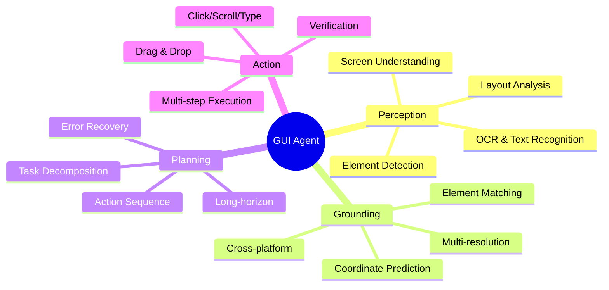

## 核心定义

**GUI Agent** = 能够理解图形用户界面（屏幕截图/视频）、定位界面元素（grounding）、执行操作（点击/滚动/输入）、完成多步骤任务的视觉 Agent 系统。

## 技术架构

## 研究路线

### 1. Grounding Robustness (Primary)

**问题**: GUI grounding 在跨分辨率、跨设备、动态布局下不稳定

**现有方案**:
- Multi-resolution training (Qwen-GUI-3B)
- Zoom-in pipeline (MEGA-GUI)
- Positional encoding (RULER)
- Coordinate-free (GuiActor)
- 小模型专用架构 (GoClick 230M)

**空白**: 架构级 multi-scale 设计（FPN）underexplored

**关联论文**: [[2500-GuiActorCoordinateFree]], [[2604-GoClick]], [[Papers/2604-AdaptiveGrounding]]

**Idea**: [[Ideas/ScaleInvariant-Grounding-GUI]]

### 2. RL-based Training (Secondary)

**问题**: SFT 数据效率低，OOD 泛化弱；RL 训练数据效率可提升 10x

**主流范式**:
- GRPO (Group Relative Policy Optimization) — UI-R1 仅用 136 条任务
- Rule-based reward (action type + coordinate accuracy)
- Credit Assignment 需解决长程任务奖励分配

**空白**: Credit Assignment 赛道极度拥挤（SOLAR-RL, GiGPO, ProxMO, ADMIRE 2026年初同发）

**关联论文**: [[2500-UiR1EnhancingEfficient]], [[Papers/2604-ClawGUI]], [[Papers/2604-SOLAR-RL]]

**Idea**: [[Ideas/ForkPoint-CreditAssignment-GUI]]

### 3. Self-Improving Reliability (Monitoring)

**问题**: Self-improving 循环中 verifier/RM 存在系统性偏差，可能放大错误而非纠错

**现有方案**:
- Self-Grounded Verification (SGV) — 20pp OSWorld 提升
- Experience replay + trajectory filtering

**空白**: Adversarial verifier 机制可提供外部纠错

**关联论文**: [[2500-UiGenieSelfImproving]], [[2500-UiVoyagerSelfEvolving]]

**Idea**: [[Ideas/AdversarialVerification-SelfImproving-GUI]]

## Benchmarks

| Benchmark | Platform | Tasks | Metric |
|-----------|----------|-------|--------|
| OSWorld | Desktop | 369 | Success Rate |
| AndroidWorld | Mobile | 116 | Success Rate |
| ScreenSpot | Multi | 620 | Element Accuracy |
| GUIOdyssey | Mobile | 100+ | Navigation SR |
| WebArena | Web | 812 | Task Completion |

## 关键洞察

### Pattern 1: Grounding 是基础瓶颈
- Survey 确认 grounding error 是 GUI Agent 失败的主因（>50% failure traced to grounding）
- 小模型（230M GoClick）可在 grounding 上与大模型竞争

### Pattern 2: RL 数据效率惊人
- UI-R1: 136 条任务 → +22.1% AndroidWorld
- 对比 SFT: 需要 10K+ 轨迹

### Pattern 3: Self-improving 验证偏差
- UI-Genie 自增强后期 OOD 性能下降（overfitting to verifier preference）
- Verifier 本身需要 external grounding

## 待解决问题

1. 如何在不增加推理开销下实现 robust cross-resolution grounding？
2. Credit Assignment 方向差异化空间在哪？（需要读完 SOLAR-RL/ProxMO）
3. Self-improving 的 verifier 如何避免被 agent exploit？

## 下一步行动

| 方向 | Action | Priority |
|------|--------|----------|
| Grounding | Prototype GoClick+FPN, test on ScreenSpot multi-res | High |
| RL Training | Read SOLAR-RL/ProxMO, assess ForkPoint feasibility | Medium |
| Self-Improving | Read SGV, monitor progress | Low |