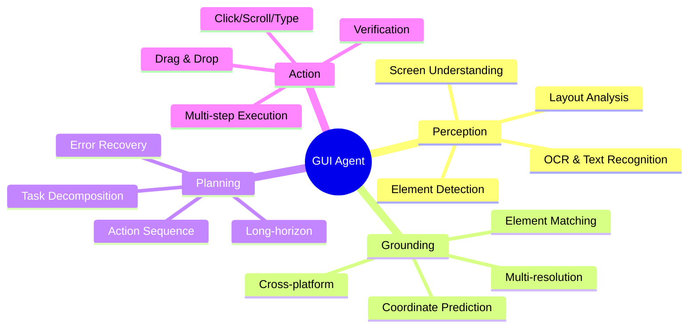

## 可视化演示

[🌐 在线浏览 HTML 演示](/static/presentations/GUI-Agent/index.html) — 杂志风格翻页展示

---

## 核心定义

**GUI Agent** = 能够理解图形用户界面（屏幕截图/视频）、定位界面元素（grounding）、执行操作（点击/滚动/输入）、完成多步骤任务的视觉 Agent 系统。

## 技术架构

```mermaid
mindmap
  root((GUI Agent))
    Perception
      Screen Understanding
      Element Detection
      Layout Analysis
      OCR & Text Recognition
    Grounding
      Coordinate Prediction
      Element Matching
      Multi-resolution
      Cross-platform
    Planning
      Task Decomposition
      Action Sequence
      Error Recovery
      Long-horizon
    Action
      Click/Scroll/Type
      Drag & Drop
      Multi-step Execution
      Verification
```

## 研究路线

### 1. Grounding Robustness (Primary)

**问题**: GUI grounding 在跨分辨率、跨设备、动态布局下不稳定

**现有方案**:
- Multi-resolution training (Qwen-GUI-3B)
- Zoom-in pipeline (MEGA-GUI)
- Positional encoding (RULER)
- Coordinate-free (GuiActor)
- 小模型专用架构 (GoClick 230M)

**空白**: 架构级 multi-scale 设计（FPN）underexplored

**关联论文**: [[2500-GuiActorCoordinateFree]], [[2604-GoClick]], [[Papers/2604-AdaptiveGrounding]]

**Idea**: [[Ideas/ScaleInvariant-Grounding-GUI]]

### 2. RL-based Training (Secondary)

**问题**: SFT 数据效率低，OOD 泛化弱；RL 训练数据效率可提升 10x

**主流范式**:
- GRPO (Group Relative Policy Optimization) — UI-R1 仅用 136 条任务
- Rule-based reward (action type + coordinate accuracy)
- Credit Assignment 需解决长程任务奖励分配

**空白**: Credit Assignment 赛道极度拥挤（SOLAR-RL, GiGPO, ProxMO, ADMIRE 2026年初同发）

**关联论文**: [[2500-UiR1EnhancingEfficient]], [[Papers/2604-ClawGUI]], [[Papers/2604-SOLAR-RL]]

**Idea**: [[Ideas/ForkPoint-CreditAssignment-GUI]]

### 3. Self-Improving Reliability (Monitoring)

**问题**: Self-improving 循环中 verifier/RM 存在系统性偏差，可能放大错误而非纠错

**现有方案**:
- Self-Grounded Verification (SGV) — 20pp OSWorld 提升
- Experience replay + trajectory filtering

**空白**: Adversarial verifier 机制可提供外部纠错

**关联论文**: [[2500-UiGenieSelfImproving]], [[2600-UiVoyagerSelfEvolving]]

**Idea**: [[Ideas/AdversarialVerification-SelfImproving-GUI]]

## Benchmarks

| Benchmark | Platform | Tasks | Metric |
|-----------|----------|-------|--------|
| OSWorld | Desktop | 369 | Success Rate |
| AndroidWorld | Mobile | 116 | Success Rate |
| ScreenSpot | Multi | 620 | Element Accuracy |
| GUIOdyssey | Mobile | 100+ | Navigation SR |
| WebArena | Web | 812 | Task Completion |

## 关键洞察

### Pattern 1: Grounding 是基础瓶颈
- Survey 确认 grounding error 是 GUI Agent 失败的主因（>50% failure traced to grounding）
- 小模型（230M GoClick）可在 grounding 上与大模型竞争

### Pattern 2: RL 数据效率惊人
- UI-R1: 136 条任务 → +22.1% AndroidWorld
- 对比 SFT: 需要 10K+ 轨迹

### Pattern 3: Self-improving 验证偏差
- UI-Genie 自增强后期 OOD 性能下降（overfitting to verifier preference）
- Verifier 本身需要 external grounding

## 待解决问题

1. 如何在不增加推理开销下实现 robust cross-resolution grounding？
2. Credit Assignment 方向差异化空间在哪？（需要读完 SOLAR-RL/ProxMO）
3. Self-improving 的 verifier 如何避免被 agent exploit？

## 下一步行动

| 方向 | Action | Priority |
|------|--------|----------|
| Grounding | Prototype GoClick+FPN, test on ScreenSpot multi-res | High |
| RL Training | Read SOLAR-RL/ProxMO, assess ForkPoint feasibility | Medium |
| Self-Improving | Read SGV, monitor progress | Low |

## 近期格局变化

- **[2026-07-15] 评测"进步幻觉"获第二独立数据点**：[[2504-OnlineMind2Web]] 证明 WebVoyager ~90% 分数在 live 站点崩塌（多数 agent 退回 SeeAct 水平，仅 Operator ~61%），并诊断成因为 shortcut 可解任务 + 不可靠 judge；与 Odysseys 44.5% 互证，judge 方法学成为分数可比性的一等变量。见 [[Topics/GUIAgent-Survey]] Takeaway 7。
- **[2026-07-15] 非参数自我改进路线成型，失败轨迹升为一等资源**：[[2409-AgentWorkflowMemory]]（NL workflow）→ [[2504-SkillWeaver]]（可执行 skill，强→弱迁移 +54.3%）→ [[2606-LearningFromFailure]]（失败轨迹 → runtime code patch，OSWorld +6.6 零训练）演进链清晰；参数化侧 [[2411-WebRL]] 同样把失败当 curriculum。改进产物的可执行性与失败经验的复用形态是新的方法区分轴。见 [[Topics/GUIAgent-Survey]] Takeaway 15。
- **[2026-07-15] web 安全面确立"security by incompetence"论断**：[[2504-WASP]]（NeurIPS 2025 D&B）现实威胁模型下部分劫持成功率 86% 但完整攻击少有达成——当前表观安全是 agent 无能的副产物，能力提升将直接放大注入风险；[[2409-EIA]]（ICLR 2025）把隐私泄露确立为独立攻击面（环境注入偷 PII 70%，精细注入绕过人工检查）。防御研究必须先于能力到位。见 [[Topics/GUIAgent-Survey]] Takeaway 6。
- **[2026-07-19] web 侧回溯/搜索证据链闭合，缺口指向环境状态原语**：[[2407-TreeSearchLMAgents]]（真实探索 +39.7%，靠 reset+replay 模拟回溯）→ [[2411-WebDreamer]]（live 不可回溯只能想象模拟，收益 ~70% 且深度封顶）→ [[2512-WebOperator]]（agent 侧投机回溯，可逆性启发式确认率仅 37%）→ [[2510-WebServ]]（引擎侧 O(1) 快照/分支回应）→ [[2511-DreamGym]]（极端解：合成经验放弃真实环境）。五篇合拢为"环境原生 fork/rollback + 动作可逆性元数据"的需求证据链——AFE 方向 rollback affordance 的最完整跨论文支撑。见 [[Topics/WebAgent-Survey]] Takeaway 7。
- **[2026-07-19] 评估器可靠性获得定量下界**：[[2504-AgentRewardBench]]（1302 条专家标注轨迹测 12 个 judge）：LLM judge precision 无一超 70%、rule-based recall 仅 55.9%、副作用检测 precision 7–14%——评估的双向失败被首次系统测量，与 CUARewardBench（ORM 82.9%）/WebJudge（~85%）共同框定 judge 精度边界。见 [[Topics/WebAgent-Survey]] Takeaway 5。- **[2026-07-20] "环境非 RL-ready"的三条对偶回应路线成型**：面对同一缺口（WebArena 4 并发 / 手动 reset / 评测误判），[[2509-AgentGymRL]] 花工程改造环境（多 Chromium 并行 + full-reset + 内存治理）、[[2511-DreamGym]] 放弃真实环境合成经验（Theorem 1: 只需 ε_R+ε_P）、[[2606-OpenWebRL]] 用容错层硬上 live（但 51% 失败仍在环境接入层）——改造/替代/容错三条路线的成本对比成为选型框架，且都指向环境引擎能力是共同瓶颈。见 [[Topics/GUIAgent-Survey]] 2.3 与 [[Topics/AgentEnvironment-Survey]] Takeaway 3。
- **[2026-07-20] 探索式任务合成家族的共同软肋显影**：[[2410-NNetNav]]（interaction-first hindsight，对环境要求最低）与 [[2502-Explorer]]（四阶段流水线，$0.28/条）把无监督任务合成推到实用规模，但家族共享同一天花板——LLM judge 噪声 ~19% 直接进训练集、沙盒-live 迁移崩塌（WebArena 训 → live 仅 9.5%）、安全协议使任务分布系统性偏只读。任务供给的瓶颈从采集成本转移到**可验证性**。见 [[Topics/GUIAgent-Survey]] Takeaway 12。
- **[2026-07-20] 验证/判定成为主战场，失败结构与修复路径同时显影**：失败任务中 >86% 是 false completion（[[2604-VLAA-GUI]]，agent 自认已成功），与 VeriGUI 72.3% 空转 timeout 同指"不知道自己错了"；[[2510-CUARewardBench]] 测得 CUA reward model 单模型上限 82.9% precision 且 CUA 专用训练反而损害判断。修复路径分化为三条：交互式验证（[[2602-VAGEN]] verifier agent 主动探测环境 92.9% acc，依据"验证不对称性"）、视觉锚定 critic（[[2606-HiViG]] 红 X 标记+intent masking，+7~9pp 而既有 critic 增益≈0）、框架级强制验证（[[2604-VLAA-GUI]] OSWorld-V 77.45% 单 pass 超人类）。见 [[Topics/GUIAgent-Survey]] Takeaway 14。
- **[2026-07-20] Self-evolving 工业闭环刷新开源水位，PRM 路线遭实证警告**：[[2601-EvoCUA]]/[[2607-EvoCUA15]] 的 Generation-as-Validation（任务与代码级 validator 共生成）+ 10 万并发 sandbox + STEPO online RL 把 OSWorld-Verified 开源 SOTA 推到 63.2%，合成经验 20k→1M 增益单调；其两个负结果具方法论意义——RL 数据子集有效性是 policy 相对的（否定"普适高质量 RL 数据集"假设）、PRM 在稀疏 reward 下被 hack（PRM 分升而 outcome 停滞），后者与 [[2602-ADMIRE]] 的 milestone 自举路线（不经 model-judged PRM 的密集化）形成对照。见 [[Topics/GUIAgent-Survey]] 2.2/2.3。
- **[2026-07-21] RL 收益边界条件成型——GRPO 是分布重塑而非能力注入**：[[2607-GRPONullWebAgent]]（受控阴性：仅 sampled-policy headroom 存在时有效）+ [[2607-MAG]]（base <10% 停摆需 expert 注入）+ [[2603-WebChain]]（mid-training 决定 ceiling）合拢为训练资源分配的前置判据；与 agenda RL 方向的"GRPO headroom 前置诊断"切入点直接对应。见 [[Topics/WebAgent-Survey]] Takeaway 8 / [[Topics/AgenticRL-Survey]]。
- **[2026-07-21] Multi-agent 并行在 web 导航域基本负收益**：[[2512-ScalingAgentSystems]]（错误放大 17.2×、基线 >45% 必然负收益）与 [[2602-WideSeekR1]]（仅可分解的宽检索域可经 MARL 训练解锁增益）把 multi-agent 收益条件锚定到任务可分解性。见 [[Topics/WebAgent-Survey]] Takeaway 9。
- **[2026-07-21] Agent-facing rollback 从设想变为已实现先例，AFE 剩余空白精确收窄**：[[2604-Crab]] 在 sandbox 域把 `sbx.rollback` 做成 agent 可自调工具并给出端到端收益（步数 −29%、RL 分支 token −40~64%）——primary direction 的差异化空间收窄为 web 全栈状态域 + success 因果验证 + prompt-only 对照；verify 侧 [[2602-VAGEN]] 交互式 verifier（92.9% acc）与 AFE `verify()` affordance 互为同一问题两侧。见 [[Topics/AgentEnvironment-Survey]] §4.3。
- **[2026-07-22] benchmark 换代——旧主基准饱和，战场前移**：AndroidWorld（顶级 framework >90%）与 ScreenSpot-V2 已饱和，mobile 长程战场移向 [[Papers/2512-MobileWorld]]（201 tasks，agent-user interaction + MCP-augmented，best framework 仅 51.7%），grounding 战场移向 ScreenSpot-Pro（当前 SOTA GUI-Owl-1.5-32B 80.3，老 baseline SeeClick/OS-Atlas 个位到十几）；桌面侧 OSWorld 已越 human 线（Sonnet 4.6 72.5% > 72.36%）。survey 只引旧基准即显过时。见 [[Topics/GUIAgent-Survey]] §1/§8。
- **[2026-07-22] 评测危机升级，cost 成为一等评测轴**：在"进步幻觉"之上，[[Papers/2407-AgentsThatMatter]]（TMLR 2025）与 [[Papers/2510-HAL]] 证明多数 benchmark 可被刷分（agent 可控字符串触发 `eval()` / gold reference 泄漏进 config）、scaffold 与 judge 可致 ~50 点摆动、static→live 掉 59%，且几乎无 agent 落在 cost–accuracy Pareto 前沿（HAL 21,730 rollout：9 benchmark 仅 1 个最贵模型在前沿，提高 reasoning effort 常无益）。任何报 SOTA 的结论须绑定 verifier + cost + Pareto 位置。见 [[Topics/GUIAgent-Survey]] §6.3。
