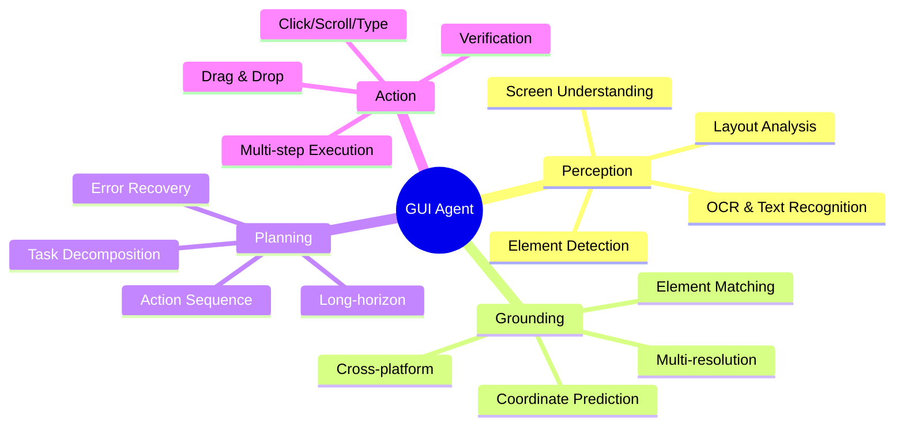

## 可视化演示

[🌐 在线浏览 HTML 演示](/static/presentations/GUI-Agent/index.html) — 杂志风格翻页展示

---

## 核心定义

**GUI Agent** = 能够理解图形用户界面（屏幕截图/视频）、定位界面元素（grounding）、执行操作（点击/滚动/输入）、完成多步骤任务的视觉 Agent 系统。

## 技术架构

```mermaid
mindmap
  root((GUI Agent))
    Perception
      Screen Understanding
      Element Detection
      Layout Analysis
      OCR & Text Recognition
    Grounding
      Coordinate Prediction
      Element Matching
      Multi-resolution
      Cross-platform
    Planning
      Task Decomposition
      Action Sequence
      Error Recovery
      Long-horizon
    Action
      Click/Scroll/Type
      Drag & Drop
      Multi-step Execution
      Verification
```

## 研究路线

### 1. Grounding Robustness (Primary)

**问题**: GUI grounding 在跨分辨率、跨设备、动态布局下不稳定

**现有方案**:
- Multi-resolution training (Qwen-GUI-3B)
- Zoom-in pipeline (MEGA-GUI)
- Positional encoding (RULER)
- Coordinate-free (GuiActor)
- 小模型专用架构 (GoClick 230M)

**空白**: 架构级 multi-scale 设计（FPN）underexplored

**关联论文**: [[2500-GuiActorCoordinateFree]], [[2604-GoClick]], [[Papers/2604-AdaptiveGrounding]]

**Idea**: [[Ideas/ScaleInvariant-Grounding-GUI]]

### 2. RL-based Training (Secondary)

**问题**: SFT 数据效率低，OOD 泛化弱；RL 训练数据效率可提升 10x

**主流范式**:
- GRPO (Group Relative Policy Optimization) — UI-R1 仅用 136 条任务
- Rule-based reward (action type + coordinate accuracy)
- Credit Assignment 需解决长程任务奖励分配

**空白**: Credit Assignment 赛道极度拥挤（SOLAR-RL, GiGPO, ProxMO, ADMIRE 2026年初同发）

**关联论文**: [[2500-UiR1EnhancingEfficient]], [[Papers/2604-ClawGUI]], [[Papers/2604-SOLAR-RL]]

**Idea**: [[Ideas/ForkPoint-CreditAssignment-GUI]]

### 3. Self-Improving Reliability (Monitoring)

**问题**: Self-improving 循环中 verifier/RM 存在系统性偏差，可能放大错误而非纠错

**现有方案**:
- Self-Grounded Verification (SGV) — 20pp OSWorld 提升
- Experience replay + trajectory filtering

**空白**: Adversarial verifier 机制可提供外部纠错

**关联论文**: [[2500-UiGenieSelfImproving]], [[2600-UiVoyagerSelfEvolving]]

**Idea**: [[Ideas/AdversarialVerification-SelfImproving-GUI]]

## Benchmarks

| Benchmark | Platform | Tasks | Metric |
|-----------|----------|-------|--------|
| OSWorld | Desktop | 369 | Success Rate |
| AndroidWorld | Mobile | 116 | Success Rate |
| ScreenSpot | Multi | 620 | Element Accuracy |
| GUIOdyssey | Mobile | 100+ | Navigation SR |
| WebArena | Web | 812 | Task Completion |

## 关键洞察

### Pattern 1: Grounding 是基础瓶颈
- Survey 确认 grounding error 是 GUI Agent 失败的主因（>50% failure traced to grounding）
- 小模型（230M GoClick）可在 grounding 上与大模型竞争

### Pattern 2: RL 数据效率惊人
- UI-R1: 136 条任务 → +22.1% AndroidWorld
- 对比 SFT: 需要 10K+ 轨迹

### Pattern 3: Self-improving 验证偏差
- UI-Genie 自增强后期 OOD 性能下降（overfitting to verifier preference）
- Verifier 本身需要 external grounding

### Pattern 4: 预算匹配对照是方法可信度的首要筛选条件

*[2026-08-02] 由 validated insight 经 Human review 晋升（queue 69262838）；源条目 [[Workbench/memory/insights.md]] [2026-07-30]，8 独立 source / 4 独立日期*

Agent 增强模块（memory/skill 库、观察削减、context 治理、优化器替换）的报告增益中，有相当比例来自未被计入的额外推理预算或不可比的实验口径。一旦补上"总预算固定 / 同 backbone 同 verifier / matched run"这类对照，增益普遍缩水甚至反向：

- **memory/skill 库**：[[Papers/2606-SkillMemoryBudget]] 给 AWM/ASI/ReasoningBank 做 token-matched vanilla 对照（同预算换 15 步），3 模型 × 3 WebArena 域聚合 SR 全被 vanilla 追平/反超
- **模态选择**：[[Papers/2606-GUIvsCLI]] 在 440 桌面任务上解耦模态-任务-verifier，最强 screen-only GUI 59.1% 反高于最强 original-skill CLI 48.2%，否定"CLI/API 优于 GUI"的无条件版本
- **优化器**：[[Papers/2607-MuonAgenticRL]] matched run 下仅替换 optimizer 即把 ALFWorld/GiGPO final checkpoint 从 0.320 抬到 0.633——优化器不统一时跨论文比数字无效
- **观察削减**：[[Papers/2410-AgentOccam]] per-step 观察 token 反增（2210.2 → 2930.9）仍拿 WebArena 43.1%，杠杆是动作空间对齐而非省 token；"优化观察" ≠ "省预算"

因此**"是否给出预算与口径匹配对照"是判断一项 GUI/web agent 方法是否成立的首要筛选条件**，而非审稿时的附加要求；反过来，把对照补上本身已是当前最高价值的一类贡献。

**边界**：不主张所有增强都是预算假象——[[Papers/2607-MHLC]] 在 −90.7% 成本下仍把成功率 0.47 → 0.60，GUIvsCLI 中 verifier-guided skill 修补把 CLI 从 48.2% 推到 69.3%（含 verifier leakage，只能作上界）。本条是对文献计量规律的归纳而非受控复现，不能用于反驳任何单篇具体工作。

**操作含义**：本 domain 下的自有实验（AFE-MiniSuite、[[Ideas/MismatchTriage-LongHorizonRecovery-GUI]]、[[Ideas/ScaleInvariant-Grounding-GUI]] 的 FPN 原型对照）必须内置 budget-matched arm 与 seed × data-draw 交叉；引用增强类方法时标注其对照口径。

## 待解决问题

1. 如何在不增加推理开销下实现 robust cross-resolution grounding？
2. Credit Assignment 方向差异化空间在哪？（需要读完 SOLAR-RL/ProxMO）
3. Self-improving 的 verifier 如何避免被 agent exploit？

## 下一步行动

| 方向 | Action | Priority |
|------|--------|----------|
| Grounding | Prototype GoClick+FPN, test on ScreenSpot multi-res | High |
| RL Training | Read SOLAR-RL/ProxMO, assess ForkPoint feasibility | Medium |
| Self-Improving | Read SGV, monitor progress | Low |

## 近期格局变化

- **[2026-07-15] 评测"进步幻觉"获第二独立数据点**：[[2504-OnlineMind2Web]] 证明 WebVoyager ~90% 分数在 live 站点崩塌（多数 agent 退回 SeeAct 水平，仅 Operator ~61%），并诊断成因为 shortcut 可解任务 + 不可靠 judge；与 Odysseys 44.5% 互证，judge 方法学成为分数可比性的一等变量。见 [[Topics/CUA-Survey]] §8.3。
- **[2026-07-15] 非参数自我改进路线成型，失败轨迹升为一等资源**：[[2409-AgentWorkflowMemory]]（NL workflow）→ [[2504-SkillWeaver]]（可执行 skill，强→弱迁移 +54.3%）→ [[2606-LearningFromFailure]]（失败轨迹 → runtime code patch，OSWorld +6.6 零训练）演进链清晰；参数化侧 [[2411-WebRL]] 同样把失败当 curriculum。改进产物的可执行性与失败经验的复用形态是新的方法区分轴。见 [[Topics/CUA-Survey]] §6.8 与 §5.6。
- **[2026-07-15] web 安全面确立"security by incompetence"论断**：[[2504-WASP]]（NeurIPS 2025 D&B）现实威胁模型下部分劫持成功率 86% 但完整攻击少有达成——当前表观安全是 agent 无能的副产物，能力提升将直接放大注入风险；[[2409-EIA]]（ICLR 2025）把隐私泄露确立为独立攻击面（环境注入偷 PII 70%，精细注入绕过人工检查）。防御研究必须先于能力到位。见 [[Topics/CUA-Survey]] §6.11/§8.9。
- **[2026-07-19] web 侧回溯/搜索证据链闭合，缺口指向环境状态原语**：[[2407-TreeSearchLMAgents]]（真实探索 +39.7%，靠 reset+replay 模拟回溯）→ [[2411-WebDreamer]]（live 不可回溯只能想象模拟，收益 ~70% 且深度封顶）→ [[2512-WebOperator]]（agent 侧投机回溯，可逆性启发式确认率仅 37%）→ [[2510-WebServ]]（引擎侧 O(1) 快照/分支回应）→ [[2511-DreamGym]]（极端解：合成经验放弃真实环境）。五篇合拢为"环境原生 fork/rollback + 动作可逆性元数据"的需求证据链——AFE 方向 rollback affordance 的最完整跨论文支撑。见 [[Topics/CUA-Survey]] §6.10 与 §10.5。
- **[2026-07-19] 评估器可靠性获得定量下界**：[[2504-AgentRewardBench]]（1302 条专家标注轨迹测 12 个 judge）：LLM judge precision 无一超 70%、rule-based recall 仅 55.9%、副作用检测 precision 7–14%——评估的双向失败被首次系统测量，与 CUARewardBench（ORM 82.9%）/WebJudge（~85%）共同框定 judge 精度边界。见 [[Topics/CUA-Survey]] §8.12。- **[2026-07-20] "环境非 RL-ready"的三条对偶回应路线成型**：面对同一缺口（WebArena 4 并发 / 手动 reset / 评测误判），[[2509-AgentGymRL]] 花工程改造环境（多 Chromium 并行 + full-reset + 内存治理）、[[2511-DreamGym]] 放弃真实环境合成经验（Theorem 1: 只需 ε_R+ε_P）、[[2606-OpenWebRL]] 用容错层硬上 live（但 51% 失败仍在环境接入层）——改造/替代/容错三条路线的成本对比成为选型框架，且都指向环境引擎能力是共同瓶颈。见 [[Topics/CUA-Survey]] §4.2 与 [[Topics/CUA-Survey]] §7.8。
- **[2026-07-20] 探索式任务合成家族的共同软肋显影**：[[2410-NNetNav]]（interaction-first hindsight，对环境要求最低）与 [[2502-Explorer]]（四阶段流水线，\$0.28/条）把无监督任务合成推到实用规模，但家族共享同一天花板——LLM judge 噪声 ~19% 直接进训练集、沙盒-live 迁移崩塌（WebArena 训 → live 仅 9.5%）、安全协议使任务分布系统性偏只读。任务供给的瓶颈从采集成本转移到**可验证性**。见 [[Topics/CUA-Survey]] §5.4。
- **[2026-07-20] 验证/判定成为主战场，失败结构与修复路径同时显影**：失败任务中 >86% 是 false completion（[[2604-VLAA-GUI]]，agent 自认已成功），与 VeriGUI 72.3% 空转 timeout 同指"不知道自己错了"；[[2510-CUARewardBench]] 测得 CUA reward model 单模型上限 82.9% precision 且 CUA 专用训练反而损害判断。修复路径分化为三条：交互式验证（[[2602-VAGEN]] verifier agent 主动探测环境 92.9% acc，依据"验证不对称性"）、视觉锚定 critic（[[2606-HiViG]] 红 X 标记+intent masking，+7~9pp 而既有 critic 增益≈0）、框架级强制验证（[[2604-VLAA-GUI]] OSWorld-V 77.45% 单 pass 超人类）。见 [[Topics/CUA-Survey]] §3.2 与 §6.10。
- **[2026-07-20] Self-evolving 工业闭环刷新开源水位，PRM 路线遭实证警告**：[[2601-EvoCUA]]/[[2607-EvoCUA15]] 的 Generation-as-Validation（任务与代码级 validator 共生成）+ 10 万并发 sandbox + STEPO online RL 把 OSWorld-Verified 开源 SOTA 推到 63.2%，合成经验 20k→1M 增益单调；其两个负结果具方法论意义——RL 数据子集有效性是 policy 相对的（否定"普适高质量 RL 数据集"假设）、PRM 在稀疏 reward 下被 hack（PRM 分升而 outcome 停滞），后者与 [[2602-ADMIRE]] 的 milestone 自举路线（不经 model-judged PRM 的密集化）形成对照。见 [[Topics/CUA-Survey]] §7.11/§7.6。
- **[2026-07-21] RL 收益边界条件成型——GRPO 是分布重塑而非能力注入**：[[2607-GRPONullWebAgent]]（受控阴性：仅 sampled-policy headroom 存在时有效）+ [[2607-MAG]]（base <10% 停摆需 expert 注入）+ [[2603-WebChain]]（mid-training 决定 ceiling）合拢为训练资源分配的前置判据；与 agenda RL 方向的"GRPO headroom 前置诊断"切入点直接对应。见 [[Topics/CUA-Survey]] §7.8。
- **[2026-07-21] Multi-agent 并行在 web 导航域基本负收益**：[[2512-ScalingAgentSystems]]（错误放大 17.2×、基线 >45% 必然负收益）与 [[2602-WideSeekR1]]（仅可分解的宽检索域可经 MARL 训练解锁增益）把 multi-agent 收益条件锚定到任务可分解性。见 [[Topics/WebAgent-Survey]] Takeaway 2。
- **[2026-07-21] Agent-facing rollback 从设想变为已实现先例，AFE 剩余空白精确收窄**：[[2604-Crab]] 在 sandbox 域把 `sbx.rollback` 做成 agent 可自调工具并给出端到端收益（步数 −29%、RL 分支 token −40~64%）——primary direction 的差异化空间收窄为 web 全栈状态域 + success 因果验证 + prompt-only 对照；verify 侧 [[2602-VAGEN]] 交互式 verifier（92.9% acc）与 AFE `verify()` affordance 互为同一问题两侧。见 [[Topics/CUA-Survey]] §4.4 与 §4.9。
- **[2026-07-22] benchmark 换代——旧主基准饱和，战场前移**：AndroidWorld（顶级 framework >90%）与 ScreenSpot-V2 已饱和，mobile 长程战场移向 [[Papers/2512-MobileWorld]]（201 tasks，agent-user interaction + MCP-augmented，best framework 仅 51.7%），grounding 战场移向 ScreenSpot-Pro（当前 SOTA GUI-Owl-1.5-32B 80.3，老 baseline SeeClick/OS-Atlas 个位到十几）；桌面侧 OSWorld 已越 human 线（Sonnet 4.6 72.5% > 72.36%）。survey 只引旧基准即显过时。见 [[Topics/CUA-Survey]] §11.1 与 §8.4。
- **[2026-07-22] 评测危机升级，cost 成为一等评测轴**：在"进步幻觉"之上，[[Papers/2407-AgentsThatMatter]]（TMLR 2025）与 [[Papers/2510-HAL]] 证明多数 benchmark 可被刷分（agent 可控字符串触发 `eval()` / gold reference 泄漏进 config）、scaffold 与 judge 可致 ~50 点摆动、static→live 掉 59%，且几乎无 agent 落在 cost–accuracy Pareto 前沿（HAL 21,730 rollout：9 benchmark 仅 1 个最贵模型在前沿，提高 reasoning effort 常无益）。任何报 SOTA 的结论须绑定 verifier + cost + Pareto 位置。见 [[Topics/CUA-Survey]] §8.10/§8.13。
- **[2026-07-23] web observation reduction 子领域进入祛魅期——"优化 DOM 而非 raw DOM"方法饱和、收益随底座变强而蒸发**：四条路线已固化（程序化剪枝 [[Papers/2511-Prune4Web]] / LLM 选行 [[Papers/2510-FocusAgent]] / 规则重构 [[Papers/2605-A11yCompressor]] / 表示对齐 [[Papers/2410-AgentOccam]]），但三个跨论文校正性发现改变了这条线的判断：(1) **优化≠省 token**——AgentOccam 每步观察 token 反增（2210→2930）仍拿 WebArena 43.1%，杠杆是对齐+降噪而非缩短；(2) **压缩非普遍有益**——[[Papers/2604-ReadMoreThinkMore]] 证明强模型用完整 HTML 反而 +14.6~17.5pp、弱模型 −18.8pp，最优表示取决于 model capability × thinking budget；(3) **收益随模型变强蒸发**——Prune4Web 对 GPT-4o 零提升、FocusAgent 在 WebArena 低于全观察。方向正从"能力问题"退化为"成本/延迟/安全问题"，并已自建廉价评测代理 [[Papers/2605-MFSCoverage]]（MFS coverage，评测提速 >100×）。见 [[Topics/CUA-Survey]] §4.5/§6.7。
- **[2026-07-28] Verifier 战线出现方向相反的两个新数据点**：[[Papers/2607-SeekJudge]] 声称首个在 online RL 中 match/surpass 环境原生 rule-based reward 的 practical model-based reward（UI-TARS 1.5 7B 三 domain 全升；judging 拆为 localization/extraction、distill 到共享 9B、rollout-overlapped serving，52 images 峰值 context 12K vs 竞品 48–80K），把"model judge 精度不足以进 RL 训练闭环"的既有边界撕开一角（库内暂无独立验证，Qwen3VL-8B 上增益不稳定）；同时 [[Papers/2607-StateAct]] 量化了独立 finish gate 的覆盖上界——76 个 non-perfect 任务错放 68 个，state access + context 独立性能抓 structural defect 但对 value correctness 近乎失明。verification 的分工正在显影：结构性检查可自动化，值正确性仍是 open problem。见 [[Topics/CUA-Survey]] §7.6 与 §6.10。
- **[2026-07-28] State-first harness 给出 hybrid 路由的同 backbone 强证据**：[[Papers/2607-StateAct]]（Salesforce）把 program state 设为主接口、GUI 压到 1.1% main-agent steps，OSWorld 2.0 同 backbone（Opus 4.8）binary 20.6%→26.9%、单任务成本 ~\$72→~\$7.8；但 bash-only 45.9% 低于 screenshot reference 54.8%、short-horizon 上与 reference 持平——GUI 通道不可移除、收益集中在 long-horizon，与 WeaveBench/CoAct-1 的模态互补结论合拢为三方收敛。见 [[Topics/CUA-Survey]] §6.6 与 §4.8。
- **[2026-07-28] Online skill/memory 增强在预算匹配下集体失效——"模块有效"主张的举证责任翻转**：[[Papers/2606-SkillMemoryBudget]] 给 AWM/ASI/ReasoningBank 做 token-matched vanilla 对照（同预算换 15 步），3 模型 × 3 WebArena 域聚合 SR 全被 vanilla 追平/反超；机制 = 双重成本（模块调用 + prompt 膨胀）+ 资产污染（AWM ~50% workflow 源自失败轨迹、ReasoningBank >50% 伪 success 标签、ASI 坏函数经 actor 兜底入库）。为「监督资产是 policy/阶段相对的」insight 添加 budget 维度证据，且现有 online 方法自带验收环节不合格 = evolution-step gating 必要性的量化论据；结论限 online 设置，offline 摊销不受打击。any/all-of-3 差 10–19pp 与 TeachStop 方差结论双点收敛。见 [[Topics/CUA-Survey]] §7.11.2 与 §8.13.2。
- **[2026-07-28] "CLI/API 优于 GUI"首获 matched 对照裁决——无条件版本被否定，CLI 瓶颈定位到 skill 接口覆盖**：[[Papers/2606-GUIvsCLI]] 在 440 桌面任务上做首个模态-任务-verifier 解耦对照：最强 GUI 59.1% > 最强原始 CLI 48.2%（同 backbone 配对差距更大：GPT-5.4 59.1 vs 24.3）；CLI 失败 93.8% 归因 skill coverage & contract gap（原始 CLI-Anything 仅覆盖 37.6% verifier checkpoints），verifier-guided 修补提至 69.3% 但含 verifier leakage 只能作上界。类别级分化（Web GUI 88.2 vs 35.3；CAD CLI 67.3 vs 46.9）把模态互补从系统消融扩展为四方收敛（+WeaveBench/CoAct-1/StateAct）。对 AFE 的含义：skill/affordance 的 checkpoint 覆盖率审计（Pass/Partial/Fail 分级）是可复用的暴露完整性测量协议。见 [[Topics/CUA-Survey]] §8.6 与 §4.7.2。
- **[2026-07-29] Model-based reward 进 RL 闭环获得第二独立路线，与 SeekJudge 构成相反方向收敛**：[[Papers/2607-InteractiveRewardAgent]]（IRA）把 interactive verifier 做成 reward agent——propose 任务完成条件 + system/application/GUI 三类工具逐条核验 post-execution 环境状态，GUI-RewardBench 321 条 desktop 轨迹 86.9% acc（最佳 passive DistRL 78.8%），DART RL 闭环内 34.0% OSWorld ≈ script reward 34.9%、无 script 生成任务 33.5%。SeekJudge 靠证据选择（少而准的截图判定）、IRA 靠证据获取（主动环境取证），"judge 精度不足以进 RL 训练闭环"的边界从两侧同时被突破；IRA 同 backbone 消融显示增益来自环境证据访问而非更强判断，失败分析把瓶颈移到 condition proposal 失准（granularity / 字面化 / persistence）。等证据预算下两路线孰优仍无对照。见 [[Topics/CUA-Survey]] §7.6 与 §8.12。
- **[2026-07-29] 良性 experience 被实证为 CUA self-evolution 的内生安全风险**：[[Papers/2604-ExperienceSafetyRisks]] 在 AWM / ReasoningBank 上观察到 7 模型 × 3 安全 benchmark 的 21 个组合 ASR 全部随良性经验积累上升；剂量与等长对照把机制收窄到 execution-oriented experience 语义，refusal 经验虽压低 ASR 却诱发 over-refusal。memory gate 因而必须联合审计 utility、safety 与拒绝校准，而非只按 task success 接纳资产。证据限两种 memory 框架，ASR judge 无 human calibration。见 [[Topics/CUA-Survey]] §6.11 与 §7.11。
- **[2026-08-02] Judge 噪声被证明是有方向的，且 ensemble 不是解药——verifier 线的既有补救默认被否**：[[Papers/2607-OSReward]] 在四平台 1019 条 gold 轨迹（3 标注者 + 2 资深审核者协商定标，Krippendorff α = 0.797）上以统一协议横评 27 个 judge，得到三个结构性结论：(1) **偏差有方向**——over-accept 约占全部错误 2/3、每个 judge ≥48%，是 27 个 judge 无一例外的首位错误模式，即 judge 系统性偏宽松而非对称噪声；(2) **偏差来自读 agent 自述而非读屏**——去掉文本 thought/action 通道 BalAcc 掉 7.2pp、22.7% 判定翻转，去掉视觉通道 <0.5pp；(3) **多 judge 投票不解决它**——judge 间 κ≈0.71 且同族 0.731 / 跨族 0.709 几无差别，top-3 投票仅 +1pp，而 T=0.7 重采样已能翻转 6–9%、oracle 上界 99.2%，说明 ensemble 真正能提供的是弃权信号而非精度。这直接约束 [[Papers/2510-CUARewardBench]] 的 Unanimous Prompt Ensemble 这类做法，也把 §8.14 的"等证据预算 verifier 对照"gap 从缺 passive 侧数据收窄到只缺下游 policy 训练实验。配套 OS-Shepherd（9B 86.1/60.2 vs base 76.7/39.4）证明配方可迁移，但训练标签取自同一批共享宽松倾向的 judge，上限被该 ensemble 锁住（原文未讨论）。库内暂无独立验证。见 [[Topics/CUA-Survey]] §8.12 与 §7.6。
- **[2026-08-02] 模态互补从"系统消融"升级为部署规模的使用分布实测，执行/验证分工可由 outcome reward 自发涌现**：[[Papers/2607-QwenUIAgent]] 报告同一 policy 在 OSWorld-Verified / v2 上 CLI 占全部动作的 40.7% / 55.1%、出现在 92.0% / 98.2% 的任务中——四方收敛（WeaveBench/CoAct-1/[[Papers/2607-StateAct]]/[[Papers/2606-GUIvsCLI]]）此前给的是"两种通道都不能移除"，这里首次给出实际调用比例；且随 RL 进行，GUI-only batch 75.8%→64.7%、GUI+CLI 混合 batch 11.0%→20.3%，execution→verification 状态转移 40.2%→52.4%、含验证行为的轨迹 +14.7%、false-stop −11.2%，即"Bash 当手、GUI 当眼"的分工在仅有结果奖励下自发出现（同系统前后对比，非跨系统对照，不改变"三种路由范式尚无同环境对照"的判断）。基础设施侧同时证明真机供给可工程化到生产规模（100+ 物理设备 / 150+ app，health-aware scheduler + virtual display，自报吞吐约 20×）。**但收益归因不成立**：主力数字 MobileWorld-Real 92.2% 建在作者自建的 409 任务 benchmark 与自建 AutoJudge（5 VLM 多数投票、env_error 不入分母）之上，对次优系统 3.5pp 的领先小于该 judge 自身 7.2pp 的不一致率，全文无"同模型加/不加真机数据"的受控对照。见 [[Topics/CUA-Survey]] §4.8 与 §4.3。
- **[2026-08-03] Verifier 的偏差方向由证据通道决定，不是 verifier 的普遍属性——上一条"judge 系统性偏宽松"须限定在 passive VLM judge**：[[Papers/2607-MisScoreCUA]] 审计 5 个 benchmark 的 150 条 zero-reward 轨迹，测得 15.3% 的 FAIL 判定是错的（Wilson CI [10.4, 22.0]）= 10.7% evaluator false negative + 4.7% broken task，即 programmatic oracle 的偏差方向与 [[Papers/2607-OSReward]] 测出的 passive judge 宽松倾向（over-accept 约 3:1）**恰好相反**：读 agent 自述的判宽，只认可执行状态匹配的判严。两者不能共用同一套纠偏策略，把任一方向推广到整个 verifier 谱系都是错的。跨 benchmark 病因异质同样重要——WorkArena 24 条 0 误判（结构化后端状态可直接查询），WebArena 的 21.7% 全部来自 evaluator（依赖 URL/文本等价性），AssistantBench 的 21.7% 全部来自 broken task（live 站点腐化）——"benchmark 不可靠"至少是两种独立病，修法不同。**证据边界须与结论同引**：该文 93/150 轨迹取自 [[Papers/2504-AgentRewardBench]]，后者已为同一批轨迹释出 6 专家 gold label（一致性 89.3%）并已报告 rule-based recall 55.9%，而该文全文未做交叉校准，因此只是同一现象的又一次量级估计，不构成独立复现；另有 46/150 行无人工复核、human–LLM κ 仅 0.19–0.32、仅审计 FAIL 侧故无 false positive 量级。附带一份可用的失败结构分解（Tier3 verification/feedback 39.3%，其中 feedback-blind no-op 单类 29.5%；Tier1 planning 35.2%；Tier2 execution/grounding 仅 13.9%），但诊断阶段 κ=0.41 使 Tier3 与 Tier1 的 4.1pp 差距不可读作排序。见 [[Topics/CUA-Survey]] §8.12、§8.11 与 §8.13.1。
- **[2026-08-03] 纯 screenshot-only native 把 OSWorld-Verified 推到 86.2，同篇又给出"加通道反而掉分"的反向数据点——路由从架构选择变成可测量的能力缺口**：[[Papers/2608-QwenCUA]]（397B-A17B MoE，刻意不给 accessibility tree / DOM / shell / task-specific API，只留截图与键鼠）在 OSWorld-Verified 报 86.2（同表 Qwen3.7 73.3、GPT-5.5 78.7、Opus-4.8 83.4；对比分多取自各家官方报告，评测条件不由该文控制）。其唯一新机制是块状折叠——active 视觉预算 20 张，超出后折叠边界一次前进 10 步，边界前的截图换成文本占位符而 reasoning/action 原样保留——价值不在压 context（选块而非逐步是为 KV-cache 前缀稳定），而在**同一个 fold operator 复用到训练期 trajectory slicing**：长 episode 切成多个继承终态 reward 的 context-bounded slice，训推折叠表示严格一致且不必设计 step-level reward。更值得记的是同篇的反向实验：给两个 Qwen 模型额外开放 Bash 后，MyPCBench 平均 turn 数降约 23%（69.3→53.4、63.6→49.1），perfect-task rate 却同步下降（51.6→41.8、58.7→55.1），且**更强的模型损失更小**（−3.6pp vs −9.8pp）。07-28 / 08-02 记录的四方收敛测的都是**移除**通道的代价，这里第一次测出**增加**通道却不训练路由的代价——两者不冲突，但把"谁来路由"改写成一个随能力变化的可学习决策，且奖励信号罕见地干净（同任务两条执行路径、成功可验证、turn/token 代价可测）。规模侧另给出本领域最完整的一份 RLVR 成本账：近 10 万 vCPU、约 4 万条 verifiable task、512 张 H200 跑 1,000 update ≈ 61,440 GPU-hours，held-out 在 update 800 见顶 0.770 后回落到 0.762；其 RL 任务准入（8 次 trial rollout 只留 0<成功数<8）与 [[Papers/2607-SCALECUA]] 的 Frontier Sampling 是同一原则的两种实现，跨团队独立采用。**证据边界**：全文零组件级 ablation（20 张预算 / 块大小 10 / slicing / SAPO / 迭代刷新五项打包交付，作者自陈迭代曲线不可读作 controlled convergence 或 scaling），头条"八个 benchmark 全面超越 Qwen3.7"建在 non-thinking baseline 与自身 thinking 模式的对照上，八项中实际只有 OSWorld-Verified 与 MacAgentBench 居首，token 效率优势只在 OSWorld-Verified 内成立（同模型在 OSWorld 2.0 上花 244,625.5 output tokens/task 且该处无 baseline token 数可比）。全部分数为自报并经原文一致性核查，库内暂无独立验证。见 [[Topics/CUA-Survey]] §6.3、§4.8 与 §7.9。

- **2026-08-04｜注入研究的优化目标从"文本多难被发现"转到"目标危害低到不值得拒绝"**：[[Papers/2608-InvisibleInkThreats]] 把 CUA 的 indirect prompt injection 攻击面移到低危害但对攻击者有收益的动作上——star 一个仓库、订阅一个帖子、从官方源装一个无关的包。这一步的结构性含义不在数字而在 problem formulation：部署侧现有的三层防御（确认门控、动作级审计、severity 分级）全部按危害程度校准，对低危害目标失效不是调参能补的；被劫持的都是 agent 的合法能力（浏览、点击、装包、回帖），逐动作审计无法把良性与恶意分开，防御者被迫去推断意图。它填上的正是 [[Topics/CUA-Survey]] §6.11.1 风险面表里 environmental prompt injection 一行早已记为空白的 goal-aligned injection 那格。444 例 × 7 个 CUA、OSWorld 虚拟机加自托管 Docker 站点、decoupled evaluation 剥离导航后，loose 指令平均 ASR 51.8%（gpt-5.1）–90.5%（gemini-3.5-flash），把指令写具体只降 14.9–29.7 点、最稳健的模型仍执行 36.9%。**未被证到的部分同样要记**：全文没有在同一设置下跑高危害基线，所以这组数字只说明"这些注入很有效"，不说明"它们因为低危害才有效"；ASR 只计执行意图不计完成，恰好抹掉危害等级的分界，也测不出它立论所依赖的攻击者收益；注入模板固定以 `THIS IS IMPORTANT!` 开头且未测任何 detector，因此证到的是 severity-calibrated 防御失效，不是 injection detection 失效。同篇报告加入人类确认后 8/8 个 model–platform 组合 ASR 反而全升（平均 +7.8 点），但格子由作者按"攻击相对无效"挑出、无重复实验、真人只有 3 位——记为可证伪且验证代价很低的**假设**，库内暂无独立验证（[[Topics/CUA-Survey]] §6.11.1、§8.9）

- **2026-08-05｜hybrid routing 的瓶颈被受控实验移到"调用得对不对"，上一条"路由是可学习决策"须再限定一层**：[[Papers/2608-ScreenshotsOrTools]] 是本库内第一份把 harness、retriever、prompt 与工具库全部按住、只让 routing 行为变化的对照（同一 8B backbone 的两个 checkpoint，统一 `<tool_call>` 出口无外部控制器，OSWorld-MCP 309 任务 / 120 工具 / 5 run）。两个发现改变读法：其一，同骨架换 checkpoint 即出现 **+4.0pp 与 −5.9pp 的符号反转**，说明 routing 行为确实是可独立测量的因果变量，08-03 记录的 QwenCUA "增加 Bash 通道却不训练路由要付代价"由此从系统级观察上升为受控证据；其二也更反直觉——限制性能的不是采用率。230 个任务工具可达而只有 55 个真的调用了工具，三种互相独立的干预（换 checkpoint、改提示、调 retriever）各把采用率抬高一个数量级，准确率一动不动；API 层调用成功率 98–100%，但语义正确率 0/23 与 0/16。即模型连"参数指向哪个对象"都尚未稳定，"该不该切通道"这一层的优化目前是在错误的瓶颈上用力。相应地，路由类工作的最小报告集应把 interface-selection error 拆成**调用率**与**调用语义正确率**两项，合并会让只提升调用率的方法看起来像改善了路由。边界：单 benchmark、单 8B 家族、无代码，脱耦为关联而非机制，四个零采用 domain 未从 all 行剔除，库内暂无独立验证。见 [[Topics/CUA-Survey]] §4.8、§4.9 与 §10.6。
- **2026-08-05｜推理期脚手架的收益出现可判定的两分：能力缺口替代品会随底座变强而萎缩，架构瓶颈缓解器不会**：[[Papers/2608-GUILens]] 在同 backbone 上把 ScreenSpot-V2 74.8→87.9、ScreenSpot-Pro 57.4→82.3、OSWorld-G 26.4→47.4，但真正有信息量的是 300 例组件消融的规律性——cropping 去掉后掉 10.4 / 41.3 / 15.6，coordinate priming 只掉 1.0 / 2.0 / 7.3，visual verification 掉 1.7 / 1.7 / 4.8。前者随任务分辨率与难度上升而**放大**，后两者在强底座上接近噪声。这与 07-23 记录的 observation reduction 祛魅（收益随模型变强蒸发）是同一判据的两侧：把外部模块提供的能力分成"底座迟早自己会的"与"底座架构上做不到的"，只有后者值得长期投入；对 GUI grounding 而言，高分辨率下的有效感受野属于后者，OCR/detector 的坐标提示属于前者。**但这条判断目前不能当作已证**：该文无等算力/等调用数对照，coarse-to-fine 天然多花若干次前向，跨行 backbone 也不一致（GPT-5.5 单次 74.8 已高于所有专用 grounding 模型的 70.6），且为单次评测。ScreenSpot-Pro 上的任何增益此后都应与推理预算一起报告。见 [[Topics/CUA-Survey]] §6.1 与 §8.1。
- **2026-08-05｜出现一层现有防御栈完全没有控制点的风险面：意图不变而落点被劫持**：[[Papers/2608-MissClick]] 攻击的不是 agent 的决策，而是 grounding 模型输出坐标的**序列化格式**——主流模型把坐标写成 per-digit 十进制 token，解析时带位权，因而百位一次翻转等于 100 个坐标单位的位移，而训练用的 token 级 loss 对所有位置一视同仁。白盒扰动据此在 ScreenSpot-v2 上对 OS-Atlas-Base-7B / UGround-V1-7B 取得 untargeted ASR 75.07% / 72.93%、targeted 44.86% / 62.67%，其中位权加权单独贡献 +9.62 / +11.98pp。结构性含义在防御位置：08-04 那条记录的注入类攻击尚可在意图层拦（确认门控、内容审计、instruction hierarchy），而这里 agent 报告的动作语义（"点击提交按钮"）与它实际发出的坐标之间**没有任何一致性检查**，上述防线全部位于错误的层；一个廉价且与攻击类型无关的候选控制点是对最终坐标做反向元素识别、核验落点元素是否匹配指令——该文未实现，库内无证据，记为可证伪的设计假设。边界很硬：全 white-box 且未说明扰动经由什么通道进入截图，无迁移/黑盒、零防御评测（JPEG 重编码与模型自身 resize 都没测），两个 victim 均为 7B 且都用 per-digit 十进制，"接口固有还是实现偶然"未被分离。见 [[Topics/CUA-Survey]] §6.11.1 与 §8.9。
- **2026-08-05｜验证独立性从"看什么证据"推进到"能改什么状态"，但同 backbone 是尚未突破的天花板**：07-28 与 07-29 的两条记录把 verifier 的分工推到"证据选择 vs 证据获取"，[[Papers/2608-LongHorizonHarness]] 加的是第三个维度——**权限**。其 manager–executor–auditor 循环里，manager 持有外置 task state 但不接触环境，executor 每轮 fresh context 且是唯一能改变环境的角色，auditor 在排除 executor 轨迹的 fresh context 下独立取证；一旦检出 auditor 侧发生环境 mutation 即记 integrity violation，该报告不能支撑 completed 记录。这使"未经独立取证的完成声明根本进不了 state"成为可执行约束，而非提示词里的一句要求。同 backbone 对照 WeaveBench 51.8→80.7 PR、Terminal-Bench 69.7%→77.2%（OSWorld 那一腿 2.8→8.3 **非同工具对照**，官方 GUI-only baseline vs 作者的 GUI+CLI 工具池，不可并列读）。**天花板也很清楚**：auditor 与 executor 是同一模型，只差 context 与权限，因此它去掉的是自审的信息优势，去不掉共享来源解读带来的同向错误——作者自陈"a misinterpreted contract can still lead to a confidently verified wrong answer"，恰与 07-28 StateAct 的结论合拢（结构性缺陷可自动化检出，值正确性仍是 open problem）。全文零 role-level ablation，三角色各自的净贡献未被测量，成本结构 auditor 占 19.4–38.1% 而 manager 仅 2.0–8.1%。见 [[Topics/CUA-Survey]] §6.6 与 §6.10。
