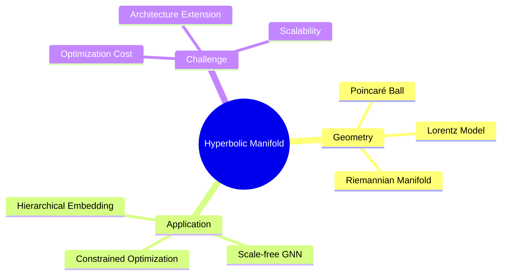

## 核心定义

**Hyperbolic Geometry & Manifold Learning** = 将深度学习扩展到 curved spaces（双曲空间、Riemannian manifold），利用非欧几何的 exponential volume growth 特性处理 hierarchical data、scale-free networks、constrained optimization。

## 技术架构

## 研究路线

### 1. Hyperbolic Embeddings (Foundational)

**里程碑**: [[1700-PoincareEmbeddings]] (🔥 Rating 5)

**核心洞察**: Hyperbolic volume exponential ≈ tree exponential

**关键结果**: 5-dim ≈ 100-dim，20x+ dimensionality reduction

**应用**: Taxonomy embedding, knowledge graphs

### 2. Hyperbolic Neural Networks

**Survey**: [[2400-HyperbolicNeuralNetworksSurvey]] (Rating 4)

**核心思路**: Neural layers in hyperbolic space

**技术挑战**:
- Linear ops 需要 tangent space 映射
- Attention extension 不成熟
- 初始化敏感

**应用**: KG embeddings, word embeddings, hierarchical classification

### 3. Hyperbolic Graph Neural Networks

**代表**: [[2400-HyperbolicGNN]] (Rating 3)

**核心思路**: Scale-free networks benefit from hyperbolic geometry

**设计**: Hyperbolic message passing + attention

**优势**: Hub importance captured, 参数效率高

**局限**: Tangent space mapping cost 高

### 4. Riemannian Optimization

**代表**: [[2400-RiemannianOptimization]] (Rating 3)

**核心思路**: Gradient descent on manifold constraints

**Manifolds**: Stiefel (orthogonal), Grassmann (low-rank), Positive Definite

**应用**: Orthogonal RNNs, low-rank training, covariance estimation

**近期进展**:
- [[2502-AcceleratedRiemannianOptimization]] (Rating 3) - 多 constraints 同时优化
- [[2502-RiemannianFixedRank]] (Rating 3) - Fixed-rank manifold metrics 分析

### 5. Lorentz Graph Neural Networks

**代表**: [[2405-LorentzGNN]] (Rating 3)

**核心思路**: Lorentz-equivariant message passing for physics

**亮点**: Equivariance 提升泛化，减少 data 需求

### 6. Hyperbolic Contrastive Learning

**代表**: [[2501-HyperbolicGraphContrastive]] (Rating 3)

**核心思路**: Hierarchical positive sampling in hyperbolic space

**应用**: Node classification SOTA, graph property prediction

### 7. Scalable Hyperbolic Knowledge Graphs

**代表**: [[2502-ScalableHyperbolicKG]] (Rating 3)

**核心思路**: Mini-batch training for 百万实体 KG

**工程突破**: Scalability bottleneck 解决

### 8. Hyperbolic Attention Networks

**代表**: [[2503-HyperbolicAttention]] (Rating 3)

**核心思路**: Distance-based attention for long-range dependencies

**应用**: Document translation, long-context LM

## Benchmarks

| Benchmark | 类型 | SOTA |
|-----------|------|------|
| WordNet | Taxonomy | Poincaré Embeddings |
| Freebase | KG | Hyperbolic KG |
| Citation Networks | Scale-free | Hyperbolic GNN |

## 关键洞察

### Pattern 1: Hyperbolic ≈ Hierarchy
Exponential volume growth 天然匹配 hierarchical/tree structures

### Pattern 2: 维度效率惊人
Poincaré 证明 5-dim hyperbolic ≈ 100-dim Euclidean

### Pattern 3: Scale-free Networks Benefit
Power-law degree graphs 在 hyperbolic space 表现优异

### Pattern 4: Optimization 是瓶颈
Riemannian operations cost 高，限制大规模应用

### Pattern 5: Curvature Learning 是趋势
Data-adaptive manifold curvature estimation 正在兴起

## 待解决问题

1. 大规模 Scalability（distributed Riemannian optimization）
2. Attention in Hyperbolic Space（Transformer extension）
3. Curvature Learning（自动选择 curvature）
4. Dynamic Hierarchies 处理
5. Multimodal Hyperbolic（VLM/Agent 应用）
6. Optimization Speed 加速

## 可视化演示

[🌐 在线浏览 HTML 演示](/static/presentations/HyperbolicManifold/index.html) — 杂志风格翻页展示

---

## 下一步

| 方向 | Action |
|------|--------|
| Foundational | 精读 Poincaré Embeddings 论文了解 RSGD 实现 |
| GNN | 研究 Hyperbolic GNN 的 attention mechanism |
| Optimization | 研究 Natural Gradient 与 Information Geometry 关联 |
| Application | 探索 VLM/Agent 的 hyperbolic embedding 潜力 |