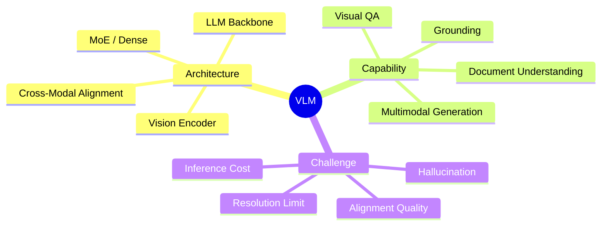

## 核心定义

**Vision-Language Model (VLM)** = 同时理解视觉和语言信息的 Foundation Model，实现跨模态推理、问答、生成和决策能力。是 GUI Agent、Embodied Agent 的感知 backbone。

## 技术架构

## 研究路线

### 1. 高分辨率视觉编码

**问题**: 传统 VLM 固定分辨率（224x224）无法识别 GUI 小字号文本、细粒度元素

**方案**:
- CogAgent: 双分辨率编码器（1120x1120）
- MobileFlow: 21B VLM for mobile GUI
- SeeClick: Grounding pre-training

**关键发现**: ≥1120x1120 输入是文本密集场景的必要条件

**关联**: [[2312-CogagentVisualLanguageModel]], [[2400-MobileflowMultimodalLlmMobile]]

### 2. 理解-生成统一

**问题**: 传统 VLM 只做理解，生成依赖独立 diffusion，两者表征不对齐

**方案**:
- LLaDA2.0-Uni: Discrete diffusion + MoE
- Unify-Agent: World-grounded synthesis

**趋势**: 理解+生成统一是明确方向

**关联**: [[2604-LLaDA2Uni]], [[2600-UnifyAgentUnifiedMultimodal]]

### 3. 效率优化

**问题**: 高分辨率输入 + 长序列推理开销大

**方案**:
- GUI-KV: 空间显著性 + 时间冗余评分（38.9% FLOPs 降低）
- LaSM: Layer-wise scaling for defense

**优势**: Training-free, plug-and-play

**关联**: [[2500-GuiKvEfficientGui]], [[2500-LasmLayerWiseScaling]]

### 4. Human Preference Alignment

**问题**: VLM 与人类意图一致性不足，存在 hallucination

**方案**: RLHF / DPO 迁移到多模态场景

**挑战**: 多模态偏好标注成本高

**关联**: [[2500-AligningMultimodalLlmHuman]]

## Benchmarks

| Benchmark | 任务 | SOTA |
|-----------|------|------|
| VQAv2 | 自然图像问答 | GPT-4V |
| TextVQA | 文本密集问答 | CogAgent |
| DocVQA | 文档理解 | CogAgent |
| ScreenSpot | GUI grounding | SeeClick |
| POPE | Hallucination | CogAgent |

## 关键洞察

### Pattern 1: Resolution-First
高分辨率视觉编码是 VLM 在 GUI/文档场景的基础能力，优先于复杂推理

### Pattern 2: Unified-First
理解+生成统一架构优于分离模块拼接，避免表征不对齐

### Pattern 3: Efficiency via Inference Intervention
KV cache / layer scaling 可在不重新训练下显著降低开销

### Pattern 4: VLM → Agent Backbone
VLM 正从"看图说话"走向多模态 agent 的感知决策核心

## 待解决问题

1. 长上下文多模态推理的 context window 限制
2. 理解-生成统一的架构最优设计（MoE vs separate）
3. 细粒度 grounding 在动态布局下的稳定性
4. 多模态偏好标注的成本降低

## 下一步

| 方向 | Action |
|------|--------|
| 高分辨率 | 研究 CogAgent dual-encoder 设计 |
| 统一架构 | 跟进 LLaDA2.0-Uni discrete diffusion |
| 效率 | 测试 GUI-KV on grounding tasks |