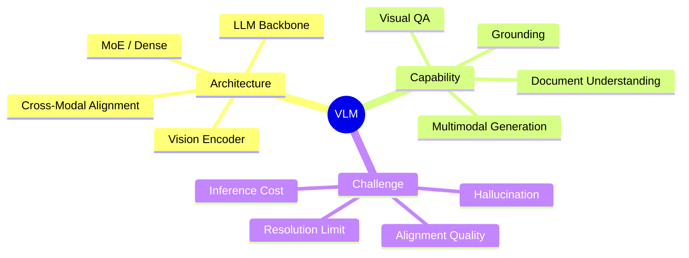

## 核心定义

**Vision-Language Model (VLM)** = 同时理解视觉和语言信息的 Foundation Model，实现跨模态推理、问答、生成和决策能力。是 GUI Agent、Embodied Agent 的感知 backbone。

## 技术架构

```mermaid
mindmap
  root((VLM))
    Architecture
      Vision Encoder
      LLM Backbone
      Cross-Modal Alignment
      MoE / Dense
    Capability
      Visual QA
      Document Understanding
      Grounding
      Multimodal Generation
    Challenge
      Resolution Limit
      Alignment Quality
      Inference Cost
      Hallucination
```

## 研究路线

### 1. 高分辨率视觉编码

**问题**: 传统 VLM 固定分辨率（224x224）无法识别 GUI 小字号文本、细粒度元素

**方案**:
- CogAgent: 双分辨率编码器（1120x1120）
- MobileFlow: 21B VLM for mobile GUI
- SeeClick: Grounding pre-training

**关键发现**: ≥1120x1120 输入是文本密集场景的必要条件

**关联**: [[2312-CogAgent|CogAgent]], [[2400-MobileflowMultimodalLlmMobile]]

### 2. 理解-生成统一

**问题**: 传统 VLM 只做理解，生成依赖独立 diffusion，两者表征不对齐

**方案**:
- LLaDA2.0-Uni: Discrete diffusion + MoE
- Unify-Agent: World-grounded synthesis

**趋势**: 理解+生成统一是明确方向

**关联**: [[2604-LLaDA2Uni]], [[2600-UnifyAgentUnifiedMultimodal]]

### 3. 效率优化

**问题**: 高分辨率输入 + 长序列推理开销大

**方案**:
- GUI-KV: 空间显著性 + 时间冗余评分（38.9% FLOPs 降低）
- LaSM: Layer-wise scaling for defense

**优势**: Training-free, plug-and-play

**关联**: [[2500-GuiKvEfficientGui]], [[2500-LasmLayerWiseScaling]]

### 4. Human Preference Alignment

**问题**: VLM 与人类意图一致性不足，存在 hallucination

**方案**: RLHF / DPO 迁移到多模态场景

**挑战**: 多模态偏好标注成本高

**关联**: [[2500-AligningMultimodalLlmHuman]]

## Benchmarks

| Benchmark | 任务 | SOTA |
|-----------|------|------|
| VQAv2 | 自然图像问答 | GPT-4V |
| TextVQA | 文本密集问答 | CogAgent |
| DocVQA | 文档理解 | CogAgent |
| ScreenSpot | GUI grounding | SeeClick |
| POPE | Hallucination | CogAgent |

## 关键洞察

### Pattern 1: Resolution-First
高分辨率视觉编码是 VLM 在 GUI/文档场景的基础能力，优先于复杂推理

### Pattern 2: Unified-First
理解+生成统一架构优于分离模块拼接，避免表征不对齐

### Pattern 3: Efficiency via Inference Intervention
KV cache / layer scaling 可在不重新训练下显著降低开销

### Pattern 4: VLM → Agent Backbone
VLM 正从"看图说话"走向多模态 agent 的感知决策核心

## 待解决问题

1. 长上下文多模态推理的 context window 限制
2. 理解-生成统一的架构最优设计（MoE vs separate）
3. 细粒度 grounding 在动态布局下的稳定性
4. 多模态偏好标注的成本降低

## 下一步

| 方向 | Action |
|------|--------|
| 高分辨率 | 研究 CogAgent dual-encoder 设计 |
| 统一架构 | 跟进 LLaDA2.0-Uni discrete diffusion |
| 效率 | 测试 GUI-KV on grounding tasks |
## 近期格局变化

- **2026-07-21｜统一模型竞争焦点从架构转向 RL 后训练**：实验基座收敛到 BAGEL 系 hybrid AR-diffusion，reward 范式转向复用 MLLM 自身能力（reward-policy 对齐 > reward 规模）——[[Papers/2607-BRAID]]、[[Papers/2607-SpectraReward]]（[[Topics/VLM-Survey]]）
- **2026-07-21｜"decodable ≠ used" 跨域收敛**：VLM 瓶颈从表征缺失转向读出通路，CoT 增益不来自持续回看图像——[[Papers/2607-VisualAccessBoundary]]、[[Papers/2606-Act2Answer]]；与 GUI grounding 线的 counterfactual 诊断 insight（已 validated）互为印证（[[Topics/VLM-Survey]]）
- **2026-07-21｜GUI grounding 与端到端 agent 能力系统性解耦**：grounding 开源 SOTA 但 OSWorld 落后 RL 系近一倍，分辨率/数据配比对两者影响方向相反——[[Papers/2509-ScaleCUA]]（[[Topics/VLM-Survey]]）
- **2026-07-24｜GUI KV 压缩出现 less-is-more 收敛证据**：两篇独立工作从不同诊断（subspace 级空间 MI 异质性 vs 全层均匀高稀疏）证明通用 KV 压缩先验（共享 saliency map、分层预算）在 GUI attention 结构下失效，且中等预算压缩精度不降甚至略超 full cache——GUI 历史 visual token 系统性冗余、stale 视觉历史污染 context；反超幅度小、仅 7B 开源模型验证——[[Papers/2606-StarKV]]、[[Papers/2603-STLiteKV]]（[[Topics/VLM-Survey]]）
- **2026-07-24｜"文本生成坐标"的 grounding 范式受两条独立路线挑战**：ToolTok 用离散 tool token 多步 pathfinding、GUI-AIMA 直接监督内生 anchor→patch 注意力分布，均以远少数据达 3B/4B 级 ScreenSpot-Pro SOTA（61.1/61.5）——grounding/action 表示是决定 data efficiency 与分辨率鲁棒性的建模选择，而非输出格式细节——[[Papers/2602-ToolTok]]、[[Papers/2511-GuiAima]]（[[Topics/VLM-Survey]]）
- **2026-07-29｜VLM efficiency 向 vision encoder 之前前移**：[[Papers/2607-MageVL]] 用 codec metadata 在 ViT 前稀疏化 patches，并用 event gate 控制 decoder 调用；它补了端到端 wall-clock 证据，也暴露峰值 speedup、硬件口径和 mixed-recipe 因果混淆必须共同报告（[[Topics/VLM-Survey]]）
- **2026-07-29｜VLM agent control 从输出文本转向内部信号**：[[Papers/2607-MHLC]] 把 hidden-state trajectory 读成 handoff/tool/abstention 控制，[[Papers/2607-HyGAE]] 把 token/turn credit 合进 unified critic；inference control 与 training credit 两侧开始收敛到显式接口，但 long-horizon calibration 仍未验证（[[Topics/VLM-Survey]]）
- **2026-08-02｜工具使用的忠实性/自适应性成为独立评价轴**：[[Papers/2607-Beacon]] 给出 MA_mean = 50% 的退化基线，立刻暴露现有 agentic VLM 锁死在"几乎必调"（DeepEyesV2 MA_tool 99.71）或"几乎不调"（Thyme MA_text 92.95）的一端，四个 baseline 的 Tool-Gain 减 Tool-Harm 净效应仅 +0.04~+1.74；[[Papers/2607-FaithEyes]] 从另一侧证明"答对但 process image 与问题无关"是常态，并给出两条可迁移的 reward 设计（按有用比例而非调用计数计分、不以答案正确为门——挂钩答案会使难题上失去维持代码可执行性的梯度压力）。这是 "decodable ≠ used" 在工具层的同构变体，可直接迁移到 GUI agent 的"何时该截图放大"；但两篇都只证到 action level、均无等推理预算对照（[[Topics/VLM-Survey]] §2.9）
- **2026-08-02｜开放基座推进到 3T-class native multimodal，视觉塔初始化的默认前提松动**：[[Papers/2607-KimiK3]] 以 2.8T/104B 激活 + 1M context 的 native multimodal MoE 成为首个登顶 WebDev Arena 的开放模型，其 MoonViT-V2 完全从零用 next-token prediction 训练、放弃 SigLIP 对比学习初始化（理由是训练稳定性），与 [[Papers/2607-Gemma4]] 的 encoder-free 直投形成两条互不相同但同向的路线。两者都只有单一规模点、都缺同规模同数据对照，Kimi K3 对该反转仅给梯度范数曲线与一句定性"持平"——记为默认前提被质疑而非被推翻（[[Topics/VLM-Survey]] §2.5）
- **2026-08-04｜跨模态一致性被测成一条与单模态分数正交的独立轴**：[[Papers/2605-TokenSwap]] 把 MMLU 题干里的名词概念整体换成图片（同题同内容、只改承载模态），42 个 MLLM **无一例外**掉分，gap 4.2%–47.4%、均值 19.6% ± 3.3%；关键在于它与 SEAM 重叠的 8 个模型上，text 分相关 $r=0.811$、image 分相关 $r=0.914$，而 modality gap 本身 $r=-0.028$——**这条轴不能从任何现有单模态排行榜推出，必须单独测**。三条常用对策同时失效：10× FLOPs 只买 2.8%、CoT 的作用方向依基座而定、纯文本训练反而把 gap 从 0.232 推高到 0.268（交错训练才降到 0.167 且 GQA/TextVQA/MME 不掉）。**未被证到的一半**：全程没要求模型先说出替换图里是什么，因此 gap 35%–47% 的弱模型上"认不出图"与"认出了用不进推理"无法分离——记为 "decodable ≠ used" 的同向黑箱读数，不是它的独立验证（[[Topics/VLM-Survey]] §2.8 / Open Problem 14）
- **2026-08-05｜高分辨率这条路线出现不改训练的推理期对偶，且给出了脚手架价值的分辨判据**：[[Papers/2608-GUILens]] 把一次性坐标预测改写成由 VLM 自选裁剪区域、每步 accept/reject 自校验的序贯观察，同基座下 ScreenSpot-Pro 提升 13.1~24.9 分（GPT-5.5 74.8→87.9），使通用 VLM 越过同表全部专用 GUI 模型。真正的格局含义在三 backbone 消融而非主表：coordinate priming 与 visual verification 的收益随基座变弱而放大、随基座变强而贬值，裁剪对最强的 GPT-5.5 仍值 10.4 分——补能力缺口的脚手架会被基座进步吃掉，补信息瓶颈的不会，而分辨率属于后者。全部对照为单次调用而非等推理预算（高精度配置每样本十余次模型调用），跨行 backbone 不统一，单次运行无重复采样（[[Topics/VLM-Survey]] §2.7 / §2.1）
- **2026-08-05｜"坐标以 digit token 逐位发出"从输出格式细节升格为一等接口性质**：[[Papers/2608-MissClick]] 证明这条接口是非均匀误差面——digit 带十进制位权而 token 级 loss 对所有位一视同仁，仅给交叉熵乘上 $10^{m-j}$ 的位权，targeted ASR 即从 35.24→44.86 / 50.69→62.67。同一杠杆在训练侧已被 NTL / DIST2Loss / Phi-Ground 独立利用，两侧收敛说明这是接口性质而非某个模型的实现偶然，推论是任何噪声源（量化、采样温度、解码扰动）在高位上的一次失误都造成大位移。它同时开出一条与指令注入正交的攻击通路：不改指令、不改参数，只在截图上加 ℓ∞ 有界扰动即可把点击挤出目标控件，而意图审计与确认门控对此无效——agent 报告的动作语义与它实际发出的坐标之间没有一致性检查。证据边界很窄：全白盒、无迁移与黑盒、零防御评测，untargeted 口径把解析失败计为成功（[[Topics/VLM-Survey]] §2.7 / Open Problem 10）
- **2026-08-05｜VLM-as-judge 的可靠性首次有了可比量纲，且暴露判定协议本身是偏差来源**：[[Papers/2608-WorldExam]] 以 800 实例 / 5,793 条 checklist item / 3 名标注者多数票测得 GPT-5.5 judge 与人 Spearman 0.8614、PLCC 0.8583，并报告分任务弱项——最低的 Social Interaction 仅 0.7019，恰是需要判时序的一类，而 judge 只看均匀采样的 10 帧且未做帧数敏感性分析。更可迁移的是协议风险：判定规则把"无法核实"一律记为不满足，画面越糊越难确认某条成立，视觉质量因此可能从后门渗进语义分（该论文未做相关分析，记为推测）。这把 Open Problem 8 的 MLLM-as-judge 可信度从"缺度量"推进到"有度量、但默认值未被审计"（[[Topics/VLM-Survey]] Open Problem 8；primary home 为 [[Topics/WorldModel-Survey]]）
