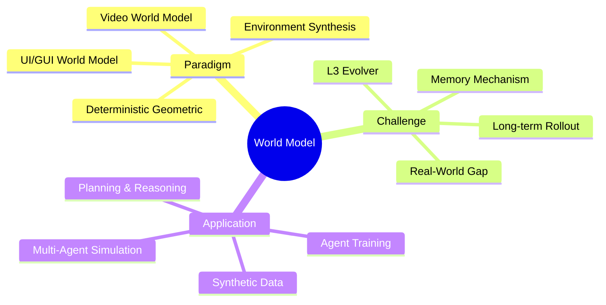

## 核心定义

**World Model** = AI Agent 的环境建模能力——预测行动后果、模拟状态转移、支持 counterfactual planning。是 MBRL、Video Generation、GUI/Web Agent、Multi-Agent Simulation 的交叉领域。

## 技术架构

## 研究路线

### 1. Video World Model (主流)

**里程碑**:
- Wan2.1/Wan2.2: 视频生成基础模型
- MultiWorld: Multi-agent multi-view extension
- HybridMemory: 动态主体 memory 机制

**关键发现**:
- 视频级预测噪声大，长期 rollout 误差累积
- Memory 机制忽略动态主体的独立运动逻辑

**关联**: [[2604-MultiWorld]], [[2603-HybridMemory]], [[2604-HYWorld2]]

### 2. Deterministic Geometric Environment (突破点)

**问题**: Model voting 构造伪标签有噪声

**方案**:
- SpatialEvo DGE: 从点云和 camera pose 确定性计算答案
- 单模型 GRPO + task-adaptive scheduler

**优势**: 零噪声奖励信号，支持 self-evolving

**关键 ablation**: w/o Physical Grounding → VSI-Bench 46.1 → 18.8（27+差距）

**关联**: [[2604-SpatialEvo]]

### 3. Environment Synthesis

**方案**:
- Agent-World: MCP servers + PRD 采集，1,978 环境
- GenerativeWorldRenderer: 游戏截取 4M 帧 G-buffer

**优势**: 大规模环境，scaling 曲线清晰

**风险**: MCP-Mark 绝对分数低（8B 8.9%）

**关联**: [[2604-AgentWorld]], [[2604-GenerativeWorldRenderer]]

### 4. UI/GUI World Model

**应用**: 支持 GUI Agent planning

**方案**:
- MobileDreamer: 文本草图世界模型 + 回滚想象，+5.25% AndroidWorld
- UISim: Layout prediction → layout-to-image 两阶段

**优势**: Layout-first 设计符合 UI 结构化本质

**关联**: [[2600-MobiledreamerGenerativeSketchWorld]], [[2500-UisimInteractiveImageBased]]

### 5. Conceptual Framework (Survey)

**Taxonomy** (AgenticWorldModel):
- **Levels**: L1 Predictor → L2 Simulator → L3 Evolver
- **Laws**: Physical / Digital / Social / Scientific

**L3 Evolver**: 自主修正模型——最 ambitious 但 open

**关联**: [[2604-AgenticWorldModel]], [[2604-Externalization]]

## Benchmarks

| Benchmark | 类型 | SOTA |
|-----------|------|------|
| VSI-Bench | 3D 空间推理 | SpatialEvo: 46.1 |
| MCP-Mark | Environment synthesis | Agent-World 14B: 13.3% |
| HM-World | Memory testing | HyDRA: 0.926 |
| AndroidWorld | GUI Agent | MobileDreamer: +5.25% |

## 关键洞察

### Pattern 1: SpatialEvo DGE 是唯一真正的 insight
确定性几何替代 model voting，但适用场景极窄（室内静态）

### Pattern 2: L3 Evolver 层级仍是 open problem
现有 world model 无法自主修正，只能做到 L2 Simulator

### Pattern 3: Video World Model 的 memory 有问题
动态主体出画再入画会消失/扭曲

### Pattern 4: Environment Synthesis 工程量大但 insight-light
Agent-World、GenerativeWorldRenderer 都是工程整合

### Pattern 5: UI World Model 的 layout-first 设计正确
UISim 的 decomposition 符合 UI 结构化本质

## 待解决问题

1. L3 Evolver 实现：prediction 失败时如何自主修正？
2. World Model failure mode 系统性分析（template collapse 等）
3. Video World Model 长期 rollout 的误差累积
4. DGE 适用边界扩展（室外/动态场景）
5. Real-World vs Synthetic gap（JSON/CSV vs live API）
6. World Model + GUI Agent grounding 结合

## 下一步

| 方向 | Action |
|------|--------|
| DGE | 研究 SpatialEvo 的扩展可能性 |
| Memory | 跟进 HybridMemory 的真实场景验证 |
| Environment | 监控 Agent-World 的 MCP-Mark 进展 |
| UI World Model | 研究 MobileDreamer + grounding 结合 |