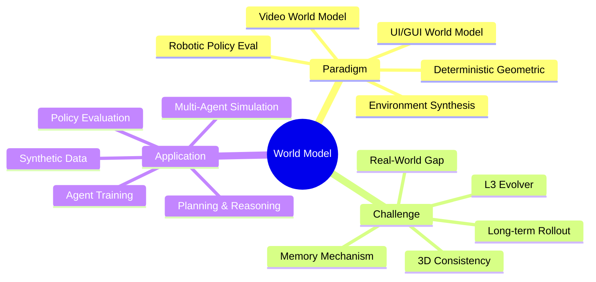

## 核心定义

**World Model** = AI Agent 的环境建模能力——预测行动后果、模拟状态转移、支持 counterfactual planning。是 MBRL、Video Generation、GUI/Web Agent、Multi-Agent Simulation 的交叉领域。

## 技术架构

```mermaid
mindmap
  root((World Model))
    Paradigm
      Video World Model
      Deterministic Geometric
      Robotic Policy Eval
      Environment Synthesis
      UI/GUI World Model
    Challenge
      Long-term Rollout
      Memory Mechanism
      L3 Evolver
      Real-World Gap
      3D Consistency
    Application
      Agent Training
      Synthetic Data
      Policy Evaluation
      Planning & Reasoning
      Multi-Agent Simulation
```

## 研究路线

### 1. Video World Model (主流)

**里程碑**:
- Wan2.1/Wan2.2: 视频生成基础模型
- MultiWorld: Multi-agent multi-view extension
- HybridMemory: 动态主体 memory 机制
- **World-R1**: RL（Flow-GRPO）对齐 3D 约束

**关键发现**:
- 视频级预测噪声大，长期 rollout 误差累积
- Memory 机制忽略动态主体的独立运动逻辑
- RL 方式（World-R1）比架构修改更 scalable

**关联**: [[2604-MultiWorld]], [[2603-HybridMemory]], [[2604-HYWorld2]], [[2604-WorldR1]]

### 2. Deterministic Geometric Environment (突破点)

**问题**: Model voting 构造伪标签有噪声

**方案**:
- SpatialEvo DGE: 从点云和 camera pose 确定性计算答案
- 单模型 GRPO + task-adaptive scheduler

**优势**: 零噪声奖励信号，支持 self-evolving

**关键 ablation**: w/o Physical Grounding → VSI-Bench 46.1 → 18.8（27+差距）

**关联**: [[2604-SpatialEvo]]

### 3. Robotic Policy Evaluation (新方向)

**问题**: Robotic policy 评估不可规模化

**方案**:
- dWorldEval: Discrete diffusion world model + progress token
- 统一 token space: vision + language + action
- Sparse keyframe memory

**优势**: Progress token 编码任务完成状态，与 L3 Evolver 概念关联

**关联**: [[2604-dWorldEval]]

### 4. Environment Synthesis

**方案**:
- Agent-World: MCP servers + PRD 采集，1,978 环境
- GenerativeWorldRenderer: 游戏截取 4M 帧 G-buffer

**优势**: 大规模环境，scaling 曲线清晰

**风险**: MCP-Mark 绝对分数低（8B 8.9%）

**关联**: [[2604-AgentWorld]], [[2604-GenerativeWorldRenderer]]

### 5. UI/GUI World Model

**应用**: 支持 GUI Agent planning

**方案**:
- MobileDreamer: 文本草图世界模型 + 回滚想象，+5.25% AndroidWorld
- UISim: Layout prediction → layout-to-image 两阶段

**优势**: Layout-first 设计符合 UI 结构化本质

**关联**: [[2600-MobiledreamerGenerativeSketchWorld]], [[2500-UisimInteractiveImageBased]]

### 6. Conceptual Framework (Survey)

**Taxonomy** (AgenticWorldModel):
- **Levels**: L1 Predictor → L2 Simulator → L3 Evolver
- **Laws**: Physical / Digital / Social / Scientific

**L3 Evolver**: 自主修正模型——最 ambitious 但 open

**关联**: [[2604-AgenticWorldModel]], [[2604-Externalization]]

## Benchmarks

| Benchmark | 类型 | SOTA |
|-----------|------|------|
| VSI-Bench | 3D 空间推理 | SpatialEvo: 46.1 |
| MCP-Mark | Environment synthesis | Agent-World 14B: 13.3% |
| HM-World | Memory testing | HyDRA: 0.926 |
| AndroidWorld | GUI Agent | MobileDreamer: +5.25% |
| LIBERO | Policy evaluation | dWorldEval |
| RoboTwin | Robotic manipulation | dWorldEval |

## 关键洞察

### Pattern 1: SpatialEvo DGE 是唯一真正的 insight
确定性几何替代 model voting，但适用场景极窄（室内静态）

### Pattern 2: L3 Evolver 层级仍是 open problem
现有 world model 无法自主修正，只能做到 L2 Simulator

### Pattern 3: Video World Model 的 memory 有问题
动态主体出画再入画会消失/扭曲

### Pattern 4: Environment Synthesis 工程量大但 insight-light
Agent-World、GenerativeWorldRenderer 都是工程整合

### Pattern 5: UI World Model 的 layout-first 设计正确
UISim 的 decomposition 符合 UI 结构化本质

### Pattern 6: RL for World Model 正在兴起
World-R1（Flow-GRPO）、SpatialEvo（GRPO）都用 RL 而非架构修改

### Pattern 7: Progress token 是有趣的新 idea
dWorldEval 将任务完成状态编码进 world model

## 待解决问题

1. L3 Evolver 实现：prediction 失败时如何自主修正？
2. World Model failure mode 系统性分析（template collapse 等）
3. Video World Model 长期 rollout 的误差累积
4. DGE 适用边界扩展（室外/动态场景）
5. Real-World vs Synthetic gap（JSON/CSV vs live API）
6. World Model + GUI Agent grounding 结合
7. Progress token 作为 L3 Evolver 触发信号？

## 下一步

| 方向 | Action |
|------|--------|
| DGE | 研究 SpatialEvo 的扩展可能性 |
| Memory | 跟进 HybridMemory 的真实场景验证 |
| Environment | 监控 Agent-World 的 MCP-Mark 进展 |
| UI World Model | 研究 MobileDreamer + grounding 结合 |
| Policy Eval | 研究 dWorldEval progress token 与 L3 Evolver 关联 |
## 近期格局变化

- **2026-08-11｜"world model 只当训练信号、部署期整体丢弃"收敛为 WAM 子族，且拿到了耦合拓扑的机制解释**：同期四篇独立工作（[[Papers/2608-SimWAM]] 驾驶 / [[Papers/2608-JEPAWAM]] latent 空间 / [[Papers/2608-WorldTokens]] 表示瓶颈 / [[Papers/2608-MobileWAM]] mobile manipulation）与既有 [[Papers/2607-STWAM]] 合拢：训练时联合建模未来、部署时删除整个 WM 分支，推理成本落回纯 VLA 量级。比工程形态更重要的是三组互不相识团队的消融同向——SimWAM 让 action attend 未来帧不涨点（90.3≈90.2≈90.1）、JEPA-WAM 把预测的未来喂 action expert 掉 6.1 个点、WorldTokens 的非排他路由使 video 与 action 目标竞争（94.1 vs 97.0）——**监督应经共享表示塑形 policy，预测的未来不该作为 policy 的输入**。这与 08-04 记录的"新增预测通路不是主要收益来源"互为表里，也把 imagine-then-act 路线的推理开销论证系统性拆除。边界：全部为 manipulation/驾驶短横幅任务，长程任务上丢弃想象是否无损无人测过；GUI 侧 [[Papers/2608-AppDeltaWorld]] 的 world model 同样只在训练期承重，跨 GUI 与 embodied 的这一默认工程选择正是 AFE 方向要挑战的假设（[[Topics/WorldModel-Survey]] 路线 4 新分支）
- **2026-08-11｜digital WM 的 fidelity 缺口从 survey 判断落成三个可测实验**：[[Papers/2608-EnvACE]]（把环境彩排收进 policy 权重，归因显示"内化"只值 +1.2、自生成 rollout 通道值 +4.3，彩排保真度零测量）、[[Papers/2608-AppDeltaWorld]]（consensus reward 负结果：23.5% rollout group 无唯一赢家——状态等价判定缺失）、[[Papers/2608-DreamGuard]]（RSSM guard 25 ms/call 但跨分布 PHIR 96.3→16.8，"世界"是被风险标签塑形的潜向量）用途各异而共享同一缺口，把 [[Papers/2606-EnvEngineeringSurvey]] 的 fidelity under-researched 具体化为：彩排对真实响应逐条对账、状态等价判据、第二个长程分布 leave-one-out。DreamGuard 与 SeerGuard 合看还给出 guard 一族的权衡曲面：延迟、证据可读性、跨分布鲁棒性当前不可兼得（[[Topics/WorldModel-Survey]] 路线 7）
- **2026-08-11｜L1/L2/L3 出现术语碰撞，vault 内需带限定词**：[[Papers/2608-WorldProxy]]（position paper）复用 L1/L2/L3 记号表示对 agent 的介入深度（推理期提示/训练期信号/共演化），与 [[Papers/2604-AgenticWorldModel]] 的能力刻度（Predictor/Simulator/Evolver）正交；两文共享两名作者且前者的"按 agent 提升量验收"主张系后者 decision-centric evaluation 的重述、未致谢。本 map 与 survey 的 L1/L2/L3 一律指 Chu 能力刻度，引介入深度写 Proxy-L1/L2/L3；其 6×3 设计空间只作检索索引与稀疏格选题指针（Spatial×L3 / Reward×L3），不作组织原则——三套互不兼容的顶层切法在 20 个月内相继出现且均未降为可测量对象，taxonomy-heavy, evidence-light 是该方向的第二个症候（[[Topics/WorldModel-Survey]] 路线 9）
- **2026-08-05｜层级式 world model 框架第一次有了可测量的刻度**：[[Papers/2608-WorldExam]] 把评测从单一总分改成四个分别报告的诊断层级（8 任务 / 1,474 case），关键构造是 World Reactivity——只给触发性控制、把本该诱发的场景反应整个留空不写进指令，于是分数衡量的是模型自己补出了什么而非它照做了什么。前两层大致对应 [[Papers/2604-AgenticWorldModel]] Levels × Laws 框架的 L1，后两层才踏进 L2；这套"不说出应然结果"的构造可直接迁移到 GUI 与 embodied 环境评测——那两处的任务描述普遍把预期后果写进指令，因而测不出模型是否真的具备环境动力学模型（[[Topics/WorldModel-Survey]] 路线 10）
- **2026-08-05｜"控制被执行"与"世界会回应"被分离成两个独立失效面**：action 接口在 Subject Control 上领先（55.47 对 37.28），却在 Terrain / Object / Physical Reaction 三层分别落后 37 / 42 / 30 分——反转幅度远大于领先幅度，说明 action-following 做得好并不蕴含世界会做出正确反应，二者需分别验收（[[Papers/2608-WorldExam]]）。**边界**：接口范式与模型档次共线（dynamic track 上 action-driven 仅 2 个本地模型对 7 个 API 系统），尚无 matched 对照，因此这是一条被定位出来的失效面而非已归因的结论（[[Topics/WorldModel-Survey]] 路线 10）
- **2026-08-05｜"视觉质量不构成 world model 能力验收"升级为三条切法不同的独立证据**：[[Papers/2607-GigaWorld1]] 从 evaluator agreement 切、[[Papers/2607-PhiZero]] 从生成 vs 判别切、[[Papers/2608-WorldExam]] 从分数分布切（General 层窄带 79.64–81.04 而 Task 层宽带 39.85–65.02，即视觉质量已饱和到几乎不可分辨时任务层仍相差一倍）。三者团队、数据、评测目标均不同，Takeaway 24 由单篇观察抬为跨范式结论——planner / evaluator 不能靠视频质量指标验收（[[Topics/WorldModel-Survey]] / [[Topics/EmbodiedAI-Survey]]）
- **2026-08-05｜contact-sensitive failure 是两条独立评测线收敛到的同一处**：[[Papers/2607-GigaWorld1]] 的 optimistic bias 与 [[Papers/2608-WorldExam]] 的 Object Interaction 失败模式（被接触物体不变、主体直接穿过去，最好的 action-driven 仅 33.75 而 language-driven 达 75.96）指向同一类物理约束缺失。库内暂无机制层面的独立解释或复现，列为待验证 pattern 而非已确立结论。**该收敛判断已于 2026-09-07 被 [[Papers/2608-WorldSimProbe]] 降级为方向上的争议，见下**（[[Topics/WorldModel-Survey]] 路线 6）
- **2026-08-04｜给 WAM 增加新的未来预测通道，收益未必来自"预测"那一半**：[[Papers/2607-STWAM]] 在 VAE 未来之外并行预测冻结 DINOv3 的语义未来（零样本 LIBERO-Plus 72.8 对 Fast-WAM 51.5、真机视觉偏移 61.5 对 25.8），[[Papers/2607-N0TWAM]] 把触觉与视觉一起作为生成目标（UniVTAC 84.5 对 67.1、真机 46.3 对 30.0）；但两篇的消融同向地削弱各自的新颖性叙事——ST-WAM 的 DINO-only future 在 LIBERO-Plus 只有 39.7，低于纯 VAE 的 51.5（语义与像素互补而非可换）；N0-TWAM 去掉反应式 observed 触觉通路（70.5 / 29.6）比去掉前瞻式 predicted 通路（71.8 / 41.1）掉得更多，且预训练规模才是最大的单一因素（84.5→65.4）。两篇都缺"逐条移除预测目标"的 matched 对照，库内无独立复现（[[Topics/WorldModel-Survey]] / [[Topics/VLA-Survey]]）
- **2026-08-04｜world prediction 进入 RL 的 critic 侧，成为 WM×VLA 的第七种耦合**：[[Papers/2607-WCM]] 让 critic 在预测 return 的同时预测下一帧 LeJEPA latent，drop-in 替换 PPO / Flow-SDE / AWR / RECAP 四种 VLA RL 算法的原 critic（149 仿真任务 + 7 真机任务）；λ=0 的 history-ViT 对照——同样的多帧时序容量、没有世界预测目标，依然无效——把增益与"多看几帧"分开。但全文无 value-accuracy 指标，中间因果链未测，增益幅度只有 0.8–2.3（[[Topics/WorldModel-Survey]]）
- **2026-08-04｜Levels × Laws 的 Social 约束域出现首篇正面工作**：[[Papers/2607-MentalWorldModeling]] 把 belief / goal / intention 从事后 rationale 升格为随动作演化的状态变量，观测定义为联合状态的第一人称渲染（因此可表达 false belief），并给出 448 条 process-annotated 的 Menti-Bench；其 necessity ladder + channel intervention + oracle cascade 是一套可迁移的"增益来自机制还是 prompting"审计模板（oracle 单增益之和 8.7 > 组合 6.3，量化了模块化 pipeline 的跨阶段误差税）。但消融显示移除 physical 通道（−16.5）比移除 mental 通道（−12.1）代价更大，且全文只报 final-action F1——目前证据支撑"结构化 prompting 有效"，不支撑"心理状态被正确建模"（[[Topics/WorldModel-Survey]]）
- **2026-08-02｜"生成保真 ⇒ 懂物理"被同一模型内的指标背离直接反驳**：[[Papers/2607-PhiZero]] 用自监督离散"物理语言"（FSQ 25K 词表，4 秒视频 → 256 符号）先推理后渲染，Physics-IQ Verified 41.2 超 Cosmos3-Super 39.5 与 Wan2.2-14B 32.2，但 IntPhys2 Hard 仅 52.38（随机 50，纯 latent 的 V-JEPA 57.42），LikePhys 刚体第一而流体倒数第三。此前只在 evaluator 场景成立的"质量 ≠ 视觉保真"由此推广为 WM 的一般性质：凡消费判别能力的用途都不能用生成指标验收；且该文缺同数据同算力、仅移除中间表示的对照，21.2→41.2 混淆表示/数据/训练三变量（[[Topics/WorldModel-Survey]]）
- **2026-08-02｜WM 的耦合方式从五种扩为六种，新增推理期 planner**：[[Papers/2607-WorldActionPlanner]] 把 world model 从训练期消费品挪到推理期——VLM 提子目标、WM 在想象中评估、policy 降级为工具，pose-image conditioning（正向运动学渲染骨架图再 VAE 编码）绕开低维动作与视频骨干的接口失配，compositional LIBERO-Long 72 对 π0.5 的 4、cosmos-policy 的 0，1 次想象胜过带 ground-truth reward 的 BoN-8（60 vs 42）；但系统带 URDF、相机标定与硬编码抓放原语，仅 Table 9 隔离 WM 自身贡献，全仿真无真机、无 imagination horizon 扫描（[[Topics/WorldModel-Survey]] / [[Topics/EmbodiedAI-Survey]]）
- **2026-07-21｜Digital domain WM 收敛于文本语义状态空间**：[[Papers/2607-SeerGuard]]（8B 语义预测超 235B 基座）、[[Papers/2511-DreamGym]]（Theorem 1：ε_R+ε_P 与像素重建无关）、[[Papers/2510-UISimulator]]（合成经验 4× OS-Genesis）从安全/理论/训练三角度独立收敛——与 robotics 的 pixel/latent 路线形成清晰分野（[[Topics/WorldModel-Survey]]）
- **2026-07-21｜WAM"可检查想象"安全假设被实证击穿**：[[Papers/2607-BadWAM]] 用 black-box 视觉扰动使 action 与 imagined future 解耦（LIBERO 96.5%→43.1%）；WAM 范式需要 action–imagination 同步性验证器这一新组件（[[Topics/WorldModel-Survey]]）
- **2026-07-21｜"降级使用"成为 WM 落地的跨领域 pattern**：预测精度不足时选容错性高的用途——[[Papers/2603-Memoir]] imagination 作 retrieval query、[[Papers/2411-WebDreamer]] 仅 H=1 lookahead、[[Papers/2607-SeerGuard]] 仅二分类风险判定；WM 精度要求越低的用途落地越早（[[Topics/WorldModel-Survey]]）
- **2026-07-29｜实时 video WM 转向 control–memory–distillation co-design**：[[Papers/2607-Wonder]] 把 rendered camera evidence、full-fidelity sparse KV 与 sparse-context-aware distillation 组合到分钟级 generation；但 16 FPS 无硬件口径、无 component ablation，且 camera control 不等于 agent-action simulation（[[Topics/WorldModel-Survey]]）
- **2026-07-29｜Digital WM 的 grounding 分化为 external prior 与 executable structure**：[[Papers/2510-RWoM]] 用 tutorial ground imagined rollout，[[Papers/2607-ObjectCentricEnv]] 用 object/procedure code + re-execution gate 维护模型；两者共同证明 grounding/可执行性有用，也共同暴露它们不等于语义正确（[[Topics/WorldModel-Survey]]）
- **2026-07-29｜World model 被重新放回 environment lifecycle**：[[Papers/2606-EnvEngineeringSurvey]] 以 modeling→synthesis→evaluation→application 组织 environment engineering，并把 diversity/complexity/fidelity 缺口显式化；单看 prediction quality 已不足以评价环境对 agent 的训练与验证价值（[[Topics/WorldModel-Survey]]）
- **2026-09-07｜长时程 visual persistence 的第一约束从"存不下"改判为"读不到"**：[[Papers/2608-WorldTrace]] 指出 rollout 超出训练 horizon 后 temporal RoPE 的 query–key offset 落到训练分布外，快频分量相位绕过 π 多圈、贡献退化为噪声——记忆仍在 KV cache 里但 attention 寻址不到（附录对 MG2-1.3B 逐频率量化：训练最大 offset 为 5，offset=30 时最快三个分量相位已超 3π）；又因在旋转空间 naive 平均会 phase cancellation，key 必须存在 canonical 空间、读取时单次旋转到按 slot rank 分配的 in-distribution virtual position。修法 training-free，只改固定 checkpoint 上的 cache 读写，在 O(1) 预算下把 ABA 回访一致性从 PAC 0.723 拉到 0.864。这直接修正本 map 的 Pattern 3（video world model 的 memory 有问题）的归因方向：容量与压缩之外还有一个更靠前的位置轴。最有信息量的是那个负结果——把该 position 方案接到 MemRoPE 的写入器上反而更差（p<0.001），说明位置分配与内容写入必须在同一 offset 分布下协同设计。同路线的 [[Papers/2607-ABotWorld0]] 从反面提供同一处证据：它用 bounded KV cache + rolling eviction 换到单张 RTX 5090 上 12.4–15.8 FPS 的实时性，代价正是 Memory 成为其 WorldRoamBench 七个维度里相对最弱的一项（0.5041 对 Genie 3 的 0.6073）。**边界**：WorldTrace 主结果只在单个 1.3B 游戏 world model 上，LingBot-World 仅附录级验证且一种写入器在其上几乎无增益，2× horizon 无显著增益；LoopBench 由同一团队提出、PAC 基于 CLIP 相似度且同一配置跨表绝对值差异大，"该记住哪些位置"的写入策略仍未解，动态主体的 exit/re-entry 不在其范围内。ABot-World-0 的 benchmark 作者与其 Benchmark Team 高度重叠，须按自家评测读（[[Topics/WorldModel-Survey]] 路线 1）

- **2026-09-07｜contact 失效的"两条评测线收敛"须降级为方向上的争议**：本 map 2026-08-05 记录的收敛判断在加入第三条线后不成立。[[Papers/2608-WorldSimProbe]] 与 [[Papers/2607-GigaWorld1]] 的 optimistic bias 同向且更硬——其 50 例审计中观察到的 grounding failure 全部是幻觉出接触、无一是漏掉接触，据此构造的 simulator 验证 no-contact 场景上，六模型最挡不住"有接触视觉线索但无控制支持"的情形（三触发均分 distractor 75.0 / spatial proximity 54.5 / appearance-induced false contact 38.6）。而 [[Papers/2608-WorldExam]] 的失败是相反符号：被接触物体保持不变、主体直接穿过去。两者不互相反驳，因为构造相反（一个考会不会无中生有，一个考会不会漏掉），但合起来说明 contact 在两个方向上都不可靠、尚未被归结成单一机制。引用"contact 是 WM 的弱点"时必须带上方向，否则会把两组不可合并的证据算成两票（[[Topics/WorldModel-Survey]] Takeaway 32 / 路线 6）

- **2026-09-07｜world model 评测出现第二条拆法，并带出一条影响 vault 内多篇评测的 judge 修正**：[[Papers/2608-WorldSimProbe]] 把"ACWM 能不能当 simulator"写成 Observable Simulator Contract 的两个可观测条件——动作是否被实现（r̂ ≈ Φ_R）、环境响应是否由已实现的运动物理支持（ê ≈ Φ_E）——五个 probe suite、18,608 实例、6 个开源 ACWM、三个仿真平台，每个反事实先在 simulator 内执行并冻结 manifest。与 [[Papers/2608-WorldExam]] 的"指令写明 vs 须自行推断"轴互补而非冗余。三条跨模型一致的读数：faithfulness 随控制偏离训练分布单调退化（cross-task replay 平均 Spearman ρ=−0.433；不熟悉执行风格低 10.8–16.1 分），且 action-injection 与 unified action–video 两类架构都横跨高低名次——架构不解释 simulator faithfulness；interaction primitive 间差异大于模型间差异（tap 40.8–56.9，shake 0.0–1.2）。两条方法层结论对本 map 之外同样适用：下游可用性只在 OOD 控制下才有分辨力（standard 轨迹 78–86% 无法区分模型，OOD 下分离为 53/34/21%），以及 **VLM 二元 rollout judge 系统性偏乐观——对 91.7% 的样本判 positive action following，人类只判 42.2%**（同批数据上 RMFA 与人类分级评分 ρ=0.750，VLM 一致率 0.450，IDM ρ=0.284）。后一条直接影响库内一批依赖 VLM judge 的 action-following 评测的可读性；需同时记住的限定是它并非"VLM judge 不可用"——WorldSimProbe 自己的 primitive 判定仍用 VLM judge，只是先在 human-verified reference set 上验到 94–97% 一致率，差别在于判的是有明确 checklist 的分项标签而非整体二元判断。**边界**：全部在仿真内、单一外部视角，模型均为各平台官方 split 上的 in-domain fine-tune，不能外推到通用 pretrain ACWM 的 zero-shot；ρ=−0.433 与 10.8–16.1 只在 RoboTwin 上报告；downstream 仅一个 RoboTwin task（作者自称受控 case study）（[[Topics/WorldModel-Survey]] 路线 10b / Open Problem 26）

- **2026-09-07｜显式 3D 表示这一支补上了此前缺的 action conditioning 与 scaling 证据**：[[Papers/2606-PointWorld]] 把 state 与 action 统一为 3D point flow——state 是 RGB-D 反投影的场景点云，action 是按 URDF 正向运动学推演出的 dense robot point flow，因此动作是"想象出来的、完整可见的"交互几何，遮挡区域的接触也能表达，且不绑定 joint 空间。模型（50M→1B）与数据（5%→100%）两轴在 log 空间都近似线性地降低逐点 ℓ2 mover 误差，是本方向少见的可预测投资回报曲线；配套的无标注三阶段 3D 标注管线（FoundationStereo → VGGT 外参对齐 → CoTracker3 lift）恢复了 DROID 中 >60% 的可靠 3D point flow，约 2M 轨迹 / 500 小时。库内此前的 3D/4D 工作以场景合成为主、无 action 接口，这一支由此分成两条。**边界**：主指标是 1 秒 horizon 的逐点 ℓ2 flow 误差而非任务成功率，作者自陈几何精度到操作性能的映射未量化；真机成功率方差极大（Drawer 90% 而 Book 20% / Microwave 30%）且需人工或 VLM 指定 task point；sim↔real zero-shot 明显退化，统一表示并未消除 sim-real gap。因此这条 scaling 曲线不构成对"scale 不能 alone 解决 physics"的反例——两者测的不是同一个量（[[Topics/WorldModel-Survey]] 路线 3 / Takeaway 38）
