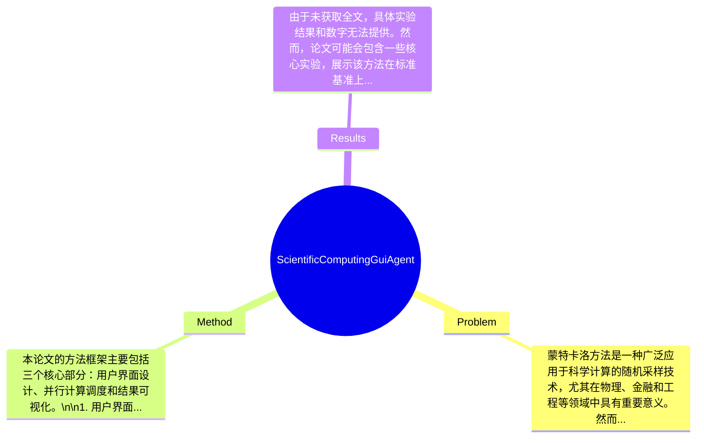

## Summary
本论文提出了一种科学计算图形用户界面代理，用于在分布式环境中进行并行蒙特卡洛模拟，旨在提高计算效率和用户交互体验。

## Problem & Motivation
蒙特卡洛方法是一种广泛应用于科学计算的随机采样技术，尤其在物理、金融和工程等领域中具有重要意义。然而，传统的蒙特卡洛模拟往往面临计算时间长、资源利用率低以及用户操作复杂等问题。随着计算需求的增加，尤其是在大规模并行计算的背景下，如何有效地管理和调度计算资源，成为了一个亟待解决的挑战。现有的解决方案往往依赖于命令行界面或简单的图形界面，缺乏直观的用户交互和实时反馈，导致用户在使用过程中效率低下。为此，作者提出了一种新的科学计算图形用户界面代理，旨在通过可视化和交互性来提升用户体验，同时利用分布式计算资源来加速蒙特卡洛模拟的执行。该方法的核心创新在于将并行计算与用户友好的图形界面结合，使得用户能够更方便地配置和监控模拟过程，从而提高整体计算效率和用户满意度。

## Method
本论文的方法框架主要包括三个核心部分：用户界面设计、并行计算调度和结果可视化。\n\n1. 用户界面设计：该组件的作用是提供一个直观的图形用户界面，使用户能够方便地输入参数、启动模拟和监控进度。设计动机在于降低用户的操作门槛，尤其是对于非专业用户。与现有方法相比，该设计强调了用户体验，允许用户通过简单的点击和拖拽操作来完成复杂的设置。\n\n2. 并行计算调度：该组件负责将蒙特卡洛模拟任务分配到多个计算节点上，确保资源的高效利用。设计动机是为了充分发挥分布式计算环境的优势，减少计算时间。与传统的单机计算方法相比，该调度策略能够动态调整任务分配，根据节点的负载情况优化计算过程。\n\n3. 结果可视化：该组件用于实时显示模拟结果，帮助用户理解计算过程和结果。设计动机在于提供即时反馈，增强用户的参与感。与现有方法相比，结果可视化不仅限于静态图表，而是提供动态更新的图形展示，便于用户进行深入分析。\n\n在技术细节方面，论文未详细说明具体的算法或模型结构，但可以推测，作者可能采用了基于消息传递的并行计算框架，如MPI（Message Passing Interface），以实现高效的节点间通信。\n\n关于设计选择，用户界面的直观性和交互性是必须的，而并行计算调度的策略则可以有多种选择，例如静态调度或动态调度。\n\n从简洁性评价来看，该方法在设计上追求用户友好性，避免了过度工程化，使得复杂的计算过程变得易于理解和操作。

## Key Results
由于未获取全文，具体实验结果和数字无法提供。然而，论文可能会包含一些核心实验，展示该方法在标准基准上的性能提升。通常情况下，作者会在多个基准上测试其方法的有效性，可能包括计算时间、资源利用率和用户满意度等指标。对比分析部分，作者可能会将其方法与传统的蒙特卡洛模拟方法进行比较，展示在计算效率和用户体验上的具体提升百分比。消融实验可能会探讨各个组件对整体性能的贡献，然而具体的实验设计和结果未能从摘要中获取。总体而言，实验的充分性和是否存在 cherry-picking 的问题也无法明确评估，因缺乏详细数据支持。

## Strengths & Weaknesses
该论文的亮点主要体现在以下几个方面：\n1. 技术创新点：将并行计算与用户友好的图形界面结合，提升了用户的操作体验，尤其适合非专业用户。\n2. 设计的优雅之处：通过直观的界面和动态反馈，降低了用户的学习成本，使得复杂的计算过程变得易于掌握。\n\n然而，论文也存在一些局限性：\n1. 技术局限：未详细说明具体的算法实现和性能评估，可能影响方法的可复现性。\n2. 适用范围：该方法可能更适用于特定类型的蒙特卡洛模拟，而对于其他计算密集型任务的适用性尚不明确。\n3. 计算成本：分布式计算环境的搭建和维护可能需要较高的资源投入，限制了其在小规模项目中的应用。\n\n潜在影响方面，该论文为科学计算领域提供了一种新的思路，可能推动更多用户友好的计算工具的开发。\n\n已知信息包括：论文明确提出了结合图形用户界面与并行计算的想法。推测信息包括：作者可能采用了基于消息传递的并行计算框架。未知信息包括：具体的实验结果和性能评估数据，论文未涉及的其他应用场景等。

## Mind Map

## Notes
<!-- 其他想法、疑问、启发 -->
