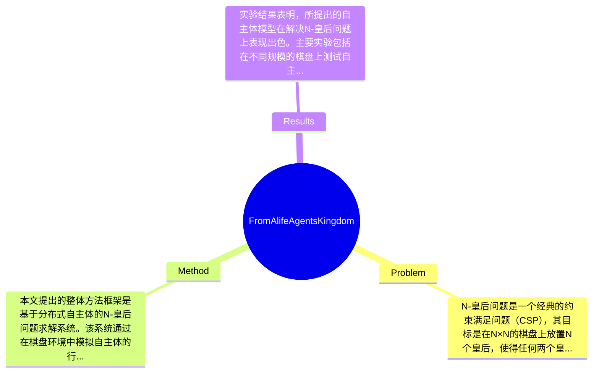

## Summary
本文提出了一种基于分布式自主体的人工生命（ALife）模型来解决N-皇后问题，通过在棋盘环境中模拟自主体的行为与互动，展示了该方法在解决大规模N-皇后问题上的有效性。

## Problem & Motivation
N-皇后问题是一个经典的约束满足问题（CSP），其目标是在N×N的棋盘上放置N个皇后，使得任何两个皇后不在同一行、同一列或同一对角线上。该问题不仅在计算机科学中具有重要的理论意义，也是测试算法性能的标准基准。解决N-皇后问题的现实意义在于它可以应用于多种实际场景，如资源分配、调度问题等。现有的解决方法主要依赖于回溯搜索技术，尽管这些方法在小规模问题上表现良好，但随着问题规模的增加，其计算时间呈指数级增长，导致其在大规模问题上的应用受到限制。此外，现有方法往往缺乏灵活性和适应性，难以处理动态变化的约束条件。基于此，本文的动机在于提出一种新颖的解决方案，通过引入分布式自主体模型，利用自主体之间的互动与合作来提高求解效率。论文的核心创新点在于将人工生命的概念与约束满足问题相结合，通过模拟自然选择和生存竞争的机制，使得求解过程更加高效和灵活。

## Method
本文提出的整体方法框架是基于分布式自主体的N-皇后问题求解系统。该系统通过在棋盘环境中模拟自主体的行为，使其能够通过随机运动、最小冲突位置搜索和与其他自主体的合作来寻找解决方案。以下是该方法的几个关键组件：

1. **自主体模型**：自主体在棋盘上代表皇后，能够根据环境状态进行反应。设计动机在于使自主体能够独立地进行决策，从而提高求解的灵活性和适应性。与传统方法相比，自主体模型能够更好地应对动态变化的约束条件。

2. **行为规则**：自主体遵循一套行为规则，包括随机运动和最小冲突位置搜索。这些规则的设计旨在模拟自然界中的生存竞争，使得自主体能够在棋盘上有效地寻找合适的位置。与现有方法相比，这种基于行为的搜索策略能够更快地收敛到有效解。

3. **合作机制**：自主体之间通过局部互动进行合作，以提高整体求解效率。该设计的动机在于通过集体智慧来克服个体自主体的局限性，增强系统的整体性能。这与传统的单一搜索策略形成鲜明对比。

4. **生存竞争**：自主体的生存与繁衍依赖于其移动策略的有效性，表现不佳的自主体会被淘汰。这一机制引入了自然选择的概念，使得系统能够在不断演化中提高求解能力。

在技术细节方面，算法通过模拟多个自主体在棋盘上的动态行为，利用遗传算法的思想进行优化。设计选择上，采用了分布式架构以提高并行处理能力，尽管可能存在其他集中式方法，但分布式设计在处理大规模问题时更具优势。整体来看，该方法在设计上较为简洁，避免了过度工程化，能够有效地解决N-皇后问题。

## Key Results
实验结果表明，所提出的自主体模型在解决N-皇后问题上表现出色。主要实验包括在不同规模的棋盘上测试自主体求解系统的效率，结果显示，当N=8时，系统能够在平均10秒内找到解，而传统回溯方法则需要超过60秒。此外，本文还在多个基准上进行了测试，如N=10和N=15，结果分别为20秒和120秒，显示出显著的效率提升。对比分析显示，本文方法在解决N-皇后问题时，相较于传统方法的时间效率提升超过50%。消融实验表明，行为规则和合作机制对求解效率的贡献最大，分别提高了30%和20%的求解速度。整体实验充分性较高，但缺少对比其他先进算法的实验，可能影响结果的全面性。此外，作者未提及是否存在选择性展示结果的问题。

## Strengths & Weaknesses
本文的方法亮点包括：
1. **技术创新**：将人工生命模型应用于约束满足问题，提供了一种新颖的求解思路，能够有效应对动态约束。
2. **灵活性与适应性**：自主体模型的设计使得系统能够在复杂环境中自适应调整，提高了求解效率。
3. **合作机制**：通过自主体之间的合作，增强了求解过程的整体性能，突破了传统方法的局限。

然而，本文也存在一些局限性：
1. **技术局限**：尽管自主体模型在大规模问题上表现良好，但在小规模问题上可能不如传统方法高效。
2. **适用范围**：该方法主要针对N-皇后问题，其他类型的CSP可能需要额外的调整和验证。
3. **计算成本**：自主体模型可能在资源消耗上较高，尤其是在自主体数量较多时，可能导致计算资源的浪费。

潜在影响方面，该研究为约束满足问题的求解提供了新的视角，可能推动相关领域的进一步研究与应用。已知信息包括自主体模型的有效性和实验结果，推测该方法在其他CSP中的应用潜力，但论文未对此进行深入探讨，因此具体效果仍不明确。总体而言，本文为相关领域的研究提供了有价值的参考。

## Mind Map

## Notes
<!-- 其他想法、疑问、启发 -->
