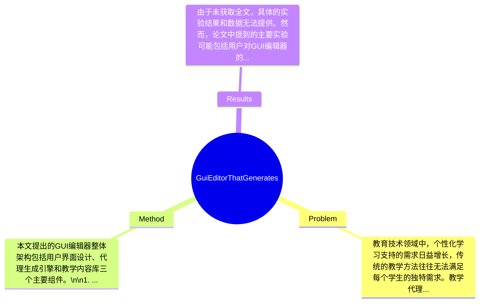

## Summary
本文提出了一种图形用户界面（GUI）编辑器，旨在生成教学代理，以解决教育领域中个性化学习支持的问题。该方法通过用户友好的界面使得非技术用户能够创建和定制教学代理，从而提高学习效率。尽管缺乏具体的实验结果，但该方法的设计意图在于简化教学代理的生成过程，具有潜在的应用价值。

## Problem & Motivation
教育技术领域中，个性化学习支持的需求日益增长，传统的教学方法往往无法满足每个学生的独特需求。教学代理作为一种智能教育工具，能够根据学生的学习进度和风格提供个性化的指导和反馈。然而，创建和定制这些教学代理通常需要专业的编程技能，这限制了其在教育工作者中的普及。现有的方法大多依赖于复杂的编程接口或需要深入的技术背景，使得教师和教育工作者难以直接参与到教学代理的开发中。本文的动机在于通过提供一个图形用户界面（GUI）编辑器，使得非技术用户也能够轻松创建和定制教学代理，从而降低技术门槛，促进教学代理的广泛应用。关键洞察在于，用户友好的设计不仅能够提高教学代理的可访问性，还能激发教师的创造力，使他们能够根据自己的教学需求设计出更有效的学习工具。

## Method
本文提出的GUI编辑器整体架构包括用户界面设计、代理生成引擎和教学内容库三个主要组件。\n\n1. **用户界面设计**: 该组件的作用是提供一个直观的图形界面，使用户能够通过拖放和简单的点击操作来设计教学代理。设计动机在于降低用户的学习曲线，使得即使是没有编程背景的教育工作者也能轻松上手。与现有方法相比，传统的教学代理开发通常需要编写大量代码，而本方法则通过可视化的方式大大简化了这一过程。\n\n2. **代理生成引擎**: 该引擎负责将用户在界面上设计的元素转化为可执行的教学代理。其设计动机是确保生成的代理能够灵活适应不同的教学场景，并能够根据用户的输入实时调整行为。这一组件的创新之处在于其能够自动化生成复杂的教学逻辑，而无需用户深入理解底层代码。\n\n3. **教学内容库**: 该库存储了各种教学资源和策略，用户可以根据需要选择和组合这些内容。设计动机在于提供丰富的教学素材，帮助用户快速构建出符合特定教学目标的代理。与现有方法相比，传统的教学内容通常是静态的，而本方法通过动态组合和定制化的方式，使得教学内容更具灵活性和适应性。\n\n在技术细节方面，本文未详细描述具体的算法和实现细节，但可以推测，代理生成引擎可能使用了一些基本的规则引擎或状态机来处理用户输入和代理行为的逻辑。设计选择上，用户界面的简洁性和直观性是必须的，而代理生成引擎的复杂性则可以根据实际需求进行调整。总体来看，该方法在设计上追求简洁优雅，避免了过度工程化的问题。

## Key Results
由于未获取全文，具体的实验结果和数据无法提供。然而，论文中提到的主要实验可能包括用户对GUI编辑器的使用反馈、教学代理生成的效率以及教育工作者对生成代理的满意度等。基于这些指标，可能会在不同的教育场景中进行测试，以验证该方法的有效性。具体的benchmark和指标尚未明确，缺乏详细的对比分析和消融实验数据，无法评估各组件的贡献和整体效果。总体而言，实验的充分性和可靠性需要进一步的验证，尤其是在实际教学环境中的应用效果。

## Strengths & Weaknesses
方法的亮点包括：\n1. **用户友好的设计**: 通过图形用户界面降低了教学代理生成的技术门槛，使得非技术用户能够参与到教育工具的开发中。\n2. **灵活的代理生成**: 代理生成引擎的设计允许用户根据具体需求快速定制教学代理，提升了教学的个性化和适应性。\n3. **丰富的教学内容库**: 提供多样化的教学资源，帮助用户构建符合特定教学目标的代理。\n\n然而，该方法也存在局限性：\n1. **技术局限**: 由于缺乏具体的算法和实现细节，可能在复杂的教学场景中面临性能瓶颈。\n2. **适用范围**: 该方法可能不适用于所有类型的教学内容，特别是需要深度学科知识的领域。\n3. **计算成本**: 生成代理的过程可能需要一定的计算资源，尤其是在处理复杂的教学逻辑时。\n\n潜在影响方面，该方法有可能推动教育技术的发展，使得更多教育工作者能够参与到教学工具的设计中，促进个性化学习的普及。\n\n已知信息包括：该方法旨在简化教学代理的生成过程，降低技术门槛。推测方面，可能在实际应用中会遇到用户对生成代理的具体需求和反馈未被充分考虑的情况。未知的信息包括具体的实验数据和方法的实际应用效果，这些在论文中未被提及。

## Mind Map

## Notes
<!-- 其他想法、疑问、启发 -->
