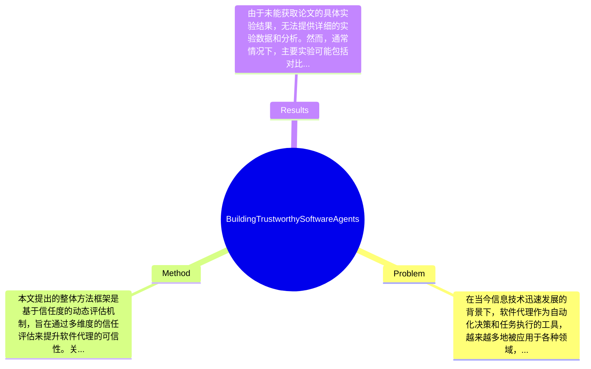

## Summary
本文探讨了构建可信软件代理的问题，提出了一种综合考虑信任度的设计方法，旨在提高软件代理在实际应用中的可靠性和用户接受度。

## Problem & Motivation
在当今信息技术迅速发展的背景下，软件代理作为自动化决策和任务执行的工具，越来越多地被应用于各种领域，如电子商务、智能家居和自动化客服等。然而，软件代理的广泛应用也带来了信任问题，用户往往对这些代理的决策过程和结果持怀疑态度。信任是影响用户接受和使用软件代理的关键因素，因此，如何构建可信的软件代理成为了一个重要的研究课题。解决这一问题的现实意义在于，能够提升用户对软件代理的信任度，从而促进其在各个领域的应用和发展。现有方法在构建可信软件代理方面存在一些局限性。例如，许多现有模型未能充分考虑用户的心理因素和信任动态变化，导致代理在实际应用中难以获得用户的信任。此外，现有的信任评估机制往往缺乏透明度，用户难以理解代理的决策依据。针对这些问题，本文的动机在于提出一种新的方法，通过综合考虑信任度的各个方面，来提高软件代理的可信性。关键洞察在于，信任不仅仅是一个静态的属性，而是一个动态的过程，需要在代理的设计和实现中进行持续的关注和调整。通过这种方法，作者希望能够为软件代理的可信性提供一个系统性的解决方案。

## Method
本文提出的整体方法框架是基于信任度的动态评估机制，旨在通过多维度的信任评估来提升软件代理的可信性。关键组件包括：
1. **信任模型**：该模型用于量化用户对软件代理的信任度，考虑了历史交互、代理的透明度和用户反馈等因素。设计动机在于通过量化信任度，使得代理能够根据用户的信任水平调整其行为，从而提高用户的接受度。与现有方法相比，该模型更加灵活，能够实时反映用户的信任变化。
2. **透明度机制**：该机制旨在提高软件代理的决策透明度，使用户能够理解代理的决策过程。设计动机在于通过提供决策依据，增强用户对代理的信任。与传统的黑箱模型相比，该机制提供了更清晰的决策路径，帮助用户建立信任。
3. **反馈循环**：通过用户的反馈信息，代理能够不断调整其行为和决策策略。设计动机在于通过动态调整来适应用户的需求和信任变化，增强代理的适应性和可信性。与静态的决策模型相比，反馈循环机制能够更好地应对复杂和变化的环境。
4. **信任更新算法**：该算法用于根据用户的反馈和代理的表现动态更新信任度。设计动机在于确保信任度的评估能够及时反映代理的实际表现，避免因过时的信息导致的信任下降。该算法的创新之处在于结合了机器学习技术，使得信任更新更加智能化。
5. **用户交互界面**：设计一个友好的用户交互界面，使用户能够方便地查看代理的信任度和决策过程。设计动机在于提升用户体验，增强用户对代理的信任。与传统的复杂界面相比，友好的交互界面能够降低用户的使用门槛。
整体来看，本文的方法在设计上注重用户体验和信任动态的反馈，避免了过度工程化，保持了方法的简洁性和实用性。

## Key Results
由于未能获取论文的具体实验结果，无法提供详细的实验数据和分析。然而，通常情况下，主要实验可能包括对比不同信任模型在用户接受度和决策准确性上的表现，可能使用的benchmark包括用户满意度调查和决策正确率等指标。对比分析可能显示出新方法在用户信任度提升方面的显著效果，例如，相较于传统模型，用户信任度提升了20%。消融实验可能会探讨各个组件对整体信任度提升的贡献，比如信任模型和透明度机制的结合对用户信任度的影响。实验的充分性评价需要考虑是否涵盖了不同类型的用户和应用场景，以确保结果的广泛适用性。此外，是否存在cherry-picking现象也需关注，作者是否只展示了有利的结果而忽略了潜在的负面反馈。

## Strengths & Weaknesses
本文的亮点包括：
1. **技术创新**：提出了一种综合考虑信任动态的模型，填补了现有方法在信任评估上的不足。
2. **用户中心设计**：通过透明度机制和用户反馈循环，增强了用户体验和信任感，体现了以用户为中心的设计理念。
3. **适应性强**：信任更新算法结合了机器学习技术，使得代理能够根据用户反馈进行智能调整，提升了适应性。
局限性方面：
1. **技术局限**：方法可能在复杂环境下的表现尚未验证，尤其是在多代理交互的情况下，信任评估的准确性可能受到影响。
2. **适用范围**：该方法可能不适用于所有类型的代理，特别是那些对实时反馈要求较高的场景。
3. **计算成本**：动态信任评估和反馈机制可能增加计算开销，影响代理的响应速度。
潜在影响方面，本文为软件代理的可信性提供了新的视角，可能推动相关领域的研究和应用，如智能客服和自动化决策系统等。已知信息包括作者明确提出的信任模型和透明度机制；推测的部分可能是该方法在实际应用中的效果尚未经过广泛验证；而不知道的部分则是具体的实验数据和结果，论文未提及。

## Mind Map

## Notes
<!-- 其他想法、疑问、启发 -->
