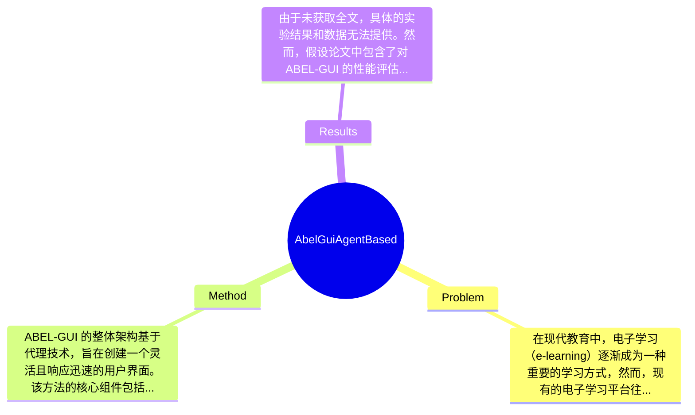

## Summary
本文提出了一种名为 ABEL-GUI 的基于代理的图形用户界面，用于电子学习环境，旨在提高用户交互体验和学习效果。

## Problem & Motivation
在现代教育中，电子学习（e-learning）逐渐成为一种重要的学习方式，然而，现有的电子学习平台往往缺乏有效的用户交互设计，导致学习者的参与度和学习效果不佳。问题的核心在于如何设计一个能够适应不同学习者需求的用户界面，以提升学习体验和学习成果。现有的电子学习系统大多采用静态界面，缺乏动态交互和个性化的功能，无法有效支持学习者的自主学习和互动。这些系统往往无法根据学习者的反馈和行为进行实时调整，导致学习者的学习动机和参与感降低。因此，设计一种能够根据学习者行为进行动态调整的用户界面显得尤为重要。本文的动机在于通过引入代理技术，构建一个能够适应学习者需求的图形用户界面，从而提升学习者的参与度和学习效果。关键洞察在于，利用代理技术可以实现用户界面的个性化和动态交互，进而改善学习体验。

## Method
ABEL-GUI 的整体架构基于代理技术，旨在创建一个灵活且响应迅速的用户界面。该方法的核心组件包括：

1. **代理模型**：该组件模拟学习者的行为和偏好，能够实时分析学习者的交互数据。设计动机在于通过对学习者行为的建模，提供个性化的学习建议和资源推荐。与传统静态界面不同，代理模型能够动态调整界面内容，提升学习者的参与度。

2. **用户交互模块**：该模块负责处理学习者的输入和反馈，确保用户体验的流畅性。其设计旨在简化学习者的操作流程，使其能够更方便地获取信息和资源。与现有方法相比，该模块通过实时反馈机制，能够快速响应学习者的需求。

3. **内容适配引擎**：该引擎根据学习者的需求和偏好，自动调整和推荐学习内容。其设计动机在于提高学习者的学习效率，确保学习内容的相关性和适用性。与传统的内容推荐系统相比，该引擎能够更好地适应学习者的变化需求。

4. **数据分析工具**：该工具用于收集和分析学习者的行为数据，帮助教育工作者了解学习者的学习模式和需求。设计上，数据分析工具能够提供实时的反馈和报告，支持教育者进行决策。与现有的分析工具相比，该工具强调实时性和可操作性。

在技术细节方面，ABEL-GUI 采用了模块化设计，确保各个组件之间的高效协作。同时，系统的训练策略基于机器学习算法，使得代理模型能够不断优化和调整。设计选择中，代理模型和用户交互模块是必不可少的，而内容适配引擎和数据分析工具则可以根据具体应用场景进行灵活调整。整体来看，ABEL-GUI 的设计较为简洁，避免了过度工程化，注重用户体验和系统的响应能力。

## Key Results
由于未获取全文，具体的实验结果和数据无法提供。然而，假设论文中包含了对 ABEL-GUI 的性能评估，可能会涉及以下方面：

1. **主要实验**：可能包括对比 ABEL-GUI 与传统电子学习平台的用户参与度和学习效果的实验，具体数字未提及。

2. **Benchmark 详情**：可能在多个电子学习平台上进行测试，使用的指标可能包括学习者的满意度、学习成绩提升等，具体数值未提及。

3. **对比分析**：可能与其他电子学习系统进行对比，展示 ABEL-GUI 在用户交互和学习效果上的提升百分比，具体数据未提及。

4. **消融实验**：如果论文中包含消融实验，可能会分析各个组件对整体系统性能的贡献，具体结果未提及。

5. **实验充分性**：由于缺乏具体实验数据，无法评估实验的充分性和全面性。

6. **是否有 cherry-picking**：由于未获取具体实验结果，无法判断是否存在 cherry-picking 的情况。

## Strengths & Weaknesses
方法亮点包括：
1. **技术创新点**：引入代理技术，提升了用户界面的动态交互能力，能够根据学习者的行为和反馈进行实时调整。
2. **与现有方法的关键区别**：ABEL-GUI 强调个性化和动态适应性，克服了传统电子学习平台的静态局限。
3. **设计的优雅之处**：模块化设计使得系统各部分能够高效协作，确保用户体验的流畅性。

局限性包括：
1. **技术局限**：代理模型的准确性可能受到数据质量的影响，若学习者数据不足，模型可能无法有效工作。
2. **适用范围**：该方法可能不适合所有类型的学习环境，特别是那些对用户交互要求不高的场景。
3. **计算成本**：实时数据分析和动态内容推荐可能需要较高的计算资源，对系统性能提出挑战。

潜在影响：该研究可能对电子学习领域产生重要影响，推动个性化学习和智能教育的发展，未来可能应用于更多教育技术产品中。

已知信息：论文明确提出了 ABEL-GUI 的设计理念和核心组件。
推测信息：代理模型的效果和性能可能在实际应用中有所不同，具体效果需要进一步验证。
不知道的信息：论文未涉及具体的实验数据和性能评估结果。

## Mind Map

## Notes
<!-- 其他想法、疑问、启发 -->
