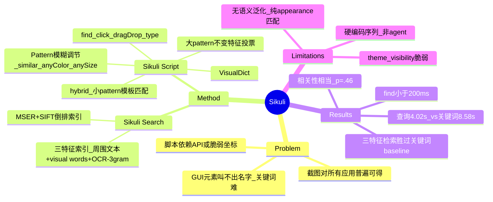

## Summary
Sikuli 用 GUI 元素的**截图**同时解决两件事：把截图当 query 检索文档（Sikuli Search），以及把截图当参数在脚本里驱动键鼠（Sikuli Script）——2009 年即确立了"看像素、按图操作 UI、不依赖应用 API/坐标"的范式，是今日 pixel-based GUI agent 的直系前身。

## Problem & Motivation
GUI 元素本质是图形的，但当年的帮助检索和自动化都被迫走**非视觉**路径，各有痛点：

- **检索**：想搜某个 toolbar 按钮/图标/dialog/报错的文档，用户得先想出正确的关键词，而 GUI 元素往往**叫不出名字**；tooltip、F1 帮助又不一定被应用实现。
- **自动化**：脚本控制 GUI 元素要么依赖应用提供 API 或可访问文本标签（AppleScript、Windows Scripting、Chickenfoot、CoScripter），这些**不一定存在**；要么用绝对/相对屏幕**坐标**（Jitbit、QuicKeys 等录制回放宏），坐标在窗口移动或元素重排后**失效**。

核心洞察：GUI 元素最直接的表示就是它的**截图**，而截图对所有应用、所有 GUI 平台**普遍可得**（总能截图），无需应用配合。因此用截图既做检索 query 又做自动化的定位目标。

## Method
论文分两个独立系统。

### 1. Sikuli Search（截图检索文档）
用**三类特征**联合索引每张截图（Figure 2）：
- **周围文本**：源文档里图片旁的文字（传统关键词图搜做法），用 Ferret 索引。
- **视觉特征（bag of visual words）**：借鉴 Video Google [Sivic & Zisserman]，用 **MSER** detector 检测显著椭圆 patch、**SIFT** descriptor 算出 visual word，建**倒排索引**；query 时取重合 visual word 最多的图作 top matches。
- **嵌入文本 OCR**：用 Tesseract 提取截图内文字；为抗 OCR 错误，不用原始串而用字符 **3-gram**（`system`→误识 `systen` 仍有 75% 重合而非完全 miss），把 5 万个 3-gram 当作 visual word 塞进同一索引。

原型库：102 本电脑书（PDF）、>50k 截图；C++ 建索引，Ruby on Rails 服务端，Java 客户端。用户拖橡皮筋矩形框选即可 query，**允许不精确匹配**，无需框准。另有 **annotation 界面**：用截图当锚点给桌面 GUI 元素挂个人/社区注释，不需改应用源码（对比 Stencils 需实现 Java 接口）。

### 2. Sikuli Script（截图驱动自动化）
核心是在屏幕上可靠、高效地**找到目标 pattern**，采用 **hybrid** 方案（Figure 6）：
- **小 pattern（icon/button）**：**template matching**（基于 normalized cross-correlation，OpenCV 实现），可多尺度匹配处理分辨率变化、灰度匹配处理配色主题变化。
- **大 pattern（window/dialog）**：template matching 太慢，改用 **invariant feature voting**（改编自 Mikolajczyk 的车/行人检测生成模型）：从训练截图提取不变局部特征学一个 object model（编码 center 相对每个 feature 的位置），测试屏上每个 feature 投票 object center，聚类出 hypotheses，再用几何变换验证；返回匹配的 position/scale/orientation，含旋转不变（为 tabletop GUI 预留）。

**Visual Scripting API（Python 语法）**：
- `find(pattern)` 返回匹配的 `Region`（否则 false）；`Pattern` 可由图像（走 CV 匹配）或文本串（走 OCR）创建。
- 四个可链式的模糊调节器：`exact()`（像素级完全一致）、`similar(threshold)`（0–1 相似度阈值）、`anyColor()`、`anySize()`。
- `Region` 有 x/y/w/h 与 similarity 分数，可迭代多匹配、可把搜索约束到某区域内。
- 空间约束算子：`left/right/above/below/nearby/inside/outside` + 阅读序 `after/before`，可组合。
- action 命令 `click/doubleClick/dragDrop/type` 发键鼠事件到 region **中心**。
- `VisualDict`：以图像为 key 的字典，接通 Sikuli Search 的匹配能力。

**实现**：C++/OpenCV 做核心匹配，Java（Java Robot 类）执行键鼠，Jython 跑 Python 脚本；带截图内嵌 inline image、code completion、相似度预览的编辑器。3.2GHz PC 上，1600×1200 屏找 100×100 目标 `find()` **<200ms**。给了 6 个 demo 脚本：最小化所有窗口、删多类型 Office 文件、追踪公交到站、导航地图到 Houston、自动应答消息框（VisualDict）、webcam 绿标记监控婴儿翻身。

## Key Results
- **用户研究（截图 vs 关键词检索）**：12 人 within-subject。查询构造时间截图 **4.02s** vs 关键词 **8.58s**，显著更快 t(11)=3.87, p=.003（不到一半）；top-5 中被判相关的结果数截图 **2.62** vs 关键词 **2.87**，**无显著差异** p=.46（即质量相当）。主观上关键词更 familiar（Q6, p<.001），截图在 easier-to-use/learn 上有趋势（p<.1）；观察到用户几轮内就学快了截图查询。
- **检索性能**：500 个库外 Windows XP dialog box，coverage 估 **70.5%**（361/500 至少有一个相关文档）。precision/recall 曲线上，三特征法（周围文本+嵌入文本+视觉）**显著优于**仅用周围文本的关键词 baseline。作者归因：周围文本常提供额外信息而不重复截图里已可见的文字，而用户恰按可见文字选关键词，导致关键词 baseline 命中率低。
- **自动化部分无定量成功率评测**，仅有 demo 与 `find()` <200ms 的速度基准。

## Strengths & Weaknesses
**Strengths / 对领域的奠基意义**
- **确立 pixel-based GUI 交互范式**：observation = 截图，action = 在匹配 region 中心发键鼠事件，application/platform-agnostic，不依赖 API 或 accessibility tree。这正是今日 pixel-based GUI/computer-use agent 的直系血统；`find(pattern).click()` 的抽象与今天 "grounding → action" 的 pipeline 结构同构。
- **simple & general**：一张截图既是 query 又是 grounding target；"截图对所有应用普遍可得"的论证到今天仍成立（不依赖 DOM/a11y）。
- **系统完整**：search + script + editor + API + 6 例 + 两个已有帮助系统（Stencils、Graphstract）的增强 integration，工程扎实，后来开源为知名工具 SikuliX。

**Weaknesses / 与今日 LLM-based GUI agent 的关系（critical read）**
- **无语义泛化**——这是 pre-LLM 方案最本质的局限。模板匹配 / 局部特征投票是纯 **appearance-based**，只能找"长得像给定截图"的元素；它 ground 的是**像素相似度而非语义**。必须先手握目标的确切截图，无法像今天 VLM agent 那样从 NL 指令语义（"点击提交按钮"）定位一个外观从未见过的元素。
- **脆弱、泛化靠人肉调参**：作者自列两大 limitation——(1) **theme variation**，颜色/字体/背景一变就 break，需切默认主题或做 pattern 映射；(2) **visibility constraint**，只在可见屏幕空间工作，被遮挡/滚出视野/在别的 tab 的元素找不到。加上 `anyColor/anySize/similar` 阈值要手工调（Figure 8 中阈值 0.25 太低就满屏 false positive），泛化边界由**手写 CV 算法固定**，不是从数据学的。
- **无 high-level 推理/规划**：脚本是命令式**硬编码的固定序列**（`while find(): click()`），无任务语义理解、无从 NL 指令自动生成计划的能力——本质是"视觉宏"而非 agent。
- **评估偏弱**：user study 仅 12 人、检索任务限于 dialog box、关键词 baseline 由作者手造（可能偏弱）；自动化部分几乎无定量评测。

**Lineage 定位**：论文自述 direct pixel access 的先驱是 Potter 的 Triggers（1999）与 VisMap/VisScript，但当年因硬件慢、CV 算法弱而"几乎无 follow-up"。Sikuli 论证了 **invariant local features + 更快硬件** 让 pixel-based interaction 变实用，重新点燃这条线。清晰的技术演进：**direct pixel access (Potter 1999) → Sikuli (2009, 手写 CV 模板匹配) → 今日 VLM grounding**。范式（pixels in, mouse/keyboard out）十余年未变，LLM/VLM 补上的正是当年最缺的**语义与规划**。

## Mind Map

## Notes
- 与今天 GUI agent survey 的连接点：Sikuli 是"pixel/vision grounding without accessibility tree"这条支线的源头。可作为 GUIAgent-Survey 中 grounding 章节的历史起点，对照后续 SeeClick / UGround / OmniParser 等学习式 grounding，突出"从手写 CV 模板匹配 → 端到端学习 → VLM 语义 grounding"的演进主线。
- 原文一处术语疑似笔误：template matching 写作 "normalized cross-validation"，按 OpenCV 实现与上下文应为 **normalized cross-correlation**。
- 待办（主线程统一处理）：cite_key 由 assign_cite_keys.py 分配、BibTeX 由 fetch_bibtex.py 缓存；本篇属 GUIAgent-Survey，需在下一轮 survey-refresh 整合（GUI survey integration pending）。
