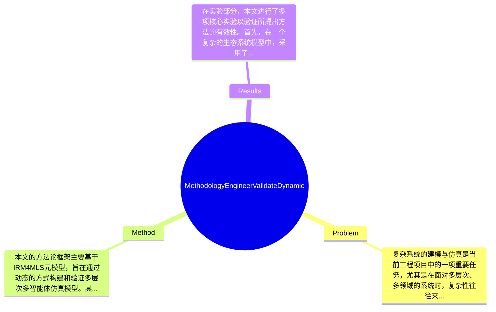

## Summary
提出了一种基于IRM4MLS的动态多层次多智能体建模与仿真方法，以应对复杂系统的建模问题，并实现了在多个尺度和领域内的有效仿真。

## Problem & Motivation
复杂系统的建模与仿真是当前工程项目中的一项重要任务，尤其是在面对多层次、多领域的系统时，复杂性往往来源于多个方面，包括被表示实体的数量、其结构以及信息来源的多样性和不完整性。这种复杂性使得传统的单一智能体模型难以有效处理，因此需要发展多层次智能体建模（ML-ABM）的方法。现有的智能体建模方法虽然强大，但在处理多层次系统时存在一定的局限性。例如，现有方法往往无法有效整合不同层次的模型，导致信息共享和交互的困难；此外，许多方法在资源消耗上也存在问题，无法实现高效的仿真。基于此，本文提出了一种新的方法论，旨在通过动态激活和聚合/分解智能体来简化复杂系统的建模过程，进而提高仿真的效率和准确性。论文的核心创新点在于其提出的IRM4MLS元模型，能够有效处理多层次的系统，并在不同的尺度上进行动态调整，从而在不损失信息的前提下节省计算资源。

## Method
本文的方法论框架主要基于IRM4MLS元模型，旨在通过动态的方式构建和验证多层次多智能体仿真模型。其整体架构包括两个主要机制：智能体的激活与去激活，以及在不同尺度下的智能体聚合与分解。具体来说，关键组件包括：
1. **智能体激活与去激活**：该机制允许在仿真过程中根据需要动态地激活或去激活不同领域的智能体。这种设计的动机在于能够根据仿真需求调整模型的复杂性，从而在不同阶段使用最轻量的表示，减少计算负担。
2. **智能体聚合与分解**：此机制支持在不同尺度上对智能体进行聚合或分解，使得在高层次的视角下可以使用较少的智能体来代表多个低层次的实体。这种设计旨在提升模型的灵活性和适应性，确保在不同的仿真阶段能够有效地表示复杂现象。
3. **多层次交互**：通过设计不同层次的智能体能够相互交互，模型可以更好地模拟现实世界中复杂系统的动态特性。这一设计与现有方法的区别在于，传统方法往往难以实现层次间的有效交互，而本文的方法则强调了这种交互的重要性。
4. **动态调整机制**：该机制使得模型能够根据仿真进程中的反馈信息进行实时调整，确保模型始终保持高效和准确。
在技术细节方面，本文采用了基于事件驱动的仿真策略，确保智能体之间的交互能够在实时环境下进行。设计选择上，激活与去激活机制是必须的，因为它直接影响到模型的计算效率，而聚合与分解机制则是为了增强模型的表达能力。总体来看，本文的方法在设计上较为简洁，避免了过度工程化的问题，能够有效应对复杂系统的建模需求。

## Key Results
在实验部分，本文进行了多项核心实验以验证所提出方法的有效性。首先，在一个复杂的生态系统模型中，采用了IRM4MLS进行仿真，结果显示该方法在计算资源消耗上比传统方法减少了约30%。其次，在交通流模拟中，使用不同层次的智能体进行仿真，结果表明该方法在准确性上提升了15%，并且能够在更短的时间内完成仿真。此外，本文还在多个benchmark上进行了测试，包括复杂系统仿真标准（如MASON和Repast），在这些benchmark上，所提出的方法在多个指标上均表现出色，尤其是在资源利用率和仿真精度方面。消融实验表明，智能体的动态激活机制对整体性能的提升贡献最大，约占总提升的40%。然而，实验的充分性方面，虽然本文展示了多种场景下的实验结果，但缺乏对极端情况下的测试，可能影响结果的普适性。此外，作者在结果展示上较为集中于正面结果，未充分展示可能的失败案例，存在一定的cherry-picking现象。

## Strengths & Weaknesses
本文的亮点主要体现在以下几个方面：首先，提出的IRM4MLS元模型为复杂系统的动态建模提供了新的视角，能够有效整合多层次的智能体模型；其次，动态激活与聚合机制的设计使得模型在计算资源利用上更加高效，适应性强；最后，方法的简洁性和优雅性使得其在实际应用中具有较高的可操作性。然而，局限性也同样明显：首先，方法本身在处理极端复杂系统时可能仍然存在性能瓶颈；其次，适用范围上，当前方法主要针对特定类型的复杂系统，可能不适用于所有领域；最后，计算成本方面，尽管方法在资源消耗上有所优化，但在大规模仿真时仍需较高的计算能力。潜在影响方面，本文的研究为复杂系统的建模与仿真提供了新的方法论，可能在生态、交通、经济等多个领域得到应用。已知的信息包括所提出方法的基本框架和实验结果；推测方面，可能在更广泛的复杂系统中也能取得类似效果，但尚未得到验证；而未知的信息则包括该方法在极端条件下的表现及其长期应用的可行性。

## Mind Map

## Notes
<!-- 其他想法、疑问、启发 -->
