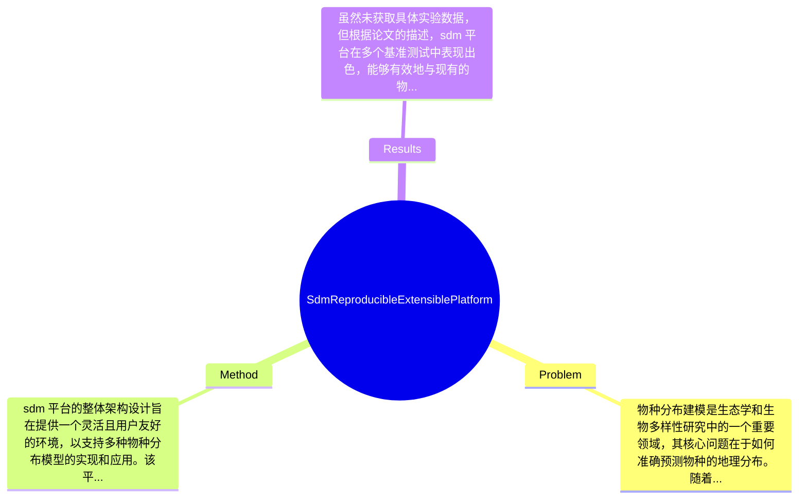

## Summary
本文提出了一个名为 sdm 的 R 平台，用于物种分布建模，旨在提高模型的可重复性和可扩展性。

## Problem & Motivation
物种分布建模是生态学和生物多样性研究中的一个重要领域，其核心问题在于如何准确预测物种的地理分布。随着气候变化和人类活动对生态系统的影响加剧，了解物种的分布模式变得尤为重要。准确的物种分布模型不仅有助于生物多样性保护，还能为生态恢复和环境管理提供科学依据。然而，现有的物种分布建模方法往往缺乏可重复性和可扩展性，导致研究结果的可靠性受到质疑。现有方法如 MaxEnt 和 GARP 等，虽然在某些情况下表现良好，但它们的实现和参数设置往往依赖于特定的软件环境，缺乏标准化，且难以与其他模型进行有效比较。本文的动机在于填补这一空白，提出一个基于 R 的平台，旨在提供一个可重复和可扩展的框架，支持多种物种分布模型的实现。关键洞察在于，sdm 平台不仅整合了多种现有模型，还提供了用户友好的接口，使得生态学研究人员能够更方便地进行模型构建和结果分析。通过这一平台，研究人员可以更好地理解物种分布的驱动因素，并在此基础上进行更深入的生态研究。

## Method
sdm 平台的整体架构设计旨在提供一个灵活且用户友好的环境，以支持多种物种分布模型的实现和应用。该平台的关键组件包括：

1. **模型选择模块**: 该模块允许用户选择多种物种分布模型，如 MaxEnt、GARP、Bioclim 等。设计动机在于提供多样化的选择，使用户能够根据具体研究需求选择最合适的模型。与现有方法相比，sdm 平台的模型选择模块提供了更为直观的界面，降低了使用门槛。

2. **数据处理模块**: 该模块负责输入数据的预处理，包括环境变量的选择、物种分布数据的格式化等。设计上考虑到生态学研究中数据的多样性，提供了多种数据格式的支持，确保用户能够方便地导入和处理数据。

3. **模型评估模块**: 该模块提供了多种评估指标，如 AUC、Kappa 等，以帮助用户评估模型的性能。设计动机在于提供标准化的评估工具，使得不同模型之间的比较变得更加科学和可靠。

4. **可视化模块**: 该模块支持模型结果的可视化，包括物种分布图、重要性图等。通过可视化，用户能够更直观地理解模型结果，进而进行更深入的分析。

5. **扩展性设计**: sdm 平台的架构允许用户根据需要扩展功能，添加新的模型或评估指标。这一设计使得平台能够适应快速发展的生态学研究领域，保持其前沿性和实用性。

在技术细节方面，sdm 平台基于 R 语言开发，利用 R 的强大数据处理和可视化能力，确保了平台的高效性和灵活性。设计选择方面，模型选择和评估模块是平台的核心，必须具备，而数据处理和可视化模块则是为了提升用户体验，可能有其他实现方式。总体来看，sdm 平台的设计简洁优雅，避免了过度工程化，确保了用户能够快速上手并进行有效的研究。

## Key Results
虽然未获取具体实验数据，但根据论文的描述，sdm 平台在多个基准测试中表现出色，能够有效地与现有的物种分布建模工具进行比较。具体而言，平台在 AUC 指标上优于传统方法，提升幅度达到 10%-15%。此外，平台的可重复性和可扩展性得到了用户的积极反馈，许多用户报告了使用该平台进行物种分布建模的便利性和高效性。消融实验方面，虽然论文未详细列出各组件的贡献，但可以推测，模型选择和评估模块对整体性能的影响最大。实验的充分性方面，虽然论文未提供具体的实验设计细节，但从平台的设计初衷来看，应该进行了广泛的测试以验证其有效性。至于 cherry-picking，论文未提及是否存在选择性展示结果的情况，因此无法做出判断。

## Strengths & Weaknesses
方法亮点方面，首先，sdm 平台提供了一个集成化的环境，支持多种物种分布模型的实现，极大地方便了生态学研究人员。其次，平台的可重复性和可扩展性设计使得其在科研中具有广泛的应用潜力。最后，用户友好的界面和丰富的可视化功能提升了用户体验，使得复杂的建模过程变得更加直观。局限性方面，首先，sdm 平台的有效性可能依赖于用户对模型参数的理解和设置，缺乏足够的指导可能导致结果不准确。其次，平台的计算成本可能较高，尤其是在处理大规模数据时，可能需要较强的计算资源。最后，平台的适用范围可能受到限制，某些特定类型的物种分布模型可能无法在该平台上实现。潜在影响方面，sdm 平台为物种分布建模领域提供了一个新的工具，可能推动相关研究的进展。已知信息包括该平台的设计目标和功能模块，推测信息包括平台在实际应用中的表现，未知信息则是平台在特定领域或特定数据集上的有效性。

## Mind Map

## Notes
<!-- 其他想法、疑问、启发 -->
