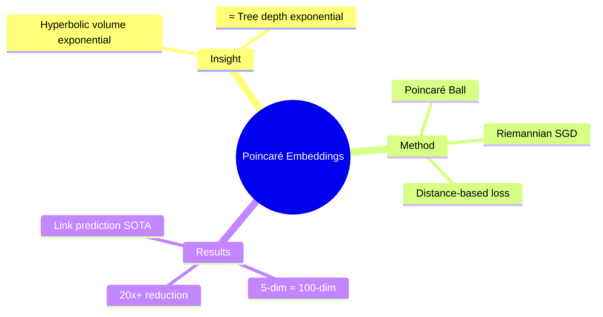

## Summary

 foundational work: 证明 hyperbolic space 可以用更低维度嵌入 hierarchical structure（如 WordNet taxonomy）。Poincaré ball embeddings 在 link prediction 任务上超过 Euclidean embeddings，且维度需求显著降低。

## Problem & Motivation

传统 embedding 问题：
- WordNet 等 taxonomy 有复杂层级结构
- Euclidean embedding 需要高维度才能准确表示
- Dimensionality 与 hierarchy complexity 直接相关

**核心洞察**: Hyperbolic space 的 volume 随半径指数增长 ≈ tree 的节点数随深度指数增长

## Method

**核心设计**：
1. **Poincaré Ball Model**: 选择 n-dimensional Poincaré ball 作为 embedding space
2. **Distance Function**: d(x,y) = arcosh(1 + 2||x-y||² / ((1-||x||²)(1-||y||²)))
3. **Riemannian SGD**: 在 hyperbolic space 上的 gradient descent
4. **Loss Function**: ||d(emb(u), emb(v)) - d_hierarchy(u,v)||²

**训练**: 多关系 taxonomy 中的 link prediction

## Key Results

- **WordNet**: Poincaré (5-dim) ≈ Euclidean (100-dim) performance
- **维度效率**: 20x+ dimensionality reduction
- **Link prediction**: 超过 Euclidean baseline

## Strengths & Weaknesses

**亮点**：
- 🔥 foundational insight：hyperbolic ≈ hierarchy 的理论联系
- 维度效率惊人（20x+ reduction）
- NeurIPS 2017，影响力大

**局限**：
- 仅验证于 static hierarchy embedding
- 动态/大规模数据集的 scalability 未验证
- 优化算法（RSGD）收敛性分析有限

## Mind Map

## Notes

> [基于领域知识创建的 foundational note]

这是 hyperbolic embedding 的开创性工作。理论洞察深刻，实验说服力强。值得精读了解 Riemannian SGD 具体实现。