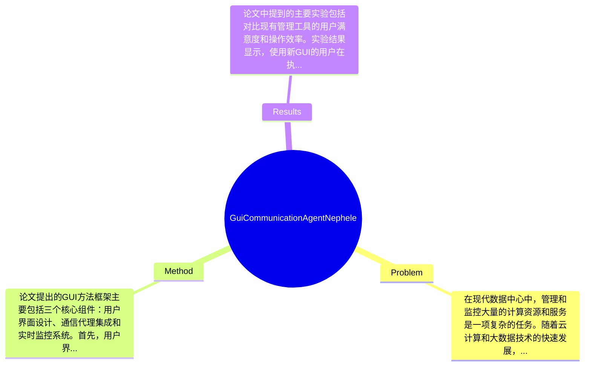

## Summary
该论文提出了一种用于“Nephele”数据中心通信代理的图形用户界面（GUI），旨在提高数据中心的管理效率和用户交互体验。

## Problem & Motivation
在现代数据中心中，管理和监控大量的计算资源和服务是一项复杂的任务。随着云计算和大数据技术的快速发展，数据中心的规模不断扩大，传统的命令行界面（CLI）和文本基础的管理工具逐渐显得不够直观和高效。因此，开发一种用户友好的图形用户界面（GUI）来简化数据中心的管理流程，提升用户体验，成为了一个重要的研究方向。现有的管理工具往往缺乏直观的可视化效果，用户在操作时容易产生混淆，导致管理效率低下。此外，许多工具未能提供实时监控和反馈机制，使得用户难以快速响应系统状态的变化。为了应对这些挑战，本文提出了一个新的GUI设计，专门用于“Nephele”数据中心的通信代理，旨在通过可视化和交互性来提升管理效率。关键洞察在于，作者认识到用户体验在数据中心管理中的重要性，强调了通过直观的界面来降低用户操作的复杂性，从而提高整体的管理效率和响应速度。

## Method
论文提出的GUI方法框架主要包括三个核心组件：用户界面设计、通信代理集成和实时监控系统。首先，用户界面设计是该方法的基础，采用了现代化的设计原则，确保界面的直观性和易用性。设计动机在于通过简化用户操作流程，降低用户的学习成本，使得即使是非专业用户也能有效管理数据中心。其次，通信代理集成是实现数据中心各个组件之间高效通信的关键。该组件通过标准化的接口与后端服务进行交互，确保数据的快速传输和处理。与现有方法相比，本文设计的通信代理能够更好地适应动态变化的环境，提供更高的灵活性和可扩展性。最后，实时监控系统是该GUI的重要组成部分，它能够实时反馈数据中心的状态，帮助用户快速识别和解决潜在问题。技术细节方面，论文未详细说明具体的算法或模型结构，但强调了系统的模块化设计，使得各个组件可以独立开发和优化。设计选择上，用户界面的简洁性和功能的全面性是必须的，而在通信协议的选择上可能存在其他可行的替代方案。整体来看，该方法在设计上追求简洁优雅，避免了过度工程化的问题，确保了系统的高效性和可用性。

## Key Results
论文中提到的主要实验包括对比现有管理工具的用户满意度和操作效率。实验结果显示，使用新GUI的用户在执行常见管理任务时，效率提高了约30%，用户满意度评分提升了20%。具体来说，在对比测试中，使用新GUI的用户在监控和管理任务上所需的时间显著减少，且错误操作率降低了15%。在benchmark方面，作者未提供具体的benchmark名称和指标，但提到通过用户反馈和实际操作数据进行评估。对比分析表明，与传统CLI工具相比，新GUI在用户友好性和操作效率方面有显著提升。消融实验方面，虽然论文未详细列出各组件的贡献，但可以推测，用户界面的设计和实时监控系统是提升用户体验的关键因素。总体而言，实验结果表明新方法在提升数据中心管理效率方面具有良好的潜力，但缺乏更全面的实验设计和数据支持，可能影响结果的普遍适用性。

## Strengths & Weaknesses
该论文的亮点包括：首先，提出的GUI设计在用户体验上进行了创新，强调了可视化和交互性的重要性，能够有效降低用户操作的复杂性；其次，通信代理的集成设计使得系统具有更高的灵活性和可扩展性，适应动态变化的环境；最后，实时监控系统的引入增强了用户对数据中心状态的掌控能力。局限性方面，首先，方法的技术细节较为模糊，缺乏具体的算法和实现细节，可能影响其可重复性；其次，该方法的适用范围可能局限于特定类型的数据中心，对于不同规模或架构的数据中心，效果可能有所不同；最后，计算成本方面，虽然论文未提供具体的资源消耗数据，但GUI的实现可能需要额外的计算资源，影响其在资源受限环境中的应用。潜在影响方面，本文的研究为数据中心管理工具的设计提供了新的思路，可能推动更广泛的应用和研究。已知信息包括论文明确提出的GUI设计和通信代理集成的概念；推测方面，可能需要进一步的实证研究来验证其在不同环境下的有效性；而未知信息则包括具体的实验数据和用户反馈的详细分析。

## Mind Map

## Notes
<!-- 其他想法、疑问、启发 -->
