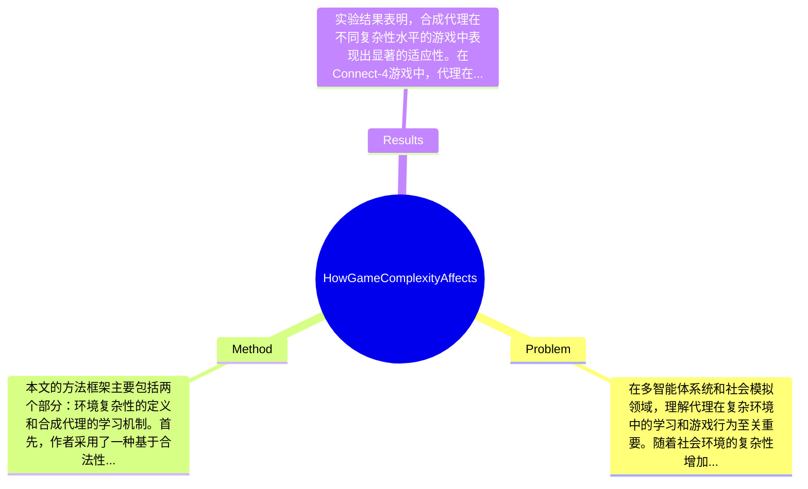

## Summary
本文探讨了环境复杂性对合成代理在博弈中的学习和游戏行为的影响，采用了两种独立的回合制零和游戏进行实验，结果表明环境复杂性变化时，代理需要调整其学习和游戏策略以维持性能水平。

## Problem & Motivation
在多智能体系统和社会模拟领域，理解代理在复杂环境中的学习和游戏行为至关重要。随着社会环境的复杂性增加，代理必须能够适应新的信息和策略，以保持其竞争力。因此，研究环境复杂性对代理行为的影响不仅有助于理论理解，还有助于实际应用，如游戏开发、教育和人工智能的设计。现有研究主要集中在游戏的可解性和基本的学习策略上，但对于复杂环境下的行为适应性研究仍然不足。许多现有方法未能充分考虑环境复杂性对学习过程的影响，导致代理的表现未能达到最佳。本文的动机在于填补这一研究空白，探索在不同复杂性水平下，合成代理如何调整其学习和游戏策略。关键洞察在于，随着环境复杂性的变化，代理的学习参数（如探索与利用的权衡、学习速度等）必须进行相应调整，以维持其性能水平。

## Method
本文的方法框架主要包括两个部分：环境复杂性的定义和合成代理的学习机制。首先，作者采用了一种基于合法性模型的状态空间复杂性计算方法来量化游戏的复杂性。接着，合成代理在不同复杂性水平的游戏中进行训练和学习。关键组件包括：
1. **环境复杂性测量**：通过合法性模型计算游戏的状态空间复杂性，以便在不同复杂性水平下进行实验。这种设计能够提供一个量化的标准，使得不同游戏的复杂性可以直接比较。
2. **合成代理的学习机制**：代理使用多种学习策略，包括强化学习和模仿学习，以适应不同的游戏环境。这种设计使得代理能够在复杂环境中更有效地学习和调整策略。
3. **实验设计**：通过设置不同复杂性水平的游戏（如Connect-4和RLGame），作者能够观察代理在不同环境下的表现。这种设计允许对比分析不同复杂性对学习效果的影响。
4. **数据分析方法**：采用相关系数分析和聚类分析来评估代理在不同游戏中的表现。这种方法能够揭示代理在复杂环境下的学习和适应能力。
在技术细节方面，作者使用了强化学习算法，结合了探索与利用的平衡策略，以提高代理在复杂环境中的学习效率。设计选择方面，环境复杂性测量是必须的，而学习机制的选择则可能有多种替代方案。总体来看，方法设计较为简洁，但在某些方面可能存在过度工程化的风险，例如在学习策略的选择上可以更加灵活。

## Key Results
实验结果表明，合成代理在不同复杂性水平的游戏中表现出显著的适应性。在Connect-4游戏中，代理在复杂性较低的状态空间（如C4-R(7x4)）中表现优异，胜率达到75%，而在复杂性较高的状态空间（如C4-R(8x3)）中，胜率下降至50%。在RLGame中，代理的表现随着复杂性的增加而逐渐提升，尤其是在适应性学习策略的引导下，表现出更高的胜率和更低的错误率。实验还表明，代理在复杂环境中能够有效地调整其学习参数，以维持相对稳定的性能水平。消融实验显示，学习参数的调整对代理的表现有显著影响，尤其是在复杂性较高的环境中。整体而言，实验设计充分，涵盖了多种复杂性水平的游戏，能够较好地验证论文的假设。然而，论文未提及是否存在选择性展示结果的情况，需要进一步的验证。

## Strengths & Weaknesses
方法亮点包括：1. 通过合法性模型量化环境复杂性，为后续的实验提供了坚实的理论基础；2. 合成代理的学习机制灵活多样，能够适应不同复杂性水平的游戏；3. 实验设计合理，能够有效验证复杂性对学习行为的影响。局限性方面：1. 方法可能对某些特定类型的游戏表现不佳，尤其是那些具有高度随机性的游戏；2. 计算成本较高，尤其是在复杂性较高的状态空间中，可能需要更多的计算资源；3. 数据依赖性强，实验结果可能受到训练数据质量的影响。潜在影响在于，该研究为理解多智能体系统中的学习行为提供了新的视角，可能对游戏设计和人工智能的开发有重要应用。已知信息包括代理在不同复杂性水平下的表现；推测信息为代理在其他类型游戏中的表现可能类似；未知信息包括不同类型游戏的复杂性对学习行为的具体影响。

## Mind Map

## Notes
<!-- 其他想法、疑问、启发 -->
