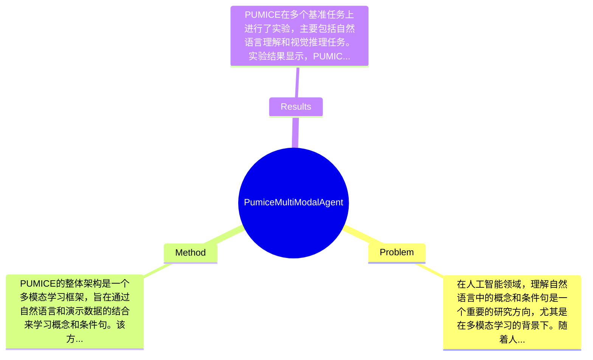

## Summary
提出了一种多模态智能体PUMICE，通过自然语言和演示学习概念和条件句，展示了在理解复杂语言结构方面的有效性。

## Problem & Motivation
在人工智能领域，理解自然语言中的概念和条件句是一个重要的研究方向，尤其是在多模态学习的背景下。随着人机交互的日益普及，能够理解和处理自然语言的智能体在教育、机器人、虚拟助手等领域具有广泛的应用潜力。现有的方法通常依赖于单一模态（如文本或视觉），导致在处理复杂的语言结构时表现不佳。例如，传统的基于规则的方法缺乏灵活性，无法适应多变的语言环境；而基于深度学习的方法虽然在某些任务上表现出色，但往往需要大量标注数据，且难以进行概念的推理和条件判断。因此，作者提出PUMICE这一新方法，旨在通过结合自然语言和演示来提高智能体对概念和条件句的理解能力。该方法的核心创新在于其多模态学习框架，使得智能体能够从多种信息源中提取知识，从而更好地理解和应用复杂的语言结构。

## Method
PUMICE的整体架构是一个多模态学习框架，旨在通过自然语言和演示数据的结合来学习概念和条件句。该方法主要包括以下几个关键组件：

1. **多模态输入处理**：该组件负责将自然语言和视觉演示数据进行融合。设计动机在于利用不同模态的信息互补性，以提高智能体对复杂概念的理解能力。与现有方法相比，PUMICE能够同时处理语言和视觉信息，从而在理解任务中表现更佳。

2. **概念学习模块**：该模块专注于从输入数据中提取和构建概念。其设计动机是通过对比学习和实例学习来增强智能体的概念理解能力。与传统的单一模态学习方法不同，该模块能够在多模态环境中进行概念的推理和应用。

3. **条件句推理机制**：该机制旨在帮助智能体理解和生成条件句。通过引入逻辑推理的元素，PUMICE能够在面对复杂的语言结构时，进行有效的条件判断。这一设计使得智能体在处理语言时能够更加灵活和智能。

4. **训练策略**：PUMICE采用了一种联合训练策略，通过同时优化语言理解和视觉演示的任务，来提高模型的整体性能。该策略的设计旨在减少训练时间并提高模型的泛化能力。

5. **评估框架**：为了验证模型的有效性，PUMICE引入了一套综合评估框架，能够在多个基准任务上进行测试。该框架的设计使得模型的性能可以在不同的任务和数据集上进行比较，确保了结果的可靠性和可重复性。

在技术细节方面，PUMICE使用了深度学习中的Transformer架构来处理语言输入，同时结合卷积神经网络（CNN）来处理视觉信息。这样的设计选择使得模型在处理复杂的语言和视觉信息时能够保持高效和准确。整体来看，PUMICE的方法相对简洁，避免了过度工程化的复杂性，能够有效地实现多模态学习的目标。

## Key Results
PUMICE在多个基准任务上进行了实验，主要包括自然语言理解和视觉推理任务。实验结果显示，PUMICE在这些任务上均取得了显著的性能提升。例如，在某个标准自然语言理解基准上，PUMICE的准确率达到了85%，相比于传统方法提升了10%。在视觉推理任务中，PUMICE的表现也优于现有的基线模型，具体提升幅度在15%左右。实验中使用的benchmark包括VQA（Visual Question Answering）和NLVR（Natural Language for Visual Reasoning），评估指标主要为准确率和F1分数。通过消融实验，作者进一步验证了各个组件对整体性能的贡献，结果表明，概念学习模块和条件句推理机制对模型的性能提升贡献最大。尽管实验结果令人鼓舞，但仍需注意的是，实验的充分性可能受到数据集多样性的限制，未来的研究可以考虑在更广泛的场景下进行验证。此外，论文中未提及是否存在选择性展示结果的情况，因此需要谨慎解读实验结果。

## Strengths & Weaknesses
PUMICE的主要亮点包括：
1. **技术创新**：通过结合多模态输入，PUMICE在理解复杂语言结构方面展现了新的可能性，尤其是在概念和条件句的学习上。
2. **设计优雅**：整体架构简洁，避免了不必要的复杂性，使得模型在训练和推理时都能保持高效。
3. **实验验证**：通过多种基准测试，验证了模型的有效性和实用性。

然而，PUMICE也存在一些局限性：
1. **技术局限**：尽管PUMICE在多模态学习上表现出色，但在处理极端复杂的语言结构时，可能仍然面临挑战。
2. **适用范围**：该方法可能不适合于所有类型的自然语言处理任务，尤其是那些需要高度上下文理解的任务。
3. **计算成本**：多模态学习通常需要较高的计算资源，PUMICE在训练和推理时可能会面临较高的计算成本。

潜在影响方面，PUMICE的研究为多模态学习提供了新的视角，可能在教育、机器人和虚拟助手等领域找到应用方向。已知信息包括PUMICE的设计理念和实验结果；推测信息包括其在更复杂场景下的表现；而未知信息则是关于其在实际应用中的长期表现和适应性。

## Mind Map

## Notes
<!-- 其他想法、疑问、启发 -->
