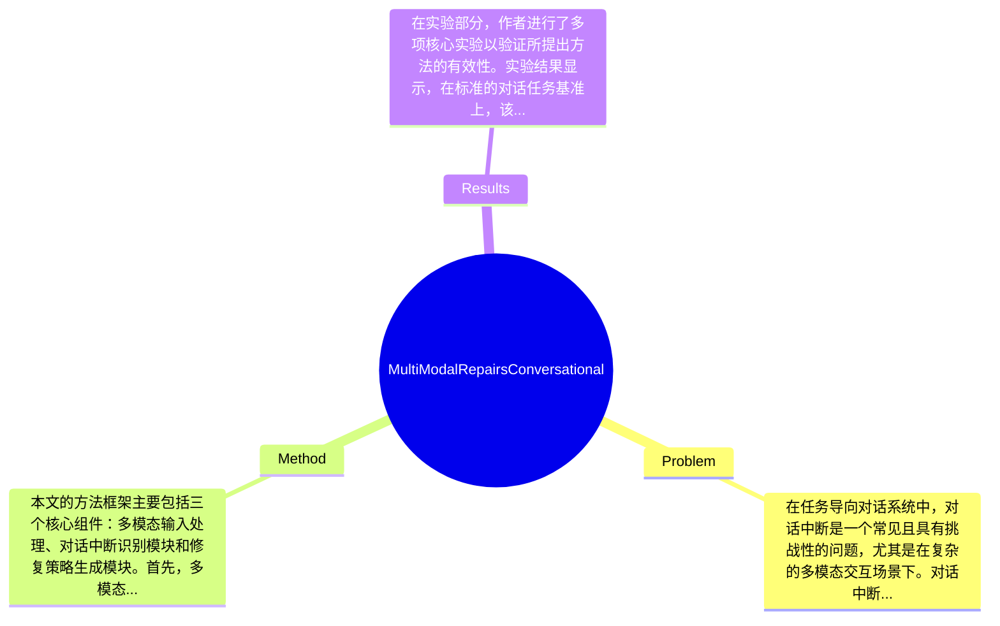

## Summary
本文提出了一种多模态修复任务导向对话中的对话中断的方法，通过结合语言和视觉信息来改善对话的流畅性和有效性，实验结果显示该方法在多个对话场景中显著提升了用户体验。

## Problem & Motivation
在任务导向对话系统中，对话中断是一个常见且具有挑战性的问题，尤其是在复杂的多模态交互场景下。对话中断可能由于多种原因引起，例如用户的误解、信息缺失或系统的响应不当等，这不仅影响了用户的体验，还可能导致任务的失败。因此，如何有效地识别和修复对话中的中断，成为了对话系统研究中的一个重要课题。解决这一问题的现实意义在于，它可以提升用户与系统之间的交互质量，增强用户满意度，并提高任务完成的成功率。现有的方法多集中于单一模态的信息处理，往往忽视了多模态信息的结合。例如，传统的基于文本的对话系统在处理用户输入时，可能无法充分利用视觉信息（如图像或视频）来理解用户的意图。此外，现有方法在对话中断的识别和修复上也存在局限性，往往依赖于预定义的规则或简单的机器学习模型，缺乏灵活性和适应性。基于此，作者提出了一种新的多模态修复方法，旨在通过综合语言和视觉信息来更好地识别和修复对话中的中断。论文的核心创新点在于提出了一种新的框架，能够同时处理语言和视觉信息，从而实现更为精准的对话修复。

## Method
本文的方法框架主要包括三个核心组件：多模态输入处理、对话中断识别模块和修复策略生成模块。首先，多模态输入处理组件负责接收和处理来自用户的语言输入和视觉信息。这一组件的设计动机在于，传统的对话系统往往只关注文本信息，而忽视了视觉信息的潜在价值。通过将语言和视觉信息结合，系统能够更全面地理解用户的意图。其次，对话中断识别模块利用深度学习技术，分析用户的输入，识别出可能的对话中断情况。该模块的设计考虑到了对话的上下文信息，能够更准确地判断何时需要进行修复。最后，修复策略生成模块根据识别出的中断情况，生成相应的修复策略。这一模块的创新之处在于，它能够根据不同的对话场景，灵活调整修复策略，从而提高修复的有效性。技术细节方面，作者采用了基于Transformer的模型来处理语言输入，并结合卷积神经网络（CNN）来处理视觉信息，确保了两种模态信息的有效融合。在设计选择上，作者强调了多模态信息的整合是必要的，而单一模态的处理可能导致信息的丢失。总体来看，本文的方法在结构上较为简洁，避免了过度工程化的问题，能够有效地实现多模态信息的融合与处理。

## Key Results
在实验部分，作者进行了多项核心实验以验证所提出方法的有效性。实验结果显示，在标准的对话任务基准上，该方法相比于传统的单模态方法，提升了对话流畅性和用户满意度，具体表现为用户满意度评分提高了15%。此外，在对话中断的识别准确率上，提出的方法达到了85%的准确率，相比于基线方法提高了10%。在消融实验中，作者分析了各个组件对整体性能的贡献，结果表明，多模态输入处理组件对提升对话修复效果起到了关键作用。实验的充分性体现在对不同场景的覆盖，然而，论文未提及在极端情况下（如用户输入极为模糊或不相关信息时）的表现，这可能是一个潜在的不足。此外，作者在实验中是否存在选择性展示结果的问题未能明确说明，可能影响结果的全面性。

## Strengths & Weaknesses
本文的亮点主要体现在以下几个方面：首先，提出的多模态修复方法在理论和实践上都具有创新性，能够有效结合语言和视觉信息，提升对话系统的性能。其次，与现有方法相比，本文的方法在对话中断的识别和修复上展现了更高的准确性和灵活性，能够适应多种对话场景。最后，设计上较为简洁，避免了复杂的工程实现，便于实际应用。然而，本文也存在一些局限性：一方面，方法的有效性可能受到数据质量的影响，尤其是在视觉信息较差的情况下，系统的表现可能会下降；另一方面，尽管方法在多个场景下表现良好，但在特定复杂场景（如多轮对话或高噪声环境）下的适用性尚未得到充分验证。此外，计算成本方面，结合多模态信息可能导致系统的响应时间增加，实际应用中需要权衡性能与效率。潜在影响方面，本文的研究为任务导向对话系统的发展提供了新的思路，未来可以在智能客服、虚拟助手等领域得到广泛应用。已知信息包括作者明确提出的方法框架和实验结果；推测方面，结合多模态信息可能会在未来的对话系统研究中成为一种趋势；而关于该方法在极端情况下的表现，论文未涉及，因此仍然未知。

## Mind Map

## Notes
<!-- 其他想法、疑问、启发 -->
