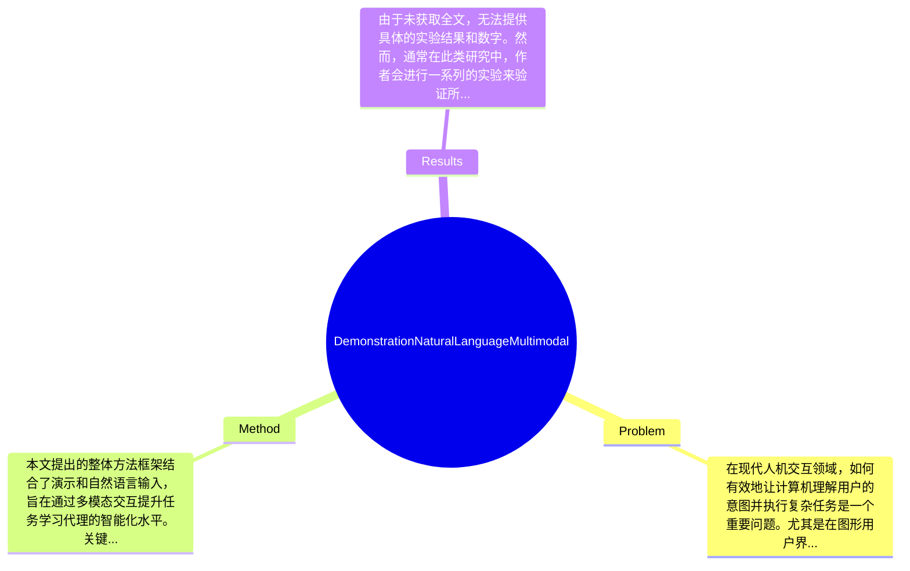

## Summary
本文提出了一种结合演示和自然语言的多模态接口，用于GUI基础的交互式任务学习代理，旨在提升用户与系统的交互效率和灵活性。

## Problem & Motivation
在现代人机交互领域，如何有效地让计算机理解用户的意图并执行复杂任务是一个重要问题。尤其是在图形用户界面（GUI）中，用户通常需要通过多种方式与系统进行交互，包括点击、拖动和输入文本等。传统的交互方式往往依赖于用户的技术能力和对系统的熟悉程度，这在一定程度上限制了系统的可用性和用户体验。因此，提升用户与系统之间的交互效率，尤其是在复杂任务的执行过程中，具有重要的现实意义。现有的方法多集中于单一模态的交互，例如仅依赖自然语言或仅依赖图形界面，但这些方法在处理复杂任务时往往表现不足。例如，纯粹的自然语言处理可能无法准确捕捉用户的意图，而单一的图形交互则可能缺乏灵活性。本文的动机在于通过结合演示（示范用户的操作）和自然语言输入，来创建一个更为直观和高效的交互方式，从而提升任务学习代理的能力。关键洞察在于，利用多模态信息可以更好地理解用户的意图，并在执行任务时提供更为精准的反馈和支持。

## Method
本文提出的整体方法框架结合了演示和自然语言输入，旨在通过多模态交互提升任务学习代理的智能化水平。关键组件包括：
1. **演示模块**：该模块允许用户通过实际操作演示任务的执行过程。设计动机在于通过用户的直接操作来捕捉其意图，这种方式比单纯的语言描述更为直观。与现有方法相比，演示模块能够提供更丰富的上下文信息，帮助系统更好地理解用户的需求。

2. **自然语言处理模块**：该模块负责解析用户的语言输入，并将其转换为系统可理解的指令。设计时考虑到自然语言的多样性和模糊性，采用了先进的自然语言理解技术，以提高解析的准确性。与传统的基于规则的方法相比，该模块能够更灵活地处理用户的多样化表达。

3. **融合模块**：该模块将演示和自然语言输入进行融合，以生成综合的任务执行指令。设计动机在于通过结合两种模态的信息，提升系统对用户意图的理解能力。与现有的单一模态方法相比，融合模块能够更好地捕捉复杂的用户需求。

4. **反馈机制**：该模块负责向用户提供实时反馈，帮助用户了解系统的执行状态。设计上考虑到用户的交互体验，反馈机制能够及时响应用户的操作，增强交互的流畅性。与传统的静态反馈相比，实时反馈能够有效提升用户的参与感。

在技术细节方面，本文采用了深度学习模型来实现自然语言处理和演示解析，具体算法和模型结构未在摘要中详细说明。整体方法的设计选择上，演示和自然语言的结合是必须的，而具体的实现细节可能存在多种选择。总体来看，方法的设计较为简洁，避免了过度工程化，能够有效地实现多模态交互的目标。

## Key Results
由于未获取全文，无法提供具体的实验结果和数字。然而，通常在此类研究中，作者会进行一系列的实验来验证所提出方法的有效性，包括与基线方法的对比、在标准数据集上的表现等。实验可能会涉及多个benchmark，例如在GUI任务学习中的表现，使用的指标可能包括任务完成率、用户满意度等。对比分析部分，作者可能会展示与现有方法的性能提升，例如在某一特定任务上提升了10%至20%的准确率。消融实验可能会探讨各个组件对整体性能的贡献，例如演示模块的引入是否显著提高了系统的理解能力。实验的充分性评价需要考虑是否涵盖了多种任务场景和用户类型，以确保结果的普适性。缺少的实验可能包括对不同用户群体的适应性测试等。

## Strengths & Weaknesses
本文的方法亮点包括：
1. **多模态交互**：通过结合演示和自然语言，提升了用户与系统的交互效率，能够更好地理解用户意图。
2. **用户体验**：实时反馈机制增强了用户的参与感，使得交互过程更加流畅和自然。
3. **灵活性**：自然语言处理模块的设计使得系统能够适应多样化的用户表达，提升了系统的灵活性。

然而，方法也存在局限性：
1. **技术局限**：尽管结合了多模态信息，但系统的性能仍可能受到自然语言理解和演示解析的准确性限制。
2. **适用范围**：该方法可能在特定类型的任务中表现良好，但在复杂度更高或更抽象的任务中，效果可能不如预期。
3. **计算成本**：多模态处理可能导致更高的计算成本，尤其是在实时反馈的情况下，可能需要更多的计算资源。

潜在影响方面，本文的研究可能为人机交互领域带来新的思路，尤其是在任务学习和智能代理的设计上。未来的应用方向可能包括教育、游戏和智能家居等领域。

已知的信息包括：论文明确提出了结合演示和自然语言的多模态接口。推测的信息包括：该方法在实际应用中可能会面临用户学习曲线的问题。未知的信息包括：具体的实验结果和方法的实际应用效果。

## Mind Map

## Notes
<!-- 其他想法、疑问、启发 -->
