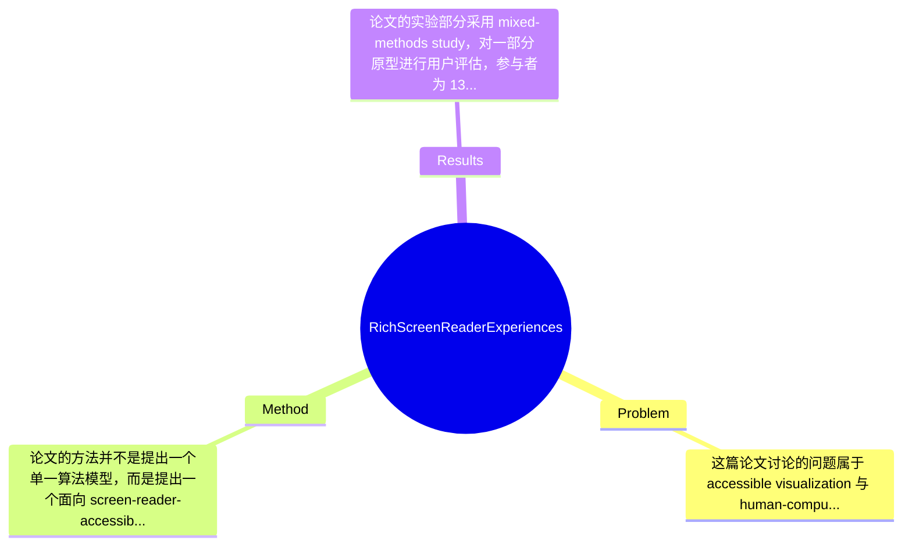

## Summary
该论文聚焦于“如何让盲人和低视力用户通过 screen reader 像视力用户使用交互式图表一样进行数据探索”这一可访问性问题，提出了一个基于 co-design 的设计框架，将可访问数据可视化拆解为 structure、navigation、description 三个核心维度，并据此实现多种可访问图表原型。作者在 13 名 blind and low vision 参与者上的 mixed-methods 研究表明，这些设计能帮助用户形成更强的空间概念、按不同粒度选择性探索数据，并提升分析过程中的控制感与自主性。

## Problem & Motivation
这篇论文讨论的问题属于 accessible visualization 与 human-computer interaction 的交叉领域，核心是：当前网页图表虽然在法律与标准层面被要求可访问，但对 screen reader 用户而言，大多数图表仍不可读、不可探索，或者只能以极其贫乏的形式被访问。问题的重要性很高，因为数据新闻、公共政策、金融、教育、医疗报告等大量关键信息都以图表形式传播；如果盲人和低视力用户只能获得简短 alt text 或原始数据表，他们实际上失去了图表最重要的价值——快速建立整体认知、比较局部模式、按兴趣深入探索。

论文明确指出现有方法至少有三类不足。第一，alt text 只能给出作者预设的摘要，用户无法自主 drill down，也无法验证作者的解释是否覆盖了自己关心的问题。第二，数据表虽然提供了底层数值，但其信息组织方式并不等价于图表：表格擅长精确查值，不擅长快速感知趋势、异常、群组关系与整体结构。第三，基于 ARIA 或线性朗读的做法虽然能让 screen reader 逐元素访问图表对象，但这种访问通常是单线性、逐项的，缺乏跳转、筛选、空间定位和层次化概览，导致交互负担很高，用户必须记忆先前听到的信息。

作者提出新方法的动机是合理且扎实的：既然研究表明 screen reader 用户与视力用户有相似的信息需求——先 overview，再 comparison，再 details-on-demand——那么非视觉可访问设计不应只停留在“把图表翻译成一句话或一张表”。论文的关键洞察在于：问题不只是“要不要提供描述”，而是要系统设计 screen reader 体验本身，包括信息如何组织、用户如何导航、系统如何叙述。也就是说，作者把可访问性从静态合规要求提升为一种可交互的信息体验设计问题，这一点是全文最有价值的 conceptual contribution。

## Method
论文的方法并不是提出一个单一算法模型，而是提出一个面向 screen-reader-accessible visualization 的设计框架，并通过 iterative co-design 将其具体化为一组可运行原型。整体框架可概括为：先从盲人与低视力用户的真实阅读需求出发，总结 screen reader 访问图表时的关键交互维度；再将这些维度组合到不同 chart type 的原型中；最后通过用户研究验证这些设计是否真的改善理解、探索效率与主观体验。其核心贡献更偏 design methodology 与 interaction design，而不是纯技术实现。

1. Structure 维度：定义“图表内容如何被组织成可遍历结构”
   该组件的作用是把原本视觉上同时呈现的图表元素，重组为 screen reader 可以顺序访问但又不失层次的结构。作者强调，screen reader 天然会把可视对象线性化，因此如果结构设计不好，用户只能被迫按作者设定的一条路径逐个听取内容。论文提出通过层次化组织图表实体，让用户能够在 overview、局部区域、具体数据点之间切换。其设计动机是尽量恢复视觉图表中的“结构感”和“空间感”，而不是把所有对象都平铺成一串标签。与现有单纯 ARIA 标注不同，这里关注的是结构语义，而不仅是对象可聚焦。

2. Navigation 维度：定义“用户可以执行哪些操作来穿行图表”
   这是论文最关键的交互设计部分之一。作者认为，图表阅读不仅是听描述，更是主动探索，因此需要支持多种 navigation 操作，例如结构性导航、空间性导航和目标导向导航。结构性导航可理解为在标题、轴、系列、数据点等层级之间移动；空间性导航试图让用户按图中的相对位置或邻接关系理解内容；目标导向导航则允许用户直接跳到特定类别、峰值、异常点或感兴趣区域。设计动机是让用户摆脱被动的线性朗读，获得类似视觉读图中的 skim、scan、compare 能力。相较已有方法，这里首次较系统地把“导航能力”作为可访问图表的基本组成部分，而非附加功能。

3. Description 维度：定义“系统说什么、怎么说、说多细”
   该组件负责 screen reader narration 的语义内容与粒度控制。论文指出，同一图表在不同任务下需要不同层级的描述：有时用户需要一句整体趋势概述，有时需要听某一组比较结果，有时又需要单个 datum 的精确值。因此 description 不应是固定的一段 alt text，而应包括内容选择、组合方式和 verbosity 控制。设计动机是平衡信息充分性与认知负担，避免要么过于简略、要么信息洪流。与传统 alt text 相比，这一设计更像“可交互叙述系统”。

4. Prototype operationalization：把三维设计空间映射为多种图表原型
   作者并不满足于提出概念，而是将上述三个维度 operationalize 到多种 chart types 上，覆盖不同设计组合。其价值在于证明这不是只适用于某一种图表的经验规则，而是一个可迁移的设计空间。论文提供的信息显示原型支持丰富的 screen reader 交互体验，但具体底层实现、前端框架、事件绑定机制、是否依赖特定 screen reader 或浏览器，摘要中未提及。

5. Co-design 与 mixed-method 评估闭环
   方法的另一重要组成部分是 iterative co-design，且共同设计中包含 blind researcher。这样做的作用是避免设计者从视觉优先视角出发做“替用户想象的可访问性”，而是直接让目标用户影响设计维度的形成。这个选择非常关键，因为论文不是在优化一个标准 benchmark，而是在定义“什么才算好的非视觉图表体验”。

从设计选择看，structure、navigation、description 三者中，前两者几乎是必须的，因为没有结构与导航，就无法形成真正的探索体验；description 的具体粒度和叙述方式则可能存在很多替代方案，例如更强的摘要生成、任务自适应 verbosity、甚至语音对话式 querying。整体上，这个方法相当简洁优雅：它没有堆叠复杂工程模块，而是提出一个解释力很强的三维框架。但也要看到，它的“简洁”更多是概念上的，真正落地到通用网页可视化工具链时，可能仍需不少工程工作。

## Key Results
论文的实验部分采用 mixed-methods study，对一部分原型进行用户评估，参与者为 13 名 blind and low vision readers。这一规模在可访问性 HCI 研究中并不算异常小，尤其考虑到目标用户招募难度，但如果从统计显著性和泛化能力角度看，样本仍然有限。作者报告的核心结论是：相较于传统的 basic non-visual alternatives，这些 richer screen reader experiences 能帮助用户更好地建立数据的空间概念、按不同粒度有选择地关注信息，并增强控制感与 agency。

需要特别指出的是，用户给出的全文摘录中并没有包含完整的 quantitative result tables，因此很多 benchmark 名称、具体任务指标、统计检验值、均值和方差“论文片段未提及”，不能捏造。可以明确写出的具体数字主要有两类。第一，作者自己的评估包含 13 位参与者。第二，论文在背景中引用了 Sharif et al. 的结果：screen reader 用户与图表交互时花费 211% 更多时间，且信息提取准确率低 61%；这不是本文方法的实验成绩，而是问题严重性的文献证据。

就 benchmark 而言，这篇工作不是典型 machine learning 论文，因此并不存在 ImageNet、GLUE 之类标准 benchmark。它的“benchmark”更准确地说是用户研究任务与原型图表集合。论文明确表示测试了一组 prototype，覆盖 diverse range of chart types，但具体哪些 chart types 被纳入正式实验、任务设置如何、评价指标是否包含 task completion time、accuracy、NASA-TLX、SUS 或 qualitative coding，当前提供内容未展开。

对比分析方面，论文的叙述显示其相对于 alt text、raw data tables 和线性 ARIA 遍历具有明显主观与行为优势，但具体提升百分比在给定文本中未提及。消融实验方面，也没有看到严格意义上对 structure、navigation、description 三个维度逐一去除的 ablation 数字结果，因此无法声称每一组件的独立贡献已被定量隔离。实验充分性上，这项工作对于提出设计框架而言是有说服力的，因为它结合了原型和真实用户；但若要进一步说服工程社区广泛采用，还缺少更大样本、跨 screen reader/浏览器环境、长时使用和更系统的任务型定量比较。就目前片段看，作者没有明显 cherry-picking 的证据，但由于只评估了“a subset of prototypes”，仍存在选择性展示较优设计组合的可能性。

## Strengths & Weaknesses
这篇论文的亮点首先在于它重新定义了 accessible chart 的目标：不是“让 screen reader 至少能读到点什么”，而是让非视觉用户也能进行层次化、可控的交互式数据探索。这一视角非常重要，因为它把可访问性从 compliance 问题推进到 experience design 问题。第二个亮点是提出 structure、navigation、description 三维框架，概念清晰、覆盖面强，也便于后续研究者复用为分析工具或设计 checklist。第三个亮点是采用 iterative co-design，并让 blind researcher 深度参与，这在可访问性研究中比“替用户设计”更可信，也减少了视力正常研究者将视觉逻辑简单映射到音频界面的风险。

局限性同样明显。第一，技术上它更像 design space 与 prototype paper，而不是可直接部署的通用系统。论文展示了“应该如何设计”，但对如何大规模集成到现有 visualization libraries、CMS、新闻生产流程中的工程路径，给定内容中并不充分。第二，适用范围可能受图表复杂度限制。对于简单 bar chart、line chart，层次结构与导航设计较直观；但面对高维、密集、动态交互或多视图 linked visualization，这套框架如何扩展，论文片段未充分说明。第三，认知负担仍可能是潜在问题。丰富导航与多粒度描述虽然提升自主性，但也可能引入命令学习成本、操作复杂度和更长的初始上手时间，尤其对不同 screen reader 熟练度用户未必同样有效。

潜在影响方面，这项工作对 accessible visualization、web accessibility、screen reader interaction 乃至数据新闻工具链都有启发意义。它可能推动 future work 研究自动生成层次结构、任务自适应 narration、与 sonification/haptics 的结合，甚至进入浏览器或可视化库标准。

严格区分信息来源：已知：论文提出三个设计维度，构建了多种 prototype，并在 13 名 blind and low vision 用户上进行 mixed-methods 评估，发现用户在空间理解、粒度切换与 agency 上受益。推测：若与自动摘要生成、LLM-based chart narration 结合，该框架可能成为更强的人机协同接口；同时，其设计对教育、新闻和公共信息可视化尤为有价值。不了解/论文未提及：具体实现栈、各原型定量成绩、跨设备兼容性、长期学习曲线、不同 screen reader 软件之间的差异表现、维护成本与部署成本。

## Mind Map

## Notes
<!-- 其他想法、疑问、启发 -->
