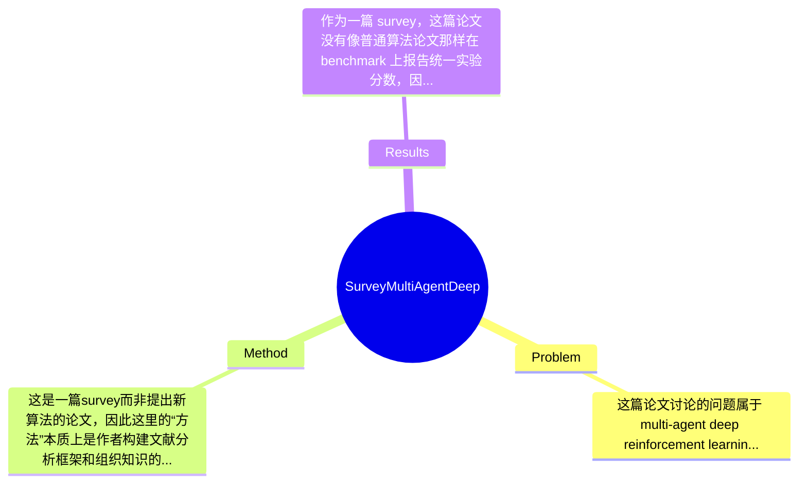

## Summary
该论文针对带通信的多智能体深度强化学习（Comm-MADRL）研究缺乏统一分类框架的问题，提出了一个面向通信设计空间的9维分析框架，对现有工作进行系统梳理、映射与比较，并总结研究趋势及未来方向。其主要贡献不是提出新的学习算法，而是将分散的通信机制、任务设定、训练范式和消息设计放入统一坐标系中，从而帮助研究者更清晰地理解该领域的方法谱系与空白区域。作为survey，它的效果体现在知识组织、问题结构化和未来研究议程设定上，而非具体benchmark上的SOTA性能提升。

## Problem & Motivation
这篇论文讨论的问题属于 multi-agent deep reinforcement learning 与 communication 的交叉领域，核心关注点是：在部分可观测、动态且多主体相互影响的环境中，多个智能体如何通过通信提升协作、竞争或混合博弈中的决策能力。这个问题之所以重要，是因为现实中的自动驾驶、机器人协作、传感网络、交通调度、游戏AI等系统几乎都具有分布式观测、局部决策和多主体耦合的特征；如果没有有效通信，智能体往往只能依据局部信息行动，导致协作失败、样本效率低、策略不稳定甚至整体系统性能塌缩。论文抓住了 Comm-MADRL 的一个关键现实痛点：相关研究近年来快速增长，但不同工作对“通信”的定义、消息形式、拓扑结构、训练方式、接收对象和约束条件都差异极大，导致研究者很难横向比较方法，也难以看清哪些设计选择真正重要。

现有方法的局限主要体现在三点。第一，早期 survey 往往把 communication 当作预定义模块，而不是需要学习、比较和结构化分析的对象，因此无法覆盖 emergent communication、learned topology、selective messaging 等新方向。第二，已有 Comm-MADRL 论文大多围绕单一任务或单一机制展开，例如只研究 differentiable communication 或只研究 CTDE setting，缺乏跨任务、跨机制的统一视角。第三，领域内术语和分类不一致：有些工作按 cooperative/competitive 分，有些按 centralized/decentralized 分，有些按 message type 分，结果是方法之间看似相近但本质设计不同，或者看似不同但共享核心假设。

作者提出新survey的动机总体是合理的：他们并不是简单罗列论文，而是试图建立一套可复用的多维分类坐标系，用来分析、开发和比较 Comm-MADRL 方法。论文的关键洞察在于，通信相关方法不能只按“是否通信”二分，而应从任务类型、通信约束、通信对象、通信策略、消息内容、消息聚合、与RL模块的集成位置、学习方法、训练方案等多个维度联合刻画。这个视角的价值在于，它把“方法设计”从单点技巧提升为“设计空间探索”问题，也更容易揭示领域中的研究偏好与空白组合。

## Method
这是一篇survey而非提出新算法的论文，因此这里的“方法”本质上是作者构建文献分析框架和组织知识的方式。整体架构可以概括为：先给出 MARL 与 communication 的背景，再聚焦“learning tasks with communication in MADRL”这一子领域，随后提出一个9维分类框架，将已有代表性工作投射到这一多维空间中，最后据此总结经验规律、讨论缺口并提出未来研究方向。其核心不是公式推导，而是建立一套结构化元框架（meta-framework），使不同通信型 MADRL 方法能够在统一参照系中被比较。

关键组件可分为以下几部分：

1. 任务维度（Learning Tasks）
   该维度用于区分方法所处理的是 cooperative、competitive 还是 mixed setting，以及目标驱动类型如 controlled goal 等。它的作用是把“通信是否有用”放回任务语境中分析，因为通信价值高度依赖任务耦合强度与利益一致性。设计动机是：同一种通信机制在纯合作任务中可能有效，但在竞争任务中可能带来信息泄露或战略操控问题。与许多仅关注 cooperative MARL 的综述相比，这种任务维度显式保留了不同博弈结构的差异。

2. 通信约束与通信对象维度（Communication Constraints / Communicatee Type）
   论文区分 unconstrained communication 与 constrained communication，同时讨论消息发给全部 agents、特定 agent groups，甚至发给 proxy 的情况。这个组件的作用是刻画现实系统中带宽、时延、可达性和拓扑限制。设计动机很明确：真实多智能体系统几乎不可能无限制广播，而通信成本会改变最优策略结构。与早期默认全连接、全时通信的方法相比，这里强调 selective、sparse、structured communication 的重要性。这个维度对理解 learned routing、graph-based communication、bandwidth-aware MARL 特别关键。

3. 通信策略与消息内容维度（Communication Policy / Communicated Messages）
   论文将通信策略细分为 full communication、partial structure、individual control、global control，并区分消息内容是 existing knowledge 还是 imagined future knowledge。前者关注“谁何时与谁通信”，后者关注“通信什么”。该组件的作用是把通信决策从动作决策中剥离出来单独分析。设计动机在于：很多方法性能差异并不来自 backbone，而来自消息选择与调度机制。例如发送原始 observation、latent feature、intention、belief、predicted future trajectory，本质上对应不同的信息瓶颈和归纳偏置。与仅把消息当作隐向量拼接的工作相比，这种分类更能揭示通信语义层次。

4. 消息组合与内部集成维度（Message Combination / Inner Integration）
   论文进一步讨论多条消息如何被 equally valued 或 unequally valued 地融合，以及通信信息是在 policy-level、value-level 还是 policy- and value-level 集成。其作用是捕捉消息聚合机制与RL核心模块的耦合方式。设计动机是：即使消息相同，不同 aggregation 方式（如简单平均、attention-style weighting、结构化融合）会显著改变 credit assignment 与稳定性；同样，接入 actor、critic 或二者都会对应不同训练信号与偏差来源。与只区分 actor-critic/value-based 大类的整理方式相比，这一维度更细，适合比较 differentiable communication 与 critic-side centralized modules 的差异。

5. 学习方法与训练方案维度（Learning Methods / Training Schemes）
   论文将学习方法概括为 differentiable、supervised、reinforced、regularized，并将训练方案分为 centralized learning、fully decentralized learning、CTDE。该组件的作用是给通信机制的可训练性和部署假设一个统一描述。设计动机在于：通信既可以端到端反向传播学习，也可以通过离散动作、额外监督信号、正则化项或混合目标学习，而不同训练范式决定了方法的稳定性、可扩展性和现实可部署性。与一些survey把“communication architecture”和“MARL algorithm”分开处理不同，这篇论文明确强调两者是强耦合的。

从技术细节上看，论文没有提出新的算法公式，而是采用文献归纳、分类映射和趋势总结的方法；其“技术性”主要在分类粒度设计是否足够正交、是否能覆盖主流方法、以及能否支持未来组合式设计。必须的设计选择是多维而非单维分类，因为单维度无法表达通信方法的组合属性；但9维是否最优则未必，完全可能存在其他组织方式，如按 message semantics、topology learning、temporal abstraction、differentiability 等重排。总体上，这个框架相对简洁且有一定优雅性，因为它避免了为每篇论文发明新标签；但也有轻微过度离散化风险：一些维度之间并不完全独立，某些方法可能同时跨越多个类别，导致边界模糊。

## Key Results
作为一篇 survey，这篇论文没有像普通算法论文那样在 benchmark 上报告统一实验分数，因此严格来说不存在“本文方法在某 benchmark 上达到多少回报”的结果。它的主要结果体现在三类输出：第一，对 Comm-MADRL 文献提出9个分析维度；第二，将已有工作映射到该多维空间并识别研究趋势；第三，基于空白组合提出未来研究方向，例如 multimodal communication、structural communication、robust centralized unit、learning tasks with emergent language 等。从你提供的全文摘录和摘要来看，论文并未给出统一的定量 benchmark 汇总表中的具体数字，因此诸如 win rate、average return、sample efficiency 提升百分比等具体数值，论文在当前提供内容中“未提及”。

如果从“survey结果”角度理解，其核心发现包括：现有研究主要集中在学习任务中的通信设计，而不是预定义固定协议；多数方法仍偏向 cooperative setting；训练上大量工作采用 centralized training and decentralized execution（CTDE）；在消息设计上，发送已有知识比发送 imagined future knowledge 更常见；在通信策略上，full communication 或较强的集中式辅助结构仍然占主流。这些都是定性趋势，不是 benchmark score。

因此，若按算法论文标准评价实验充分性，这篇论文天然不具备统一实验验证，因为它不是提出模型并做对比实验的工作。它也没有传统意义上的 ablation study，例如去掉某个模块后性能下降多少。其“充分性”更多取决于文献覆盖面、分类是否清晰、案例选取是否有代表性。批判性地看，这类survey容易存在选择性引用风险：如果作者对某些子方向（如 differentiable communication、CTDE）覆盖更多，而对 symbolic communication、language grounding、competitive communication 关注较少，就会塑造一种带偏差的领域图景。基于当前提供文本，我不能确认作者是否存在明显 cherry-picking，但可以确定的是：论文展示的主要是趋势性结论，而非可重复的统一数值对比；缺少系统的 meta-analysis、缺少标准化 benchmark 汇总，是它在“结果”层面的一个明显边界。

## Strengths & Weaknesses
这篇论文的亮点首先在于结构化能力强。相较于简单按时间线罗列论文，它提出了9维分析框架，把任务、消息、通信对象、融合方式、学习方法和训练方案放在一个统一设计空间中，这对读者理解 Comm-MADRL 的方法谱系非常有帮助。第二个亮点是它把 communication 视为一个可设计、可学习、可约束的核心变量，而不是 MARL 中附属的小模块，因此能更好地连接现实问题中的带宽、拓扑和部分可观测性约束。第三个亮点是它不仅总结现状，还尝试从维度组合中提出未来研究方向，这比单纯“列open problems”更有建设性。

局限性也比较明显。第一，作为survey，它提出的是分类框架而不是可验证理论，因此其价值高度依赖分类是否合理；但9个维度之间并非完全正交，某些类别边界模糊，实际标注可能带有主观性。第二，论文强调“learning tasks with communication”，这让它对 broader communication in MARL 的覆盖可能不够全面，例如更偏 symbolic communication、theory-heavy emergent language、或者非深度方法的讨论可能不足。第三，它缺乏严格的定量 meta-analysis，没有建立统一 benchmark、统一指标和统一实验协议来验证“哪些通信设计普遍更好”，因此其结论更多是观察性而非因果性的。

潜在影响方面，这篇论文对新入门研究者和准备选题的人很有价值，因为它提供了一张相对清晰的地图，帮助识别研究空白，例如 multimodal、structural、robust centralized unit 等方向。对资深研究者而言，它的直接技术增量有限，但在组织文献和形成研究议程方面仍有参考意义。

已知：论文明确提出9维框架，讨论 Comm-MADRL 趋势，并给出若干未来方向。推测：作者希望借由多维分类促进标准化比较，并推动从“算法堆叠”转向“设计空间探索”；但这一点论文是否真正改变社区实践，尚未被文中证实。不知道：论文未提及统一系统性检索协议、是否穷尽主要文献、各维度标注一致性如何、以及不同分类选择对研究结论有多敏感。

## Mind Map

## Notes
<!-- 其他想法、疑问、启发 -->
