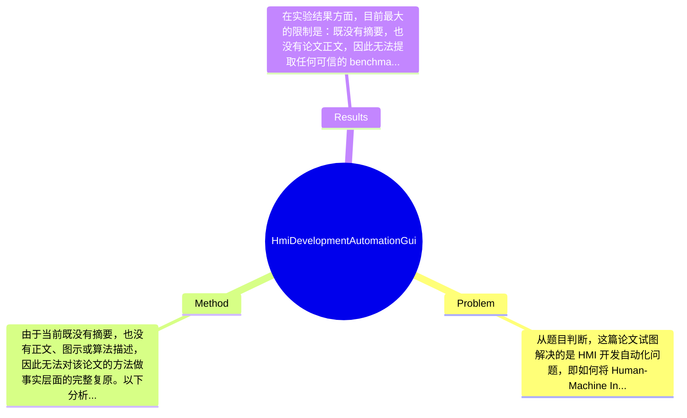

## Summary
论文题目表明其关注 HMI（Human-Machine Interface）开发自动化问题，尝试借助 GUI elements 与面向对象编程语言实现机制来提升界面开发效率与规范化程度；但由于当前未获取论文摘要与全文，无法确认其具体方法结构、实验设置及最终效果。基于题目可推断，这是一项面向工业软件工程与界面生成自动化的应用型研究，但具体贡献边界论文未提及。

## Problem & Motivation
从题目判断，这篇论文试图解决的是 HMI 开发自动化问题，即如何将 Human-Machine Interface 的设计与实现过程，从传统的手工编码、界面拼接或设备端逐项配置，转化为更加自动化、可复用、可维护的软件工程流程。这个问题属于工业软件开发、人机交互系统设计以及软件工程自动化的交叉领域。在工业控制、嵌入式系统、制造执行系统、医疗设备、车载系统等场景中，HMI 往往承担操作入口、状态展示、报警提示与参数配置等职责，因此其开发效率、稳定性与一致性具有很高现实价值。如果能实现基于 GUI elements 的自动化开发，不仅可以减少重复劳动，还可能降低人为编码错误，并提升跨项目迁移能力。

从现实意义看，HMI 开发常面临几个痛点：第一，不同设备或平台之间界面实现差异大，开发者需要反复编写样板代码；第二，界面元素与底层业务逻辑耦合严重，维护成本高；第三，很多工业场景仍依赖特定 IDE、专有脚本或平台绑定工具，难以实现真正的软件资产复用。因此，一个面向 object-oriented programming languages 的实现方案，如果能够把 GUI 元素抽象为类、对象、组件或模板，就有潜力提升可扩展性与工程规范性。

但现有方法可能存在若干局限。其一，传统可视化界面编辑器通常更偏向拖拽式配置，生成代码可读性差，后续手工维护困难。其二，纯手工面向对象实现虽然灵活，但开发速度慢，对团队工程规范要求高。其三，许多自动化工具依赖特定平台或运行时，缺乏跨语言、跨框架适配能力。基于这些问题，作者提出新方法的动机在逻辑上是合理的：希望将 GUI elements 与面向对象语言特性结合，建立更系统的 HMI 自动生成或半自动实现机制。

不过必须强调，以上判断大多来自题目而非论文正文。论文的关键洞察很可能是：通过将 HMI 的可视元素对象化、模块化与模板化，可以把界面开发从“逐页面编码”转变为“按组件装配与生成”。这一动机具有工程合理性，但其创新程度、是否真正超越现有 GUI builder、以及是否提供可复现的自动化流程，论文未提及。

## Method
由于当前既没有摘要，也没有正文、图示或算法描述，因此无法对该论文的方法做事实层面的完整复原。以下分析严格基于题目“ HMI Development Automation with GUI Elements for Object-Oriented Programming Languages Implementation ”进行结构化推断，并明确区分哪些是已知、哪些是合理猜测。已知信息只有：论文聚焦 HMI development automation，核心手段涉及 GUI elements，并且落脚到 object-oriented programming languages implementation。由此可推测，其方法可能是一个围绕 GUI 元素抽象、代码生成与面向对象封装展开的工程框架。

**整体架构**：从题目推断，整体方法大概率包含三层：第一层是 HMI 界面需求或界面元素描述层，用于定义按钮、文本框、指示器、图表、菜单等 GUI components；第二层是自动化映射或转换层，将这些 GUI elements 映射为面向对象语言中的类、对象、属性和事件处理逻辑；第三层是最终实现层，在某种 OOP language（如 Java、C#、C++、可能还包括 Python 的 GUI framework）中生成可运行或可扩展的 HMI 程序框架。若此推断成立，那么这篇论文的方法并非单纯提出一个新模型，而更像是软件工程意义上的开发流程自动化机制。

**关键组件**：

1. **GUI elements 抽象层**
   - 作用：将 HMI 中的可视化控件统一抽象成标准化元素，便于后续自动生成代码。
   - 设计动机：HMI 开发中的重复性很大，不同页面经常复用类似控件。如果缺乏统一抽象，每个项目都需要从头实现。
   - 与现有方法区别：传统 GUI builder 偏重界面布局，而这里若强调“面向对象语言实现”，则重点可能在于把界面元素转换为可维护的软件对象，而不仅是静态布局。
   - 论文未提及：具体抽象方式、元模型定义、是否采用 XML/JSON/DSL 描述。

2. **对象化封装机制**
   - 作用：把 GUI 元素表示为类与对象，使其具备属性、方法、事件与继承关系，支持复用和扩展。
   - 设计动机：面向对象的优势在于封装、继承、多态。如果作者强调 object-oriented programming languages implementation，那么很可能希望每种 GUI 元素都有明确的软件对象表示。
   - 与现有方法区别：相比脚本式或过程式界面实现，对象化封装更利于复杂 HMI 系统的长期维护。
   - 论文未提及：是否支持继承层次、事件委托、MVC/MVVM 等设计模式。

3. **自动代码生成或模板生成模块**
   - 作用：根据界面元素描述自动生成类定义、布局代码、事件绑定代码，减少手工编程。
   - 设计动机：自动化是论文题目中的关键词。如果没有代码生成，仅仅是封装组件，称不上“development automation”。
   - 与现有方法区别：可能不只是生成 UI skeleton，还包括与业务逻辑接口的对接。
   - 论文未提及：生成的是完整代码、半成品模板，还是某种中间表示；也未说明支持何种语言。

4. **事件与交互逻辑绑定机制**
   - 作用：HMI 不仅展示信息，更涉及用户交互，因此按钮点击、数据更新、报警触发、状态切换等逻辑需要绑定到对象方法或回调上。
   - 设计动机：如果自动化只覆盖静态布局而不覆盖事件逻辑，实际价值会很有限。
   - 与现有方法区别：可能尝试把交互规则也模板化，从而减少业务界面之间的重复编码。
   - 论文未提及：是否支持状态机、数据绑定、异步更新等复杂机制。

5. **跨项目复用或模块库**
   - 作用：将常见 HMI 模块积累为可复用组件库，用于快速搭建新系统。
   - 设计动机：工业 HMI 往往具有高度模板化特征，复用是自动化价值的重要来源。
   - 与现有方法区别：若作者构建了领域组件库，其贡献可能偏工程平台而不是单一算法。
   - 论文未提及：组件库规模、适用行业、定制化能力。

**技术细节**：很遗憾，论文未提供任何可用内容，因此无法确认是否使用模型驱动开发（MDD）、领域特定语言（DSL）、UML 类图映射、代码模板引擎、反射机制或特定 GUI framework。也无法判断它是桌面 HMI、Web HMI，还是工业组态环境。训练策略、模型结构等通常适用于机器学习论文，而从题目看，这篇论文更像传统软件工程或系统实现论文，因此可能并不存在“训练”这一环节。

**设计选择**：从软件工程角度看，真正“必须”的设计可能是 GUI 元素标准化描述和面向对象映射机制；否则自动化难以成立。至于使用哪种实现语言、是否采用代码生成器、是否采用可视化编辑器辅助，则可能属于可替代设计。比如同样目标既可用模板驱动生成，也可用运行时反射或 declarative UI 框架实现。

**简洁性评价**：由于缺乏正文，无法判断该方法是简洁优雅还是过度工程化。若其核心只是“将界面控件封装为类并自动生成代码”，那么想法在工程上直接有效，但理论创新可能有限；若它进一步提出可扩展的元模型、统一事件机制和跨语言映射框架，则会更完整。总体而言，目前只能判断其潜在价值偏工程实践，而非算法突破。这一部分存在高度不确定性，论文未提及的细节不能臆造。

## Key Results
在实验结果方面，目前最大的限制是：既没有摘要，也没有论文正文，因此无法提取任何可信的 benchmark 名称、评价指标、对比方法或具体数值。按照用户要求，本部分需要包含具体数字和 benchmark，但基于现有材料，这些信息均“论文未提及”或“当前不可获得”，不能捏造。因此以下内容只能做批判性结果分析框架，而不能声称是真实实验结论。

如果这篇论文是典型的软件工程/工程应用型研究，那么它可能会报告以下几类结果：第一，开发效率提升，例如开发时间缩短多少百分比；第二，代码规模变化，例如自动生成后人工代码量减少多少；第三，系统维护性指标，如模块复用率、缺陷数量、修改成本；第四，运行效果展示，例如某个 HMI 原型系统成功部署到特定工业场景。然而，这些都只是合理推测，并非论文已知事实。

**主要实验**：论文未提及。无法确认作者是否构建了原型系统，是否与传统手工开发流程比较，也无法确认是否有用户研究、案例研究或性能测试。

**Benchmark 详情**：论文未提及。此类工作通常不一定使用标准 benchmark，更可能采用 case study 或工程项目验证。如果作者仅展示单个案例而无统一基准，那么其说服力会弱于算法论文中的公开数据集对比。

**对比分析**：论文未提及。无法知道其 baseline 是手工编码、现有 HMI tool，还是某种 GUI framework。也无法计算具体提升百分比。

**消融实验**：论文未提及。如果论文提出了多个组件（如 GUI 抽象、代码生成、对象封装、事件模板），理想情况下应通过 ablation 说明每个组件的独立贡献。但对于工程实现论文，这类消融常常缺失。

**实验充分性评价**：从当前信息看，实验充分性无法判断，但可以指出潜在风险。如果论文只展示“成功实现了一个系统”，而没有量化比较，那么其证据力度较弱；如果没有跨平台、跨语言或跨场景验证，则很难证明方法具有广泛适用性；如果没有开发者使用反馈或维护成本分析，也无法充分支持“automation”的实际工程价值。

**是否有 cherry-picking**：无法判断。若未来拿到全文，需要重点检查作者是否只展示适合组件化建模的规则型 HMI 页面，而回避复杂动态交互、非标准控件、跨线程事件同步等难例。总之，目前结果层面的可信结论只能是：证据不足，无法基于现有材料确认论文效果。

## Strengths & Weaknesses
尽管缺乏摘要与全文，这篇论文从题目上仍显露出一定研究价值，尤其是在工业软件开发自动化方向。下面的评价严格区分已知、推测与不知道。

**方法亮点**：
第一，题目所体现的“GUI elements + object-oriented programming languages”结合具有明确工程导向。已知的是，作者聚焦 HMI 开发自动化；推测来看，这种思路能够把界面开发从低层重复编码提升到组件复用与对象封装层面，这是软件工程上较有实用性的方向。
第二，若论文确实实现了 GUI 元素到 OOP 代码的自动映射，那么它的亮点在于把人机界面设计与程序实现桥接起来。相比单纯的拖拽式设计器，这种方式可能更利于维护、版本管理和团队协作。
第三，如果作者提供了可复用组件库或模板系统，那么其优雅之处在于将工业 HMI 的高重复性转化为标准化开发资产。不过这一点只是推测，论文未提及。

**局限性**：
第一，技术局限可能在于适用边界。推测这类方法更适合结构规则、组件明确、交互逻辑相对标准化的 HMI；对于高度定制化、复杂动画、实时多线程交互或跨平台响应式 UI，自动生成方案往往容易失去灵活性。论文未提及其边界条件。
第二，创新性风险较高。仅从题目看，这项工作可能更偏工程整合，而非提出全新理论或通用框架。如果它只是把已有 GUI builder 思路迁移到 OOP 语言封装层，那么学术新颖性可能有限。是否如此，论文未提及。
第三，计算成本不是主要问题，但工程成本可能不低。若需要先建立完整的 GUI 元素元模型、模板引擎和组件库，前期投入会较大；如果系统依赖特定语言或平台，其复用性又会受限。这是合理推断，不是论文明示结论。

**潜在影响**：若方法有效，它可能对工业控制界面、嵌入式设备前端、监控系统面板、教育软件界面原型开发等方向有帮助，特别适合强调稳定性、规范性与复用性的工程团队。

**已知 / 推测 / 不知道**：
- 已知：论文主题是 HMI 开发自动化，涉及 GUI elements 与面向对象编程语言实现；发表于 2022 年期刊。
- 推测：方法可能基于 GUI 组件抽象、对象封装和代码自动生成；主要价值可能在于提升开发效率与复用性。
- 不知道：具体算法/流程、支持的编程语言、实验数据、对比 baseline、案例规模、失败场景、资源消耗、可复现性。这些关键信息都需要摘要或全文支持。

综合看，这篇论文在选题上有应用价值，但在证据缺失的情况下，无法判断其是否真正提出了可推广的方法论，还是一次局部工程实现展示。

## Mind Map

## Notes
<!-- 其他想法、疑问、启发 -->
