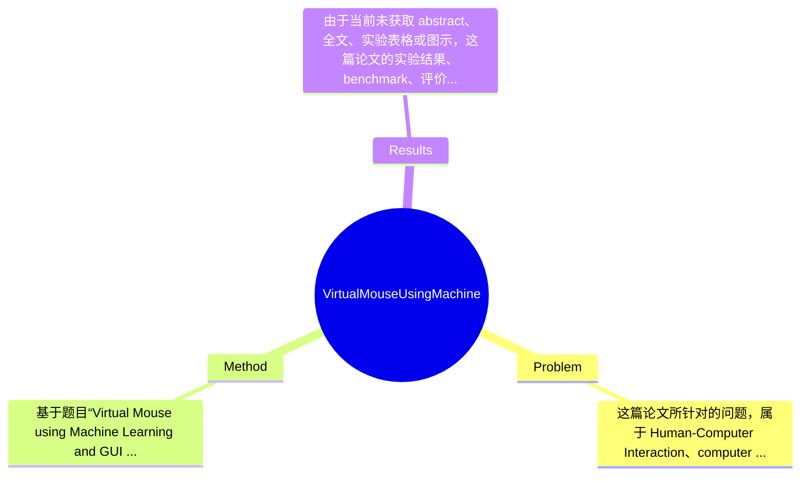

## Summary
论文题目显示其目标是利用 Machine Learning 与 GUI automation 实现“虚拟鼠标”，即通过视觉或手势交互替代传统物理鼠标完成指针控制与点击操作；从题名可推测方法可能结合摄像头输入、手部/指尖检测与系统级鼠标事件映射；但由于当前未提供 abstract 或全文，具体模型、实验设置与效果数据均无法确认，因此只能给出基于题目层面的审慎分析。

## Problem & Motivation
这篇论文所针对的问题，属于 Human-Computer Interaction、computer vision 与 assistive computing 的交叉领域，核心任务是让用户无需实体鼠标，而通过摄像头捕捉的手势、手部位置或指尖动作，完成屏幕光标移动、点击、拖拽等 GUI 控制。这个问题的重要性体现在两个层面：其一，它是自然人机交互的重要方向，能降低对传统输入外设的依赖；其二，它对行动受限用户、无接触交互场景、低成本替代输入设备等应用具有现实价值，例如医疗环境、公共终端、教学演示、AR/VR 过渡式桌面交互等。

从现有方法看，传统替代方案通常包括基于颜色标记追踪、基于固定阈值的轮廓提取、以及基于硬件传感器的体感控制。它们各有明确局限。第一，颜色标记或手套方案往往依赖外部辅助物体，对光照变化和背景干扰敏感，泛化性差。第二，纯规则式图像处理方法通常要求固定姿态、固定距离或干净背景，一旦用户手型多样、摄像头视角变化、遮挡增加，鲁棒性会快速下降。第三，专用硬件方案虽然可能更稳定，但成本更高、部署更复杂，不利于普及。正因如此，作者提出将 Machine Learning 与 GUI automation 结合是有合理动机的：前者用于更稳健地识别手势或手部关键点，后者把识别结果转化为系统级鼠标事件，实现从“看懂动作”到“控制界面”的闭环。

就关键洞察而言，论文题目暗示其核心想法不是单纯做 gesture recognition，而是将视觉理解与实际操作系统控制耦合起来，直接面向可用性而非仅面向分类精度。这一点在应用型论文中是成立且有意义的。不过需要强调：由于未获得摘要或正文，上述分析中关于视觉输入、手势识别和控制映射的细节均属基于题目和该类工作常见范式的合理推测，不能视为论文已明确证明的事实。

## Method
基于题目“Virtual Mouse using Machine Learning and GUI Automation”，可以较为谨慎地推断，该方法的整体框架大概率是：首先通过普通摄像头采集用户手部视频流；随后利用某种 Machine Learning 模型或 hand-tracking 模块从图像中提取手部位置、关键点或手势类别；再把这些中间表征映射为鼠标控制信号，例如光标移动、左键单击、右键单击、滚动或拖拽；最后借助 GUI automation 工具向操作系统发送鼠标事件，从而实现虚拟鼠标功能。这个流程体现的是“感知—理解—动作执行”三阶段架构，重点不只是识别精度，还包括交互的实时性、稳定性和可操作性。

可以将其可能的核心组件拆成以下几部分进行分析：

1. 视频采集与预处理模块
该组件的作用是从 webcam 获取实时视频帧，并进行必要预处理，如 resize、颜色空间转换、镜像翻转、去噪或 ROI 裁剪。这样设计的动机很直接：原始视频通常包含背景噪声、分辨率冗余和光照扰动，如果直接送入后续识别模块，既会增加计算量，也会降低检测稳定性。与早期依赖固定背景减除的方法相比，若论文确实使用了 Machine Learning，则预处理可能更偏向提高输入一致性，而不是完全依赖手工阈值规则。该模块通常是实时系统的基础，因为输入帧率直接影响鼠标控制流畅度。

2. 手部/指尖检测或关键点估计模块
这是整个系统最核心的感知组件。其作用是确定手在图像中的位置，并进一步识别掌心、指尖或多指关键点，用于推断当前交互意图。设计动机在于，单纯使用整只手的边界框难以支撑精细控制，而鼠标交互需要更细粒度的空间信息，尤其是指尖位置或手势结构。若论文采用的是常见的 hand landmark 方法，那么它与传统 contour-based 方法的差异就在于：它不再依赖脆弱的轮廓启发式，而是试图用学习到的特征更稳定地建模手部结构。不过由于论文未提供正文，具体是分类模型、检测模型、MediaPipe 类工具，还是自训练网络，均无法确认。

3. 手势语义解释与控制映射模块
这一模块负责把视觉层面的观测转化为交互命令。例如，单指伸出可能表示移动鼠标，两指并拢可能表示点击，特定捏合动作可能触发拖拽或滚轮。该设计的动机是将连续空间信号与离散系统操作对齐，这也是虚拟鼠标能否“可用”的关键。与单纯 gesture recognition 论文不同，这里不是只输出一个类别标签，而是要设计一套交互协议，使不同动作之间尽量可区分、低误触、易学习。若没有良好的动作—命令映射，即使识别模型本身准确，也难以形成稳定用户体验。

4. 坐标映射与平滑控制模块
如果系统将摄像头中的手部位置直接映射到屏幕坐标，就会面临比例不一致、边界抖动、微小噪声放大等问题。因此通常需要进行坐标归一化、工作空间到屏幕空间的线性或非线性映射，以及 temporal smoothing。其作用是让光标移动既足够灵敏，又不至于过度跳动。设计动机在于，视觉检测的误差在 GUI 控制中会被用户直接感知，所以比一般识别任务更强调时序稳定性。与仅追求逐帧检测准确率的研究不同，虚拟鼠标更关心 end-to-end 可操作性，这类平滑和滞回机制往往是实用系统不可或缺的。

5. GUI automation 执行模块
该组件把识别得到的高层命令转为实际鼠标事件，如 moveTo、click、doubleClick、scroll 等。其价值在于打通算法与操作系统之间的最后一公里。如果没有这一层，系统最多只是一个手势识别 demo，而不能真正替代鼠标。设计上，GUI automation 一般依赖现成软件库，优点是实现简单、跨应用兼容较好；不足是系统延迟、权限限制以及不同平台兼容性问题可能较突出。与端到端硬件模拟设备相比，这种方案更轻量，但软件栈更依赖操作系统环境。

从技术细节和设计选择角度看，这类方法中“必须的设计”通常包括：实时视频处理、稳定的手部定位、明确的手势到鼠标命令映射、以及抖动抑制；而“可替代设计”则包括：使用哪种 ML 模型、是做关键点检测还是直接做 gesture classification、是规则式点击判定还是序列模型判定、以及 GUI automation 采用何种库。就简洁性而言，如果论文只是采用现成 hand-tracking + 简单规则映射 + GUI automation，那么方法可能相对简洁、偏工程实现；如果作者自建复杂模型但未显著提升交互体验，则可能显得过度工程化。遗憾的是，在缺少 abstract 和正文的情况下，我们无法判断其最终属于“优雅整合”还是“简单系统拼接”。

## Key Results
由于当前未获取 abstract、全文、实验表格或图示，这篇论文的实验结果、benchmark、评价指标与具体数值均“论文内容不可得”，因此无法像标准论文分析那样列出准确的 quantitative results。严格来说，我们不知道作者是否在公开 benchmark 上测试，也不知道其评估重点是分类准确率、关键点误差、端到端交互延迟、帧率，还是用户主观体验。任何具体数字，例如“达到 95% accuracy”或“30 FPS”，如果在此直接写出，都属于捏造，因此必须明确标注：论文未提及（至少当前提供材料中未提及）。

不过，从该类应用型工作常见实验结构出发，可以推测作者理论上应该至少进行了以下几类验证。第一类是功能性实验，即展示系统是否能够完成基本鼠标操作，如移动、点击、滚动、拖拽等。第二类是鲁棒性或实时性实验，例如在不同背景、光照、手势速度、摄像头距离下的表现。第三类是对比实验，可能与传统物理鼠标无关，而是与已有的手势控制实现、无 ML 的图像处理方法，或不同分类器/检测器进行比较。但这只是“合理推测的实验形态”，不是论文已给出的事实。

如果从批判性角度评价当前可见信息，那么该论文的实验充分性目前无法判断。已知不足是：没有可见 benchmark 名称，没有评价指标，没有用户研究数据，没有失败案例，没有误触发率、延迟或长时间使用稳定性的报告。对于虚拟鼠标这种强交互任务，仅报告若干成功截图通常是不充分的，因为真正的难点在于连续使用体验而非一次性识别成功。尤其需要看到的实验包括：不同用户的跨人泛化、不同设备摄像头下的效果、复杂背景下的误识别率、以及与 baseline 的可量化对比。如果正文里缺少这些，那么很可能存在“偏展示型、弱评测”的问题。

关于 cherry-picking，目前也无法直接下结论。已知的是，我们没有看到作者是否展示失败案例；不知道他们是否只挑选了表现最好的环境和手势进行报告；也不知道是否进行了统计显著性分析。因此最稳妥的判断是：证据不足，不能说存在 cherry-picking，但也完全不能排除。

## Strengths & Weaknesses
从题目和会议类型看，这项工作的潜在亮点主要有三点。第一，它聚焦一个非常具体且落地的问题——用 Machine Learning 实现虚拟鼠标，而不是停留在抽象的 gesture recognition 层面，这种“从识别到控制”的闭环设计具有明确应用导向。第二，若其确实结合 GUI automation，则说明作者意识到实际系统部署的重要性，能够让算法输出直接转化为操作系统层面的交互行为，这一点比只做离线识别更有工程价值。第三，虚拟鼠标是一个低门槛但有现实需求的方向，若方案基于普通摄像头实现，那么在可访问性辅助、低成本无接触交互方面具备推广潜力。

但其局限性同样明显，而且在缺乏正文时需要更谨慎地指出。技术层面上，这类系统往往天然依赖视觉输入质量，因此容易受光照、背景杂乱、遮挡、摄像头分辨率和用户手部姿态差异影响。适用范围上，虚拟鼠标通常适合轻量交互、演示控制、辅助输入，却未必适合高精度、高时长、高强度桌面工作，例如绘图、游戏、程序开发中的精细指针操作。计算与延迟方面，即使模型本身不大，整条链路包含视频采集、推理、后处理和 GUI 事件发送，端到端 latency 可能明显高于物理鼠标。数据依赖方面，如果作者自行训练模型，那么其泛化能力取决于训练数据覆盖；如果只是调用现成模型，则系统创新性可能偏弱。

潜在影响方面，这项工作如果实现得当，可以作为自然交互和 assistive technology 的入门型系统，对教学展示、原型开发、智能家居控制等有参考价值；但若缺乏系统化评测，它更可能是一篇工程展示性质的应用论文，而不是该方向的核心突破。

下面严格区分信息状态。已知：论文题目为“Virtual Mouse using Machine Learning and GUI Automation”，发表于 2022 ICACCS；研究主题明确与 ML、GUI 自动化、虚拟鼠标有关。推测：系统大概率使用摄像头、手势/手部识别、坐标映射和鼠标事件模拟；论文可能偏应用实现而非理论创新。未知：所用具体模型、训练数据、是否使用现成框架、实验 benchmark、评价指标、精确性能数字、失败案例、平台兼容性、资源消耗、用户研究结果。基于目前信息，我认为它有一定参考价值，但远不足以视为该方向必读论文。

## Mind Map

## Notes
<!-- 其他想法、疑问、启发 -->
