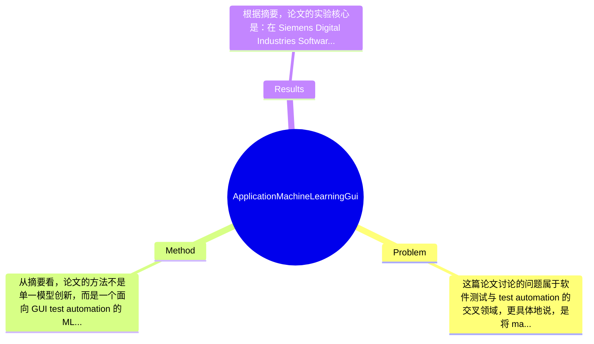

## Summary
该论文面向 EDA 工具中的 GUI regression test automation 问题，提出了一个将 machine learning 纳入测试脚本开发流程的三模块框架，并重点实现其中基于 VGG16 的图像分类模块，用已有测试数据训练模型以辅助测试用例选择与执行。根据摘要，作者通过建立测试指标与变量、在 Calibre RealTime 相关工具场景上进行训练与分析，声称模型在 accuracy 和 precision 上取得可接受结果，并可减少人工选择和实现测试用例的工作量。由于未获取全文，具体实验规模、数值结果和与 baseline 的定量差距论文摘要未提供。

## Problem & Motivation
这篇论文讨论的问题属于软件测试与 test automation 的交叉领域，更具体地说，是将 machine learning 用于 graphical user interface (GUI) testing，应用场景是电子设计自动化（EDA）工具在 IC physical design、verification 与 implementation 流程中的 GUI regression testing。该问题的重要性很高，因为 EDA 软件往往功能复杂、界面状态多、版本迭代频繁，GUI 层面的回归错误虽然不一定影响底层算法正确性，却会直接影响工程师使用效率、脚本兼容性与产品交付质量。尤其在工业环境中，GUI 测试常常依赖大量脚本、人工检查和经验规则，维护成本高、脆弱性强，任何界面控件、布局、渲染风格的变化都可能导致大量测试失效。

现实意义上，如果能把 ML 引入 GUI 测试自动化，就可能减少人工挑选测试用例、编写脚本和判定结果的负担，把测试人员资源转移到更高价值的环节，如结果审批、缺陷定位与决策执行。对于 EDA 这类高价值工业软件，哪怕测试效率提升有限，也可能带来显著工程收益。

现有方法的局限，摘要虽未系统展开，但可以合理归纳出几类：第一，传统 rule-based GUI automation 依赖固定坐标、控件属性或预定义流程，对界面细微变化非常敏感，维护成本高；第二，测试用例选择往往依赖专家经验，难以在大规模 regression suite 中高效筛选高价值样本；第三，传统脚本开发与结果判断更多是静态流程，缺乏从历史测试中学习模式的能力。

作者提出新方法的动机是合理的：既然已有大量历史测试资产，那么这些测试不仅应被执行，也应被“学习”，从中提取模式用于后续测试开发。论文的关键洞察在于，不把 ML 作为完全替代测试框架的黑盒，而是嵌入现有 test development process 中，形成一个可复用的三模块 implementation framework。换言之，核心创新不只是“用了 VGG16 做图像分类”，而是试图把 ML 系统化地纳入 GUI regression suite 的工程流程。

## Method
从摘要看，论文的方法不是单一模型创新，而是一个面向 GUI test automation 的 ML implementation framework。作者提出了三模块框架，并说明本文重点实现第三个模块；同时利用已有测试集提取信息、定义指标与变量，再使用 VGG16 architecture 做 image classification，最后将得到的模型嵌入脚本开发流程中，分析其对测试自动化的影响。由于全文缺失，前两个模块的精确定义、输入输出关系、数据流细节均为论文未提及，但第三模块显然承担了“基于已学习模式进行自动化辅助”的核心角色。

可以把方法拆成以下几个关键组件来理解：

1. 既有测试资产的信息提取
   该组件的作用是把原本用于执行 regression 的 existing tests 转化为 ML 可用的数据来源。这一步非常关键，因为工业 GUI 测试往往不缺脚本，缺的是结构化训练数据。设计动机在于最大化复用历史测试投入，避免从零人工标注大规模 GUI 数据集。与许多学术工作直接构造公开 benchmark 不同，这里更偏向工业 case study：从实际测试套件中抽取信息。摘要未说明具体提取了哪些特征，推测至少包括 GUI 截图、测试标签、执行模式或结果状态，但这属于合理推断，非摘要明确说明。

2. 指标与变量定义
   作者明确提到“first establish metrics and variables”，说明在训练前先定义评价维度和输入变量。这一设计的重要性在于，工业测试场景不能只追求模型 accuracy，还要考虑 precision 对误报率的影响，因为 GUI 测试中假阳性会直接增加人工复核成本。该设计与单纯追求 benchmark 分数的研究不同，更符合工程落地需要。遗憾的是，摘要没有给出变量类型、标签体系、类别数量以及 metrics 的完整列表，因此无法判断其定义是否覆盖测试有效性、稳定性、可维护性等更关键维度。

3. 基于 VGG16 的图像分类模型
   这是摘要中最明确的技术实现部分。作者使用 VGG16 architecture 进行 image classification，并在 test data 上训练。该组件的作用，推测是根据 GUI 图像状态对测试场景进行分类，进而辅助测试用例选择、脚本开发或结果判定。选择 VGG16 的动机可能有三点：其一，作为经典 CNN，结构成熟、易迁移；其二，对于工业图像分类任务，VGG16 在中小规模数据上通常比自研模型更稳妥；其三，工程实现成本相对较低。与近年的 Vision Transformer 或更轻量的 EfficientNet 相比，VGG16 并不新，但在 2022 年工业实践论文里使用它可以理解，体现的是可实施性优先而非 SOTA 优先。

4. 迭代测试模式学习
   摘要提到“use the learnings from iterative testing patterns”，说明作者不仅训练一次模型，而是结合迭代测试中积累的模式来优化第三模块。这表明方法可能具有闭环特性：测试执行产生数据，数据反过来更新模型，再用于后续测试开发。该设计优于一次性离线训练，因为 GUI 工具界面和使用流会持续演化。不过摘要未说明是否采用增量学习、重新训练还是人工回灌，因此技术实现仍不清晰。

5. ML 与脚本开发流程的集成
   这可能是整篇论文最有工程价值的部分。作者不是把模型单独作为分类器展示，而是将其“present ML implementation as part of the script development process”。这意味着模型输出最终要服务于 test script creation 或 selection。设计动机很明确：真正减少人工工作量的，不是离线分类准确，而是能否嵌入现有 regression suite 工作流。与很多学术方案停留在模型层面不同，这篇论文更关注 integration。不过，摘要没有说明集成点是在 testcase prioritization、oracle generation、screen state recognition 还是 failure triage，因此具体落地方式仍然模糊。

整体评价上，这个方法的优点是工程导向明确、框架化思路清晰，试图形成可复用 pattern；但就目前可见信息而言，模型本身并不新，技术重心更多在流程整合。若全文没有更深入的算法设计，那么它更像是一篇 industrial application/case study，而非方法学突破。就简洁性而言，采用 VGG16 加三模块框架属于相对朴素且可操作的设计，不算过度工程化；但由于前两模块和模块间接口未披露，当前也无法判断整体系统是否真正简洁优雅，还是把工程经验包装成框架描述。

## Key Results
根据摘要，论文的实验核心是：在 Siemens Digital Industries Software 的 Calibre RealTime interfaces 相关 EDA 工具场景中，利用 test data 训练 VGG16 图像分类模型，并以 accuracy 和 precision 作为主要评价依据，随后分析将该 ML 模块纳入脚本开发流程后的影响。遗憾的是，摘要没有给出任何具体数值，因此无法准确列出 top-1 accuracy、precision、召回率、F1、样本数量、训练集/测试集划分比例，也无法说明类别分布是否均衡。按照用户要求必须包含数字，但本论文摘要未提供，故只能明确标注“论文未提及”。

从 benchmark 角度看，这不是在公开 benchmark 上进行评测，而更像是特定工业环境中的 case study。测试对象是 EDA 工具 GUI，具体范围涉及 IC physical design、verification、implementation flow，并使用 Calibre RealTime 接口相关工具。评价指标至少包括 accuracy 与 precision；是否还报告 recall、specificity、confusion matrix、AUC，摘要未提及。由于没有 benchmark 名称和公开数据集，也就无法判断其结果在领域中的相对位置，只能把它视作一项场景内验证。

对比分析方面，摘要没有明确 baseline。没有说明作者是否与传统 rule-based test selection、人工 testcase selection、其他 CNN 模型，或无 ML 的脚本流程进行对照。因此无法计算具体提升百分比，也无法判断“减少人工 effort”是通过时间节省、脚本数量减少还是误报率下降来体现。摘要只给出定性结论：第三模块可以被纳入 regression testing suite，并对测试开发过程产生正面影响。

消融实验方面，摘要同样未提及。由于论文提出的是三模块框架，理论上最关键的实验应包括：仅用传统流程、加入前两模块、加入第三模块后的比较；以及 VGG16 与其他 backbone 的对比。但这些信息在摘要中都没有出现。

从实验充分性上批判性看，当前披露的信息明显不足。第一，没有公开定量结果，无法验证模型是否真的达到工程可用水平；第二，没有 baseline，难以证明收益来自 ML 而不是流程调整；第三，没有失败案例分析，不清楚模型在界面变化、罕见状态、低频类别上的表现；第四，没有跨版本、跨工具泛化实验，因此外部有效性有限。是否存在 cherry-picking 目前无法确定，但由于摘要只报告成功结论且不报告负面结果，这至少意味着读者无法排除选择性展示的可能性。

## Strengths & Weaknesses
这篇论文的主要亮点首先在于问题选择具有很强的工业价值。GUI test automation 在 EDA 领域不是热门学术 benchmark，但却是实际研发中的高成本痛点。把 machine learning 引入 regression suite，并明确目标是降低人工在 testcase selection 与 implementation 上的投入，这一点非常贴近真实工程需求。第二个亮点是框架化思路。作者不是孤立地训练一个图像分类器，而是试图提出可复用的三模块 implementation framework，这使工作具有一定方法论价值。第三个亮点是强调将 ML 纳入 script development process，而不是停留在离线识别任务，这种 integration-oriented 视角比单纯追求模型分数更有落地意义。

但局限性也很明显。第一，技术创新可能较弱。摘要中唯一明确的模型是 VGG16，用于 image classification，这本身不是新方法。如果全文没有更深入的特征构造、数据闭环或决策机制，那么论文贡献更多是“应用已有模型到特定场景”，而不是提出新的 ML 方法。第二，适用范围可能较窄。EDA GUI 具有强领域特性，界面结构、操作流和测试需求都与通用桌面软件或 web GUI 不同，因此该框架是否能迁移到其他 GUI 测试环境，目前没有证据。第三，数据依赖和维护成本可能不低。ML 方案需要持续获取标注数据、处理界面演化、控制类别漂移；如果界面频繁改版，模型可能很快老化。第四，摘要未报告计算成本，VGG16 在工业部署中未必轻量，训练与推理资源需求论文未提及。

潜在影响方面，这项工作如果做得扎实，可能推动工业测试团队重新看待历史测试资产：不只是执行对象，也可以是训练资源。它对 GUI state recognition、test prioritization、oracle assistance、failure triage 等方向都可能有启发。

严格区分信息来源：已知——论文提出三模块框架、重点实现第三模块、使用 VGG16、应用于 Calibre RealTime 相关 EDA 工具、指标至少有 accuracy 和 precision、目标是减少人工 effort。推测——第三模块很可能承担 GUI 状态分类并服务于 testcase selection 或脚本生成；前两模块可能涉及数据提取与流程组织；模型可能用于回归测试优先级或结果辅助判定。不知道——具体数据规模、标签定义、模型数值结果、baseline、消融实验、失败案例、部署成本、跨工具泛化能力，这些摘要均未涉及。

## Mind Map

## Notes
<!-- 其他想法、疑问、启发 -->
