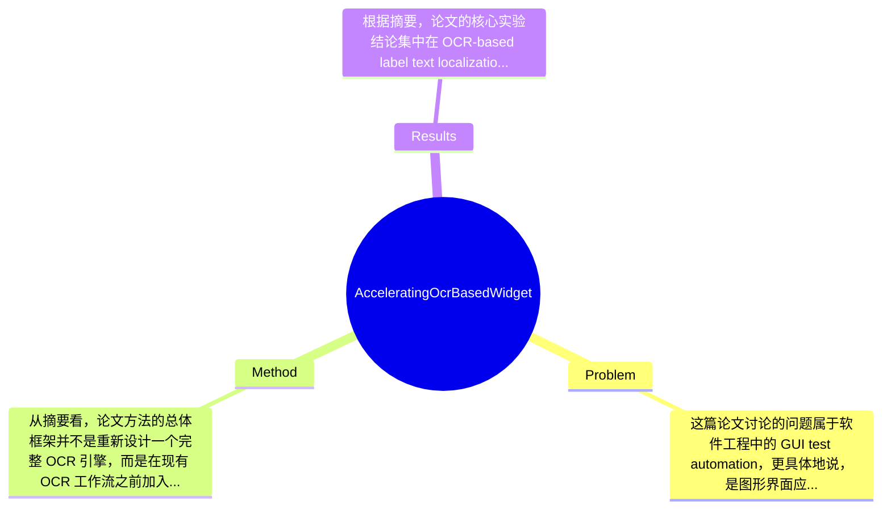

## Summary
该论文针对 GUI 测试自动化中基于 OCR 的 widget 文本定位速度过慢问题，提出了一种无需 GPU 的 Label Text Screening (LTS) 加速方法，通过在 OCR 前对 GUI 屏幕中的候选 label text 进行筛选，减少不必要的文本分析。根据摘要，在 4k 分辨率界面上，LTS 可使约 60% 以上案例的定位时间控制在 0.5 秒以内，而基于 Tesseract、PaddleOCR、EasyOCR 的 CPU 方案通常需要 2 秒以上，即使使用 GPU 也往往难以稳定低于 1 秒。

## Problem & Motivation
这篇论文讨论的问题属于软件工程中的 GUI test automation，更具体地说，是图形界面应用中 widget localization 的效率问题。所谓 widget localization，是指在界面上找到目标控件的位置，例如按钮、菜单项、窗口标题等；当传统的属性定位、DOM/Accessibility tree、控件 ID 或坐标脚本不可用时，OCR-based localization 成为一种较通用的后备方案，因为很多 GUI 元素最终都以文本形式呈现给用户。这个问题的重要性在于，自动化测试往往要求交互响应快、执行稳定、可在普通开发/测试机器上部署；若每次定位一个控件都要等待数秒，测试脚本的总耗时会迅速膨胀，甚至影响持续集成中的可用性。

现实意义很直接：企业桌面软件、跨平台 GUI、远程桌面环境、图像驱动测试框架都可能受益于更快的文本定位。特别是在无 GPU 的普通笔记本或虚拟机环境中，OCR 推理成本高，成为落地瓶颈。现有方法的局限至少有三点。第一，通用 OCR 引擎通常面向“完整场景文本识别”，会对整屏进行较重的文本检测与识别，带来显著冗余；而测试任务很多时候只关心少量短文本。第二，Tesseract、PaddleOCR、EasyOCR 等工具多将内部流程封装成黑箱，直接调用虽方便，但难以根据 GUI 测试场景做任务特化优化。第三，许多 OCR 方法在高分辨率 GUI 截图上计算量大，即使 GPU 加速也未必能满足交互式测试对低延迟的要求。

论文的动机因此比较明确且合理：既然 GUI 测试中常见目标是 label text，而这类文本通常较短、分布有规律，就没有必要让通用 OCR 对整屏做“全量、重型”分析。作者的关键洞察是将问题收缩到 label text localization，并利用 GUI 文本的结构特征，在 OCR 前增加一个快速筛选阶段，尽量减少后续 OCR 的工作量。这个方向从工程上很有针对性，不追求更强的通用 OCR 能力，而追求测试场景中的可用速度提升。

## Method
从摘要看，论文方法的总体框架并不是重新设计一个完整 OCR 引擎，而是在现有 OCR 工作流之前加入一个快速、GPU-independent 的 Label Text Screening (LTS) 阶段。其核心思想是：先利用 GUI 屏幕中文本分布与 label text 的特征，快速排除大量不可能包含目标短文本的区域，只把少量候选区域送入后续 OCR 分析，从而“打开 OCR 黑箱”，避免通用 OCR 引擎对整屏执行昂贵的文本检测与识别。换言之，这是一种面向测试自动化任务的 pipeline-level acceleration，而不是底层识别模型的精度竞赛。

关键组件可以概括为以下几部分：

1. **任务特化：聚焦 label text 而非任意场景文本**
   该组件的作用是重新定义目标问题，把 GUI 上的目标文本限制为按钮、菜单项、窗口标题等短文本 label。设计动机在于 GUI 测试中的目标往往不是长段落、复杂排版或自然场景文本，而是结构规整、长度短、位置相对稳定的控件文本。与现有通用 OCR 方法相比，这种特化直接缩小了搜索空间，也使后续启发式筛选成为可能。它的本质区别在于：不是“尽可能读出所有文本”，而是“尽快找到测试所需文本”。这是一个很典型的任务驱动设计。

2. **GUI 文本特征分析与候选区域筛选（LTS 核心）**
   LTS 的主要作用是根据 GUI screen 上文本的特点筛掉大部分无关区域，减少 OCR 调用范围。摘要提到作者“investigate the characteristics of texts on a GUI screen”，说明其方法大概率利用了 GUI 中文本在尺寸、颜色对比、排列方式、背景规律、短文本长度等方面的统计特征。设计动机是：在高分辨率截图中，全面 OCR 的成本主要来自全图扫描和大量候选文本行/块分析；如果能先做轻量筛选，就可显著降低总延迟。与直接调用 Tesseract/PaddleOCR/EasyOCR 的区别在于，LTS 不是把 OCR 当不可控黑箱，而是主动在其前面建立一个面向 GUI 的过滤层。论文未给出摘要级别的具体实现细节，因此无法确认其采用的是连通域分析、边缘/颜色启发式、区域裁剪还是字符形态先验，但可以确定其目标是“avoid excessive text analysis on a screen as much as possible”。

3. **打开 OCR 黑箱的流程重组**
   摘要中“opens the black box of OCR engines”非常关键，说明作者并非简单比较不同 OCR API，而是拆解 OCR 流程中的重成本部分，并重新组织执行路径。其作用是把原来整屏统一处理的 OCR 过程转化为更细粒度、按需触发的分析方式。设计动机是很多 OCR 引擎为了通用性，默认做较完整的检测、分组、识别和后处理，但 GUI 测试场景可能不需要全部步骤都在全图上进行。与现有方法相比，这种设计更偏系统优化：不是提升模型 capacity，而是减少不必要 computation。若实现得当，这类方法通常在 CPU-only 环境中特别有效。

4. **GPU-independent 的轻量化执行策略**
   该组件的作用是确保方法在普通 laptop、无 GPU 环境下也能运行得足够快。设计动机很实际：测试自动化往往部署在开发者机器、CI runner、虚拟机或远程桌面环境，不能假设有稳定可用的 GPU。与许多依赖深度模型加速的 OCR 流水线不同，LTS 显然更强调简单方法组合与 CPU 友好性。摘要明确说它“uses a combination of simple methods”，这说明其性能收益更多来自流程裁剪和启发式过滤，而非复杂深度网络。这样的设计在工程上通常更容易部署，也更容易解释失败原因。

5. **面向响应时间的系统目标而非单纯识别精度目标**
   该组件体现为评价指标上的转变：作者强调 localization time，而不是传统 OCR benchmark 常见的字符/词级精度。设计动机是测试自动化中用户真正关心的是“能否快速找到并点击目标控件”，而不是整页 OCR transcript 是否最优。与现有研究的区别在于，其贡献更像一个 software engineering 场景中的任务优化方案。论文摘要未明确说明是否牺牲了部分召回率或准确率换取速度，因此这一点需要谨慎看待。

从技术路线看，该方法具有较好的简洁性：核心不是堆叠复杂模型，而是通过任务建模、区域筛选、流程重构来获得加速。这种方案往往比重新训练大型 OCR 模型更优雅，也更符合 ASE 论文的工程研究风格。但它也可能带有较强启发式色彩，是否“优雅”取决于筛选规则是否稳健、是否跨 GUI 风格泛化。若规则较多、依赖界面特定假设，则可能走向过度工程化；仅从摘要看，作者强调“simple methods”而非复杂管线，因此我倾向于认为其设计偏简洁实用，但鲁棒性仍需阅读全文验证。

## Key Results
根据摘要，论文的核心实验结论集中在 OCR-based label text localization 的时间优化上。最重要的结果是：在作者使用的 subject datasets 上，LTS 显著降低了平均定位时间；在 4k 分辨率 GUI screens 上，超过约 60% 的案例可在无 GPU、普通 laptop 环境下将定位时间控制在 0.5 秒以内。这一结果直接对应其实用目标——让 OCR 方案从“几秒级等待”接近可交互的响应时间。

对比基线方面，摘要明确列出了三类流行 OCR 引擎：Tesseract、PaddleOCR、EasyOCR。作者称，现有 CPU-based approaches built on these engines “usually need over 2 seconds to achieve the same goal on the same platform”。如果以 2 秒对比 0.5 秒粗略估计，LTS 至少带来了约 4 倍级别的延迟改善；而且这里比较的是同平台、同任务目标下的响应时间，因此具有较直接的工程意义。更值得注意的是，摘要进一步指出，即使加入 GPU acceleration，这些已有方法也“can hardly keep the analysis time in 1 second”。这意味着 LTS 的价值不仅在于 CPU-only 环境可用，更在于其任务定制化策略可能优于单纯依赖硬件堆算力。

Benchmark 细节方面，摘要只明确提到了“subject datasets”和“4k resolution GUI screens”，但未给出数据集名称、样本规模、GUI 类型分布、操作系统来源、语言类别、字体多样性，也未说明评测指标是否只包含 time，还是同时报告了 localization accuracy / recall / precision。因此严格来说，实验数字目前可确认的只有三个阈值级结论：LTS 在 4k GUI 上使 60%+ 案例低于 0.5 秒；CPU baseline 通常超过 2 秒；GPU baseline 也难稳定低于 1 秒。论文摘要没有提供标准差、分位数、最坏情况或平均值的精确数值。

消融实验方面，摘要未提及是否分析了 LTS 中各简单组件的独立贡献，例如候选筛选、OCR 流程拆分、参数设置分别带来多少收益。实验充分性上，这是一大缺口：如果没有 accuracy-speed trade-off、跨分辨率实验、跨 OCR engine 通用性验证、失败案例统计，那么“快”是否建立在漏检增多的代价上就无法判断。也看不出作者是否有 cherry-picking。摘要使用“on the subject datasets”措辞较谨慎，没有宣称普遍最优，但由于只展示了有利时间阈值结果，仍需阅读全文确认是否报告了困难场景和反例。

## Strengths & Weaknesses
这篇工作的亮点首先在于问题抓得很准。它没有泛泛讨论 OCR 加速，而是抓住 GUI 测试自动化中最常见、最痛的子问题——label text localization 的时延瓶颈，并将研究目标明确设定为普通无 GPU 环境下的实用响应时间。这种任务聚焦使方法更有落地价值。第二个亮点是思路务实：作者不是追求更复杂的识别模型，而是通过 LTS 在 OCR 前做筛选、减少无效分析，属于典型的“系统级优化优于盲目换模型”。第三个亮点是可部署性潜力高。GPU-independent、simple methods、normal laptop 这些关键词说明它对工业测试工具可能更友好。

但局限也很明显。第一，方法很可能高度依赖 GUI 文本的先验规律，尤其是“label text 通常是短文本”这一假设；一旦遇到富文本界面、缩写不规则、多语言混排、图标与文字重叠、低对比度主题或复杂自绘控件，筛选规则可能失效。第二，论文目标偏速度优化，但摘要未说明是否保持了足够的定位准确率与召回率；如果加速是以漏检某些按钮或菜单项为代价，那么其在自动化测试中的可靠性会受限。第三，适用范围可能主要集中于 OCR-based fallback 场景。若系统原本就能访问 Accessibility tree、控件属性或 DOM 结构，那么 OCR 路线本身未必是首选，LTS 的价值也会下降。

潜在影响方面，该工作对软件测试和 GUI agents 都有启发：它说明视觉定位任务不必总是用全量视觉模型解决，可以结合任务先验做轻量筛选。未来可应用在桌面应用 RPA、远程桌面自动化、游戏 UI 自动操作、低资源设备上的 GUI 理解等方向。

严格区分信息来源：**已知**：论文提出了 LTS；目标是加速 OCR-based label text localization；在 4k GUI 上 60%+ 案例低于 0.5 秒；Tesseract/PaddleOCR/EasyOCR 的 CPU 方案常超 2 秒，GPU 方案也难低于 1 秒。**推测**：LTS 可能依赖候选区域过滤、文本形态启发式和 OCR 流程拆分；其收益主要来自减少整屏扫描。**不知道**：具体算法细节、数据集名称与规模、定位精度变化、是否支持多语言、失败案例、消融实验、开源与否，摘要均未提及。

## Mind Map

## Notes
<!-- 其他想法、疑问、启发 -->
