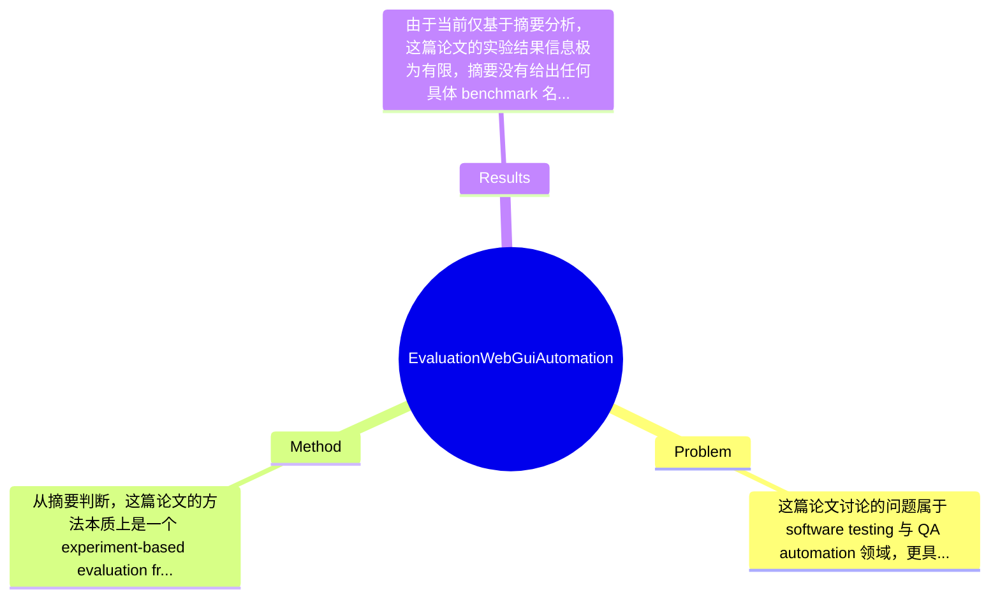

## Summary
该论文围绕 dynamic web application 的 GUI 自动化测试工具选型问题，采用实验性评估方法考察 TestComplete 的 test recorder 与 script generation 能力，并基于一组预设 criteria 对其适用性进行分析；从摘要看，论文目标不是提出新算法，而是评估现有 commercial tool 在动态 Web 场景下的实用表现。由于未获取全文，具体效果数字、benchmark 细节与量化结论论文摘要未提及。

## Problem & Motivation
这篇论文讨论的问题属于 software testing 与 QA automation 领域，更具体地说，是 Web GUI automation testing tool 的实验评估问题。其核心关注点不是“如何设计新的测试算法”，而是“现有自动化测试工具在 dynamic web application 上是否真的好用、稳定、经济”。这一问题非常重要，因为现代 Web 系统迭代频繁，前端框架、DOM 结构、异步加载、动态元素定位都会显著增加人工回归测试成本；如果自动化工具选型不当，反而会导致脚本脆弱、维护成本高、测试收益下降。现实意义上，这类研究直接服务于企业测试流程建设、工具采购决策、测试团队培训成本控制，以及项目在预算和时间约束下的质量保障。

从摘要可见，作者认为 automation testing tools 的选择必须结合 project nature、budget 和 time，这说明他们的问题意识较务实，面向工业实践。现有方法的局限至少包括三类：第一，很多工具虽然宣称 low-code/no-code，但面对 dynamic web application 时，record-and-playback 生成的脚本常因元素属性变化、时序问题或页面重绘而失效；第二，不同工具功能宣传较多，但缺乏针对具体场景、具体 criteria 的实证比较，导致团队选型依赖经验或厂商文档；第三，GUI recorder 往往适合静态流程演示，不一定适合复杂业务逻辑、跨页面状态依赖和频繁变动的 Web 界面。论文动机因此是合理的：既然 TestComplete 被广泛使用，且提供 test recorder 与 script generation，那么有必要通过实验系统考察这些特性在动态 Web 环境下的可行性与边界。其关键洞察在于：工具价值不能只看“能否录制脚本”，而应放在真实 dynamic web testing criteria 下进行评估，这比单纯功能介绍更接近实际部署需求。

## Method
从摘要判断，这篇论文的方法本质上是一个 experiment-based evaluation framework，而不是提出新的模型或 testing algorithm。整体框架应当是：选定 TestComplete 作为被评估对象，围绕其 test recorder engine、GUI test case recording 和自动 script generation 功能，在一个或多个 dynamic web application 场景中执行实验，然后依据一套“specific criteria”进行分析，最终给出该工具在实际 Web GUI automation 中的表现评价。由于未获取全文，具体实验对象、步骤、量化指标和统计方法论文摘要未提及，但可以明确看出其方法论偏向工具评测与案例实验。

可以将其方法拆解为以下几个核心组件：

1. 被评估工具选择：TestComplete
   该组件的作用是确定实验对象。作者选择 TestComplete，原因在摘要中已经给出：它被广泛用于 test automation，并且内置 test recorder engine，支持 minimal coding skills 下的 GUI test recording 和 script generation。这样的设计动机很现实，因为如果目标是帮助测试团队选型，那么评估一个工业界常用 commercial tool 比设计一个学术原型更有落地价值。与许多学术论文不同，这里不是构建新方法，而是验证现成工具在目标场景中的真实能力，属于“工具能力审计”而非“算法创新”。

2. 测试场景设定：dynamic web application
   该组件的作用是限定评估边界。作者明确指出评估基于 dynamic web application，这一点非常关键，因为动态页面比静态页面更能暴露录制式自动化工具的问题，例如异步加载、动态 ID、JavaScript 渲染、元素时序变化等。这样设计的动机是让实验更贴近真实工业应用，而不是在过于理想化的静态网页上得出乐观结论。与一般产品演示式评测不同，如果论文确实按动态场景设计 criteria，那么其结论会更有参考意义。不过摘要没有说明动态性具体体现在哪些技术栈或交互模式上，这是方法透明度的一个不足。

3. 功能评估对象：recording 与 script generation
   该组件聚焦于 TestComplete 的两个核心卖点。recording 的作用是降低脚本开发门槛，使非编程型测试人员也能快速生成 GUI test cases；script generation 的作用是将录制行为转化为可重复执行、可编辑的自动化测试脚本。作者这样设计显然是因为这两个功能直接关系到工具 adoption 成本：录制是否稳定决定初次上手效率，脚本生成质量决定后续维护成本。与纯手写 Selenium-style automation 相比，这种设计强调 low-code productivity；但其潜在风险在于，自动生成脚本往往可读性差、对页面变化敏感。若论文有进一步检查脚本鲁棒性，那将是很重要的评价维度，但摘要未说明。

4. 评价准则：specific criteria
   这是整篇实验设计最关键的部分。criteria 的作用是把“工具好不好用”转化为可观察、可比较的维度。合理的 criteria 可能包括：录制成功率、回放稳定性、动态元素识别能力、脚本可维护性、执行时间、错误恢复能力、对低代码用户友好性等。但需要强调，这些具体指标只是合理推测，摘要并未列出。设计动机在于避免主观印象式结论，使评估具备结构化依据。与一般经验性文章相比，若 criteria 定义清晰，则该研究更具有方法上的可复用性。

5. 实验输出：基于案例的工具结论
   最终输出应是对 TestComplete 特性优劣的分析，而不是训练出的模型或新的框架。这样的输出形式较简洁，也符合工业评测论文常见写法。就简洁性而言，这种方法是直接、务实、低理论负担的；优点是容易复现和理解，缺点是创新性有限，而且结论强烈依赖实验设置与 chosen criteria。若实验案例较少、指标不严谨，就容易滑向“产品试用报告”而非高可信度研究。因此，这种方法整体上算简洁，但也可能存在一定程度的经验化、轻量化，距离严格的 benchmarked empirical study 还有多远，摘要无法判断。

## Key Results
由于当前仅基于摘要分析，这篇论文的实验结果信息极为有限，摘要没有给出任何具体 benchmark 名称、测试任务数量、评价指标定义，也没有报告成功率、执行时间、错误率、脚本维护成本或对比基线等数字。因此，严格来说，主要实验结果、benchmark 详情与具体数值均属于“论文摘要未提及”，不能捏造。

从摘要唯一能够确认的是：作者“conduct an experiment to study and examine these features”，并且“evaluation of this tool and its features will be based on a specific criteria for testing dynamic web application”。这说明论文至少做了一个面向 dynamic web application 的实验，并且围绕 TestComplete 的 recorder 与 script generation 进行了 structured evaluation。但实验是否包含多个 Web 应用、多个测试用例类别、是否与 Selenium、Katalon、UFT 等 baseline 对比，摘要均未说明。如果没有 baseline，那么结果更像单工具评估，而不是 comparative benchmark；这会明显限制结论外推性。

就结果解读而言，若论文最终只证明“TestComplete 可以录制并生成脚本”，那其实是产品功能验证，不足以构成强研究贡献。真正有价值的结果应包括至少三类量化证据：第一，在动态页面上的回放成功率；第二，相比人工编码或其他工具的效率收益；第三，在页面变化后的维护成本变化。但这些摘要均未涉及。消融实验方面，这类工具评估论文通常也不会做严格意义上的 ablation，因为它不是由多个可拆组件构成的算法系统；若作者有拆分 recorder、object identification、script generation 等模块表现，那会增强分析深度，但摘要未提及。

从实验充分性看，目前可见的问题是：信息披露不足，无法判断样本规模、统计显著性和结果普适性。也无法排除 cherry-picking 的可能，即作者可能选择对 TestComplete 更友好的测试场景。由于没有负面案例、失败模式和对照实验摘要信息，现阶段只能保守判断：论文有一定实践参考价值，但结果证据强度很可能有限，尤其不适合据此直接做大规模工具采购决策。

## Strengths & Weaknesses
这篇论文最大的亮点在于研究问题非常实践导向。第一，它关注的不是抽象算法，而是 software testing 团队每天都会遇到的工具选型问题，尤其是 dynamic web application 场景下 GUI automation 的真实可用性，这使论文具备明确的工业价值。第二，它聚焦 TestComplete 的 test recorder 与 script generation，这两个特性恰好对应低代码自动化的核心诉求：降低上手门槛与提升脚本生成效率。第三，作者强调基于“specific criteria”进行评估，说明其并非纯主观体验式描述，而是试图构建结构化评价框架；如果全文中 criteria 定义清晰，这会是其方法上的一个可取之处。

但局限也非常明显。首先，技术创新性较弱：从摘要看，论文没有提出新的 testing framework、定位算法或鲁棒性增强机制，而是对现有 commercial tool 做实验评估，因此其学术贡献更偏 empirical observation，而非方法创新。其次，适用范围可能较窄：如果实验只围绕某一类 dynamic web application 或少量测试场景展开，那么结论很难推广到复杂 SPA、富交互系统、跨浏览器兼容测试或高频 CI/CD 环境。第三，结果可信度受信息透明度限制：摘要没有给出 benchmark、样本量、指标数字和 baseline，对计算成本、license 成本、学习曲线、维护负担也没有说明，这使得读者难以全面评估 TestComplete 的综合性价比。

潜在影响方面，这篇论文更可能作为测试工程实践的参考资料，而不是领域里程碑。它可帮助团队认识到：录制式 GUI automation 工具的价值需要结合项目类型、预算和时间约束来考察，而不能只看宣传功能。

严格区分信息来源：已知——论文评估对象是 TestComplete，关注 test recorder、GUI recording、script generation，并以 dynamic web application 的 specific criteria 做实验。推测——criteria 可能涉及录制成功率、回放稳定性、维护性和易用性；实验可能是案例驱动而非大规模 benchmark。 不知道——具体实验设置、应用规模、对比工具、量化结果、失败案例、统计方法、威胁有效性分析，摘要均未涉及。

## Mind Map

## Notes
<!-- 其他想法、疑问、启发 -->
