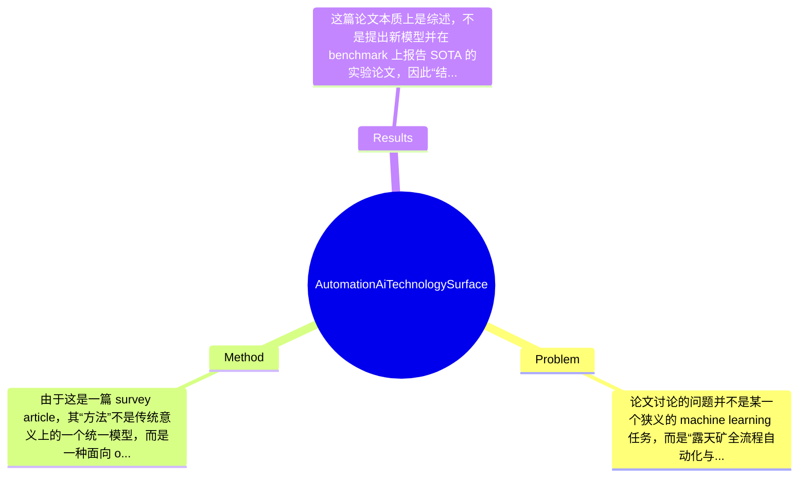

## Summary
这是一篇面向露天矿尤其是澳大利亚 Pilbara 铁矿区的综述论文，系统梳理了从地质勘探、采矿作业到铁路与港口运输全链条中的 automation、robotics 与 AI 技术。论文并未提出单一新算法，而是通过工程流程分解与案例式综述来说明 mining automation 的技术版图、关键挑战与潜在机会。其主要价值在于为工程与研究读者建立 open-pit mining 的整体认知框架，并指出 AI 在高技术矿山中的落地场景与限制。

## Problem & Motivation
论文讨论的问题并不是某一个狭义的 machine learning 任务，而是“露天矿全流程自动化与智能化”这一复杂系统工程问题，属于 mining engineering、robotics、industrial AI 与 cyber-physical systems 的交叉领域。具体而言，作者关注 Pilbara 铁矿区从 mineral exploration 到 ore shipment 的完整生产链，包括 geological assessment、mine planning、production drilling、blasting、excavation、haulage、crush and screen、stockpiling、rail distribution 与 ore-car dumping 等多个环节。这个问题重要，是因为露天矿规模大、资本密集、设备重型化程度高，任何一个环节的效率、安全性或调度失误都可能造成显著的经济损失和安全风险；同时 Pilbara 地区作业环境偏远、劳动组织复杂、运输链长，因此自动化对提高产能、降低人工暴露风险、改善运营连续性具有直接现实价值。

从现实意义看，矿业是典型的高风险、高能耗、高物流耦合行业。自动钻机、无人运输卡车、自动列车、智能感知与预测维护等技术，不只是“提效工具”，更关系到安全生产、资源利用率、设备寿命、能源消耗与供应链稳定性。现有方法的局限主要体现在三方面：第一，很多研究聚焦单一作业点或单机自动化，缺乏跨 mine-rail-port 的系统级视角，导致局部最优不能转化为全局收益；第二，传统矿业工程方法较依赖人工经验、规则系统和静态规划，面对地质不确定性、设备退化和现场扰动时适应性不足；第三，学术界提出的一些 AI 方法往往在数据条件、传感器布设和部署环境上假设过于理想，与矿区真实工况存在鸿沟。作者提出这篇综述的动机是合理的：不是宣称“新模型优于旧模型”，而是试图搭建一个让非矿业背景工程读者也能理解的技术地图，并基于长期产学合作经验指出真正值得研究的问题。论文的关键洞察在于，矿业自动化的难点并不只在感知或控制算法本身，而在于多阶段流程耦合、极端工况鲁棒性、系统集成与工程可维护性。

## Method
由于这是一篇 survey article，其“方法”不是传统意义上的一个统一模型，而是一种面向 open-pit mining automation 的结构化综述框架。整体上，作者采用“按生产链条分解 + 按工程问题归纳 + 穿插典型 AI/robotics 技术案例”的方式组织内容：先为没有采矿背景的读者建立露天矿作业流程认知，再逐步介绍各环节的 automation 技术、研究兴趣与工程挑战，并结合作者所在团队与行业伙伴长期合作的视角讨论落地难点。换言之，这篇文章的方法论是 process-centric 而非 algorithm-centric。

1. 全流程分层框架
   论文首先将矿业活动划分为 resource development、mine operations、rail operations 和 port operations 等层次，并进一步拆解为大约九个核心步骤。这一组件的作用是建立统一语义框架，使读者理解不同自动化问题在产业链中的位置。这样设计的动机很明确：矿业不是单机任务，而是强耦合流程工业，只有放在全流程背景下，AI 技术的收益和边界才看得清。与很多仅讨论 autonomous haul trucks 或无人钻机的文章不同，这篇综述强调 mine-rail-port 一体化视角，这是它的重要区别。

2. 面向工程问题的技术映射
   作者并不是抽象地谈“AI 在矿业中的应用”，而是把技术对应到具体任务，例如 geological assessment、stratigraphic boundary identification、mineral estimation、equipment automation、transport coordination 等。摘要片段中明确提到如 DTW-GP 与 hyperspectral imaging 这类技术，用于地层边界识别和矿物估计。该组件的作用是把 AI/automation 从口号变成任务级工具箱。设计动机在于，矿业中的数据类型高度异构，包括 gamma logs、hyperspectral data、vehicle telemetry、production data 与 logistics data，不同任务需要不同建模方式。与泛化式“AI 赋能产业”叙述相比，这种任务-技术对照更具工程可执行性。

3. 以 robotics 与 autonomy 为核心的设备级自动化梳理
   论文提到 autonomous drills、haul trucks、shovels、conveyors、drones、trains 和 ships，说明其重点覆盖感知、导航、控制、任务执行与人机协同等设备级系统。该组件的作用是展示矿区自动化的实际载体：AI 不是悬浮在系统上层，而是嵌入重型设备、移动平台和物流基础设施中。这样设计的原因是矿业自动化首先要解决 safety-critical 的 physical interaction 问题，纯软件优化无法单独创造价值。与仅做数据分析或调度优化的工作相比，本文更强调 cyber-physical integration。

4. 基于长期产学合作的挑战归纳
   作者特别强调论文视角来自 decade-long industry-university R&D partnership，这意味着文章不仅罗列文献，还隐含吸收了实际部署经验。其作用在于将研究问题与真实约束连接起来，例如偏远环境、传感器污染、设备可靠性、系统维护、通信条件与组织流程限制。设计动机是避免学术方案脱离现场。与纯文献综述相比，这种写法更像“领域经验总结”，价值在于帮助研究者识别哪些问题是真的痛点，哪些只是实验室中的代理问题。

5. 渐进式科普与工程教育导向
   论文假设读者没有 mining 背景，因此采用 gradually builds context 的写法，先介绍基本流程，再讨论技术细节。这个设计看似简单，实则重要，因为矿业术语和作业流程对外部 AI 研究者并不直观。其区别于高度专业化的矿业论文：本文更像一篇 bridge paper，连接 mining engineering 与 AI/robotics 社群。

技术细节方面，当前提供的文本没有完整公式、统一算法或训练策略，因此无法像分析 ML 论文那样拆解 loss function、network architecture 或 optimization scheme；论文更像对已有技术的分类回顾，其中提及的方法包括 DTW-GP、hyperspectral imaging 等，但论文未提及统一实验训练细节。设计选择上，按产业链组织内容是必要的，因为这是矿业系统的自然结构；但每个子任务内部完全可以采用其他综述维度，例如按 perception/planning/control 分类、按 sensing modality 分类或按 autonomy level 分类。就简洁性而言，这篇文章的方法框架总体较清晰，不算过度工程化；但由于覆盖范围极广，其代价是深度不均衡，某些子领域只能点到为止，难以给出统一、可操作的技术评价标准。

## Key Results
这篇论文本质上是综述，不是提出新模型并在 benchmark 上报告 SOTA 的实验论文，因此“结果”主要体现在知识整合、技术盘点和案例性总结，而不是标准化 quantitative benchmark。根据用户提供的摘要与片段，论文明确列举了 mining automation 覆盖的主要对象，如 autonomous drills、haul trucks、shovels、conveyors、drones、trains 和 ships，并按从 geological assessment 到 ore shipment 的九类环节组织讨论。但就严格意义上的实验结果而言，当前提供文本中没有给出统一 benchmark 名称、评价指标、表格结果、误差率、成功率、吞吐量提升或安全指标改善等具体数字，因此任何具体数值都应标注为“论文未提及”。

如果从“核心内容结果”角度概括，论文的主要输出有三类：第一，给出 Pilbara open-pit operations 的全链路流程图景，帮助读者理解 automation 技术所处位置；第二，列举若干代表性技术，例如 DTW-GP 用于 stratigraphic boundary 识别、hyperspectral imaging 用于矿物估计，说明 AI 在矿山上游资源评估中的具体用法；第三，强调 mine、rail、port 联动下的系统工程挑战。这些属于综述性发现，而非实验性发现。

对比分析方面，论文似乎并未设置统一 baseline，也没有以某一算法对比 previous work 的形式展开，因此不存在常规意义上的“提升百分比”总结。消融实验同样大概率不存在，因为 survey paper 不训练单一系统。实验充分性方面，若以综述标准看，它的优势是覆盖产业链广、面向工程实践；但不足是缺少系统化 quantitative comparison，例如不同 autonomous haulage systems 的 deployment scale、不同 sensing 技术的精度与成本、不同 scheduling 方法的收益比较等。是否存在 cherry-picking？从现有片段看，作者主要选择代表性技术与成功案例进行说明，这在综述中很常见，但如果全文缺少失败部署、事故案例、维护成本和 ROI 不佳场景的讨论，那么就可能存在“偏向展示成熟方案”的倾向。不过基于当前材料，这一点只能谨慎判断为“可能”，不能下定论。

## Strengths & Weaknesses
这篇论文的亮点首先在于视角完整。它不是把 mining automation 简化为单个机器人或单个 AI 模型，而是覆盖从地质评估到铁路港口运输的全链条，这对理解矿业中的真实优化目标非常关键。第二个亮点是工程导向强。作者基于长期 industry-university R&D partnership，总结的不是脱离现场的抽象问题，而是更贴近部署与运营的 challenge/opportunity。第三个亮点是跨学科桥接能力强。它假定读者没有 mining 背景，用较友好的方式把 open-pit operations、robotics、data analytics 和 automation 连接起来，对 AI 研究者进入矿业场景尤其有帮助。

局限性也很明显。第一，作为综述，论文缺乏统一评价框架。它列举了很多技术方向，但如果没有系统比较指标，读者难以判断哪些技术真正成熟、哪些仍停留在概念验证阶段。第二，覆盖面广导致深度有限。像 autonomous haulage、drill automation、rail scheduling、remote sensing 这些主题都足以单独成文，放在同一篇 21 页左右的综述里，不可避免会牺牲细节。第三，从当前材料看，论文对 failure cases、负面结果、部署成本和组织变革阻力的讨论可能不够充分；而这些恰恰是工业 AI 成败的关键。

潜在影响方面，这篇文章更像“领域入口型综述”，适合作为 mining AI/automation 的地图。它对学术界的贡献在于明确了值得研究的任务链条，对产业界的价值在于帮助非矿业技术人员快速理解业务流程与技术接口。可能的应用方向包括 autonomous fleet、predictive maintenance、ore characterization、rail logistics optimization、remote operations 和 digital mine planning。

已知：论文明确是关于 Pilbara 露天铁矿 automation 与 AI 的综述；明确覆盖 mine、rail、port operations；明确提到 DTW-GP、hyperspectral imaging、autonomous drills、haul trucks、trains 等技术对象。推测：作者可能基于 Rio Tinto 等合作场景总结了较多实际经验，但当前节选未完整展示具体案例深度；全文可能更偏重成功部署经验而非负面案例。 不知道：统一 benchmark、具体实验数字、经济收益、部署成本、事故率变化、各技术成熟度分级，当前提供材料均未提及。

综合评分上，我给 3/5。它不是某个方向的里程碑算法论文，但作为跨学科综述具有较强参考价值，尤其适合想进入 mining automation 领域的研究者或工程人员建立全局认知。

## Mind Map

## Notes
<!-- 其他想法、疑问、启发 -->
