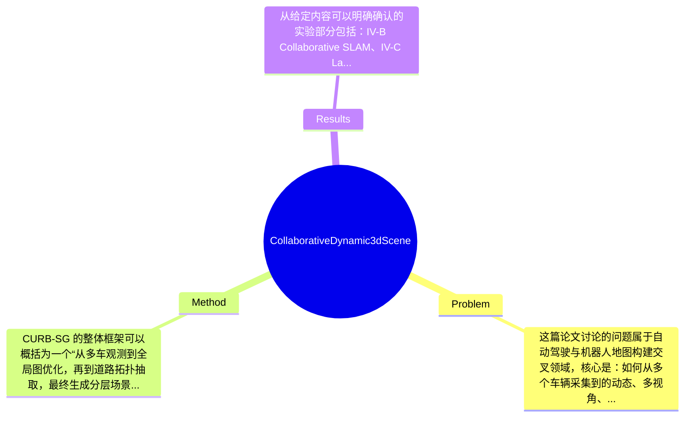

## Summary
该论文针对自动驾驶中“如何利用多车协同构建可查询、可推理、包含动态语义的3D场景表示”这一问题，提出了 Collaborative URBan Scene Graphs (CURB-SG)：将多智能体 panoptic LiDAR、协同 graph-based SLAM、lane graph 构建和环境分区结合起来，生成分层动态3D scene graph。论文在照片级仿真城市场景中验证了该方法能够完成多车地图融合、车道级拓扑抽取与场景图构建，但从给定内容来看，核心优势更偏表示与系统整合，定量 superiority 的具体幅度仍需结合原文表格细读。

## Problem & Motivation
这篇论文讨论的问题属于自动驾驶与机器人地图构建交叉领域，核心是：如何从多个车辆采集到的动态、多视角、含语义的 LiDAR 数据中，构建一个既保留几何精度、又具备高层拓扑与语义可查询性的3D表示。传统自动驾驶地图大多是 HD map、occupancy map 或 semantic map，它们对 localization、planning 有帮助，但通常停留在几何或像素/点级语义层面，缺少“对象—道路—区域—轨迹”之间的结构化关系表达。对自动驾驶来说，这一点非常重要，因为决策系统并不只需要知道“哪里可通行”，还需要知道“这辆车位于哪个lane segment、前方是否进入交叉区、某类静态地标属于哪个道路区域”。现实意义在于，这类结构化表示有望支持更高层的 reasoning、地图更新、跨车协作感知，甚至未来与 vision-language model 或 foundation model 的接口对接。

现有方法存在几类具体不足。第一，单车 SLAM 或单车语义建图通常难以覆盖大尺度城市区域，且更新效率有限；面对遮挡和局部感知盲区时，单车地图完整性不足。第二，已有 dense voxel grid 或 point-based semantic map 虽然细节丰富，但查询与推理成本高，不适合直接支持高层决策，因为其缺少稀疏、层次化、图结构组织。第三，一些 scene graph 工作偏室内或静态环境，或者不显式处理自动驾驶中的lane topology、intersection partitioning与动态车辆关系，因此难直接迁移到城市场景。

作者提出新方法的动机是合理的：他们并不满足于“更准的SLAM”或“更细的语义分割”，而是要把多车协同建图与高层语义抽象合并为统一系统。论文的关键洞察在于：先通过 collaborative SLAM 获得统一全局几何基座，再通过 ego 轨迹与其他车辆 panoptic 观测提炼 lane graph，用 lane connectivity 对道路环境进行交叉口/非交叉口分区，最终把车道、静态地标、动态车辆、SLAM pose graph 与3D panoptic point clouds 组织成多层 scene graph。这种“先统一几何，再结构化语义分解”的路线，是该工作最核心的创新。

## Method
CURB-SG 的整体框架可以概括为一个“从多车观测到全局图优化，再到道路拓扑抽取，最终生成分层场景图”的流水线系统。多个 ego agents 将关键帧包发送至中心服务器，包内包含本地 odometry 估计和 panoptic LiDAR 扫描；服务器执行 graph-based collaborative SLAM，检测 inter-agent loop closure 并进行全局优化，得到统一的大尺度3D地图。随后，系统利用 ego 车辆轨迹以及其对其他车辆的 panoptic 观测构建 lane graph，并基于 lane graph 的连通结构将环境划分为 intersecting 和 non-intersecting road areas。最后，在统一坐标系下，把车道层、静态地标层、动态车辆层以及底层 pose graph / point cloud 层组合成 multi-layered dynamic 3D scene graph。

1. 协同式 graph-based SLAM
- 作用：这是整个系统的几何基础，负责把多个车辆的局部轨迹和局部感知整合到统一全局坐标系中，并尽可能减少漂移。
- 设计动机：如果没有稳定的全局对齐，后续 lane graph、地标归属、跨车动态对象关联都会变得不可靠。自动驾驶中的多车协作价值很大，但前提是能做 inter-agent registration。
- 与现有方法区别：论文强调使用 keyframe package 和 inter-agent loop closure detection 的 graph-based collaborative SLAM，而不是仅做后验地图拼接。这意味着多车数据并不是松散并列，而是进入统一 pose graph 中优化。
- 技术细节：给定内容表明输入包含 local odometry 和 panoptic LiDAR scans，服务器端执行 global graph optimization。HTML摘要未给出更细的残差项、回环候选检索策略、鲁棒核函数等，因此这些低层实现只能标注为“论文未在提供内容中展开”。

2. 基于轨迹与动态观测的 lane graph 构建
- 作用：从低层点云地图中抽取面向道路拓扑的中层结构，是 scene graph 中承上启下的一层。
- 设计动机：自动驾驶 reasoning 很多时候围绕 lane 展开，而不是围绕稠密点云。使用 ego 路径与对其他车辆的 panoptic observations 来估计 lane 结构，本质上是把“车辆真实行驶行为”作为道路拓扑线索。
- 与现有方法区别：传统 lane extraction 往往依赖 HD map、人工标注或纯视觉/几何车道线检测；这里更强调从多车行为轨迹和观测中 bottom-up 地恢复 lane graph，减少对外部高精地图依赖。
- 技术细节：论文提到 lane graph 来源于 ego agents 的 paths 和对其他 vehicles 的 panoptic observations，说明其 lane 抽取并非仅由自车轨迹决定，而是吸纳环境中交通参与者运动模式，理论上更利于覆盖多车道结构。

3. 基于 lane connectivity 的环境分区
- 作用：将道路空间切分为 intersecting 与 non-intersecting road areas，为后续区域级语义归属与高层查询提供结构单元。
- 设计动机：城市道路中，交叉口与普通路段在行为模式、风险评估、优先级规则上明显不同。若 scene graph 只有对象和点云，没有“区域”这一层，则难支持如“该车辆是否已进入交叉区”之类查询。
- 与现有方法区别：不少语义地图有 road / sidewalk 分类，但缺少从拓扑连通性出发的 functional partitioning。本文把 lane graph connectivity 作为区域划分依据，更接近驾驶决策语义。
- 设计选择：这一步并非唯一选择，也可以使用地图先验、交通规则拓扑或学习式区域分割。但作者采用 lane connectivity，是一个较可解释且不强依赖标注的方案。

4. 多层动态3D scene graph 构建
- 作用：把不同抽象层次的信息统一成图结构，包括 lane information、static landmarks 及其 map section assignment、other vehicles、pose graph 和 3D panoptic point clouds。
- 设计动机：scene graph 的价值不在于替代点云，而在于对点云进行稀疏抽象，便于 higher-order reasoning 和 efficient querying。自动驾驶系统未来可能需要回答复杂问题，例如“某静态地标属于哪个 road section”“某车辆相对于哪条 lane、位于哪个交叉区域”。
- 与现有方法区别：相比只保留对象节点的 scene graph，CURB-SG 明显强调 lane 和 map sections 的交通结构语义；相比只做道路拓扑图的工作，它又保留了 pose graph 和 3D panoptic point cloud 作为 grounding。
- 技术细节：从描述看，该图是 layered graph，不同层之间存在 assignment/containment/observation 等关系，但具体 edge type 定义、更新频率、动态图维护机制在给定内容中没有完整展开。

5. 工程整合与系统性评价
- 必要设计：协同 SLAM 和 lane-level abstraction 是必要的，否则无法既实现多车统一建图又实现高层结构化表达。
- 可替代设计：中心化服务器架构未必唯一，也可以考虑 distributed optimization；lane graph 也可由地图学习模型直接预测。
- 简洁性评价：该方法更像“系统型论文”而非单一算法创新。优点是模块间逻辑顺畅：几何对齐→拓扑提炼→区域分解→场景图组织；缺点是组件较多，性能可能受每个子模块误差累积影响，存在一定系统工程化色彩，但整体并不显得无端复杂。

## Key Results
从给定内容可以明确确认的实验部分包括：IV-B Collaborative SLAM、IV-C Lane Graph、IV-D Environment Partitioning，实验平台为 photorealistic simulator，用于 urban scenarios 评测。这说明作者不仅测试了最终 scene graph 结果，还分别评估了协同建图、车道图生成和道路环境分区三个关键子任务，实验设计与方法结构是一一对应的，属于较合理的系统性验证。

但需要非常严格地说，当前用户提供的正文摘录并未包含具体表格、数值指标和 baseline 名称，因此许多关键 quantitative results 无法安全捏造。比如：collaborative SLAM 的 trajectory error、map alignment error、loop closure precision/recall；lane graph 的 topology accuracy、centerline distance；environment partitioning 的 IoU、precision/recall；以及与单车 SLAM 或非协同方法相比的提升幅度，这些在提供文本中均“论文未提及”或至少“当前摘录未包含”。因此若要做完整结果复核，必须查看原论文实验表格与附录。

基于结构可推断的主要实验目标是三类。第一，Collaborative SLAM 应验证多车输入是否能提升全局一致性，并通过 inter-agent loop closures 改善大尺度地图质量。第二，Lane Graph 实验应验证从 ego 路径和其他车辆观测中恢复道路拓扑的可行性。第三，Environment Partitioning 应验证使用 lane connectivity 对交叉区和非交叉区划分是否稳定有效。若论文提供了这些任务的单独 benchmark 与可视化，那说明作者并非只展示最终漂亮场景图，而是在拆解每一层能力。

实验充分性方面，优点是覆盖了系统关键模块；不足是从摘要和节标题来看，实验全部基于仿真环境，真实世界 deployment、跨传感器域泛化、异步通信/丢包鲁棒性、多车数量扩展性等仍未可知。是否存在 cherry-picking？仅凭现有摘录不能下结论。已知作者声称“extensively evaluate”，但如果没有真实场景和强 baseline，对“广泛评估”的说服力仍有限。

## Strengths & Weaknesses
这篇论文的亮点首先在于表示层级设计得比较完整。已知它不是简单把语义点云转成图，而是把 collaborative SLAM、lane graph、environment partitioning 和 multi-layer scene graph 串成一条链路，使最终表示既有底层几何 grounding，也有中层道路拓扑和高层对象关系。这种从自动驾驶需求出发的图结构，比单纯 occupancy/semantic map 更适合查询与推理。第二个亮点是多车协同建图与 scene graph 的结合。很多工作只做协同感知或只做 scene graph，而本文试图解决“跨 agent 融合之后如何形成统一结构化场景表示”这一更系统的问题。第三个亮点是 lane graph 由实际交通参与者轨迹与 panoptic observation 驱动，这种 bottom-up 拓扑抽取思路具有较强可解释性。

局限性也很明显。第一，技术上这是一个多模块串联系统，误差传播风险较高：SLAM 对齐不好会影响 lane graph，lane graph 不稳又会影响 environment partitioning 和 landmark assignment。第二，适用范围上，它显然更适合道路结构清晰、车辆行为能反映 lane topology 的城市交通环境；对于临时施工区、无明确车道标识区域、混合交通或大规模行人主导场景，效果可能下降，这是合理推测。第三，计算与系统部署上，中心化服务器接收多车 keyframe packages 并做 global optimization，可能面临通信带宽、实时性和扩展性问题；这一点在自动驾驶车路协同场景中很关键，但当前摘录未给出详细 profiling。

潜在影响方面，该工作对自动驾驶地图表示有参考价值，尤其适合作为 planning、behavior prediction、risk-aware querying、甚至 future VLM-grounded driving agent 的中间世界模型。若后续能扩展到真实车队和在线更新，它可能成为“结构化协同地图”的一个重要方向。

严格区分信息类型：已知——论文提出 CURB-SG，输入为多 agent panoptic LiDAR，包含 collaborative SLAM、lane graph、environment partitioning 和多层 3D scene graph，并在 photorealistic simulator 中评估。推测——该方法对高层决策和语言查询接口会更友好，但论文摘要未直接证明下游收益；中心化架构可能有扩展性瓶颈。 不知道——具体定量指标、真实数据集表现、运行时延、通信负载、对传感器噪声和 segmentation error 的敏感性，当前提供内容均未充分说明。

## Mind Map

## Notes
<!-- 其他想法、疑问、启发 -->
