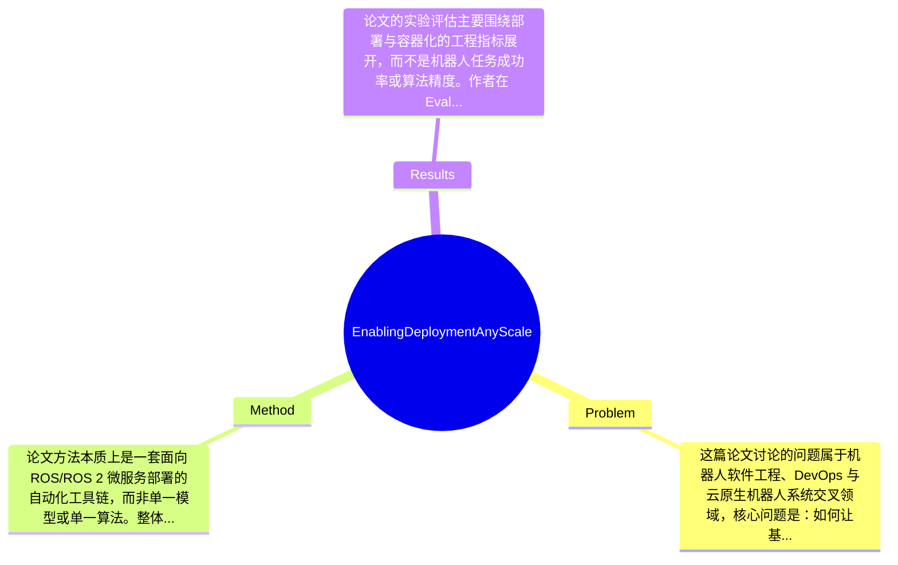

## Summary
该论文针对 ROS/ROS 2 机器人应用在微服务架构中部署困难、依赖复杂和跨平台 DevOps 流程不顺畅的问题，提出了一套自动化容器化工具链 dorotos，包括自动最小化构建容器镜像、面向机器学习的 ROS base images，以及带默认优化配置的 Docker CLI。论文的主要效果不是提出新的机器人算法，而是通过工程化工具降低机器人应用从开发到 CI/CD 再到部署的门槛，并从构建时间、磁盘占用、启动时间、运行性能和功能特性等维度与替代方案进行了比较。

## Problem & Motivation
这篇论文讨论的问题属于机器人软件工程、DevOps 与云原生机器人系统交叉领域，核心问题是：如何让基于 ROS/ROS 2 的机器人应用能够以微服务方式，在从小规模设备到大规模分布式系统中实现可重复、可维护、可自动化的部署。这个问题很重要，因为现代机器人系统，尤其是自动驾驶、智能交通、仓储物流和边缘云协同场景，已经不再是单机单进程的软件形态，而是多个感知、规划、控制、通信模块跨设备协同运行。此时部署难点不仅来自算法本身，更来自依赖管理、版本兼容、异构硬件适配、无停机更新以及 CI/CD 流程整合。

现实意义非常直接。若部署流程不标准化，研究原型很难转化为可运维的工程系统；若依赖无法固定，系统会出现“在开发机能跑、在车端不能跑”的典型问题；若更新不能自动化，大规模车队或机器人集群的维护成本会急剧上升。因此，自动化容器化和微服务化对于机器人从实验室走向产业部署具有明确价值。

现有方法的局限主要有三类。第一，传统 ROS 开发通常依赖本地工作空间和手工配置环境，复现性差，跨平台迁移成本高。第二，通用容器化方法虽然可用，但对 ROS 特有的 package 依赖、workspace 构建、overlay、消息中间件配置等支持不足，需要开发者编写大量样板 Dockerfile。第三，一些现有机器人容器方案偏向开发环境封装，而非覆盖从镜像构建、最小化发布、ML 依赖、到 CI/CD 集成的完整链路。

作者提出新方法的动机是合理的：如果要真正推动机器人应用采用微服务架构，仅靠“能装进 Docker”远远不够，必须提供自动化、最小化、适配 ROS 特性的工具链。论文的关键洞察在于，把机器人部署问题从“单个容器如何写”提升为“端到端开发—构建—发布—运行工作流如何标准化”，并将重点放在工程落地而非算法创新上。

## Method
论文方法本质上是一套面向 ROS/ROS 2 微服务部署的自动化工具链，而非单一模型或单一算法。整体框架围绕一个 container-driven workflow 展开：开发者提供 ROS package 源码，系统基于通用 Dockerfile 模板和 CI/CD 集成自动构建两类镜像——用于开发的 development image，以及用于部署的 deployment image；前者保留源码和完整依赖便于迭代，后者仅保留运行所需依赖与编译后二进制以减小体积并提升部署确定性。与此同时，作者提供面向机器学习场景的 ROS base images，以及一个修改过的 Docker CLI 来简化日常开发交互。其核心不是发明新的容器技术，而是把 ROS 应用容器化过程“产品化”。

关键组件可分为以下几部分：

1. 自动化容器镜像构建（Automated Container Image Build）
   该组件的作用是从任意 ROS 或 ROS 2 package 源码自动生成可用镜像，减少手工编写 Dockerfile 和依赖配置的负担。设计动机在于 ROS 项目经常存在工作空间结构复杂、依赖层级多、系统依赖与源码依赖交织的问题，人工维护镜像不仅费时，而且容易失配。与现有做法相比，作者强调“最小化部署镜像”的自动生成：开发镜像用于编码调试，部署镜像则剥离源码和不必要构建工具。这一点区别于很多只提供一个肥大开发镜像的方案。技术上看，这应该依赖标准化的多阶段构建（multi-stage build）思想以及对 ROS 构建系统的封装，但更细的 Dockerfile 规则、缓存策略和层设计，论文摘要中未完全展开。

2. 通用 Dockerfile 模板与 ROS 专用封装（docker-ros）
   该组件相当于工具链入口，提供 generic Dockerfile 并将其接入 Git 平台的 CI/CD 模板。它的作用是统一构建习惯，让不同项目采用相似的镜像构建方式。设计动机是降低团队协作成本：当每个 ROS 仓库都自己发明一套容器流程时，维护和迁移代价很高。与通用 Docker 模板不同，该组件显然对 ROS/ROS 2 的 workspace、依赖解析、构建输出等进行了专门适配。必要设计在于它把“从源码到可部署镜像”的逻辑抽象成标准流程；但从理论上讲，也可以采用 Bazel、Nix 或更强的 build system 完成类似目标，因此这部分不是唯一选择，而是与 ROS 生态兼容性较好的选择。

3. 面向机器学习的 ROS 基础镜像（ML-enabled ROS Base Images）
   作者专门维护一组 useful machine learning-enabled base images，这一点非常贴近当前机器人系统现实，因为感知、预测、语义理解等模块往往依赖 CUDA、PyTorch、TensorFlow 或其他 ML runtime。该组件的作用是让开发者不必重复从裸 Ubuntu/ROS 镜像开始安装复杂的 GPU 与 ML 依赖。设计动机在于 ML 依赖是机器人部署中最脆弱、最易出现版本冲突的一环。与普通 ROS 官方镜像相比，这些 base images 更强调“可直接支撑智能模块开发和部署”。但其代价也可能是镜像体积更大、硬件耦合更强，尤其在 GPU 驱动兼容问题上仍难彻底抽象。

4. 修改版 Docker CLI 与默认优化配置
   该组件用于简化开发阶段与容器镜像的交互。论文指出其提供 useful defaults，意味着它可能封装了常用参数，例如 volume mount、network、device access、用户权限映射等，从而降低开发者使用容器运行 ROS 节点的摩擦。设计动机很务实：机器人开发不像纯后端服务，往往涉及图形界面、传感器设备、GPU、主机网络、实时通信，原生 docker run 命令繁琐且容易出错。与标准 Docker CLI 相比，它的创新不在底层能力，而在更符合 ROS 工作流的人机接口。

5. CI/CD 集成与微服务工作流
   论文将工具链嵌入 Git 平台 CI/CD 模板中，这是整个方法能落地的关键。它的作用是把“每次提交自动构建、测试、发布开发/部署镜像”变成默认流程，而不再依赖人工打包。设计动机是将机器人软件纳入现代软件工程实践。与很多学术工作只展示容器化概念不同，这里作者强调自动部署链路完整性，体现出明显工程导向。

从简洁性看，这个方法总体上较为优雅，因为它复用了 Docker、CI/CD、ROS 现有生态，而不是重新发明一套平台；但它也带有明显工程系统特征，创新更多体现在 workflow 整合与默认设计，而非新的理论机制。因此它是“有用且实用”的工程化方法，不算过度工程化，但学术新颖性相对有限。

## Key Results
论文的实验评估主要围绕部署与容器化的工程指标展开，而不是机器人任务成功率或算法精度。作者在 Evaluation 中考察了至少四类量化维度：CI/CD 与 build time、disk space、start-up time、operation performance，并在另一个维度上比较了 compatibility/versioning、source dependency management、containerization/packaging、CI/CD、maturity/popularity 等特性。也就是说，这篇论文的 benchmark 更像“部署工作流 benchmark”而非经典机器人 benchmark。

但需要明确指出：用户提供的论文摘录中没有保留具体实验表格和数字，因此无法可靠给出“某方法快了多少秒、节省多少 MB、性能损失多少 %”这样的精确结果。按照论文结构判断，作者应当对其工具链与替代方案进行了量化比较，并且得出的结论大概率是：自动最小化容器化在磁盘占用和部署镜像简洁性方面更优；在启动时间与运行性能方面，容器化带来的额外开销较低或可接受；在 CI/CD 自动化与依赖管理方面，工具链具备更强的实用性。但具体数值，论文摘录未提及，不能捏造。

从 benchmark 细节看，测试对象应该包括 ROS/ROS 2 应用在容器中的构建与运行过程，指标包括 build duration、镜像大小/磁盘占用、容器启动耗时以及运行时性能。功能对比部分则更像 feature matrix，用于和替代工具做横向比较。若论文含有消融实验，其形式更可能是“是否使用最小化部署镜像、是否启用特定 base image、不同工具链方案比较”，而不是机器学习论文中常见的模块消融；但用户提供内容未显示具体消融数字。

批判性看，实验是务实的，但充分性有限。它证明了工具链在工程指标上的可用性，却未充分覆盖真实大规模分布式机器人场景，例如跨设备网络抖动、实时性硬约束、多容器编排（如 Kubernetes）、GPU 驱动兼容问题、OTA 更新失败恢复等。是否存在 cherry-picking 也难完全判断；至少从结构上看，作者既做量化开销，也做功能比较，较为全面，但由于缺少失败案例和复杂生产环境报告，仍可能偏向展示工具链更有利的场景。

## Strengths & Weaknesses
这篇论文的主要亮点首先在于问题选得对。它没有停留在“如何让 ROS 跑起来”，而是聚焦机器人软件工程中长期被低估的部署与运维难题，把微服务、容器、CI/CD 这些成熟软件工程实践系统性引入 ROS 应用。第二个亮点是工具链完整性较高：自动构建、最小化部署镜像、ML base images、简化 CLI、CI/CD 模板形成闭环，这比单点式工具更有落地价值。第三个亮点是开源发布，这使其不仅是概念论文，也有成为社区基础设施的潜力。

局限性也很明显。第一，技术创新性偏弱。该工作更多是已有技术的面向 ROS 场景整合，而不是提出新的容器编排理论、依赖解析算法或运行时优化机制，因此学术贡献更偏系统工程。第二，适用边界需要谨慎：微服务与容器化并不天然适合所有机器人场景，尤其是强实时控制回路、极端资源受限硬件、对启动确定性要求极高的嵌入式系统，容器层即便开销不大，也可能带来不可接受的复杂度。第三，论文对大规模生产问题覆盖不够，例如安全隔离、供应链安全、镜像签名、实时调度、跨节点编排、故障恢复等，这些恰恰是“从可用到可商用”的关键。

潜在影响方面，该工作对机器人 DevOps、云边协同部署、自动驾驶软件流水线都有参考意义，尤其适合作为研究团队或工业团队建立标准化 ROS 容器工作流的起点。

严格区分信息来源：已知——论文明确提出并开源了一套 ROS 微服务自动容器化工具链，包含自动镜像构建、ML-enabled base images 和 CLI，并从开销与功能角度比较替代方案。推测——其最小化部署镜像 likely 采用 multi-stage build，且在团队协作与跨平台复现性上会带来显著收益，但论文摘录未直接给出因果验证。不知道——具体实验数值、所比较的所有 baseline 名称、是否支持 Kubernetes 级编排、在真实车队或机器人集群中的长期运行稳定性，论文摘录未提及。

## Mind Map

## Notes
<!-- 其他想法、疑问、启发 -->
