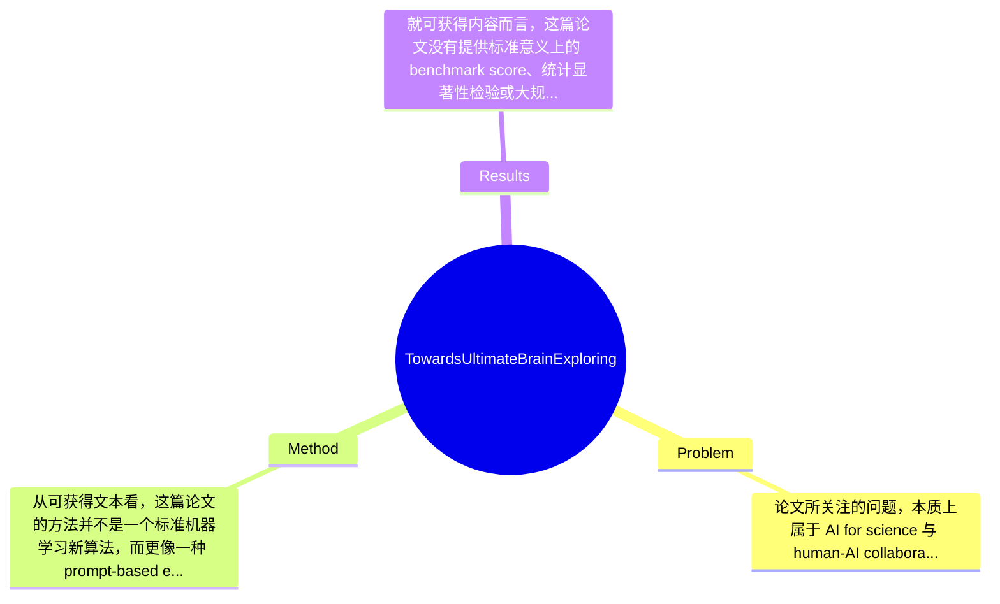

## Summary
这篇论文试图回答“ChatGPT 能否参与科学发现与理论构造”这一问题，方法上通过一个带有 gamification 色彩的人机提示环境，让 ChatGPT生成并“评测”一个假想物理理论 GPT^4（将 generative pretrained transformer 与 generalized probabilistic theory 概念拼接）；结果上，论文展示了 ChatGPT 能输出数学表达、物理解释、相关示例甚至诗歌，但其证据主要停留在概念演示与生成能力展示层面，而非严格科学验证。

## Problem & Motivation
论文所关注的问题，本质上属于 AI for science 与 human-AI collaboration 的交叉领域：大型语言模型，尤其是 ChatGPT，这类以自然语言生成为核心的系统，是否不仅能辅助写作、总结和问答，还能在科学探索中承担更积极的角色，例如提出假设、组织理论、生成形式化表达、辅助分析物理现象。这个问题之所以重要，是因为科学研究中大量环节本质上都涉及知识重组、概念联想、符号表达与假设生成，而这些正是 LLM 可能擅长的部分。如果这类系统真的能够稳定参与科学发现，那么它们将有潜力改变文献综述、研究构思、教育、理论原型设计乃至跨学科创新的工作流。

从现实意义看，这项工作意在探索一种新的科研协同范式：由人类设定目标、边界与评价规则，LLM 在其中扮演创意生成器、表达引擎和初步分析助手。对物理学、数学教育、科研启发式工具以及面向公众的科学传播，都有一定想象空间。尤其在早期探索阶段，研究者往往并不需要一个“已经正确”的模型，而更需要一个可以快速产出候选思路的系统。

不过，现有方法存在明显局限。第一，传统符号推理或定理证明系统虽然形式严格，但开放域创造性弱，难以像自然语言模型那样进行跨概念联想。第二，常规科学机器学习方法通常聚焦特定任务，如蛋白质结构预测或方程发现，缺乏通用交互能力，不能灵活参与开放式理论讨论。第三，早期 LLM 应用更多是文稿润色、摘要生成或问答辅助，少有工作明确把“科学发现过程本身”作为实验对象。

作者提出新方法的动机是合理的：既然 ChatGPT 具备强文本生成与一定数学表达能力，那么可以通过精心设计的提示与互动环境，测试其在科学概念构造中的上限与边界。论文的关键洞察不在于提出了一个可验证的新物理理论，而在于把“让模型参与假说生成与理论叙事”本身变成研究对象。换言之，核心创新更像是一种实验框架与元研究视角：考察 ChatGPT 如何在人类设定的游戏化规则下，生成看似科学、结构化、跨模态的内容。

## Method
从可获得文本看，这篇论文的方法并不是一个标准机器学习新算法，而更像一种 prompt-based experimental protocol。整体框架是：作者将 ChatGPT 置于一个“游戏化/任务化”的交互环境中，通过连续指令诱导其扮演科学探索代理，要求它定义一个新的假想理论 GPT^4，随后围绕该理论生成解释、数学表达、简单计算、物理现象描述与语言创作内容，并把这些输出作为“科学发现潜力”的展示证据。因此，这里的 method 核心不是模型训练，而是任务设定、提示编排、输出组织和案例呈现。

关键组件可以拆成以下几部分：

1. 游戏化提示环境（gamification environment）
- 作用：这是整篇论文最核心的实验容器。作者并不是直接问“ChatGPT 会不会做科学”，而是通过一种更具互动性的设定，让模型逐步接受角色、规则和目标，从而输出看起来更系统化的科学内容。
- 设计动机：LLM 对上下文极其敏感，开放式提问往往导致泛泛回答；通过 gamification，可以增强任务沉浸感、连续性和结构化程度，让模型更稳定地沿着“构建理论—解释现象—展示能力”的路线生成内容。
- 与现有方法区别：区别于标准 benchmark 或一次性 prompt，这种方式更接近 role-playing 与 staged prompting，强调过程引导而非单轮结果。

2. 假想理论 GPT^4 的构造
- 作用：作者让 ChatGPT 将 AI 里的 GPT（generative pretrained transformer）与物理中的 GPT（generalized probabilistic theory）结合，生成一个名为 GPT^4 的新模型/新理论。这是全文叙事主轴，也是测试模型概念融合能力的核心对象。
- 设计动机：选择“GPT”这一双关缩写有明显的元叙事意味，一方面便于模型调用已有语言模式，另一方面也为论文制造概念统一性和新颖性。
- 与现有方法区别：它并不是从第一性原理推导理论，也不是数据驱动学习物理规律，而是通过语言生成进行概念拼装。这个过程更像 speculative synthesis，而非 formal theory building。

3. 多类型输出能力测试
- 作用：论文强调 ChatGPT 不仅能生成自然语言，还能输出数学表达、统计分析、矩阵行列式计算、非定域关联验证、ASCII art 和 limerick。这相当于把“科学辅助能力”拆成多个子能力进行展示。
- 设计动机：单一文本输出不足以说明模型具有“科学探索”潜力，因此作者选择不同形式的内容来构造更强的表面证据，证明模型在解释、计算、表征与创意写作上具有统一生成能力。
- 与现有方法区别：很多论文只看问答正确率或代码能力，而这里是跨表达形式的案例式评测，更接近 capability showcase。

4. 人工筛选与论文编排
- 作用：从“全文完全由 ChatGPT 输出生成”这一表述看，实际科研流程中必然存在作者对 prompt、轮次、保留结果、章节组织的介入。也就是说，所谓方法的一部分，其实是人类对模型输出的策展(curate)与再上下文化。
- 设计动机：如果没有人工选择，LLM 输出通常松散、重复或不一致；论文成稿需要研究者把离散对话整理成看似连贯的科学叙事。
- 与现有方法区别：这篇工作某种程度上研究的不是“裸 ChatGPT”，而是“经人类提示设计和结果筛选后的 ChatGPT 协同系统”。

技术细节方面，论文未提及任何模型训练、微调、loss function、数据集构建或参数设置；可知的是使用了 ChatGPT 不同时间版本（文中提到 2022-11-30 research preview 与 2023-01-30 update），并通过多轮提示获得内容。严格说，这不是学习算法贡献，而是交互协议贡献。设计上，游戏化环境与 GPT^4 概念构造是必需的，因为它们支撑了全文实验逻辑；但具体任务如写打油诗、ASCII art 等则更像展示性附加项，也完全可以替换为别的能力测试。

从简洁性看，这个方法相当简洁：没有复杂模型、没有大规模实验、没有工程系统，主要依赖 prompt engineering 与案例展示。优点是低门槛、易复现、概念清楚；缺点是过于依赖叙事包装，科学严谨性不足，且容易把“生成得像”误判为“理解得深”或“发现得真”。因此它更像一篇 provocative essay + demonstration paper，而非成熟的方法论文。

## Key Results
就可获得内容而言，这篇论文没有提供标准意义上的 benchmark score、统计显著性检验或大规模定量评测，因此“结果”主要是案例级展示而非严格实验结论。论文宣称的核心结果包括：ChatGPT 在游戏化环境下成功构造了一个假想理论 GPT^4；能够围绕这一理论生成数学与物理相关内容；并展示了跨形式输出能力，例如生成 limerick、进行 matrix determinant 计算、讨论 nonlocal correlations、描述物理现象等。这些结果支持作者的主张：ChatGPT 在“模拟科学探索过程”方面具有一定潜力。

若按论文自身叙事，主要实验可概括为三类。第一类是“理论构造实验”：模型生成了 GPT^4 这一概念框架，把 generalized probabilistic theory 与 generative pretrained transformer 融合，作为一个拟人化、可语言交互的物理理论代理。第二类是“形式化能力展示”：模型被要求输出数学表达、进行基础数学/统计处理、解释物理规律。第三类是“语言创造实验”：模型生成关于自身的 limerick，以证明其语言能力与科学叙事能力可以共存。

但需要强调，论文未给出具体 benchmark 名称、标准评价指标、样本数量、成功率、错误率、重复实验次数，也没有报告诸如 accuracy、F1、BLEU、pass@k、MSE 等任何数值指标。除了“first paper entirely generated with outputs from ChatGPT”这类叙述性亮点外，几乎没有可量化结果。因此如果严格按照机器学习或物理学论文标准审视，benchmark 详情一项基本属于“论文未提及”。

对比分析方面，论文也没有建立清晰 baseline。没有与 GPT-3、LaMDA、人工专家、传统符号系统或非游戏化 prompt 进行系统对照，所以无法回答“游戏化环境到底提升了多少”“ChatGPT 比普通 LLM 好多少”“GPT^4 叙事比随机概念拼接是否更优”。消融实验同样缺失：没有比较去掉 gamification、去掉多轮交互、去掉人工筛选后结果会如何。

实验充分性总体偏弱。它更像一组精心挑选的正面样例，而不是对模型能力边界的全面测量。存在明显 cherry-picking 风险：作者展示了模型能做出的内容，但没有系统展示失败案例、事实错误率、推理崩溃场景或不同 prompt 下输出的不稳定性。论文自己在结论中也部分承认，这些结果只能被看作生成能力的指示，而不应解释为科学上准确或可验证的预测。这种自我限定是诚实的，但也说明其证据强度有限。

## Strengths & Weaknesses
这篇论文的亮点首先在于视角新。它不是把 ChatGPT 当作普通写作工具，而是把“LLM 是否能进入科学发现流程”本身当成研究问题，具有较强的话题性和启发性。尤其在 2023 年早期，这种用论文自身作为实验对象的做法很有象征意义。第二个亮点是方法极简但传播力强：通过 gamification、概念双关（AI 的 GPT 与 physics 的 GPT）和多模态样式输出，作者成功把一个本来抽象的问题包装成易理解、可讨论的演示。第三个亮点是作者保持了一定程度的自我克制，明确提醒结果不应被视为科学上真实可验证的预测，这比很多夸大式 AI 叙事更谨慎。

但局限也很明显。第一，技术局限非常大：论文没有提出可复用的算法创新，没有严格评价协议，也没有证明 ChatGPT 真正完成了“scientific discovery”，更接近生成了“像科学的文本与符号”。这意味着其结论更多是关于语言模型的叙事能力，而非发现能力。第二，适用范围有限。该方法适合概念发散、头脑风暴、科普互动或元研究讨论，不适合需要严密证明、实验可复现性和数值精度的科学任务；在物理学中尤其如此，因为“理论看起来合理”和“理论可证真”之间差距极大。第三，数据与系统依赖不可忽视。输出高度依赖 ChatGPT 的训练分布、提示方式以及作者筛选，若更换模型版本或换一组 prompt，结果可能显著变化；而论文没有研究这种不稳定性。

潜在影响上，它更像一篇方向性宣言：提醒学界认真思考 LLM 在科学研究链条中的定位——也许不是独立发现者，而是高带宽的概念重组器、假设生成器和表达助手。它对后续 AI for science、AI scientist、autonomous research agent 等方向有一定启发价值。

严格区分信息来源：已知：论文明确声称全文由 ChatGPT 输出生成，采用 gamification 环境，引导模型构造 GPT^4，并展示数学、物理解释与诗歌等能力，同时承认结果不代表科学上可验证预测。推测：作者实际进行了大量 prompt 设计、结果筛选和文本编辑，且展示内容可能偏向成功案例。论文未证实这些操作的具体程度。不知道：具体 prompt 序列、失败样本比例、重复实验稳定性、不同模型版本差异、人工编辑比例、评价标准与外部专家审核情况，论文均未充分提供。

综合评分方面，我给 3/5。它不是技术上扎实的里程碑论文，但作为理解早期 ChatGPT 科研想象、反思 LLM 在科学发现中角色的案例，具有参考价值；值得读其立意与边界，不宜把它当作实证性方法论文来依赖。

## Mind Map

## Notes
<!-- 其他想法、疑问、启发 -->
