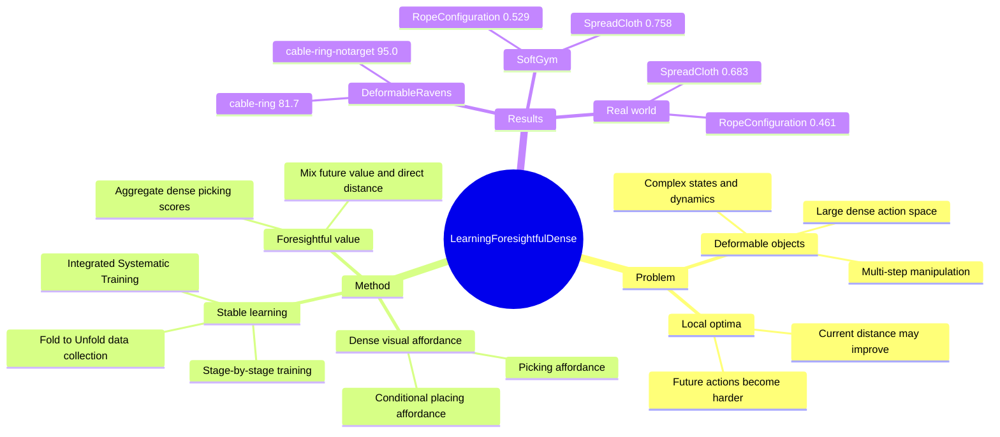

## Summary
本文把 deformable object manipulation 的 pick-and-place policy 表示成 dense visual affordance，并引入 state value 让 affordance 对后续动作有 foresight，避免只按当前距离或 coverage 贪心导致的 local optima。它用 stage-by-stage supervised learning、Fold to Unfold 自监督数据收集和 Integrated Systematic Training，在 DeformableRavens、SoftGym 与 real-world cloth/rope 操作上优于 Transporter、RL 和 MVP 等基线。

## Problem & Motivation
Deformable objects 如 cloth、rope 具有复杂状态、复杂动力学、高维自由度、大动作空间和严重 self-occlusion，因此比 rigid/articulated object 更难操作。许多任务不是单步完成，而需要一串强相关动作；如果 policy 只优化当前状态到目标的距离，就可能进入暂时 coverage 更大但后续难以完成任务的 local optimal state。

已有路线主要包括 RL、imitation learning、flow-based dynamics 或视觉反馈。论文指出这些路线分别面临复杂状态建模不稳定、需要 hand-crafted expert policy/demonstrations、规划耗时等限制。作者的核心动机是：保留 dense affordance 对复杂 visual state/action distribution 的表达能力，同时让 affordance 学到类似 DP/Q-learning 中 state value 的 long-term 信息。

## Method
论文把动作 primitive 设为 pick-and-place，动作由 picking point `p_pick` 和 placing point `p_place` 构成；根据 benchmark 设定，picker 不需要 rotation。由于 `p_place` 高度依赖 `p_pick`，作者把组合动作拆成 picking policy 和 conditional placing policy。

核心表示是两张 dense affordance map：

- `A_pick_o`：对 observation `o` 中每个点预测 picking affordance。
- `A_place_{o|p_pick}`：给定 observation 和 picking point，对每个 placing point 预测 placing affordance。

普通 greedy supervision 会直接用动作后状态 `o'` 与目标 `T` 的距离来监督 placing affordance，例如 SpreadCloth 中使用 `1 - dist(o', T)`，也就是 coverage area。本文的关键改动是把后续状态的 value 加进 placing affordance：

- state value 由 picking affordance 聚合得到，即在当前状态上所有 picking choices 的最大预测值。
- placing affordance 同时考虑后继状态 value 和直接距离：`alpha * value(o') + beta * (1 - dist(o', T))`，其中 `alpha + beta = 1`。
- picking affordance 再由对应 placing affordance 的最大值监督，因此 picking 也获得 foresightfulness。

这个定义会产生 picking affordance 与 placing affordance 的 chicken-egg dependency。作者用 stage-by-stage training 打断循环：先从接近目标的状态学习一阶段 affordance，此时 direct distance 近似 state value；再反向扩展到更复杂状态，每一阶段用上一阶段已经训练好的 picking module 提供稳定 value supervision，先训 placing module，再训 picking module。

数据收集采用 Fold to Unfold：从较接近目标的状态执行一个动作得到更复杂状态，再执行 reverse action 检查是否能回到相似状态；若相似，就把更复杂状态作为下一阶段起点，并在其上采样多样动作。作者强调 reverse action 不能完全恢复原状态，但相似性足以提升 sample efficiency；该 affordance 本身不依赖这种数据收集方式，也可以用其他数据训练。

最后用 Integrated Systematic Training 进一步在线整合 picking 和 placing modules：从随机初始状态开始，用当前 `M_pick` 和 `M_place` 连续执行 pick-and-place，并用真实执行结果同时更新二者。网络上，两个 module 都使用 FCN backbone 提取 point-level features；`M_pick` 用 picking point feature 预测 picking score，`M_place` 拼接 picking point、placing point 和 global feature 预测 placing score；loss 为 MAE。

## Key Results
**DeformableRavens.** 在 `cable-ring` 和 `cable-ring-notarget` 上，Ours 的 success rate 分别为 **81.7** 和 **95.0**，高于 Transporter 的 **68.3** 和 **70.0**；GT-State 为 **0.0 / 5.0**，GT-State 2-Step 为 **0.0 / 1.7**。

**DeformableRavens novel configurations.** 模型在 32 beads 上训练，测试 24/28/36 beads。`cable-ring` 上 Ours 为 **61.6 / 86.7 / 58.3**，Transporter 为 **33.3 / 58.3 / 32.7**；`cable-ring-notarget` 上 Ours 为 **81.7 / 96.7 / 78.3**，Transporter 为 **60.0 / 71.7 / 31.7**。

**SoftGym.** 在 `SpreadCloth` 与 `RopeConfiguration` 上，Ours 的 normalized score 为 **0.758** 和 **0.529**，高于 CURL-SAC 的 **0.195 / 0.348**、PlaNet 的 **0.387 / 0.236**、DrQ 的 **0.275 / 0.154**、MVP 的 **0.372 / 0.258**。

**Ablations.** 在 DeformableRavens 上，`Ours w/o IST` 为 **78.3 / 91.7**，低于完整方法 **81.7 / 95.0**；`Ours RandPick` 为 **11.7 / 58.3**，说明 learned picking affordance 很关键。在 SoftGym 中，`Ours only dist` 在 SpreadCloth/RopeConfiguration 上分别停在 **0.701 / 0.460**，完整方法随 stage 增加达到 **0.758 / 0.529**，支持 value-aware stage training 对避免 greedy local optima 的作用。

**Real world.** 在 Franka Panda + RealSense 的 real-world 实验中，Ours 在 `SpreadCloth` 和 `RopeConfiguration` 上的 normalized score 为 **0.683** 和 **0.461**，高于 MVP 的 **0.307** 和 **0.227**。

## Strengths & Weaknesses
**已知。** 方法的主要贡献不是提出更复杂的 policy class，而是把 dense visual affordance 从 single-step actionable score 扩展为带 long-term state value 的 foresightful affordance。这个 formulation 对 deformable manipulation 很自然：action space 是点级密集的，后续动作是否容易执行也可以通过 dense action values 聚合。

**已知。** 相比 imitation learning baseline，本文不需要针对每个任务 hand-craft expert policy；相比 model-free RL baseline，训练监督来自分阶段稳定的 offline/online interaction data，而不是在巨大 state/action space 中同时更新所有 value。实验中的 ablation 也明确显示，random picking、只用 direct distance、去掉 IST 都会降性能。

**已知。** 论文暴露出的主要 failure mode 是 greedy direct distance 或 `Ours only dist` 会偏向 local optimal states：某些状态当前 coverage 更高，但 future state value 更低，后续动作更难完成任务。Figure 8/9 给出了这种 local optima 与 only-distance placing affordance 的定性例子。

**局限。** Fold to Unfold 依赖 reverse action 后状态与原状态足够相似；论文也承认 reverse action 不能完全恢复 previous states。这意味着该数据收集策略更适合存在近似可逆操作路径的任务，对不可逆、接触历史强依赖或需要复杂 tool-use 的 deformable manipulation 是否仍高效，论文没有证明。

**局限。** 实验动作 primitive 固定为 pick-and-place 且不含 rotation；真实机器人还需要 domain randomization 和 real-world Fold-to-Unfold fine-tuning，不是纯 sim-to-real zero-shot。附录显示 SpreadCloth/RopeConfiguration 每个 step 收集 **40000** interactions，训练每个 step 的 placing module 约 **12h**、picking module 约 **6h**，IST 另需 **6h**，因此数据与训练成本不低。

**推测。** 对 GUI-agent 或 web/mobile agent 的直接迁移价值有限，因为本文没有 language instruction、GUI grounding 或 VLM reasoning；但它提供了一个有启发的 pattern：把 dense action affordance 与 long-term value 合并，可能适用于需要多步屏幕操作的 pixel/action scoring，而不是只做 myopic element selection。

**不知道。** 论文正文没有给出 DOI，也没有明确给出 GitHub/code link；只提供 project page。实验报告没有给出 variance、confidence interval 或统计显著性检验；也没有系统列出完整方法在真实场景失败的 case taxonomy。

## Mind Map

## Notes
这篇值得打 **4/5**：它不是 VLM/GUI-agent 论文，但对 embodied manipulation 中的 affordance learning、long-horizon planning 和视觉动作表示都有直接参考价值。最值得借鉴的是 "dense affordance as value estimator" 这个抽象，而不是具体的 FCN 架构或 Fold-to-Unfold 数据流程。

后续阅读时可以把它和 FlingBot、MVP、Transporter、Diffusion Policy、以及后续 VLA 的 action head 设计放在一起看：本文代表的是 action-value dense map 路线，而不是 trajectory generation 或 language-conditioned policy 路线。关键问题是，这类 dense affordance 能否扩展到更高维动作、双臂协作、language goal 和 open-world object/state distribution。
