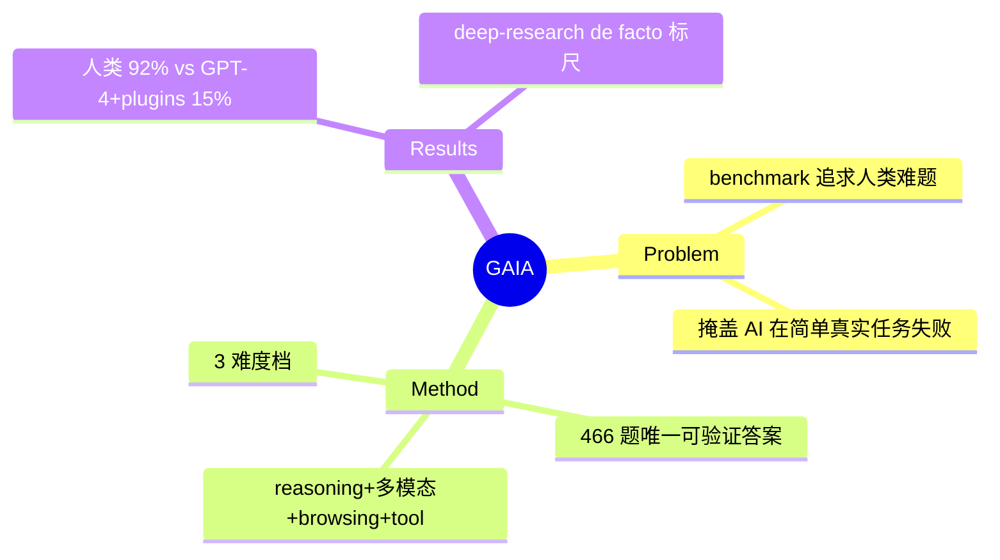

## Summary
GAIA 是通用 AI 助手 benchmark：466 个"对人类概念上简单、对 AI 很难"的真实问题，需要 reasoning + 多模态 + web browsing + tool use 才能答对。设计哲学反转了常见"越来越难"的思路——人类 92% 正确、GPT-4+plugins 仅 ~15%，成为衡量 agentic/deep-research 系统的经典标尺。

## Problem & Motivation
LLM benchmark 常追求"人类都难"的题（数学奥赛、专业考试），但这掩盖了 AI 在**人类觉得简单的真实任务**上的系统性失败——多步查资料、看图、用工具组合出一个可验证答案。作者主张：真正的通用助手能力，应该用这类"对人简单、对 AI 难"的题来测。

## Method
- **466 问题**（公开 300 题答案 + HuggingFace 排行榜），每题有唯一可验证的短答案。
- **能力需求**：reasoning、多模态处理、web browsing、通用 tool-use——多数题必须真的上网查、读文件、跨源综合才能答。
- **三档难度**：按所需步骤/工具数分级，Level 1 最简单、Level 3 需长链多工具。
- **设计哲学**：conceptually simple for humans yet hard for AI——答案唯一可验证，绕开 open-ended 生成的评测难题。

## Key Results
- **人类 92% vs GPT-4 (with plugins) ~15%**——巨大 gap，凸显当时 AI 助手在真实多步任务上的无能。
- 成为 deep-research / agentic 系统的通用标尺：后续 [[Papers/2505-WebDancer]]、[[Papers/2507-WebSailor]]（GAIA 55.4）、WebWatcher 等均在 GAIA 上报分，是"deep research 是否 work"的 de facto 检验。

## Strengths & Weaknesses
**亮点**：(1) "对人简单对 AI 难"+ 唯一可验证答案的设计极其干净，规避 LLM-judge 主观性；(2) 天然要求真实 web browsing + tool use，是 web/deep-research agent 的核心 benchmark；(3) ICLR 2024，HuggingFace 长期维护排行榜，影响力大。

**局限**：(1) 466 题规模有限，可能被针对性优化；(2) 短答案可验证但也限制了对长程 report 类任务的评测（BrowseComp/HLE 补更难的）；(3) 随强 agent 出现，GAIA 头部已接近饱和（55%+），区分度下降。属 [[Topics/WebAgent-Survey]] benchmark 路线（deep-research 通用标尺）。

## Mind Map

## Notes
- 与 [[Papers/2504-BrowseComp]]（更难、更需持久浏览）、HLE 构成 deep-research 评测的难度梯队。
- Yann LeCun / Thomas Scialom 署名，Meta AI + HuggingFace 联合。
