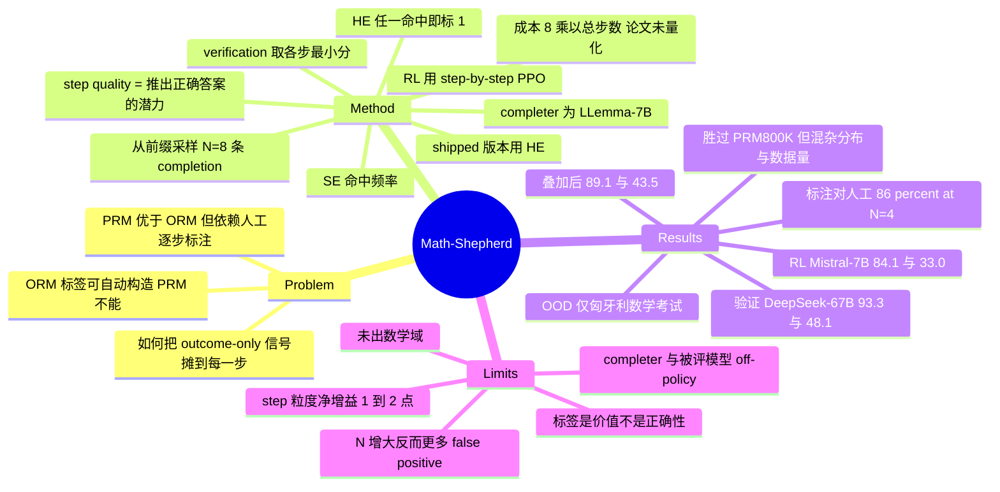

## Summary
Math-Shepherd 用 Monte-Carlo prefix rollout 把 outcome-only 的可验证信号转成 step-level 标签：从中间步 $s_i$ 出发让 completer 采样 $N=8$ 条后续路径，按是否命中 golden answer 用 hard/soft estimation 给该步打分，从而在零人工标注下训出 PRM。该 PRM 同时用作 best-of-256 verifier（DeepSeek-67B 在 GSM8K 93.3 / MATH500 48.1）和 step-by-step PPO 的分步奖励（Mistral-7B GSM8K 77.9→84.1、MATH 28.6→33.0）。代价是每个 step 都要 $N$ 次完整 completion，论文把它列为第一条 limitation，却没给任何算力数字。

## Problem & Motivation
PRM 相对 ORM 的优势已被 Lightman et al. (2023) 确立：能定位错误发生的具体位置，这对 RL 和自动纠错都是有价值的信号。但 PRM 的训练数据靠人工逐步标注（Uesato et al. 2022；Lightman et al. 2023），而多步推理的逐步标注要求标注者具备高级技能，成本高到卡住了 PRM 的发展与落地。

不对称之处在于：ORM 的标签本来就可以自动构造——采样若干候选解、检查最终答案是否正确即可，尽管存在 false positive（答案对但推理错），前人已证明这样训 ORM 仍然有效。PRM 侧则没有对应的自动方法。论文的 problem formulation 因此很干净：**能否把「最终答案对不对」这一条 outcome-only 信号，反向分摊成每一步的 step-level 标签**。

## Method

### 定义：step quality = 该步推出正确答案的"潜力"
受 MCTS 启发，论文把一个中间推理步的质量定义为 *its potential to deduce the correct answer*。这是一个 **value 定义而非 correctness 定义**——作者本人在 §3.3.1 就承认 "this definition also introduces some degree of noise"。这一点是理解全文（以及后续所有引用它的工作）的关键，详见 Strengths & Weaknesses。

### Completion + Estimation
给定已展开到 $s_i$ 的前缀，用一个 "completer" 采样 $N$ 条后续推理路径 $\{(s_{i+1,j},\cdots,s_{K_j,j},a_j)\}_{j=1}^{N}$，收集答案集合 $A=\{a_j\}_{j=1}^{N}$，再对照 golden answer $a^*$ 打标签。两种估计方式（Eq. 3 / Eq. 4，原文形式）：

**Hard estimation (HE)**——只要有一条 completion 命中就算好步：

$$y_{s_i}^{HE}=\begin{cases}1 & \exists a_j\in A,\ a_j=a^{*}\\ 0 & \mathrm{Otherwise}\end{cases}$$

**Soft estimation (SE)**——命中频率：

$$y_{s_i}^{SE}=\frac{\sum_{j=1}^{N}\mathbb{I}(a_j=a^{*})}{N}$$

拿到每步标签后，PRM 用逐步二分类交叉熵训练：$\mathcal{L}_{PRM}=\sum_{i=1}^{K}y_{s_i}\log r_{s_i}+(1-y_{s_i})\log(1-r_{s_i})$。作者试过 Lightman et al. 的 good/neutral/bad 三分类，报告与二分类"差别不大"，故采用二分类。

### 实际落地配置（与论文叙述的方法有偏差，需注意）
- **completer = LLemma-7B，$N=8$**。
- Solution pool：7B 与 13B 模型各在 GSM8K/MATH 训练集上训 1 epoch，每题各采 15 条解，去重后得 GSM8K 约 170k、MATH 约 270k 条 solution。
- **真正用于训练的是 HE 版本**，理由是工程便利：HE 可以直接选两个 special token 表示 'has potential' / 'no potential'，走标准 language modeling pipeline，不用改模型结构。SE 虽然理论上标注质量更高，但没有用于最终模型。

### 下游用法
- **Verification**：一条 solution 的总分 = 所有 step 分数的**最小值**（min-pooling，沿用 Lightman et al.）。另可与 self-consistency 组合：$a_{sc+rm}=\arg\max_a \sum_i \mathbb{I}(a_i=a)\cdot RM(p,S_i)$。
- **RL**：step-by-step PPO，在**每个 reasoning step 末尾**给奖励，区别于 ORM-PPO 只在整段回复末尾给一次。

### 标注成本（survey 关注点）
论文层面的确定事实：**每个 step 需要 $N=8$ 次完整 completion**；一条 $K$ 步的解需要 $8K$ 次；全量成本 $=8\times\sum_i K_i$。论文报告了 solution 条数（170k / 270k），但**既未报告 $\sum_i K_i$，也未报告总 completion 数，全文没有任何 wall-clock、GPU-hours、FLOPs 或美元成本数字**（已作为否定性 claim 独立核查，C18）。

> 以下为本笔记推算，非论文数据：按 GSM8K 每解约 5 步计，$170\text{k}\times5\times8\approx6.8\times10^6$ 次 completion；MATH 每解约 10 步计，$270\text{k}\times10\times8\approx2.2\times10^7$ 次。量级在 $10^6$–$10^7$ 次**多步生成**（不是单 token 前向）。且这是叠加在"每题从两个模型各采 15 条解"的 pool 构造成本之上的。后续工作若以"规避 Math-Shepherd 的标注成本"为动机，必须自建这个基线——原文没有可直接引用的数字。

## Key Results

### Verification：best-of-256 重排（Table 1）
PRM/ORM 的 base model：GSM8K 用 LLaMA2-70B，MATH 用 LLemma-34B。所有 generator 均以 MetaMATH 微调。

| Generator | Verifier | GSM8K | MATH500 |
|:--|:--|:--|:--|
| LLaMA2-70B | Self-Consistency | 88.0 | 39.4 |
| | ORM | 91.8 | 40.4 |
| | SC + ORM | 92.0 | 42.0 |
| | **Math-Shepherd** | **93.2** | 44.5 |
| | SC + Math-Shepherd | 92.4 | **45.2** |
| LLemma-34B | Self-Consistency | 82.6 | 44.2 |
| | ORM | 90.0 | 43.7 |
| | SC + ORM | 89.6 | 45.4 |
| | **Math-Shepherd** | **90.9** | 46.0 |
| | SC + Math-Shepherd | 89.7 | **47.3** |
| DeepSeek-67B | Self-Consistency | 88.2 | 45.4 |
| | ORM | 92.6 | 45.3 |
| | SC + ORM | 92.4 | 47.0 |
| | **Math-Shepherd** | **93.3** | 47.0 |
| | SC + Math-Shepherd | 92.5 | **48.1** |

两个方向性结论：(1) 相对 ORM 的增益在 MATH 上（+4.1 / +2.3 / +1.7）明显大于 GSM8K 上（+1.4 / +0.9 / +0.7），作者归因于 GSM8K 步数少、ORM 已经够用；(2) 在 GSM8K 上叠加 self-consistency 反而**掉点**（93.2→92.4、90.9→89.7、93.3→92.5），作者的解读是 reward model 足够强时再叠 SC 会有害。

### RL：step-by-step PPO（Table 2，greedy decoding）
Reward model base 为 Mistral-7B，用它监督 LLaMA2-7B 与 Mistral-7B 两个 generator。MATH 此处为**全测试集**。

| Model | GSM8K | MATH |
|:--|:--|:--|
| LLaMA2-7B: MetaMATH | 66.6 | 19.2 |
| + RFT | 68.5 | 19.9 |
| + ORM-PPO | 70.8 | 20.8 |
| + **Math-Shepherd step-by-step PPO** | **73.2** | **21.6** |
| Mistral-7B: MetaMATH | 77.9 | 28.6 |
| + RFT | 79.0 | 29.9 |
| + ORM-PPO | 81.8 | 31.3 |
| + **Math-Shepherd step-by-step PPO** | **84.1** | **33.0** |

**分步粒度带来的净增量要单独看**：ORM-PPO 相对 SFT 已经拿到 +4.2/+3.9（LLaMA2-7B GSM8K/Mistral GSM8K），而 step-by-step PPO 相对 ORM-PPO 只有 +2.4 / +2.3（GSM8K）与 +0.8 / +1.7（MATH）。摘要里那个醒目的 77.9→84.1 中，超过一半来自 PPO 本身而非 step-level 粒度。

### RL + Verification 叠加（Table 3，RM base = Mistral-7B，256 候选）

| Model | Verifier | GSM8K | MATH500 |
|:--|:--|:--|:--|
| Mistral-7B: MetaMATH | Self-Consistency | 83.9 | 35.1 |
| | ORM | 86.2 | 36.4 |
| | SC + ORM | 86.6 | 38.0 |
| | Math-Shepherd | 87.1 | 37.3 |
| | SC + Math-Shepherd | 86.3 | 38.3 |
| Mistral-7B + step-by-step PPO | Self-Consistency | 87.4 | 42.3 |
| | ORM | 87.6 | 41.3 |
| | SC + ORM | 89.0 | 43.1 |
| | Math-Shepherd | 88.4 | 41.1 |
| | **SC + Math-Shepherd** | **89.1** | **43.5** |

值得注意的负面结果（作者自陈）：PPO 之后，**单用 Math-Shepherd 做 verifier（88.4 / 41.1）在 MATH500 上反而不如纯 self-consistency（42.3）也不如 SC+ORM（43.1）**。作者解释为"初始 reward model 不足以监督 PPO 后更强的模型"。

### 标注质量与 ablation
- **对照人工标注**：手工标注 GSM8K 训练集的 160 个 step 作为参照。以 LLaMA2-70B (MetaMATH) 作 completer 时，HE 在 $N=4$ 达到 **86%** 准确率；**$N$ 继续增大时准确率反而下降**，作者归因于 false positive。
- **HE vs SE**：$N$ 增大时 SE 与人工分布的交叉熵持续下降（越来越接近），HE 没有这一趋势；但作者发现**用 SE 或 HE 训出的 verifier 性能没有实质差别**，因此最终选了工程更简单的 HE。
- **对比其它自动标注法（Table 4）**：Math-Shepherd (LLaMA2-13B, $N=4$) 达 85.0% / loss 2.05，显著优于 DIVERSE-NLI (DeBERTa) 61.3% / 5.43、DIVERSE-NLI (LLaMA2-13B) 75.6% / 3.27、DIVERSE-Rule 75.0% / 3.43。
- **对比人工标注的 PRM800K**：在 MATH 上自动标注数据集**胜过** PRM800K。作者自己归因于两点——PRM800K 标在 GPT-4 输出上、与本文的 MetaMATH-微调开源模型存在分布 gap；以及本文数据量是 PRM800K 的 4 倍。
- **completer 能力很关键**：更大的 completer 产出更低 loss 的标注；把评测题从 completer 训练集中剔除的 'Weak' 集 loss 明显更大，作者由此推断 "LLMs should acquire the questions in advance to enhance their performance as completers"。
- **模型规模**：7B/13B/70B 上 PRM 均优于 SC 和 ORM；70B reward model 的准确率随候选数上升，7B reward model 反而下降；**小 RM 去验证大 generator 会比 SC 更差**。
- **数据效率**：在约 10k 训练样本的小数据量下，PRM 已比 ORM 高约 4% 准确率。
- **OOD**：匈牙利高中数学期末考（33 题、满分 100），LLemma-34B 作 generator、256 候选，PRM 比 ORM 高 **9 分**。

## Evidence Ledger

| Claim ID | Claim | Type | Source locator | Evidence excerpt | Status |
|:--|:--|:--|:--|:--|:--|
| C1 | 主训练数据的自动标注用 LLemma-7B 作 completer，每步解码数 N=8 | benchmark-setting | §4 Parameter Setting | "We use LLemma-7B as the completer with the decoded number N=8." | source-verified |
| C2 | HE 定义（Eq. 3）：存在任一 completion 命中 $a^*$ 则标 1，否则 0 | causal-mechanism | §3.3.2, Eq. 3 | "$y_{s_i}^{HE}=1$ if $\exists a_j\in A, a_j=a^*$; 0 Otherwise" | source-verified |
| C3 | SE 定义（Eq. 4）：命中 $a^*$ 的 completion 占 N 的比例 | causal-mechanism | §3.3.2, Eq. 4 | "$y_{s_i}^{SE}=\frac{\sum_{j=1}^{N}\mathbb{I}(a_j=a^*)}{N}$" | source-verified |
| C4 | 7B/13B 各训 1 epoch、每题采 15 解、去重后得 GSM8K ~170k、MATH ~270k solution | number | §4 Parameter Setting | "sample 15 solutions per problem ... around 170k solutions for GSM8K and 270k solutions for MATH" | source-verified |
| C5 | 实际训练的 PRM 用 HE 而非 SE，理由是可用两个 special token 走标准 LM pipeline | benchmark-setting | §4 Parameter Setting | "we train the PRM using the hard estimation version because it allows us to utilize a standard language modeling pipeline" | source-verified |
| C6 | DeepSeek-67B：Math-Shepherd 93.3 / 47.0；SC+Math-Shepherd 92.5 / 48.1（256 候选） | number | Table 1 + caption | "Math-Shepherd (Ours) \| 93.3 \| 47.0"; "verification is based on 256 outputs" | source-verified |
| C7 | LLaMA2-70B：SC 88.0/39.4、ORM 91.8/40.4、MS 93.2/44.5、SC+MS 92.4/45.2 | number | Table 1, LLaMA2-70B block | "ORM \| 91.8 \| 40.4 ... Math-Shepherd \| 93.2 \| 44.5" | source-verified |
| C8 | LLemma-34B：SC 82.6/44.2、ORM 90.0/43.7、MS 90.9/46.0、SC+MS 89.7/47.3 | number | Table 1, LLemma-34B block | "Math-Shepherd \| 90.9 \| 46.0 ... SC + Math-Shepherd \| 89.7 \| 47.3" | source-verified |
| C9 | Mistral-7B：SFT 77.9/28.6、RFT 79.0/29.9、ORM-PPO 81.8/31.3、step-PPO 84.1/33.0 | number | Table 2, Mistral-7B block | "+ ORM-PPO \| 81.8 \| 31.3 ... step-by-step-PPO \| 84.1 \| 33.0" | source-verified |
| C10 | LLaMA2-7B：SFT 66.6/19.2、RFT 68.5/19.9、ORM-PPO 70.8/20.8、step-PPO 73.2/21.6 | number | Table 2, LLaMA2-7B block | "+ ORM-PPO \| 70.8 \| 20.8 ... step-by-step-PPO \| 73.2 \| 21.6" | source-verified |
| C11 | Mistral-7B step-PPO + SC&Math-Shepherd = 89.1 GSM8K / 43.5 MATH500 | number | Table 3 | "Self-Consistency + Math-Shepherd (Ours) \| 89.1 \| 43.5" | source-verified |
| C12 | verification RM base：GSM8K 用 LLaMA2-70B、MATH 用 LLemma-34B；RL 场景 RM base 为 Mistral-7B | benchmark-setting | Table 1 caption + §4 | "reward models are trained based on LLama2-70B and LLemma-34B"; "For reinforcement learning, we choose Mistral-7B" | source-verified |
| C13 | 以 LLaMA2-70B 为 completer，HE 在 N=4 达 86%（对照 160 个人工标注 GSM8K step）；N 再增大准确率下降，归因 false positive | number | §5.2 | "accuracy of the hard estimation (HE) reaches 86% when N equals 4 ... may lead to false positives" | source-verified |
| C14 | N 增大时 SE 越来越贴近人工分布而 HE 不然；但 SE/HE 训出的 verifier 性能无实质差别 | comparison | §5.2 | "no substantial divergence whether trained with either SE or HE" | source-verified |
| C15 | MATH 上自动标注数据集胜过人工标注的 PRM800K；作者称自身数据量为 PRM800K 的 4 倍 | comparison | §5.1 | "our automatically annotated datasets outperform the human-annotated PRM800K ... four times larger" | source-verified |
| C16 | Table 4：Math-Shepherd (LLaMA2-13B, N=4) 85.0%/2.05 vs DIVERSE-NLI 61.3、75.6，DIVERSE-Rule 75.0 | number | Table 4 | "Math-Shepherd \| LLaMA2-13B (N = 4) \| 85.0 \| 2.05" | source-verified |
| C17 | 匈牙利高考数学 33 题满分 100，LLemma-34B + 256 候选，PRM 比 ORM 高 9 分 | number | §5.5 | "consists of 33 questions. The total score ... is 100 ... PRM outperforms ORM 9 scores" | source-verified |
| C18 | 论文把 completion 算力列为首条 limitation，但全文未报任何 wall-clock / GPU-hours / FLOPs / 总 rollout 数 | number | §6 Limitations + 全文检索 | "this completion process demands a lot of computing resources" | source-verified（否定性 claim，经全文关键词穷举核查） |
| C19 | MATH 的 verification 用 500 题的 MATH500 子集（因算力成本），RL 用全测试集；GSM8K 两场景均用全测试集 | benchmark-setting | §4 Datasets | "due to the computation cost, we employ a subset MATH500 that is identical to the test set of Lightman et al." | source-verified |
| C20 | verification 时 solution 总分取所有 step 分数的最小值 | causal-mechanism | §3.4（§4 重复） | "we use the minimum score across all steps to represent the final score of a solution" | source-verified |
| C21 | 发表于 ACL 2024 Long Papers，pp. 9426–9439，DOI 10.18653/v1/2024.acl-long.510 | benchmark-setting | ACL Anthology 2024.acl-long.510 | "Proceedings of the 62nd Annual Meeting ... (Volume 1: Long Papers)"; "9426–9439" | source-verified |
| C22 | 小 RM 验证大 generator 会比 SC 更差；大 RM 验证小 generator 显著提升 | comparison | §5.3 | "when a smaller reward model ... adversely impacts the model's performance compared to SC" | source-verified |
| C23 | 约 10k 训练样本时 PRM 比 ORM 高约 4% 准确率 | number | §5.4 | "outperforms ORM by approximately 4% accuracy when applying a modestly sized training dataset (i.e., 10k instances)" | source-verified |
| C24 | step quality 被定义为"推出正确答案的潜力"（受 MCTS 启发），作者明确承认该定义引入噪声 | causal-mechanism | §3.3.1 | "we define the quality of a reasoning step as its potential to deduce the correct answer"; "introduces some degree of noise" | source-verified |
| C25 | 论文承认自动标注含噪声，且该噪声对 PRM 性能的影响"仍未确定" | causal-mechanism | §6 Limitations | "the impact of this potential noise on PRM performance is still undetermined." | source-verified |
| C26 | 全文唯一的 OOD 评测是匈牙利高考数学，仍属数学域；无任何非数学域（code / 通用推理 / agent 任务）评测 | benchmark-setting | §4 Datasets、§5.5、全文检索 | "out-of-distribution evaluation on the Hungarian national final exam ... 33 questions" | source-verified |
| C27 | arXiv v1 为 2023-12-14，最新 v3 为 2024-02-19 | benchmark-setting | arXiv submission history | "[v1] Thu, 14 Dec 2023 ... [v3] Mon, 19 Feb 2024" | source-verified |
| C28 | §5.2 称 N>4 后 HE 标注准确率下降，§6 却泛称"N 增大标注质量随之提升"且未限定到 SE——是限定词缺失而非数值冲突 | comparison | §5.2 vs §6 | "we observed a decline in the accuracy ... with further increases in N" vs "as N increases, so does the quality of automatic annotations" | source-verified |
| C29 | §3.5 对 step-by-step PPO 只说"在每个 step 末尾给奖励"；PRM 分数如何变成 reward、advantage/return 形式、discount、clip、value function、reward normalization 与 RL 目标函数均未给出（KL 系数 0.04 是唯一报告的 reward 侧超参，但未说明 KL 如何进入） | causal-mechanism | §3.5 + §4 Parameter Setting + 全文检索（v3 无附录） | "our step-by-step PPO offers rewards at the end of each reasoning step"; "Kullback-Leibler coefficient is set to 0.04" | source-verified（已按核查意见收窄原始表述） |

## Strengths & Weaknesses

### Strengths
**Problem formulation 干净，方法 simple & scalable。** 把 outcome-only 的可验证信号（答案对不对）通过 prefix rollout 分摊到每一步，不需要新结构、不需要新损失、不需要人工——这是"重要问题 + 简洁方法"的正面样本。它之所以成为 canonical baseline，靠的是这个 formulation 而不是任何一项 SOTA 数字。

**两个下游场景都做了，不只做 reranking。** verification 与 RL 都验证，且 RL 侧给出了对 ORM-PPO 的直接对照——这是同期不少 PRM 工作缺的。

**负面结果没有被掩盖。** GSM8K 上叠 SC 掉点、PPO 后单用 Math-Shepherd 反而不如 SC、$N$ 增大后标注准确率下降——这三条都写在正文里。Limitations 里"噪声对 PRM 性能的影响仍未确定"也是诚实的表述。

### Weaknesses

**1（最关键）：MC-value 信号识别的不是"正确的步骤"，而是"处在能成功的轨迹上的步骤"。** 这不是我强加的批评，而是论文自己的定义——step quality 就被定义为 *potential to deduce the correct answer*（C24）。在 HE + $N=8$ 下，一个**错误但可被后续步骤纠正**的步骤只要有一条 completion 命中就被标为 good；反过来一个**正确但 completer 能力不足**的步骤会被标为 bad。所以标签衡量的是前缀在 completer 策略下的价值，不是该步的逻辑正确性。论文承认这引入 noise，也承认大 $N$ 会产生 false positive，但**没有任何实验把 credit 归因质量与 step correctness 解耦**。唯一连接两者的证据是 160 步人工对照的 86%——而这个数字有三重限定：样本仅 160 步、只在较易的 GSM8K 上、且是用 **LLaMA2-70B completer + $N=4$** 测的。**真正用于构建训练集的配置是 LLemma-7B + $N=8$，这一配置的标注准确率正文没有给出数字**（Figure 4(a) 可能含该点，但图内数值无法从文本层读取）。也就是说，shipped 数据集的标注质量从未被直接测量过。

**2：completer 与被评分模型 off-policy，论文回避了这个 mismatch。** 标签是 LLemma-7B 的 rollout 估出的 value，但 PRM 要去给 LLaMA2-70B / LLemma-34B / DeepSeek-67B 的解打分。§5.2 已经明确显示 completer 能力显著影响数据质量，却没有讨论"用弱 completer 估的 value 去评强 generator"意味着什么。Table 3 中 PPO 之后 Math-Shepherd 单独用反而不如 SC，作者归因于"初始 RM 不够强"——这正是同一个 mismatch 的症状，只是没被命名。

**3：$N$-scaling 的叙述前后不一致。** §5.2 明确说 HE 准确率在 $N>4$ 后**下降**，§6 Limitations 却泛泛地说 "as N increases, so does the quality of automatic annotations"，且完全没有区分 HE 与 SE。单调性只对 SE 成立，而 shipped 模型用的恰恰是 HE。这是限定词缺失而非数值矛盾，但后果是实质性的：任何据此认为"多花 rollout 就能买到更好标签"的读者，都会被 §6 误导。

**4：step 粒度的净增量比标题与摘要暗示的小得多。** verification 侧在 GSM8K 上 Math-Shepherd 相对 ORM 只有 +0.7~+1.4；RL 侧 step-by-step PPO 相对 ORM-PPO 只有 +2.3~+2.4（GSM8K）、+0.8~+1.7（MATH）。摘要主打的 77.9→84.1 中超过一半来自 PPO 本身。论文自己也承认 GSM8K 上 PRM 与 ORM 差距小（步数少、ORM 够用）。换句话说，$10^6$–$10^7$ 量级的 rollout 换来的是 MATH 上几个点、GSM8K 上一个点。

**5：胜过 PRM800K 不能读成"自动标注质量高于人工标注"。** 论文自己把胜出归因于分布 gap（PRM800K 标在 GPT-4 输出上）与 4 倍数据量——两个都是混杂因素，没有做等数据量、同分布的对照。§6 也承认"这可能导致 PRM800K 失效"，即这更像是 PRM800K 的适用性问题而非质量比较。

**6：完全没有走出数学域，但措辞比证据宽。** 唯一的 OOD 评测是匈牙利高中数学期末考——仍然是数学、仍然有唯一可自动校验的答案。论文却把它写成 "the reward model can generalize to other domains"。对 survey 更重要的是：**整个 pipeline 的前提是能自动判断 $a_j = a^*$**。对没有 golden answer 可自动校验的任务（开放式生成、多数 agent 任务、GUI 操作、长程工具使用），这个前提直接不成立，方法不是"效果下降"而是"无法执行"。这是把该路线迁往 agent 场景时最先断裂的地方。

**7：step-by-step PPO 的规格严重欠缺。** §3.5 只有一句"在每个 reasoning step 末尾给奖励"。PRM 的 sigmoid 分数如何变成 reward（原样用？阈值化？取对数？重标定？）、advantage/return 如何构造、discount、GAE、clip ratio、value function、reward normalization——全部缺失；v3 无附录，五个编号公式里没有任何 RL 目标函数。唯一报告的 reward 侧超参是 KL 系数 0.04，但也没说 KL 是作为 reward penalty 还是独立损失项进入。另外，PPO 时"step 边界"如何切分、是否在分步奖励之上再叠一个终局 outcome reward，都没有交代。论文最核心的 RL 结论因此不可复现。

**8：completer "应当提前见过题目"是个带泄漏味道的发现。** §5.2 显示剔除评测题的 'Weak' 集 loss 明显更大，作者的结论是 completer 应当预先学过这些题。这实际上说明标注质量有一部分来自 completer 对该题的记忆而非通用推理能力——意味着自动标注在真正 unseen 的题上会退化，而论文没有量化这个退化幅度。

**9：成本被当作定性 limitation 处理。** 论文把 completion 算力列为第一条 limitation，却没给任何可引用的量化数字。这对后续以"避免 Math-Shepherd 标注成本"为动机的工作是个结构性麻烦：基线成本必须由引用方自行重建，而重建口径不一致会让"降低 X 倍成本"这类声明失去可比性。

### 一处引用精度提示
摘要与 introduction 里的 "43.5% on MATH"、"48.1% on the MATH dataset" 实际来自 **MATH500 子集**（Table 1/Table 3 的列头是 MATH500），而同一句摘要里的 "28.6%→33.0% on MATH" 来自 **MATH 全测试集**（Table 2）。同一段文字中的两个 "MATH" 不是同一评测集。论文称子集评测"produces similar results to the full-set evaluation"，但没有给出支撑这一说法的数字。引用这些数字时须注明评测集。

## Mind Map

## Notes

**对 survey（outcome-only → step-level credit assignment）的定位。** 这是 Monte-Carlo prefix-rollout 自动 step 标注的 canonical 方法，后续几乎所有该族工作（OmegaPRM 的 MCTS + 二分定位、ReST-MCTS\* 等）都以它为成本基线。写 survey 时有三点必须转述准确：
1. 标注规则是 $N=8$ 条 completion + HE/SE 两式（Eq. 3/4），shipped 数据集用的是 HE；
2. 成本是"每步 $N$ 次完整 completion"，论文只有定性表述、**没有任何可引用的算力数字**——凡是声称"相比 Math-Shepherd 降低 X 倍成本"的工作，其基线口径都是自建的，需逐一核对；
3. 该方法的适用前提是"最终答案可自动校验"，这决定了它能否迁往非数学域，而论文本身从未在数学域外测试过。

**信号身份问题是这条线的核心张力。** MC-value 标签回答的是"从这个前缀出发还能不能成功"，不是"这一步对不对"。Math-Shepherd 用 86%（$N=4$、LLaMA2-70B completer、160 步 GSM8K）作为两者一致性的唯一证据，且这个配置并非它实际用来建数据集的配置。survey 若要论证"outcome-only 反推 step 信号是否真的完成了 credit assignment"，这个 gap 应当作为起点而非脚注。

**vault 内关联。**
- [[Papers/2605-BetaPRM]] — 直接针对本文 SE 标签的痛点：$K/N$ 只是有限样本估计，把它当点目标回归会过拟合采样噪声；BetaPRM 改用 Beta 分布同时建模均值与可靠性。可与本文的"SE 更贴近人工分布但换不来 verifier 增益"对读。
- [[Papers/2503-ATLaS]] — 笔记里已把 "MC prefix rollout 估值"这一族在长轨迹上的成本（$6.5\times10^5$ 次推理）作为判死刑的具体数字，是本文缺失的成本数字的一个可比参照点。
- [[Papers/2512-NLAC]] — 明确把自己的 language-output critic 类比为 PRM，并在自评中承认没有与 Math-Shepherd / OmegaPRM / ReST-MCTS\* 对比。

**artifact 说明。** 论文正文只给了一个 Notion 项目页（`achieved-bellflower-4d6.notion.site/Math-Shepherd-...`），未在文中给出 GitHub 仓库链接，故 frontmatter `code` 留空。

**待查。** Figure 4(a) 中 LLemma-7B completer 在 $N=8$ 时的标注准确率是否存在——若存在，即为 shipped 数据集质量的直接数字；文本层无法读取图内数值，需查 PDF 图像或原始数据。
