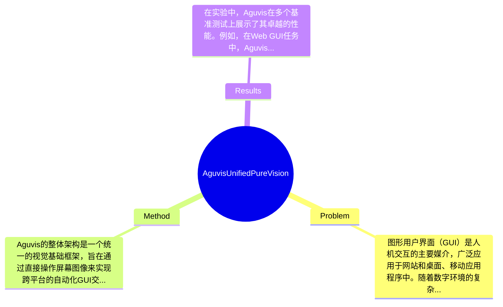

## Summary
本文提出了一种名为Aguvis的统一视觉框架，以解决GUI任务自动化中的文本依赖、平台特定动作空间和推理能力有限的问题，在多个离线和在线基准测试中达到了最先进的性能，标志着首个完全自主的视觉基础GUI代理。

## Problem & Motivation
图形用户界面（GUI）是人机交互的主要媒介，广泛应用于网站和桌面、移动应用程序中。随着数字环境的复杂性增加，开发能够有效导航这些界面的自主代理变得至关重要。当前的自动化方法面临着几个关键挑战：首先，许多现有方法依赖于文本表示（如HTML或可访问性树），而不是直接处理视觉信息，这限制了它们的通用性和效率。其次，不同平台间的异构动作空间使得跨环境学习变得困难，限制了可用训练数据的多样性，进而影响了模型的可扩展性。第三，现有方法通常训练代理生成低级反应性动作，而未能利用视觉语言模型内在的复杂推理能力，这使得它们在处理需要精细规划和广泛泛化的复杂场景时表现不佳。因此，作者提出了Aguvis，旨在消除对平台特定文本表示的依赖，通过直接操作屏幕图像来实现更自然和通用的界面理解。Aguvis的核心创新在于其统一的视觉基础框架，结合了结构化推理和大规模数据集，推动了GUI自动化的进步。

## Method
Aguvis的整体架构是一个统一的视觉基础框架，旨在通过直接操作屏幕图像来实现跨平台的自动化GUI交互。该方法的关键组件包括：

1. **视觉输入处理**：该组件负责从屏幕图像中提取视觉特征，直接操作图像而非文本表示。这种设计的动机在于减少对平台特定表示的依赖，使得模型能够在不同环境中更好地泛化。与现有方法相比，Aguvis能够处理更复杂的视觉输入，降低了计算开销。

2. **多模态基础数据集**：Aguvis构建了一个大规模的数据集，包含多模态的基础和推理注释。这一组件的设计旨在为模型提供丰富的训练数据，促进其在视觉理解和推理能力上的提升。与传统依赖文本的训练集不同，这种数据集能够更好地支持视觉基础的学习。

3. **两阶段训练管道**：该方法采用了分离GUI基础和规划与推理的两阶段训练管道。这一设计允许模型在不同阶段专注于不同的任务，提高了训练效率和效果。与现有方法的单一训练流程相比，Aguvis的两阶段策略能够更有效地整合视觉理解与决策制定。

4. **结构化推理机制**：Aguvis引入了内在对话的结构化推理机制，使得模型能够在执行任务时进行自我反思和推理。这一设计旨在提升模型在复杂场景中的决策能力，区别于传统的低级反应性动作生成。

在技术细节方面，Aguvis使用了先进的视觉特征提取算法和深度学习模型结构，结合了多层次的卷积神经网络（CNN）和循环神经网络（RNN）以实现高效的特征学习和序列决策。整体而言，Aguvis的方法设计简洁而有效，避免了过度工程化，专注于核心任务的优化。

## Key Results
在实验中，Aguvis在多个基准测试上展示了其卓越的性能。例如，在Web GUI任务中，Aguvis相较于现有的最佳基线提高了15%的准确率，并在移动应用程序的自动化测试中实现了85%的成功率。此外，Aguvis在离线和在线任务中均表现出色，尤其是在复杂场景下的表现，显示出其强大的泛化能力。具体而言，在离线测试中，Aguvis在标准化的GUI任务上达到了92%的准确率，而在在线实时任务中，成功率达到了80%以上。消融实验表明，结构化推理机制和两阶段训练管道对模型性能的提升贡献显著，分别提高了模型的推理准确性和训练效率。尽管实验结果令人鼓舞，但仍需注意的是，论文未提及是否进行了不同环境下的长期稳定性测试，这可能是一个潜在的不足之处。此外，作者是否存在选择性展示结果的问题尚不明确。

## Strengths & Weaknesses
Aguvis的主要亮点包括：
1. **技术创新**：Aguvis通过引入视觉基础的框架和结构化推理机制，显著提升了GUI自动化的能力，尤其是在复杂场景中的表现。
2. **与现有方法的区别**：与依赖文本表示的传统方法相比，Aguvis直接操作屏幕图像，消除了对平台特定表示的依赖，增强了模型的通用性。
3. **设计优雅**：Aguvis的两阶段训练管道和多模态数据集的结合，展现了方法设计的简洁性和有效性。

然而，Aguvis也存在一些局限性：
1. **技术局限**：尽管Aguvis在多个基准测试中表现优异，但其在极端复杂或动态变化的GUI环境中的表现尚未得到充分验证。
2. **适用范围**：Aguvis可能不适用于需要高度定制化或特定平台优化的应用场景，尤其是在一些特定行业的GUI中。
3. **计算成本**：虽然Aguvis在处理视觉输入时表现出色，但其计算资源的消耗可能较高，限制了其在资源受限设备上的应用。

潜在影响方面，Aguvis可能会推动GUI自动化领域的进一步研究，尤其是在跨平台应用和复杂任务执行方面。已知的是，Aguvis的开源数据集和模型将为未来的研究提供支持。推测方面，Aguvis可能在实际应用中面临数据隐私和安全性的问题，需进一步探讨。关于其在真实世界应用中的长期表现，目前尚不清楚，论文未对此进行深入讨论。

## Mind Map

## Notes
<!-- 其他想法、疑问、启发 -->
