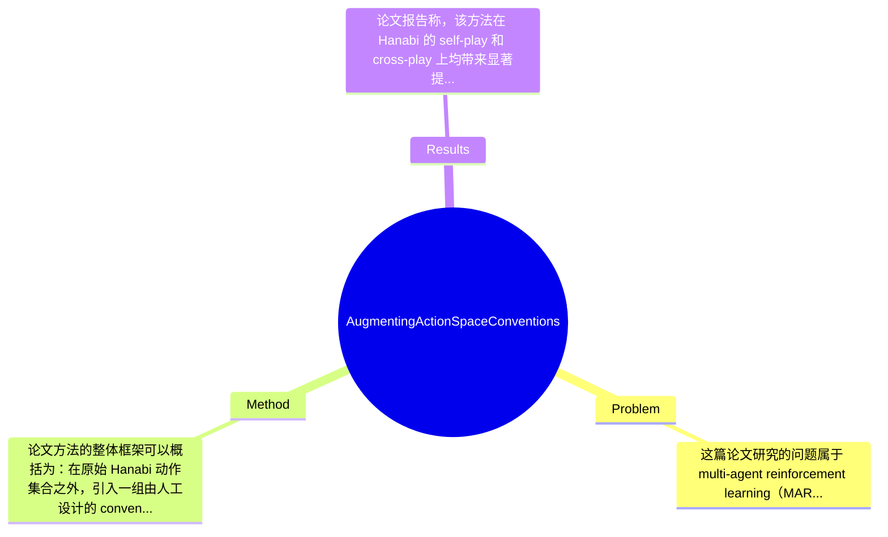

## Summary
该论文针对 Hanabi 中多智能体在部分可观测、受限通信条件下的协作学习问题，提出了通过 conventions（约定俗成的协作规则）来扩展 action space 的方法，把多步、跨智能体的协同行为封装为可主动选择的特殊动作；方法基于人类 Hanabi 约定设计，在 self-play 与 cross-play 上都取得了显著提升。相较于依赖复杂网络结构或重度算法技巧的既有方法，这一工作强调用结构化协作先验提升样本效率与合作质量。论文的核心贡献是把 convention 从“训练后出现的行为模式”提升为“显式可学习、可执行的动作层级单元”。

## Problem & Motivation
这篇论文研究的问题属于 multi-agent reinforcement learning（MARL）中的 cooperative decision-making，更具体地说，是在 Hanabi 这一典型部分可观测 cooperative game 中，如何让多个 agent 在通信受限的前提下形成稳定、高效且可泛化的协作策略。Hanabi 之所以重要，是因为它同时具备 hidden information、严格动作约束、有限提示资源以及强协同依赖，几乎把现实多智能体系统中的核心难点浓缩到了一个可控 benchmark 中。现实中，这类问题对应自动驾驶车队协同、无人机编队、受限带宽下的机器人协作等场景：每个体只见局部信息，但整体任务需要共享隐含意图与执行默契，因此仅靠单步显式通信往往不足。

现有方法的局限主要有三类。第一，许多 Hanabi 工作依赖复杂 architecture、belief modeling、搜索或大规模训练技巧，虽然性能高，但计算成本重、工程复杂，且不易迁移。第二，标准 RL 动作空间通常只包含“原子动作”，无法自然表达像“通过某个 hint 传递一整套意图”这种跨时间、多主体的协作协议，导致策略必须在底层动作级别上艰难地自行涌现约定。第三，已有方法常在 self-play 中表现不错，但 cross-play 脆弱：一旦搭档策略分布改变，隐式习得的 communication protocol 很容易失效。

论文的动机因此是合理的：既然人类在 Hanabi 中高度依赖 conventions 来减少沟通成本并放大提示信息，那么把 conventions 显式纳入 agent 的可选行为集合，可能比单纯堆叠模型复杂度更直接有效。本文的关键洞察在于：convention 不应只被当作后验分析中的“行为解释”，而可以被前置为 action abstraction，即把一段需要多步完成、并要求其他 agent 共同配合的协作模板当成高层动作，让学习过程在更适合合作的决策空间中进行。

## Method
论文方法的整体框架可以概括为：在原始 Hanabi 动作集合之外，引入一组由人工设计的 conventions，将其作为高层 cooperative actions 来扩展 agent 的 action space；agent 不再只学习“给谁什么提示、打哪张牌、弃哪张牌”这样的原子动作，还可以学习“触发某个约定并期待队友按约定解释”的结构化动作。底层学习器建立在文中回顾的 Independent Q-learning / Deep Q-learning 及 options 思想之上，因此本质上是一种把 conventions 视为 temporally extended cooperative options 的 action abstraction 方法。

关键组件可分为以下几点：

1. Convention 的形式化定义
   该组件的作用是把人类 Hanabi 中常见的协作规则转化为机器可执行的策略单元。论文强调 convention 并非单个离散动作，而是跨越多个 time step、涉及多个 agents 的行动序列，并且需要相关 agent “主动 opt in” 才能完整实现。这样设计的动机是，Hanabi 中很多提示的语义并不在表面动作本身，而在共享规则下的解释方式。例如某个 hint 在普通语义下只是颜色/数字提示，但在约定语义下可能意味着“立即可打”“保留关键牌”等。与现有方法相比，这里最大的区别是把协作协议显式编码进决策空间，而不是期待神经网络从海量交互中隐式发现。

2. Action space augmentation
   该组件是方法核心：把 conventions 作为额外 action 加到原始动作空间中。其作用是改变 agent 的搜索空间，使其能直接在“原子动作”和“约定动作”之间做选择。设计动机在于，原始动作空间虽然完备，但对学习 cooperative signaling 极不友好，因为一条有效协议往往需多个 agent 在多个回合内形成一致解释。扩展后的动作空间相当于提供了高层宏动作，使 credit assignment 更聚焦，也降低了策略涌现的组合难度。与传统 options 的差别在于，这里的 option 不只是单 agent 的 temporally extended behavior，而带有明确的社会语义和多 agent 依赖。

3. 基于人类 convention 的规则库构建
   论文在 Hanabi 小规模设置与标准 Hanabi 设置中分别实现了若干 conventions，附录中还列出 implemented conventions and principles。该组件的作用是提供可执行先验，使 augmentation 不是抽象概念，而是可直接训练和评测的具体机制。设计动机很明确：人类在 Hanabi 中已积累大量有效约定，这些规则天然适合信息受限协作。与纯数据驱动方法相比，它牺牲了一部分通用性，换取更强的 inductive bias 和更快的合作形成。

4. 与 DQN / IQL 学习流程的集成
   从目录看，作者先回顾 Independent Q-learning、Deep Q-learning 与 options，再将 convention augmentation 嵌入现有 RL 学习范式。其作用是证明该方法不是必须依附某个复杂新架构，而可以作为现有 value-based MARL 的插件。设计上，这提升了方法的可复用性和可解释性。论文未在所给内容中完整展开网络结构细节，但可以确定其重点不在发明新 backbone，而在改变决策接口。

5. Self-play 与 cross-play 双重评测导向
   方法并非只优化 self-play，而是显式关注 cross-play。其背后逻辑是：真正有价值的 convention 应当提高搭档间兼容性，而不是只服务于同分布镜像策略。把 convention 做成共享高层动作，理论上有助于形成更稳定、更可解释的合作语义。

技术上，这个方法最像“带社会语义的 hierarchical action abstraction”。必须的设计是：定义 convention 的触发条件、执行流程、队友响应机制，以及这些高层动作如何映射回合法原子动作。可替代的选择包括：用 learned options 自动发现约定、用 latent communication 学习协议、或通过 centralized training 学习隐式 signaling。就简洁性而言，本文方法相当简洁优雅：它没有堆叠过多模型组件，而是从问题结构出发重塑 action space。不过它也带有明显的人为工程痕迹，因为 convention 的选择与规则设计依赖 domain knowledge，不完全自动化。

## Key Results
论文报告称，该方法在 Hanabi 的 self-play 和 cross-play 上均带来显著提升，且适用于不同数量的 cooperators，这是全文最核心的实验结论。Benchmark 主要就是 Hanabi，并区分了 small Hanabi 的 preliminary results 与完整 Hanabi 的 performance evaluation；评测章节明确包含 Self-play Performance 与 Cross-play Performance，说明作者不仅看封闭协作性能，也看不同策略之间的兼容性。指标按 Hanabi 研究惯例大概率是 average score，但在当前提供内容中，具体 benchmark 配置、玩家人数划分、以及各表格中的精确数值未完整给出，因此不能捏造具体分数，必须标注为论文节选未提供。

从摘要可确定的结果是：基于 conventions 的 action space augmentation 对“existing techniques”有显著提升，而且这种提升同时出现在 self-play 与 cross-play。若论文在附录 C 提供 Statistical Significance Test，则说明作者至少意识到均值提升不足以支撑结论，需要进一步验证统计显著性，这是实验严谨性的加分项。不过由于当前未看到 p-value、置信区间或效应量，无法判断提升是否稳定且幅度是否足够大。

对比分析上，作者的论点是：相比依赖复杂 architecture design 和 algorithmic manipulations 的方法，他们的方法以更低复杂度引入协作先验，仍能取得更好表现。这个对比在叙事上有吸引力，但严格来说，还需要看到与哪些 baseline 比、提升多少分、在 2-player / 3-player / 4-player / 5-player Hanabi 上是否一致提升。如果只在某些玩家数量上强，或只在小规模版本上明显，则结论边界会变窄。

消融实验方面，从目录推断，论文很可能比较了不同 convention 集、small Hanabi 与 full Hanabi、以及是否启用 augmentation 的差异，但当前材料没有给出组件级数字。实验充分性方面，已有 self-play 与 cross-play 是优点，但仍缺少几个关键验证：第一，convention 数量增加是否单调收益，还是会引入学习混乱；第二，面对不共享相同 convention 的搭档是否鲁棒；第三，训练样本效率与计算成本是否真的优于复杂 baseline。至于 cherry-picking，现有材料无法证明作者是否只挑有利设定展示，因此应谨慎评价为“无法判断，论文节选未提供完整结果表”。

## Strengths & Weaknesses
这篇论文最突出的亮点有三点。第一，问题切入点非常好：它没有沿着“更大网络、更复杂 belief model”继续堆模型，而是回到 Hanabi 的本质——协作依赖共享约定——因此创新更偏向问题结构建模，而非单纯性能工程。第二，把 convention 提升为 action space 中的显式高层动作，是一个相当自然且有解释性的设计；这让“提示为何有意义”不再完全埋在黑箱参数里。第三，方法兼顾 self-play 与 cross-play，这比只追求镜像自博弈高分更接近真实多智能体协作需求。

局限性也很明显。第一，技术局限在于对人工设计 convention 的依赖较强。若规则库设计得好，性能可能大幅提升；若规则不适合任务分布，augmentation 反而会引入无效动作、扩大搜索空间、干扰学习。第二，适用范围可能偏窄。Hanabi 非常适合用人类 conventions 建模，因为它本就存在成熟约定文化；但在开放世界、多模态感知、动态任务目标的 MARL 场景中，人工定义高质量 convention 可能非常困难。第三，cross-play 的提升很可能建立在“共享同一套 convention 先验”之上；若搭档来自不同 convention 体系，甚至完全不知道这些规则，方法的兼容性未必成立。第四，虽然作者批评复杂方法计算成本高，但本文是否真的更省算力，需要训练时间、参数量、sample efficiency 等数字支持；当前节选未给出。

潜在影响方面，这项工作对领域的贡献在于提醒研究者：多智能体 cooperation 的关键不只在更强 function approximator，也在更好的 coordination interface。它可能启发后续研究结合 options、hierarchical RL、symbolic protocol learning、甚至 LLM-style rule induction，自动发现和选择 conventions。

已知：论文明确提出用 conventions 扩展 action space；这些 conventions 跨时间、跨 agent，需要主动配合；在 Hanabi 的 self-play 与 cross-play 上有显著提升。推测：方法可能改善 sample efficiency，并提升策略可解释性；其收益可能在玩家更多、协作更复杂时更明显。不知道：具体提升幅度、各玩家人数下结果分布、训练资源消耗、对未共享 conventions 搭档的鲁棒性、以及是否优于最强 SOTA。综合来看，这是一篇有参考价值的结构性方法论文，但从当前材料看，还不足以认定为里程碑工作。

## Mind Map

## Notes
<!-- 其他想法、疑问、启发 -->
