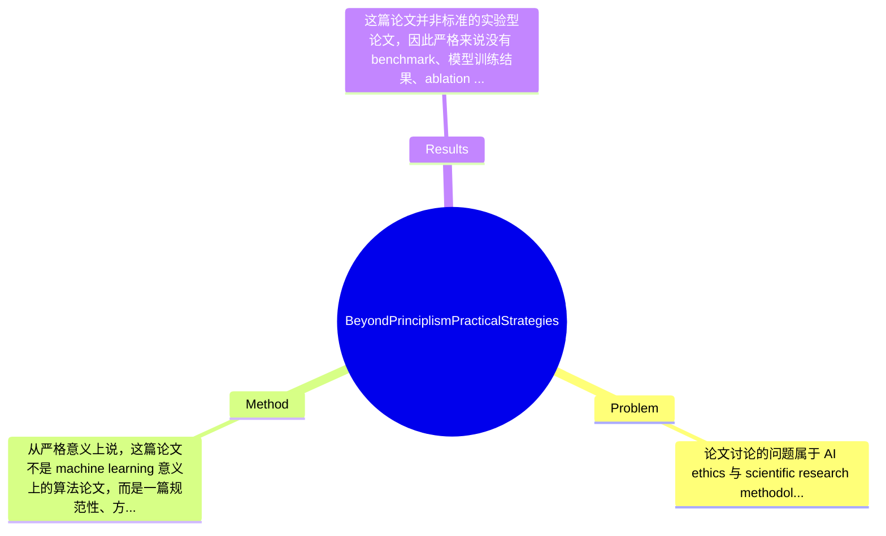

## Summary
这篇论文关注生成式 AI，尤其是 LLM，在科研实践中的伦理使用问题，指出现有 principlism、formalism 和 technological solutionism 过于抽象或僵化，难以指导日常研究操作；作者提出一种以用户为中心、受 realism 启发的实践框架，围绕五个可操作目标给出策略、误用案例与纠正建议，并补充透明性与可复现性的文档规范。其主要贡献不是提出可量化的新模型或 benchmark SOTA，而是把抽象 AI ethics 原则转化为更贴近科研工作流的实践指导框架。

## Problem & Motivation
论文讨论的问题属于 AI ethics 与 scientific research methodology 的交叉领域，核心是：当生成式 AI 和 LLM 被快速引入文献综述、数据分析、写作辅助、代码生成、审稿支持等科研流程时，研究者缺乏一套既有伦理基础又能真正落地执行的使用规范。这个问题之所以重要，是因为科研场景对真实性、可追溯性、版权合规、隐私保护和学术诚信的要求明显高于一般商业应用；如果研究人员在不理解模型局限的情况下直接把 AI 纳入工作流，可能造成错误结论传播、数据泄露、署名争议、隐性抄袭以及难以复现实验流程等后果。现实意义上，这一问题影响高校、科研机构、医院、产业研发团队以及期刊和资助机构的政策制定。作者对现有方法的批评较明确：第一，principlism 依赖 fairness、accountability、transparency 等高层原则，但这些原则常常停留在宣言层面，无法回答“研究者今天该如何使用 ChatGPT/LLM 完成具体任务”；第二，formalism 强调规则和禁令，虽然便于管理，却容易忽视具体研究情境差异，例如不同学科对数据敏感性、代码复用和写作协助的容忍度并不一致；第三，technological solutionism 倾向于相信用更多检测器、审计工具或模型修补就能解决伦理问题，但科研伦理并不只是技术可控性问题，还涉及制度、判断和责任归属。作者提出新框架的动机总体合理：既不能只讲抽象原则，也不能只靠一刀切禁令，而应把伦理判断嵌入研究实际流程。其关键洞察在于，把“是否伦理”从静态原则遵守转向“相对于替代方案是否真正带来净益处”的实践评估，并用五个目标把复杂伦理议题拆解为可执行任务。

## Method
从严格意义上说，这篇论文不是 machine learning 意义上的算法论文，而是一篇规范性、方法论导向的框架论文。其“方法”核心是构建一个 user-centered、realism-inspired 的伦理实践框架，用于指导研究者在具体科研工作流中评估和使用生成式 AI。整体架构可以概括为：先诊断当前 AI ethics 指导中的“Triple-Too”问题，再批判三类主流治理思路的不足，随后提出五个面向日常研究活动的伦理目标，并为每个目标配套操作策略、误用案例、纠正措施和文档化要求，最终把伦理判断嵌入研究决策、培训和治理机制中。

1. 五目标伦理框架（核心骨架）
   该组件是全文最核心的结构。作者提出五个目标：理解模型训练与输出及 bias mitigation；尊重 privacy、confidentiality 与 copyright；避免 plagiarism 和 policy violation；相对替代方案有益地使用 AI；透明且可复现地使用 AI。其作用是把抽象伦理原则转译成研究者能直接检查的任务清单。设计动机在于，相比“公平”“责任”这类高层概念，研究者更容易围绕具体目标进行自查。与现有 principlism 的区别是，这里不从价值原则出发，而从研究活动中的决策节点出发，强调情境化判断。

2. 对 bias 来源与缓解阶段的分解
   论文特别讨论了 LLM bias 在数据抓取、采样、预处理、pre-training、fine-tuning、RLHF、评估和部署等阶段的来源，并给出如提升数据多样性、reweighting、正则化、多样化人类反馈、adversarial testing 等缓解策略。该组件的作用是提醒研究者：模型输出问题不能只归因于“模型犯错”，而要追溯训练链条。设计动机是提升用户对模型生成内容的认识深度，避免把 LLM 当作中立工具。与一般科研伦理文件不同，这部分更接近技术性解释，试图连接 AI governance 与 model lifecycle。需要注意的是，论文只提供概念层面的阶段划分，并未提出新的 bias measurement algorithm；因此这是知识整合而非技术创新。

3. 基于替代方案的 utility evaluation
   作者强调，伦理 AI 使用不应只看孤立性能指标，而应比较 AI 与现有替代方案在效率、准确性、风险和收益上的综合效用。例如，在写作辅助、编码、信息筛选等任务中，问题不只是“AI 会不会出错”，而是“相比人工或传统软件，它是否在可接受风险下带来更高净收益”。这个设计很关键，因为它把伦理讨论从绝对禁用/绝对允许转向情境依赖的 cost-benefit judgment。与 formalism 的差异在于，它不预设固定答案，而要求研究者在具体任务中比较 alternatives。缺点是，这一评估框架偏原则性，缺乏标准化量表、决策树或量化打分细则，落地时仍需机构自行补充。

4. 透明性与可复现性的 documentation guideline
   作者提出应记录 AI-assisted research 的使用方式，以增强 transparency 和 reproducibility。该组件作用是让研究过程可追溯，便于同行判断 AI 在研究中的影响边界，例如模型名称、版本、用途、提示词范围、人工审核方式等。设计动机很清楚：若 AI 介入过程不被披露，后续研究者无法复现，也无法分辨责任归属。与很多仅要求“披露是否使用 AI”的政策相比，作者更强调面向科研工作流的细粒度文档化。不过摘要未给出完整模板字段，论文节选中也未看到统一标准，因此其可操作性可能依赖作者在正文中的附录或补充说明；若无，则仍偏倡议性质。

5. 培训与平衡执行机制
   作者最后提出 targeted professional development、training programs 和 balanced enforcement mechanisms。该组件的作用是说明伦理实践不只是个人自律，还需要组织层面的能力建设和制度约束。设计动机在于，单靠研究者个人理解无法解决复杂情境中的判断差异。与 technological solutionism 的区别是，这里不把治理外包给技术工具，而把培训、制度和技术并列看待。就方法简洁性而言，整篇论文框架清晰、逻辑上较简洁，没有过度工程化；但也正因其高度框架化，许多关键设计仍停留在规范建议层面，缺少可直接执行的表单、流程图、评分 rubric 或跨学科案例对照，这限制了方法的操作精度。

## Key Results
这篇论文并非标准的实验型论文，因此严格来说没有 benchmark、模型训练结果、ablation study 或显式的 quantitative comparison。根据提供内容，论文的“结果”主要体现在理论与实践框架的产出上，而不是具体数值提升。已知的主要产出包括：第一，作者提出“Triple-Too”诊断，即当前科研 AI 伦理治理存在过多高层倡议、原则过于抽象、过度聚焦风险与限制而忽视效用三类问题；第二，提出五个伦理目标作为实践框架；第三，补充了 bias 来源—缓解策略链条以及 documentation guideline，用于提升透明性和可复现性。若从论文体裁看，这些是 conceptual contributions，而不是 empirical results。

就 benchmark 和指标而言，论文未提及任何公开 benchmark 名称，也未报告如 accuracy、F1、AUROC、human evaluation score、policy compliance rate 等具体指标。也没有与 baseline framework 进行量化比较，例如未展示采用该框架后研究者合规率提升多少、误用率下降多少、复现性评分提高多少。因此若按照机器学习论文的结果标准，这部分证据明显不足。对比分析方面，作者主要是概念性比较 principlism、formalism 和 technological solutionism 三种路径的不足，但没有基于问卷、案例库、用户研究或机构政策审计给出实证支持，因此不能说服性地证明新框架优于既有框架，只能说提出了一个更具实践导向的候选方案。

消融实验方面，论文未提及。我们无法知道五个目标中哪些最关键、是否缺一不可，也不知道 documentation guideline 是否单独就能显著改善研究透明性。实验充分性方面，这篇文章最大的缺口是缺乏用户研究：例如让不同学科研究者应用该框架处理真实案例，比较决策一致性、时间成本、违规率、主观可用性等。也缺少跨领域案例验证，特别是医学、社会科学、计算机科学中 AI 使用边界差异很大。关于 cherry-picking，论文主要展示的是支持其论点的误用风险与纠正策略；由于缺少系统案例采样方法，无法判断是否存在选择性呈现，但至少从已给材料看，作者并未用夸大的数字结果制造“显著优越性”。

## Strengths & Weaknesses
这篇论文的亮点首先在于问题切得很准。它没有重复抽象地谈 fairness、accountability，而是直接指出科研场景中的“Triple-Too”困境，这一诊断具有较强现实感，也解释了为什么许多 AI ethics 文件看起来正确却难以指导研究者日常决策。第二个亮点是框架设计强调 user-centered 和 practice-oriented，把伦理要求拆成五个目标，覆盖模型理解、隐私版权、学术诚信、效用比较和透明复现，结构完整且贴近科研工作流。第三个亮点是它引入“相对替代方案的效用评估”这一视角，避免把 AI 伦理简化为禁用清单；这比单纯强调风险更平衡，也更适合创新环境。

局限性也很明显。第一，技术与方法层面缺乏可验证性：论文提出的是规范框架而非可执行 protocol，没有量化 rubric、标准化审查模板或决策流程图，导致不同机构可能得出高度不一致的实施版本。第二，缺乏实证评估：没有用户实验、案例编码研究、跨学科比较或政策试点，因此很难判断该框架在降低误用、提高透明性或改善研究质量方面是否真的有效。第三，适用范围虽广但也因此可能过于一般化；不同领域对 privacy、copyright、AI-assisted writing 的容忍度差异很大，而论文当前更像通用倡议，未充分展开学科差异和高风险场景边界。第四，计算成本不是主要问题，但组织实施成本可能不低，因为真正落地需要培训、审计和文档基础设施。

潜在影响方面，这篇工作更适合作为科研机构、期刊、实验室制定 AI 使用政策的参考框架，而不是研究模型设计的技术论文。它可能推动未来出现更细粒度的 disclosure template、AI-assisted research checklist、学科定制政策以及研究人员培训课程。

已知：论文明确提出五个伦理目标，批评三类现有路径，并强调 transparency、reproducibility 与 utility-relative-to-alternatives。推测：作者希望该框架成为机构政策和研究者教育的中层工具，连接抽象伦理原则与具体实践，但这一用途在现有材料中未被系统验证。不知道：框架是否经过用户研究、是否有附录模板、是否已在真实实验室或期刊政策中试用、不同目标之间是否存在优先级或冲突解决机制，论文未提及。

## Mind Map

## Notes
<!-- 其他想法、疑问、启发 -->
