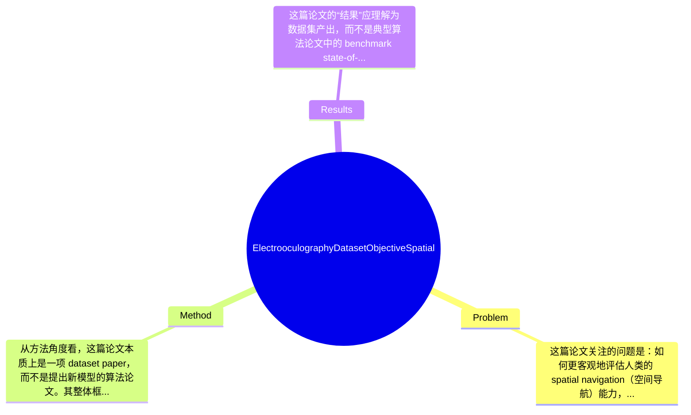

## Summary
该论文提出并公开了一个用于客观评估健康人群空间导航能力的 Electrooculography (EOG) 数据集，采集了27名受试者在 Leiden Navigation Test 视频观看阶段的水平与垂直眼动信号，并配套提供 Mini-Mental State Examination 与 Wayfinding Questionnaire 等认知量表信息；其主要贡献不是新算法，而是构建了一个将眼动生理信号与空间认知测评关联起来的多模态研究资源，为后续基于 EOG 的 spatial navigation 分析提供数据基础。

## Problem & Motivation
这篇论文关注的问题是：如何更客观地评估人类的 spatial navigation（空间导航）能力，以及如何将眼动相关生理信号与这一高级认知功能联系起来。该问题属于认知神经科学、biomedical signal processing 与 cognitive assessment 的交叉领域。空间导航并不只是“找路”这么简单，它涉及工作记忆、注意分配、环境表征、决策和执行功能，因此在健康老龄化、神经退行性疾病筛查、康复训练和人机交互中都具有重要意义。现实中，传统导航能力评估大多依赖问卷、自报告、行为测验或高成本 eye tracking 设备，这些方法要么主观性较强，要么设备昂贵、部署复杂、难以长时连续监测。相比之下，EOG 作为通过眼周电信号测量眼动的技术，具有低成本、可穿戴、时间分辨率高、适合连续采集等优势，因此具有较强应用潜力。

现有方法的局限主要体现在三点。第一，许多导航研究依赖实验室内行为指标或问卷，难以捕捉瞬时视觉搜索和注视转移过程，因而无法细粒度解释被试在导航中的认知策略。第二，视频眼动或 camera-based eye tracking 虽然空间精度高，但系统昂贵、对光照和头部稳定性较敏感，不利于大规模或自然环境部署。第三，公开可用的、将 EOG 与导航能力评分直接绑定的数据集非常少，导致算法开发、跨研究比较和可重复性验证都受限。

论文的动机因此是合理的：作者试图弥补“空间导航任务中的 EOG 数据资源匮乏”这一基础设施缺口，而不是直接提出一个分类或预测模型。其关键洞察在于，若能在标准化导航任务（Leiden Navigation Test）下同步采集原始/处理后的 horizontal 与 vertical EOG，并配套认知量表分数，就能为后续研究建立一个从低层生理动态到高层导航能力之间的桥梁。不过也要看到，这种洞察更多体现为数据组织和研究资源建设，而非理论机制上的突破。

## Method
从方法角度看，这篇论文本质上是一项 dataset paper，而不是提出新模型的算法论文。其整体框架可以概括为：在标准化的空间导航测评场景中，对健康受试者采集 EOG 眼动信号，并结合认知筛查与导航相关问卷，整理为可供后续分析的多模态数据集。方法重点在于实验设计、信号采集、数据整理与元数据标注，而非训练某个 machine learning 模型。

1. 整体数据采集架构
该数据集围绕 Leiden Navigation Test 的视频观看阶段构建。受试者在执行该标准化任务时，系统同步记录水平与垂直 EOG 信号，形成与空间导航相关的时间序列数据。这样的设计动机很明确：相比开放式自由行为任务，标准化视频范式可以降低环境差异，使不同参与者之间更可比。与很多只给出单一行为分数的研究不同，这里保留了连续生理信号，因此后续研究者可以自行提取 fixation-like pattern、saccade proxy、频谱特征或时序统计特征。

2. 受试者与认知标签构成
论文明确指出数据来自27名 healthy subjects。除 EOG 之外，作者还收集了 Mini-Mental State Examination (MMSE) 和 Wayfinding Questionnaire 分数，后者包含 navigation、orientation、distance estimation、spatial anxiety 等维度。该组件的作用是为眼动信号提供认知和行为层面的标签，使研究者不只是做纯信号分析，还能探索 EOG 与空间能力、焦虑感、方向感之间的相关关系。设计上，这比仅保存“任务完成与否”更有信息量，也与当前多模态 cognitive assessment 的趋势一致。与现有不少生理数据集只提供年龄性别等基础人口统计信息不同，这里加入了任务相关量表，是一个实用增强。

3. EOG 信号类型与预处理
数据集包含 raw and processed EOG signals，且覆盖 vertical 与 horizontal 两个通道方向。原始信号保留了研究者自行设计滤波、漂移校正、事件检测方法的空间；处理后信号则降低了使用门槛，便于非信号处理背景的研究者直接开展分析。作者在背景部分强调了 EOG 可进行实时处理，并提到 model-oriented denoising 相比传统 bandpass filtering 更能保留信号内在特征，但就用户提供的内容看，具体采用了何种预处理流程、滤波参数、伪迹去除算法、采样率与分段策略，论文摘要未完整给出，因此这些技术细节在现有材料下只能标注为“论文未提及”或“提取内容未覆盖”。这也是 dataset paper 常见的问题：若文档不充分，数据复用门槛仍然存在。

4. 标准化任务选择：Leiden Navigation Test
选用 Leiden Navigation Test 的视频观看阶段，是本研究设计中的关键选择。它的作用是提供一个与 spatial navigation 直接相关、同时又可控的刺激环境。视频任务比真实场景导航更容易标准化，也能避免自由移动时 EOG 受头动和身体运动强烈干扰。设计动机是牺牲部分生态效度，换取更强的实验可比性和更干净的信号质量。与真实世界 wayfinding 相比，这种设计更适合建立基准数据集，但其外部有效性会受到限制。

5. 数据组织与可用性评价
从论文描述看，数据集包含参与者相关信息、量表分数、原始/处理后 EOG，说明作者有意识地将数据整理成较完整的研究资源，而不是只上传若干裸信号文件。这种组织形式有助于后续开展 supervised learning、correlation analysis 或 subgroup comparison。整体方法在工程上相对简洁，没有复杂硬件闭环或多传感器融合，优点是清晰易懂；但从另一个角度看，也意味着方法创新主要停留在“构建数据资源”层面，而不是提出新的标注体系、采集协议优化方法或统一的分析 baseline，因此简洁但创新强度有限。

## Key Results
这篇论文的“结果”应理解为数据集产出，而不是典型算法论文中的 benchmark state-of-the-art。根据摘要中明确给出的信息，最核心的结果是：作者构建了一个包含27名健康受试者的 EOG 数据集，采集内容包括水平与垂直 EOG 信号，并同步提供 MMSE 与 Wayfinding Questionnaire 分数。也就是说，论文最明确、最可核验的成果数字就是样本量 n=27，以及多模态数据组成：raw EOG、processed EOG、认知筛查分数和导航相关问卷维度。

从 benchmark 角度看，论文并未像 machine learning 论文那样在公开 benchmark 上报告 accuracy、F1、AUC、RMSE 等指标；这里的“benchmark”更接近实验范式本身，即 Leiden Navigation Test 的视频观看阶段。可惜用户提供内容中没有看到更细的统计结果，例如不同量表分数分布、EOG 振幅/频谱特征统计、test-retest reliability、跨被试方差、信号质量指标、数据缺失率等。因此若要求“具体数值”，目前除27名受试者外，论文摘要没有进一步给出。对于 processed EOG 的效果、去噪性能提升、与导航分数的相关系数，也均为论文未提及或提取内容未覆盖。

对比分析方面，这项工作也没有呈现与已有数据集的系统比较，例如与传统 eye tracking 导航数据集相比在成本、时间分辨率、可穿戴性上的量化优势，或与其他 EOG dataset 在任务设计、通道数、标签丰富度上的差异。这使得读者难以判断其在公开资源版图中的独特位置。消融实验在 dataset paper 中本就不一定适用，而当前材料也未显示作者提供了例如“仅原始信号 vs 原始+量表标签”的下游任务性能比较。

从实验充分性看，这篇论文更像是资源发布的第一步，充分性一般。它完成了数据采集与整理，但如果想证明该数据集对空间导航研究“确实有用”，还应补充至少一类 baseline 分析：如 EOG 特征与 Wayfinding Questionnaire 子量表的显著相关、基于 EOG 预测高低导航能力组的初步分类结果、或 processed signal 相对 raw signal 的质量改进指标。就目前展示方式看，不算明显 cherry-picking，因为作者本身没有展示大量“漂亮结果”；但也正因缺少系统分析，论文的说服力更多依赖数据集的潜在价值，而非已被实证验证的研究发现。

## Strengths & Weaknesses
这篇论文的主要亮点首先在于选题定位准确。已知事实是，作者将 EOG 这种低成本、可连续记录的眼动测量方式，与空间导航这一高级认知功能连接起来，并在数据层面提供了 raw/processed signals 加认知量表的组合。这比单纯发布裸 EOG 更有研究价值，因为它允许后续工作探索“信号—认知”映射。第二个亮点是采用标准化的 Leiden Navigation Test 视频阶段作为任务背景，这在已知信息范围内有助于控制刺激条件，提高被试间可比性。第三个亮点是数据内容相对完整，除了 MMSE，还包含 Wayfinding Questionnaire 的多个维度，如 orientation、distance estimation、spatial anxiety，这使得研究问题可以更细分，而不是只做一个粗糙的总分回归。

但局限也很明显。第一，技术局限在于样本量较小，已知只有27名 healthy subjects。对于构建稳定的统计关联、训练泛化良好的 machine learning 模型或进行子群体分析，这个规模偏小，尤其在个体差异很大的眼动信号研究中更是如此。第二，适用范围有限。已知数据只包含健康参与者，推测其年龄范围和人群多样性可能有限，因此很难直接外推到老年群体、MCI、Alzheimer’s disease 或其他神经系统疾病患者；而这些恰恰是空间导航评估最具临床意义的应用方向。第三，生态效度不足。已知任务发生在视频观看阶段，而不是现实导航或 VR/AR 交互环境，因此测到的更像是“观看导航场景时的眼动反应”，不一定等价于真实 wayfinding 行为。第四，文档透明度可能不够。根据当前可见内容，不知道采样率、设备规格、预处理参数、同步方式、信号质量控制标准是否完整公开；这些信息若缺失，会直接影响复现和二次分析。

潜在影响方面，已知该数据集可作为 spatial cognition、EOG signal processing、cognitive assessment 交叉研究的基础资源。合理推测，它可被用于开发基于 EOG 的导航能力客观评估工具、老年认知衰退早筛方法、或低成本人机交互系统中的用户状态建模。至于其是否能支持临床级诊断、是否具备跨设备泛化能力、是否包含足够长时序用于深度学习建模，目前不知道，论文摘要未提供证据。

已知：27名健康受试者；包含水平/垂直 raw 与 processed EOG；包含 MMSE 和 Wayfinding Questionnaire 多维分数；任务场景是 Leiden Navigation Test 视频观看阶段。推测：作者希望该数据集服务于导航能力建模和认知筛查研究；视频范式有助于减少运动伪迹。不知道：设备具体参数、采样率、预处理算法、信号质量指标、是否公开下载链接、是否有 baseline 模型与统计显著性分析。

## Mind Map

## Notes
<!-- 其他想法、疑问、启发 -->
