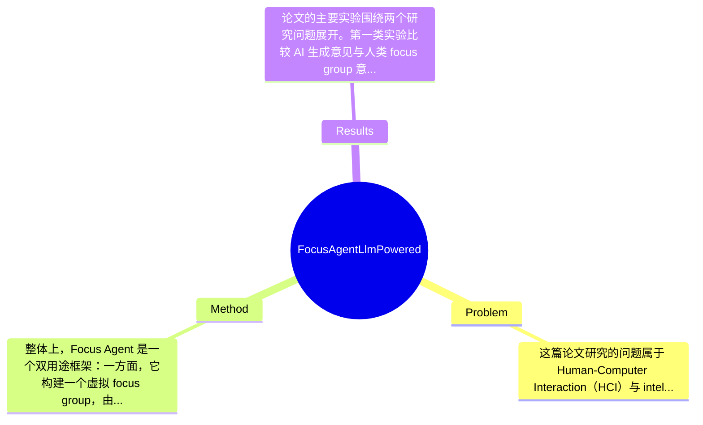

## Summary
该论文针对 HCI 中 focus group 组织成本高、主持人依赖强的问题，提出了一个由 LLM 驱动的 Focus Agent，用于同时模拟虚拟参与者并在真人参与场景中担任 moderator。作者通过 5 组、共 23 名人类参与者的实验，将 AI 生成的讨论内容与真人 focus group 进行比较，结果表明其生成观点在定量分析上与人类意见具有一定相似性，但在真实主持能力上仍存在改进空间。

## Problem & Motivation
这篇论文研究的问题属于 Human-Computer Interaction（HCI）与 intelligent virtual agents 的交叉领域，核心目标是用 Large Language Model 替代或辅助传统 focus group 中两类关键角色：一类是讨论参与者，另一类是 moderator。focus group 本质上是一种定性研究方法，通过多人讨论挖掘用户态度、体验与需求，在产品设计、用户研究、教育、医疗和社会科学中都非常重要。它的重要性不只在于“收集意见”，更在于通过群体互动激发个体难以单独表达的观点，因此对 HCI 的设计前期探索与系统评估尤其关键。现实意义上，如果能够用 LLM 降低组织成本，就可能显著减少招募困难、时空协调困难和对高水平主持人的依赖，使早期设计研究、迭代评估和难接触人群研究更易开展。

现有方法存在几个具体局限。第一，传统线下或线上 focus group 需要同时协调多人时间，对 geographically dispersed 或 hard-to-reach 群体尤其困难；这不是一般性的“成本高”，而是直接限制样本覆盖与研究频率。第二，focus group 质量高度依赖 moderator 的经验，主持人若不擅长追问、控场或平衡发言，很容易得到表层、偏置甚至低效数据。第三，已有多 agent simulation 工作虽能生成多角色对话，但通常并非围绕严格的 HCI 定性研究流程设计，也不一定关注 moderator duty、议程推进和可比较的数据质量。

论文的动机总体合理：作者不是简单地宣称“LLM 可以替代人类”，而是试图检验两个更具体的问题——LLM 生成的意见在多大程度上接近人类 participant，以及 LLM 作为 moderator 是否能有效履行主持职责。这个动机比单纯追求自动化更扎实，因为它把研究重点放在数据质量与方法有效性上。论文的关键洞察在于：如果给 LLM 设定 participant personas 与 discussion plan，它可能不只是生成流畅文本，而是能在一定程度上复现 focus group 的意见分布与主题结构；同时，LLM 作为 moderator 的价值不一定是完全替代人类，而可能先体现在辅助提问、结构化推进和降低门槛上。

## Method
整体上，Focus Agent 是一个双用途框架：一方面，它构建一个虚拟 focus group，由 AI moderator 与多个 AI participants 围绕给定议题展开讨论；另一方面，它也可作为 voice-based conversational agent，在有人类参与者的真实 focus group 中担任 moderator。换言之，这不是单一 chatbot，而是一个围绕“定性研究流程”设计的 LLM 系统，目标是把议程规划、轮次对话、问题生成、发言管理和讨论记录整合起来。

第一，虚拟 focus group simulation 是方法的核心组件之一。其作用是让多个 AI participants 在同一研究问题下给出不同观点，从而模拟真实小组讨论。设计动机在于，focus group 的价值不只是单个问答，而是多人之间的交互式观点生成，因此单 agent 问答不足以替代。与一般 multi-agent conversation 不同，这里的 simulation 明确服务于 HCI qualitative research，强调围绕 moderator prompt 的受控讨论，而不是开放域闲聊。论文摘要与章节信息表明作者将 AI participants 与真实 focus group 结果做对应比较，但关于 participant persona 的构造方式、人数配置、prompt 模板、记忆机制等细节，在给定材料中论文未提及。

第二，LLM moderator 组件负责生成问题、跟随 discussion plan 推进流程，并依据当前讨论内容进行追问。该组件的作用相当于把传统人类主持人的部分职责形式化：开场、提问、转场、维持主题相关性。这样设计的动机是，focus group 成败高度依赖 moderator，因此若只模拟参与者而不建模主持过程，所得数据很可能与真实研究流程脱节。与传统脚本式虚拟主持人相比，LLM moderator 的区别在于能够根据上下文动态生成 follow-up questions，而非仅按固定问卷依次发问。这也是论文最值得注意的点之一，因为它试图评估 LLM 是否具备某种“moderation intelligence”，而不只是语句生成能力。

第三，voice-based interaction 组件把 Focus Agent 从纯文本系统扩展到与人类参与者的真实互动场景。根据目录中“Multi-speaker speech recognition for Voice-based Conversational Agents”和“Voice-based Focus Agent with human participants”，可以推断系统使用多说话人语音识别来处理多人发言，再将内容送入 LLM 生成主持回应。这个组件的作用是使系统符合真实 virtual focus group 的使用方式，而不是只在离线文本上验证。设计动机在于真实 focus group 大多是语音交互，多人同时发言、打断、重叠说话会显著影响主持效果。与纯文字多 agent 模拟相比，这一步更接近部署场景，但也引入了 ASR 错误传播、说话人分离困难和响应延迟等问题。具体使用何种 ASR 模型、延迟指标、系统架构细节，给定材料中论文未提及。

第四，human-AI comparative study 其实也是方法的一部分，而不只是实验设置。作者先运行 5 场真人 focus group，再让 Focus Agent 对相同或相近议题进行模拟，用 quantitative analysis 比较 AI 与 human opinions 的相似性。这种设计的意义在于，不把“看起来像人”作为成功标准，而是用可比较的研究产出评估系统价值。与许多只做 demo 的 LLM agent 工作不同，这里至少尝试把系统输出映射到 qualitative research 的评价维度上。

技术细节方面，已知信息显示系统依赖 LLM 进行内容生成、追问与角色对话，并结合 multi-speaker speech recognition 支持语音模式。训练策略、是否进行 instruction tuning、是否使用 retrieval、是否有长期记忆模块、prompt engineering 的具体形式，论文在给定内容中未提及。就设计选择而言，LLM 驱动的 moderator 是相对必要的，因为论文研究问题之一就是 moderator effectiveness；但 AI participant simulation 未必只有多 agent 这一条路，也可以考虑基于真实访谈语料的 case-based generation 或检索增强。简洁性上，这个框架概念上是清晰的：participant simulation + moderator agent + voice interface + human comparison，整体不算过度工程化；但若要在真实研究流程中稳定可用，其背后可能需要大量 prompt 设计、流程控制和异常处理，而这些复杂度在摘要级材料里尚未完全展开。

## Key Results
论文的主要实验围绕两个研究问题展开。第一类实验比较 AI 生成意见与人类 focus group 意见的一致性。作者共进行了 5 场 focus group，涉及 23 名人类参与者，并部署 Focus Agent 模拟这些讨论。摘要中明确给出的结论是：quantitative analysis 表明 Focus Agent 能生成与人类参与者“similar”的意见。这说明作者至少进行了某种定量相似性评估，而不是只给出案例式主观展示。但非常关键的是，给定材料没有提供具体 benchmark 名称、评价指标名称、统计方法以及精确数值，因此无法报告诸如 cosine similarity、theme overlap、inter-rater agreement 或显著性检验结果；这些都必须标注为论文未提及（在当前提供文本中未出现）。

第二类实验是让 Focus Agent 在包含真实人类参与者的场景中担任 moderator。论文指出，该研究“exposes some improvements associated with LLMs acting as moderators”，意味着结果并非简单证明 AI moderator 成功替代人类，而是发现其有一定可行性，同时暴露出需要改进之处。结合章节“Meta Focus Group Theme 1/2/3”可看出，作者还收集了参与者对 focus group 体验、对 Focus Agent 态度以及对系统反馈的主题分析。这种混合式评估是合理的，因为 moderator 的效果不仅体现在讨论内容，还体现在参与感、流畅性和控制感上。

对比分析方面，当前可明确的 baseline 实际上是“人类 focus group 结果”，而不是某个既有算法系统。论文的贡献更偏向 feasibility study 和 system study，而非标准 benchmark 竞赛，因此其结果应理解为“与人类意见接近”而不是“在公开数据集上 SOTA”。这也意味着无法计算相对于 prior work 的提升百分比，论文未提及直接与其他 LLM-based moderator 或 agent framework 的定量比较。

消融实验方面，从提供材料看没有看到明确的 ablation，例如去掉 moderator planning、去掉多 agent 互动、改用文本输入替代语音等，因此很难判断各组件独立贡献。实验充分性上，这篇论文的优点是同时覆盖了 simulated group 与 human-in-the-loop moderation 两个场景，但不足也明显：样本量只有 23 人、场次 5 组，外部效度有限；没有看到跨主题、跨模型、跨 prompt 的稳健性检验；也缺少与专业人类 moderator 的系统对照。是否存在 cherry-picking 方面，摘要没有明显只展示成功案例，因为它明确承认 moderator 部分仍需改进；不过由于缺少完整数值表与失败案例统计，无法完全排除选择性呈现的可能。

## Strengths & Weaknesses
这篇论文的亮点首先在于问题切入非常贴近真实研究工作流。很多 LLM agent 论文停留在“能对话”层面，而 Focus Agent 把目标直接对准 HCI 中高成本、强人工依赖的 focus group，这使其应用价值清晰。第二个亮点是双重角色设计：既模拟 AI participants 生成讨论数据，又让 LLM 担任 moderator 与真人互动。相比只做 participant simulation 的方法，这种设计更完整地覆盖了 focus group 的核心机制。第三个亮点是作者没有仅用主观 demo 证明系统可行，而是通过 5 组、23 名参与者的人类研究与 quantitative analysis 讨论“意见相似性”，并加入 meta focus group 分析用户体验，这在 HCI 语境下是较为合适的评估路径。

局限性也很明显。第一，技术局限在于 LLM 擅长生成“合理话语”，但不等于真正拥有 lived experience。AI participants 产生的观点可能只是互联网语料中常见立场的重组，因此在涉及边缘群体、罕见经历、强情境依赖议题时，输出很可能流于 stereotype 或平均化意见。第二，适用范围有限。focus group 的重要价值之一是参与者之间的自发互动、情绪张力、沉默、犹豫和非语言线索，而 voice-based LLM moderator 目前主要处理语言内容，未必能有效识别群体动力学；在敏感议题、高冲突议题、需要伦理照护的讨论中，AI moderator 可能并不适合。第三，系统层面还受制于语音识别与实时交互。多人重叠说话、口音、噪声都会放大 ASR 误差，进而影响 moderator 的追问质量；论文标题和章节表明作者考虑了 multi-speaker speech recognition，但给定材料中没有看到对其误差的系统分析。

潜在影响方面，这项工作对 HCI、UX research、service design 和教育研究都有启发意义。它最现实的用途可能不是彻底替代人类 focus group，而是作为研究前期的低成本探索工具、讨论提纲生成器、主持辅助器，或者在正式招募前进行 pilot study。若结合 domain knowledge、retrieval 和更严格的人设控制，未来也可能成为混合式 qualitative research 基础设施。

严格区分信息来源：已知——论文提出 Focus Agent，包含 focus group simulation 与 human-participant moderation 两种用途；进行了 5 场、23 名参与者研究；定量分析显示 AI 观点与人类相似；AI moderator 仍有改进空间。推测——系统可能依赖 prompt-based persona 设定、上下文追问与多说话人 ASR 管线；其更适合作为辅助工具而非完全替代。不存在或不知道——具体 LLM 型号、prompt 模板、评价指标数值、消融结果、计算成本、延迟、伦理风险缓解方案，在当前提供文本中论文未提及。

## Mind Map

## Notes
<!-- 其他想法、疑问、启发 -->
