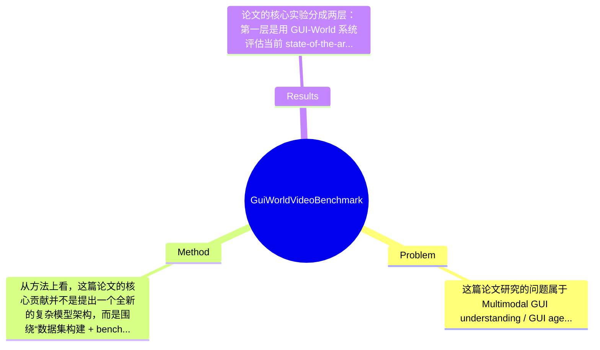

## Summary
该论文针对现有 MLLM/GUI agent 主要停留在静态网页或移动端、缺乏对动态 GUI 视频与多步交互理解的问题，提出了一个面向多场景 GUI 视频理解的 benchmark 与数据集 GUI-World，并进一步基于 Video LLM 微调得到 GUI-Vid 作为初步改进方案。实验表明，现有 Image LLM 和 Video LLM 在动态 GUI、时序操作和跨窗口场景中普遍表现不佳，而经过面向 GUI 数据增强与微调后，GUI-Vid 在多类 GUI-oriented 任务上有所提升，但距离可靠 GUI agent 仍有明显差距。

## Problem & Motivation
这篇论文研究的问题属于 Multimodal GUI understanding / GUI agent / Video-Language Understanding 的交叉领域，核心任务是让模型不仅“看懂”单张界面截图，还能理解 GUI 中随时间变化的内容、用户操作历史以及多步任务过程。这个问题之所以重要，是因为现实中的软件使用、网页浏览、桌面办公、视频编辑、系统设置等场景，几乎都不是静态单帧决策，而是依赖状态转移、弹窗、滚动、页面跳转、多窗口切换和操作序列的。若模型只能理解截图而不能理解时序 GUI，就很难真正成为可用的 GUI agent。

现实价值很直接：一方面，它关系到自动化办公、无障碍辅助、智能教学、软件测试、数字员工等应用；另一方面，它也是通向通用 computer-use agent 的关键基础能力。现有方法的局限至少有三点。第一，大量 GUI benchmark 偏重静态图像理解，只考 icon、OCR、布局或 grounding，忽略动态内容与操作链条，因此高分不代表能完成真实任务。第二，已有工作场景覆盖较窄，通常集中在 web 或 mobile，而真实环境里桌面软件、多窗口、跨应用切换同样常见。第三，Video LLM 在自然视频上训练较多，但 GUI 视频的视觉统计特性与自然视频差异很大：变化稀疏、文字密集、细粒度控件多、关键变化常只发生在局部区域，导致现成 Video LLM 难以直接迁移。

作者提出 GUI-World 的动机总体是合理的：如果想评估和推动 GUI agent，必须先有覆盖动态 GUI、多场景、多任务形式的数据与 benchmark。论文的关键洞察是，GUI 理解的难点不只在“识别界面元素”，更在于“结合时间维度理解状态变化与操作意图”；同时，仅靠现有通用 Video LLM 直接迁移不够，需要专门的数据构建与针对 GUI 场景的训练增强。

## Method
从方法上看，这篇论文的核心贡献并不是提出一个全新的复杂模型架构，而是围绕“数据集构建 + benchmark 设计 + 基于 Video LLM 的初步改进”展开。整体框架可以概括为：先采集多种 GUI 场景下的视频数据，再通过关键帧标注与 Human-MLLM collaboration 生成多类型问答任务，形成 GUI-World benchmark；随后用该类 GUI-oriented 视频数据微调一个 Video LLM，得到 GUI-Vid，并通过 progressive enhancement 的思路探索如何提升模型对 GUI 时序内容的理解能力。

关键组件可以分为以下几部分：

1. GUI 视频采集与场景覆盖
   该组件的作用是建立一个比以往更接近真实使用环境的 GUI 数据基础。论文明确强调 GUI-World 覆盖六类 GUI 场景，并包含 desktop software 与 multi-window interactions，这一点与很多只关注网页或手机的工作不同。设计动机在于：真实 GUI agent 不会只面对单一站点或单页截图，而需要跨软件、跨窗口、跨任务地处理复杂环境。相比现有静态 benchmark，这种设计更强调生态多样性与任务真实性。它的价值不在于单一数据规模，而在于分布更贴近实际 computer-use 场景。

2. 关键帧标注机制
   关键帧标注的作用是把长 GUI 视频中的核心状态变化提取出来，为后续任务构建和模型评估提供结构化锚点。作者在摘要中明确指出，当前模型若没有 manually annotated keyframes 或 operation history，会显著难以理解动态 GUI 内容，这说明关键帧在该工作里既是数据构建工具，也是揭示任务难点的重要实验变量。这样设计的原因是 GUI 视频通常具有“长时间几乎静止、短瞬间状态突变”的特征，均匀采样往往会错过真正关键的交互节点。与自然视频处理方法相比，这里更重视语义转折点而不是运动连续性。

3. Human-MLLM collaboration 任务生成
   这一组件是数据构建的关键。其作用是基于视频和关键帧生成 GUI-oriented 问题与标注答案，覆盖八类问题、三种格式。设计动机是兼顾标注质量与成本：纯人工高质量但昂贵，纯 MLLM 生成容易产生幻觉与不一致，因此采用人机协作。与现有 benchmark 相比，这种方式更容易扩展到复杂 GUI 场景，并保持任务多样性。论文虽未在给定材料中完整展开具体 prompt 细节，但从章节标题看，任务生成是独立设计模块，而非简单模板问答。

4. GUI-oriented benchmark 设计
   该部分作用是系统评估 Image LLM 与 Video LLM 在静态、动态、顺序任务上的能力边界。设计上并不只给出单一 QA，而是有多种 question format，说明作者希望测试的不只是闭集识别，还包括更开放的描述、推理或操作相关理解。与已有 GUI benchmark 的区别在于，它将时间维度和多步交互纳入评估中心，而不是附属条件。这使 benchmark 更能暴露模型 failure case：例如需要回忆操作历史、定位窗口切换前后状态差异、判断动态内容变化等。

5. Progressive Enhancement 与 GUI-Vid
   这是论文在数据集之外给出的初步方法探索。其作用是验证：如果针对 GUI 视频进行专门微调，Video LLM 是否能获得实质提升。根据摘要，作者利用 fine-tuned Video LLM 构建 GUI-Vid，作为 GUI-oriented assistant。这里的设计动机较务实，不是另起炉灶发明全新 backbone，而是在现有 Video LLM 基础上做 domain adaptation，看看瓶颈到底在模型能力还是训练分布。与现有通用 Video LLM 相比，GUI-Vid 的区别主要在于训练数据和任务对齐，而不是底层架构革命。

技术细节方面，论文给定材料没有完整列出 backbone 名称、参数规模、采样策略、损失函数与训练轮数，因此这些具体超参数应标注为“论文未提及”或当前摘要未给出。但从章节结构可知，其实验包含 fine-tune dataset construction、hyperparameter settings 和 evaluation，说明微调流程是完整执行的。设计选择上，关键帧与操作历史几乎是必须的，因为这正是论文实证指出的性能关键；而具体采用何种 Video LLM backbone、是否加入 OCR 模块、是否显式建模 action history，则可能有替代方案。整体而言，这个方法相对简洁，创新更多在 benchmark/data 层面而非模型工程堆叠；优点是问题定义清楚、切中痛点，缺点是模型改进部分偏“baseline enhancement”而非强方法学突破。

## Key Results
论文的核心实验分成两层：第一层是用 GUI-World 系统评估当前 state-of-the-art Image LLMs 与 Video LLMs；第二层是通过微调得到 GUI-Vid，验证 GUI-oriented adaptation 是否有效。根据摘要可以明确得出的主要结论有三点：其一，现有模型在动态 GUI 内容理解上明显不足，尤其在缺少 manually annotated keyframes 或 operation history 时性能显著下降；其二，现有 Video LLM 在 GUI-oriented 任务上整体落后，原因之一是 GUI 视频训练数据稀缺；其三，GUI-Vid 在多种 GUI 任务上相较基座模型有提升，但仍远未达到可部署 GUI agent 的水平。

benchmark 方面，GUI-World 覆盖 six GUI scenarios、eight types of GUI-oriented questions、three formats，这是论文实验设计的重要支撑。其评测对象包含 Image LLMs 和 Video LLMs，说明作者既比较“单帧强模型”也比较“具备时间建模能力的模型”。不过，用户提供的正文节选与摘要中没有给出具体 benchmark 名称下的详细数值表格、各模型准确率、提升百分点、置信区间等，因此若要求“具体数字”，只能严格写明：具体分数、精确提升幅度、各任务拆分结果在当前提供材料中论文未提及。不能凭空补数字。

从结果解释看，这篇论文的重要发现不是单纯“某模型 SOTA”，而是揭示了当前研究范式的错位：在 GUI 场景里，Video LLM 并没有因为具备视频建模能力就自然优于 Image LLM；相反，若没有针对 GUI 的专门数据和关键状态标注，模型很难抓住真正有用的时序信号。若论文附录中包含消融，最值得关注的应是关键帧、操作历史、不同任务格式以及 progressive enhancement 各阶段的贡献，但在当前材料中具体消融数值同样未展示。

实验充分性方面，这篇工作在问题覆盖上是充分的，因为它同时比较静态与动态、多场景与多任务；但在方法验证上偏初步，GUI-Vid 更像 proof-of-concept。缺失的实验包括：更细粒度的错误类型分析、跨场景泛化、长视频长度敏感性、OCR 噪声鲁棒性、以及真实 agent 执行成功率。就目前材料看，作者并非明显 cherry-picking，因为论文结论相当克制，甚至直接承认 video LLM 作为 GUI agents 仍是 significant challenge，这种负结果导向本身增强了可信度。

## Strengths & Weaknesses
这篇论文的亮点首先在于选题非常准确。它抓住了 GUI agent 研究中一个常被忽视但决定落地能力的核心问题：动态 GUI 与时序操作理解。很多工作在静态 screenshot benchmark 上表现很好，但无法应对页面跳转、弹窗、窗口切换和操作链，这篇论文把这个断层明确暴露出来。第二个亮点是 benchmark 设计具有现实感。六类 GUI 场景、八类任务、三种格式，且覆盖 desktop software 与 multi-window，这比只做 web/mobile 的设定更接近真实 computer-use setting。第三个亮点是结论克制，没有把 GUI-Vid 包装成“问题已解决”，而是指出基础 LLM 能力仍是瓶颈，这种负责任的表述对领域更有价值。

局限性也很明显。第一，技术方法创新有限。GUI-Vid 更像面向 GUI 视频数据的 fine-tuned Video LLM，而不是提出新的时序建模机制、控件级表示或显式 action-state tracking 框架，因此它在研究上的主要贡献仍是 dataset/benchmark，而非模型突破。第二，数据构建依赖关键帧人工标注与 Human-MLLM collaboration，这虽然提高质量，但扩展到更大规模、更长任务链和更广软件生态时，成本可能较高。第三，论文自己也承认受 base LLM 限制，即使有 GUI 数据增强，模型距离可靠 agent 仍有差距，说明当前方法对底层语言推理、OCR 解析、细粒度控件理解和长期记忆仍然敏感。

潜在影响方面，这项工作很可能成为后续 GUI 视频理解研究的重要测试基准，尤其适合用于分析 temporal GUI reasoning、跨窗口状态跟踪和 GUI-specific video adaptation。它也可能推动研究者从“截图问答”转向“操作过程理解”。

严格区分三类信息：已知：GUI-World 是公开数据集；覆盖六类 GUI 场景、八类问题、三种格式；评估了 Image LLM 与 Video LLM；GUI-Vid 通过微调带来提升但问题未解决。推测：如果加入显式 OCR、action history memory 或关键区域采样，性能可能进一步提高；桌面软件场景可能比普通网页更难。不知道：GUI-Vid 的具体 backbone、训练数据规模、每项 benchmark 的精确分数、标注一致性统计、以及不同模型在各子任务上的详细 failure ratio，当前提供材料未提及。

综合评分给 3 分：有参考价值。原因是它对 GUI-oriented video understanding 的问题定义、数据建设和实验观察都很有借鉴意义，但在方法层面尚未形成决定性突破，因此更适合作为领域基准与问题诊断论文，而不是必须逐公式深挖的模型里程碑。

## Mind Map

## Notes
<!-- 其他想法、疑问、启发 -->
