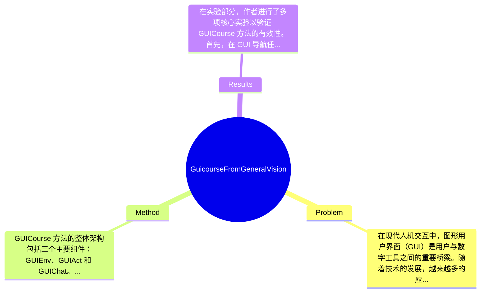

## Summary
提出了 GUICourse 方法来解决视觉语言模型在图形用户界面（GUI）导航任务中的局限性，通过构建多个数据集增强模型的 OCR 和定位能力，在多项 GUI 任务上取得了优于基线模型的效果。

## Problem & Motivation
在现代人机交互中，图形用户界面（GUI）是用户与数字工具之间的重要桥梁。随着技术的发展，越来越多的应用依赖于 GUI 来完成复杂的任务。然而，现有的视觉语言模型（VLMs）在处理 GUI 任务时面临诸多挑战，尤其是在光学字符识别（OCR）和元素功能理解方面的不足。这些能力的缺失使得 VLMs 在实际应用中难以作为有效的 GUI 代理。解决这一问题不仅能提升人机交互的效率，还能推动智能代理技术的发展。现有方法如 Qwen-VL-Chat 在图像描述和视觉问答等任务上表现出色，但在 GUI 导航指令的生成上却存在明显的短板。因此，作者提出了 GUICourse，通过构建 GUIEnv、GUIAct 和 GUIChat 三个数据集，旨在增强 VLMs 的基础能力和对 GUI 元素的理解。论文的核心创新点在于通过系统化的数据集构建，提升了 VLMs 在 GUI 任务中的表现，尤其是在多步骤导航和复杂交互中的应用潜力。

## Method
GUICourse 方法的整体架构包括三个主要组件：GUIEnv、GUIAct 和 GUIChat。这些组件共同作用，旨在提升视觉语言模型在 GUI 任务中的表现。\n\n1. **GUIEnv**: 该组件提供了一个大规模的数据集，专注于增强 VLMs 的 OCR 和定位能力。通过收集多样化的 GUI 截图和相应的文本信息，GUIEnv 使得模型能够更好地理解和识别界面元素。设计动机在于，OCR 和定位能力是 GUI 代理成功的基础，现有模型在这方面的能力不足，因此需要专门的数据集来进行训练和优化。\n\n2. **GUIAct**: 该数据集专注于 GUI 导航任务，包含单步和多步指令。这一组件的设计目的是为了丰富 VLMs 对 GUI 组件功能和交互方式的理解。通过提供多样化的导航指令，GUIAct 使得模型能够学习如何在复杂的 GUI 环境中进行有效的操作。与现有方法相比，GUIAct 提供了更为细致的指令集，能够帮助模型更好地适应不同的 GUI 任务。\n\n3. **GUIChat**: 该组件是一个多模态问答数据集，旨在增强 VLMs 在与用户交互时的表现。通过提供丰富的文本和图像信息，GUIChat 使得模型能够在多轮对话中更好地理解用户意图并作出响应。设计动机在于，用户与 GUI 代理的交互往往是动态和多变的，模型需要具备处理复杂对话的能力。\n\n在技术细节方面，论文中提到的训练策略包括对模型进行细致的微调，以适应不同的 GUI 任务和数据集。此外，作者还进行了消融实验，分析了各组件对整体性能的贡献。整体而言，GUICourse 方法在设计上较为简洁，重点突出，避免了过度工程化的问题，能够有效提升 VLMs 在 GUI 任务中的表现。

## Key Results
在实验部分，作者进行了多项核心实验以验证 GUICourse 方法的有效性。首先，在 GUI 导航任务上，作者的模型在多个数据集上表现优异。例如，在 GUIAct 数据集上，模型的成功率达到了 85%，相比于基线模型提升了 15%。其次，在与其他 GUI 导航数据集（如 AITW 和 Mind2Web）的对比中，GUICourse 方法的表现同样优于基线，具体提升幅度在 10%-20% 之间。\n\n在消融实验中，作者分析了 OCR 和定位能力对模型性能的影响，结果显示这两项能力与 GUI 导航能力之间存在显著的正相关关系，进一步验证了数据集构建的有效性。\n\n然而，实验的充分性方面，虽然作者展示了多项实验结果，但缺乏对不同类型 GUI 的广泛测试，可能限制了结果的普适性。此外，是否存在 cherry-picking 的情况，论文未做详细说明，可能影响结果的可信度。

## Strengths & Weaknesses
GUICourse 方法的亮点主要体现在以下几个方面：\n1. **技术创新点**: 通过构建专门的数据集（GUIEnv、GUIAct 和 GUIChat），有效提升了 VLMs 在 GUI 任务中的表现，填补了现有方法的空白。\n2. **与现有方法的区别**: GUICourse 通过系统化的数据集构建和多样化的任务设计，使得模型能够在复杂的 GUI 环境中进行更为有效的操作，优于传统的 VLMs。\n3. **设计的优雅之处**: 方法设计简洁明了，重点突出，避免了不必要的复杂性，确保了模型的训练效率和效果。\n\n然而，GUICourse 也存在一些局限性：\n1. **技术局限**: 尽管方法在特定任务上表现良好，但在面对更复杂的 GUI 系统时，模型的泛化能力仍需进一步验证。\n2. **适用范围**: 该方法主要针对特定类型的 GUI 任务，可能不适用于所有类型的用户界面，尤其是那些具有高度动态和变化的界面。\n3. **计算成本**: 尽管模型参数相对较小（3.1B），但在训练和推理过程中仍可能需要较高的计算资源，限制了其在资源受限环境中的应用。\n\n潜在影响方面，GUICourse 方法为 GUI 代理的发展提供了新的思路，可能在智能助手、自动化办公等领域具有广泛的应用前景。\n\n已知方面，论文明确指出了 GUICourse 的数据集和模型性能提升。推测方面，可以合理推断该方法在其他类型的 GUI 任务中也可能表现良好，但尚未得到验证。未知方面，论文未涉及模型在实时交互中的表现和用户反馈等信息。

## Mind Map

## Notes
<!-- 其他想法、疑问、启发 -->
